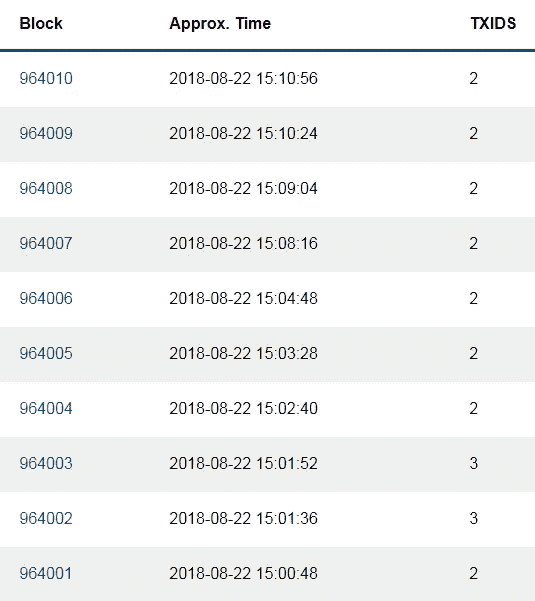
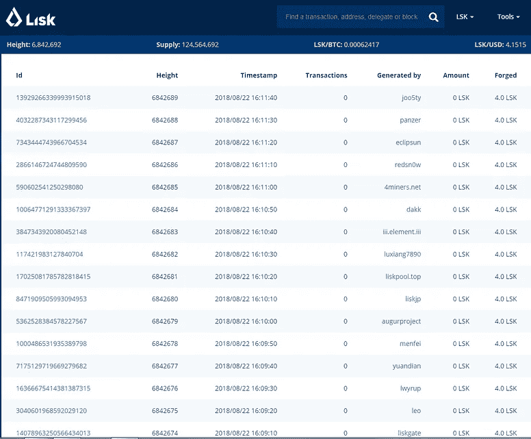
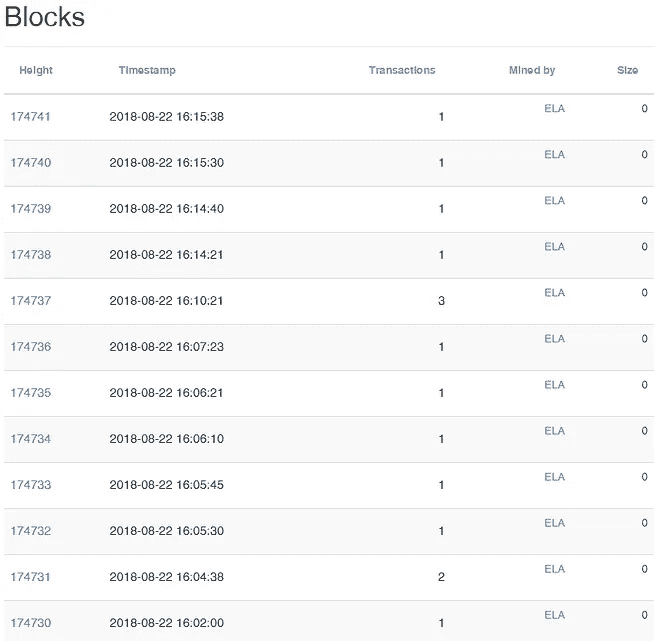

# (许多)协议的末日即将来临

> 原文：<https://medium.com/hackernoon/the-impending-doom-of-many-protocols-6568de020c2e>

Storm clouds gathering

**请跟我来**[**@ flat outcrypto**](https://twitter.com/flatoutcrypto)**。你可以在**[**flatoutcrypto.com**](http://flatoutcrypto.com)上找到我所有的文章

正如我昨天在关于加密叙述的[帖子中提到的那样](/@flatoutcrypto/crypto-narratives-and-the-road-to-adoption-27df1371b7dd)，我认为相对于[加密资产](https://hackernoon.com/tagged/cryptoasset)市场，协议作为一个整体被高估了，我们可以预期在未来几年看到这种下降。

根据我的统计，前 100 个中至少有 50 个(前 50 个中有 41 个)是协议。这些协议中的大多数都没有真正的活动。不是没有活动，就像以太坊上的大多数 DApps 用户很少，没有活动周期一样。

只需查看几个协议最近的事务，记住 Elastos 和 Stratis 都将每个块的一个事务作为块奖励:

你可以说我关注这种缺乏活动是不公平的，就在昨天我还在说我们需要更多的时间让用户来。

然而，DApps 与协议非常不同。DApps 需要用户来。用户不关心所使用的协议。只有开发人员和项目团队才关心他们使用哪种协议，他们比普通用户更了解各种协议的优缺点。

以太坊现在是明显的领先者(显然[比特币](https://hackernoon.com/tagged/bitcoin)不包括在这个讨论中)。它有开发者的支持，绝大多数 DApps 都打算在上面运行。因此，要与以太坊竞争，您需要:

1.  能够在不影响分散化的情况下进行扩展；
2.  提供不同的东西

目前还没有其他协议证明它们可以在不影响去中心化的情况下扩展，尽管它们无法解决这个问题。

第一组协议与以太坊有完全相同的问题，但缺乏任何真正的竞争优势。就我而言，那些已经死了，我不会用船篙碰它们。这些包括旧的协议，如近地天体、Stratis、Waves、Qtum、NEM 等。是的，我知道 Neo 有一些项目，是的，它是中国的(我仍然不相信它像许多追随者声称的那样得到了中国政府的“支持”)，但这不足以弥补它的技术缺陷。

然后，我认为你有另一套承诺改善缩放，即使他们可能使用倾向于集中的共识算法，如 EOS，IOTA(直到没有协调器，我不相信网络可以没有它，对不起)和 TRON。然而，我不认为任何提供足够的改进是没有代价的。

然后还有第三组，它们至少提供了某种专业化或聚焦。这些将包括:

*   **关注隐私**:你可以做同样的练习，给隐私币排序，把它们减少到一两个
*   **货币**:如果我们假设比特币不会被用作货币，那么它仍然有存在的空间。不被当前任何事物说服。
*   **专业化/竞争优势** : Elastos 和他们的 VM 方法至少是不同的，可以有广泛的应用，Decred 已经建立了一个更稳固的社区(只需看看 staking 的比率)或 EOS(我可能已经在上面写了，但首先不是每个人都关心集中化蠕变，其次他们有一个 40 亿美元的基金让人们建立他们的网络。那是一个[显著的优势](/@flatoutcrypto/prepare-for-crypto-to-get-bigger-7548769ef391)。)Ripple 将是另一个关注过多智能合约平台的公司。

因此，我认为，如果我们持乐观态度，你可能会数出大约 10 个协议，它们有机会在前 100 个协议中的 50 个协议中幸存下来。我个人认为大概有三个有机会被领养，其中两个还没有启动。

那么，剩下的会怎么样呢？拥有协议令牌的唯一目的是从底层活动中获益。当没有活动时，会发生什么？价格肯定会下降。

即使价值确实聚集在协议层，您也必须使用正确的协议才能受益。如果相对于市场而言，大部分协议的价值都在下降，那么拆分 50 个协议是一个糟糕的策略。即使是互操作性——世界各地较小的链被认为是可取之处——也无法充当救世主——为什么有人会浪费时间在其他死链上构建，而他们可以在另一个链上构建，即使它们是互操作的？为什么不投资互操作性层呢？

因此，在未来几年，我会对持有绝大多数协议持谨慎态度。你可能会说我一直傲慢地对许多项目不屑一顾(我用了大约 10 分钟写了这篇文章，所以它不会成为我更有条理的论点之一)，但我相信核心前提是成立的。

有太多的协议，一旦一个空间成熟，大量的竞争平台不会持续下去。它总是合并成一个小数字。我们最终会有 50 个协议都被赋予了极高的价值，这是常识性的考验。

**免责声明:在本文提到的人中，我支持 BTC 和 ELA。**