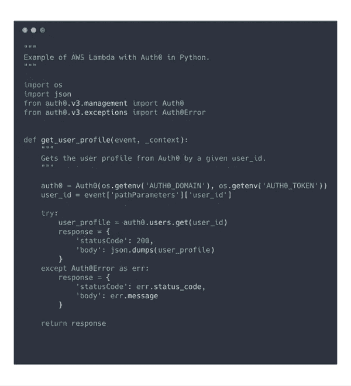
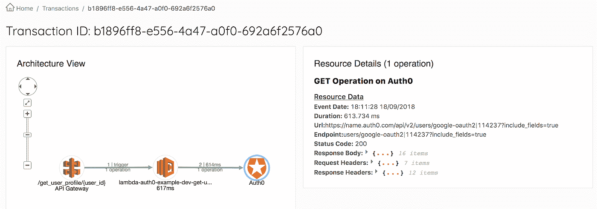
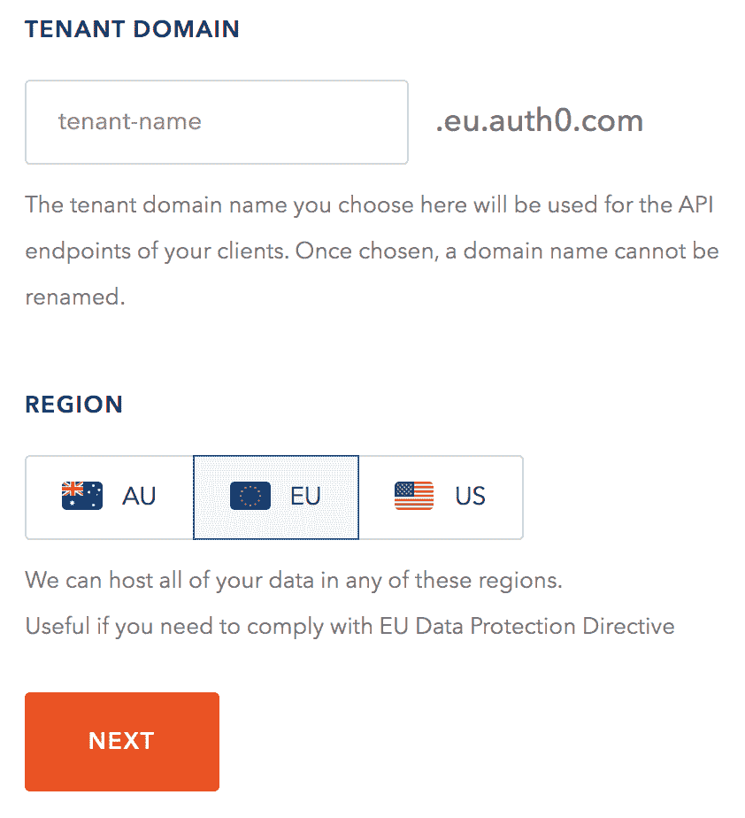

# API 在无服务器中的重要性和影响

> 原文：<https://medium.com/hackernoon/the-importance-and-impact-of-apis-in-serverless-1de1904239d6>

当谈到无服务器时，两个优势会立即浮现出来:

1.  跳出框框——这可能是我们作为开发者所能想到的最好的事情。
2.  不要管理基础架构问题—配置、更新、补丁不再是问题。

这些优势主要被称为“FaaS”(Function-as-a-Service)，现在很多云提供商都在提供，比如 [AWS Lambda](https://aws.amazon.com/lambda/) 、 [Azure Functions](https://azure.microsoft.com/en-us/services/functions/) 、 [Google Cloud Functions](https://cloud.google.com/functions/) 等等。

无服务器不仅仅是 FaaS——我们负责扩展、加密、备份、性能、日志等的托管数据库服务**是**无服务器的。这同样适用于托管队列、存储、web APIs 和其他服务。

最终，每个应用程序都由第三方 API 组成。它们很棒，因为它们允许我们专注于产品开发，而不是实施别人已经实施过的内部解决方案，而且可能比我们能做的更好。最棒的是，我们既不关心扩展，也不关心基础设施。

这样的第三方 API 可以为我们提供用户管理( [Auth0](http://auth0.com/) )、支付( [Stripe](https://stripe.com/) )、通信( [Twilio](https://www.twilio.com/) )等等。

在无服务器中，关于 API 有一个主要的警告。当我们按使用付费时，或者具体地说，我们为代码运行的时间量付费，**与 API 的快速交互是至关重要的！**我们需要衡量性能，以了解对我们成本和客户体验的影响。

# 使用 Auth0 和 AWS Lambda 进行身份验证

让我们从一个简单的例子开始——在 Python 中设置一个 Lambda 函数，它返回给定 ID 的用户详细信息。对于用户管理和认证，我们将使用 Auth0。

我们表示 Lambda 函数的主 *handler.py* 如下所示:

使用[无服务器框架](http://serverless.com/)完成部署。你可以在 [GitHub](https://github.com/epsagon/lambda-auth0-example) 中看到完整的代码。

# 衡量 API 的性能

为了了解从 Auth0 获得响应需要多长时间，我们可以添加时间印记。这很难维护和分析。正如我们所说的，我们更喜欢能够解决这一问题的托管服务。我们将使用一个用于无服务器的的[性能监控解决方案——epsa gon。一旦我们在代码中设置了这个库，我们将获得这个函数的轨迹的完整可视化:](https://epsagon.com/)

我们可以观察到 Auth0 从 Auth0 获得响应需要大约 600ms。多次运行该操作平均会产生大约 500 毫秒的结果。我们等待响应的额外空闲时间，影响了我们的**成本**和**用户体验**。

# 使用 Lambda 和 Auth0 优化性能

此时，为了优化性能，我们可以做的事情很少:

1.  **减少服务的延迟** —通过在 Auth0 中选择更近的服务区域(例如，美国而不是欧盟)，我们可以缩短响应时间。测量新的服务区域配置平均需要大约 150 毫秒(350 毫秒/ 70%的改进！).

1.  **缓存数据** —用户配置文件很少改变，因此没有理由每次都从 Auth0 请求相同的配置文件。相反，我们可以存储一个 dict，其中 user_id 映射到他的配置文件和上次更新的时间戳。如果这个时间戳是最新的，我们可以使用缓存数据。否则，我们可以发送新的请求。它极大地改善了持续时间(使用缓存时为 0 毫秒！).

# 选择 API 时的考虑事项

对于应用程序架构中的每个组件，都有几个 API 可供选择。此列表总结了一些要评估的关键指标:

1.  **价格** —毫无疑问，这很重要。
2.  **集成** —开始使用服务有多容易？它有我正在使用的编程语言的库吗？
3.  **性能** —这个 API 的反应速度有多快？
4.  **文档** —它有时被低估了，但是对我们开发人员来说，它是至关重要的。
5.  限制——有什么 API 限制吗？这可能是一个交易破坏者。
6.  **额外功能** —安全和法规、社区和支持等。

# 结论

无服务器不仅仅是功能，这是我们的整个应用程序，包含托管资源和第三方 API。

在将这些与功能集成时，用外部资源和 API 对它们的性能进行基准测试，并了解它们对我们的成本和客户体验的影响是非常重要的。

*最初发表于*[*【blog.epsagon.com】*](http://blog.epsagon.com/the-importance-and-impact-of-apis-in-serverless)*。*