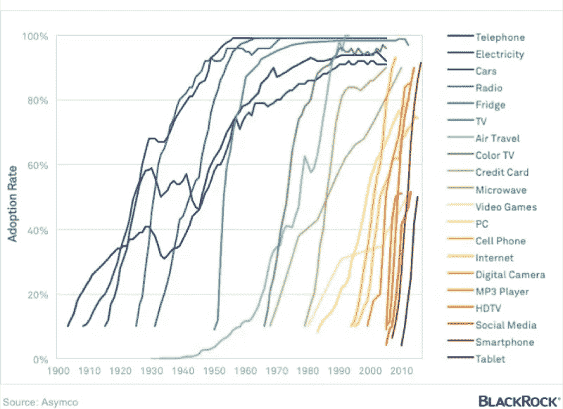
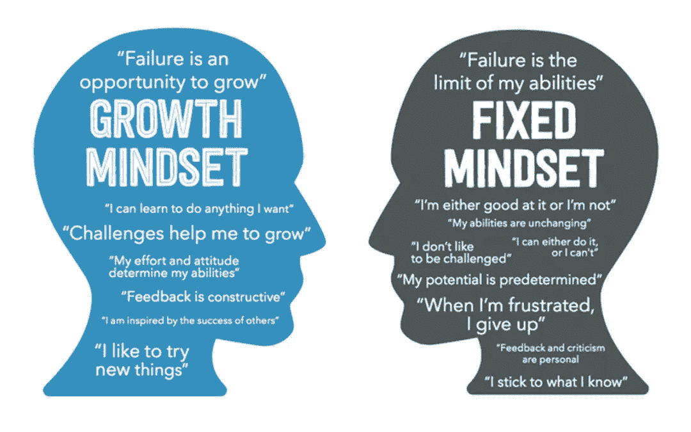

# 成长心态的重要性

> 原文：<https://medium.com/hackernoon/the-importance-of-a-growth-mindset-2440b21a9657>

## 甚至连孩子都注意到了

Adoption of technology in the U.S., 1900 to present, B[LACKROCK](https://www.blackrockblog.com/2015/12/11/economic-trends-in-charts/)

我七岁的女儿自行车骑得很好。我的儿子，四岁，还不太好——他学得很快，但从勇敢和自豪，摇摆到不情愿和愤怒。

前几天在我们居住的地区骑自行车旅行，阳光明媚，是时候发展这些技能了。我们出发了，我儿子在头五分钟里摔了四次。不出所料，他的耐心渐渐消失了，他用他四岁大的胳膊叉腰，给了我们三个两个桶。

> 你需要有一个成长的心态

我七岁的女儿说。

我笑了，我的儿子被吓得沉默不语。她没有从我或我的妻子那里得到那个短语，一定是学校。

那么，为什么我们都需要一个成长的心态呢？

[O](http://whickhamparochial.org/index.php/2017/03/13/growth-mindset-at-parochial/)riginal source unknown, copied from Whickham Parochial School’s [article](http://whickhamparochial.org/index.php/2017/03/13/growth-mindset-at-parochial/)

世界变化很快，变化的步伐也在加快。你跟不上。但是你必须这么做，因为这让你感觉自己还活着，让你与人相关，并且令人振奋。谁想被甩在后面，变化的世界有多有趣——明天会是什么样子。好消息是，你可以参与进来，帮助塑造明天。

像许多人一样，我过去偶尔会参加课程，可能一年一次或两次，在过去，我曾经达到我认为我已经覆盖了它的水平:我知道 ITIL，我知道外包，我知道可支持性，我知道系统集成，我知道业务变化方法，没有太多需要学习的东西——所以我很舒服，工作完成了。

我已经有一段时间不舒服了，我想很多都是一样的。变革的步伐正在加快。颠覆性 S 曲线比以往任何时候都更尖锐、更陡峭，而且变得更粗、更快。黑白电视被彩色电视所取代，或者数码相机被柯达所取代(柯达倔强地发明了这个东西),这都花了几十年的时间，但是现在，这种破坏即使不是几个月，也是个位数年。参见托尼·塞巴在他的 ***本质*** [清洁破坏——能源&运输](https://www.youtube.com/watch?v=2b3ttqYDwF0)视频中使用的这篇文章顶部的图形，并在文章中引用了我从托尼·塞巴那里学到的[瓜·塔比泽](https://medium.com/u/b25924868d70?source=post_page-----2440b21a9657--------------------------------)的[东西。](/rethink-entrepreneurship/things-ive-learned-from-tony-seba-about-technology-disruption-40fe6ba83746)

如你所见，线条越来越清晰，几乎是垂直的。不敏捷的企业、组织和人们，要害怕。

世界上的组织，私有的，公共的，无论他们的业务线是什么，都越来越认识到他们需要在他们的领域中成为一个软件组织才能成功，而最大的区别是敏捷性和上市时间-我们需要走得更快，我们需要加速。Nike 数字平台工程副总裁 Courtney Kissler 表示:“我的一个‘啊哈’时刻是转向优化速度…在此之前，我们的 IT 组织是针对成本进行优化的”。

技术在变化。工作方式正在改变。自动化和机器学习即将到来。创新无处不在。播客激增。一本又一本的书。LinkedIn 从一个无聊的“我在这里工作”工具，变成了一个强大的网络倍增器和每天洞察力或挑衅性思维的来源。

世界上日益增长的是复杂性和速度。采用 S 曲线一直存在，但现在它变得越来越陡峭。

> 未来属于那些学习更多技能并以创造性的方式将它们结合起来的人。

罗伯特·格林，精通

Photo by [Matt Heaton](https://unsplash.com/photos/EyTOnL4ST9k?utm_source=unsplash&utm_medium=referral&utm_content=creditCopyText) on [Unsplash](https://unsplash.com/?utm_source=unsplash&utm_medium=referral&utm_content=creditCopyText)

“成功的人都知道这一点。他们每天都投入大量时间来培养成长思维，获取新知识，学习新技能，并改变他们的看法，从而使他们的生活受益。” [Zdravko Cvijetic](https://medium.com/u/206228785f04?source=post_page-----2440b21a9657--------------------------------) 写道。

你需要有一个成长的心态。越来越多的人不再选择“坚持你所知道的”，思想封闭或有固定的思维模式。你需要思考，“挑战帮助我成长”，被他人的成功所激励，并拥有开放和成长的心态。持续学习是为数不多的常量之一。

阳光依然明媚，我的儿子骑上了自行车。他没有让他的妹妹带着聪明的亚历克关于成长心态的评论出来，然后骑着车去晒太阳。他四岁，他很自信，他有一个成长的心态，他会骑得更快。此外，最重要的是先回家，因为那里有巧克力。

Nettles photo by [Paul M](https://unsplash.com/photos/rqfnrOp2aeA?utm_source=unsplash&utm_medium=referral&utm_content=creditCopyText) on [Unsplash](https://unsplash.com/search/photos/nettles?utm_source=unsplash&utm_medium=referral&utm_content=creditCopyText)

他起步很好，蹬车，保持平衡。专注，纪律，韧性，毅力。一边走一边检查和适应。接受所有的信息，并将其融入他新的世界观和自信中。他会这么做。然后，他侧身摔进了一大堆荨麻里。痛苦。

关键是，你必须不断尝试，不断学习。打击可能是一种祝福。坏的补丁是你从中学到最多的。当一切顺利时，没有人真正了解。

因此，安装播客应用程序(我发现 [Pocket Casts](http://www.shiftyjelly.com/pocketcasts/) 是最好的)，订阅 [Medium](/) (一个无广告的故事源，为独立写作提供了一个平台——每个人都有一个故事要讲)，订阅 Audible(如果你以任何方式参与软件，你应该阅读[Accelerate:Building and Scaling High-performance Technology Organizations](https://www.goodreads.com/book/show/35747076-accelerate))，还可以获得实体书，参加会议，与人联系，向他人学习，分享想法，并避免那些棘手的问题，但如果你被刺痛，请重新站起来。世界变化很快，你需要一个成长的心态，你需要参与进来。

为了找到你的目标，也许你需要找到你的 iki Gai——参见托马斯·奥彭的文章《日本人长寿快乐的秘诀》,值得一读，如果没有别的原因，仅仅是因为有多少其他的文章以四圆维恩图为特色？

加里·沃茨

Photo by [Eric Kane](https://unsplash.com/photos/X-MbINOd9kY?utm_source=unsplash&utm_medium=referral&utm_content=creditCopyText) on [Unsplash](https://unsplash.com/search/photos/cycle?utm_source=unsplash&utm_medium=referral&utm_content=creditCopyText)

如果你喜欢这篇文章，请击几下掌。

*你可以关注我的*[*hackernoon.com/@gary.sa.watts*](https://hackernoon.com/@gary.sa.watts)*和*[*twitter.com/@garysawatts*](https://twitter.com/@garysawatts)*，这里还有一些我的文章:*

 [## 第四轮:ITIL 反击

### 当我环顾四周，我看到人们脸上的悲伤。区块链、机器学习和 DevOps 爱好者…

hackernoon.com](https://hackernoon.com/round-4-itil-fights-back-4562bf1ed32d)  [## 德沃普斯如何开始的故事

### 一个关于开发和运营的寓言

hackernoon.com](https://hackernoon.com/a-tale-of-how-devops-began-35735b15e3e4)  [## Mabl 教我如何变得符合 DevOps

### 席卷 IT 行业的动向引人入胜——devo PS、站点可靠性工程、无服务器、NoOps——

hackernoon.com](https://hackernoon.com/i-fell-in-love-with-mabl-3b1d0a9cbb3f)  [## DevOops，一些常见的反模式

### 未能打破这些筒仓

hackernoon.com](https://hackernoon.com/devoops-some-common-anti-patterns-1850ac2f5074)  [## 到 DevOps 前面去

### 速度更快、价值更高、质量更高、协作更好

hackernoon.com](https://hackernoon.com/get-in-front-with-devops-8823d2c141af)  [## 什么让敏捷下降了？

### 生产率难题

hackernoon.com](https://hackernoon.com/whats-getting-agile-down-7b0983b8027e)  [## 是时候告别 Scrum 了？

### 持续的交货可能会把它吹走

hackernoon.com](https://hackernoon.com/time-to-say-farewell-to-scrum-8344ed9440db)