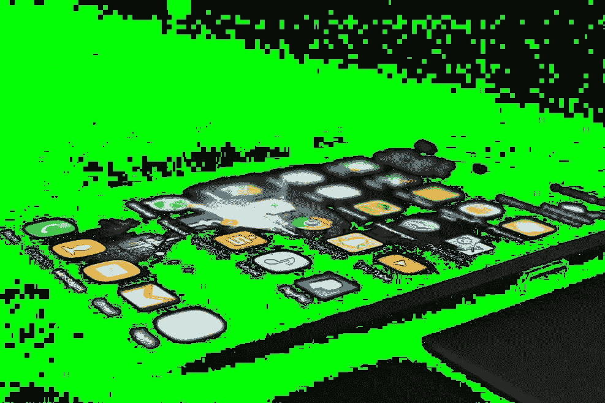

# 移动用户界面设计的重要性

> 原文：<https://medium.com/hackernoon/the-importance-of-mobile-ui-design-cd5ca8e7f628>

> 由 [Nitin Goyal，医学博士](https://www.quora.com/profile/Nitin-Goyal-MD)，骨科医生，Pulse Platform 创始人& CEO。[原载](https://www.quora.com/How-do-I-show-the-importance-of-mobile-UI-design-to-engineers-developers-who-dont-understand-its-importance/answer/Nitin-Goyal-MD)于 [Quora](http://quora.com?ref=hackernoon) 。

忽视用户界面设计的影响是你可能犯的最大错误之一。

我见过太多的应用程序没有以应有的方式关注 UI。这些设计没有从消费者的角度考虑问题，也没有反映应用程序的目的。

它们是静态的。它们不会随着用户的变化而发展，也不会随着用户的变化而改变。

在 Pulse，我们非常注重 UI 设计。

最近，我们的移动应用程序和网络仪表盘赢得了一个[缪斯创意奖](http://museaward.com/winners/4/242/676)和一个[戴维设计奖](https://www.daveyawards.com/winners/gallery/list/?_p=11&award=2&event=1016)。我们还收到了积极的用户反馈，这鼓励我们不断更新和改善体验。也就是说，这就是为什么 UI 对于任何数字健康平台的成功都是必不可少的。

## **1。它高亮显示值**

界面是你对用户最初的推销。你要展示你的应用对他们有价值。一个糟糕的设计会立刻告诉用户它没有什么价值，不管它实际上有多有用。

我们今天使用的许多应用程序都过于复杂。我是一个经营一家科技公司的年轻人(我愿意认为自己是合理的“科技通”)，当我打开其中一些时，我偶尔会感到困惑。我最后看着界面想，“等等，我现在该做什么？”

那不可能是你病人的反应。UI 非常重要，因为平台必须将自己呈现给用户，并让接下来的步骤非常清晰。设计必须直观，界面必须引导用户完成这些步骤。

这样想:你的界面必须迎合最难接触到的人，而不疏远其他人。它必须吸引尽可能广泛的人群，并向几乎每个打开应用程序的人展示明确的价值。

## **2。是你和用户的连接**

界面是你真正与用户联系的方式。忽略它意味着你忽略了这种联系。相反，要关注谁会使用你的应用，以及他们会如何使用。构建界面时要考虑到那些理想的用户。

这里有一个例子:

我们的应用程序 [Pulse](https://www.pulse-care.com/) ，是为那些正在进行关节置换手术的人准备的。那个人的平均年龄是 63 岁左右。所以，为了和这些人交流，我们必须问一些关于他们的问题。

他们会在哪里使用这款应用——在医院还是在家里的躺椅上？

他们使用手机还是平板电脑？他们面前会有设备吗？他们有空间做我们推荐的练习吗？

然后，我们创建了一个反映这些答案的 UI 设计。

当我们设计界面时，我们必须考虑所有这些问题(以及更多)，因为我们希望用户喜欢与平台交互。

我们的很多病人都戴着老花镜，或者手机上的文本尺寸更大。这是变老的一部分，对吗？因此，我们确保使用更大的按钮和文本，使应用程序更容易交互。

但是请记住，你的用户不是静态的，你的设计也不应该是静态的。当我们三年前开始设计这款应用时，我们目前的患者要年轻几岁。我们必须时刻牢记这一点，因为随着不同的一代进入我们的人口统计，他们将会更加沉迷于技术。现在 50 岁的人可能比 63 岁的人更懂技术。

我们的普通病人会随着时间而改变。我们的目标是与他们一起改变，并保持这种联系。

## **3。它简化了流程**

我见过的其他数字健康应用的一个缺点是它们太复杂了。它们需要提供者付出巨大的努力来将它们整合到医院或诊所的工作流程中。流程必须改变，复杂性实际上增加了。

我们在 Pulse 平台上真正关注的一件事是为患者和提供者设计它。我们知道要想成功，仅仅让患者喜欢是不够的。我们需要医生、医院和相关的卫生专业人员理解这种价值，并决定将其用于他们的病人。

我们想，“嘿，为什么不简单点呢？让我们适应当前的工作流程。”

事实上，当你试图告诉某人他们正在做错事时，很难得到认同。他们需要改变，按照你的方式去做。他们为什么要为你的平台改变一切？相反，简单一点就好。

目标是让你的平台变得如此简单和强大，以至于每一次交互都是有用的。当我向任何团体或医院系统做报告时，我总是听到相同的回应。

“哇，看起来太酷了。我明白。有道理。我想和它互动。”

这就是拥有一个优秀的 UI 设计能为你做的。它让人们看到你的平台，立刻就能看到他们想要使用的东西。它告诉他们，这个应用程序就像你承诺的那样有价值。

> 由 [Nitin Goyal，医学博士](https://www.quora.com/profile/Nitin-Goyal-MD)，骨科医生，Pulse Platform 创始人& CEO。[原载](https://www.quora.com/How-do-I-show-the-importance-of-mobile-UI-design-to-engineers-developers-who-dont-understand-its-importance/answer/Nitin-Goyal-MD)于 [Quora](http://quora.com?ref=hackernoon) 。
> 
> 更多来自 Quora 的趋势科技答案，请访问[HackerNoon.com/quora](https://hackernoon.com/quora/home)。