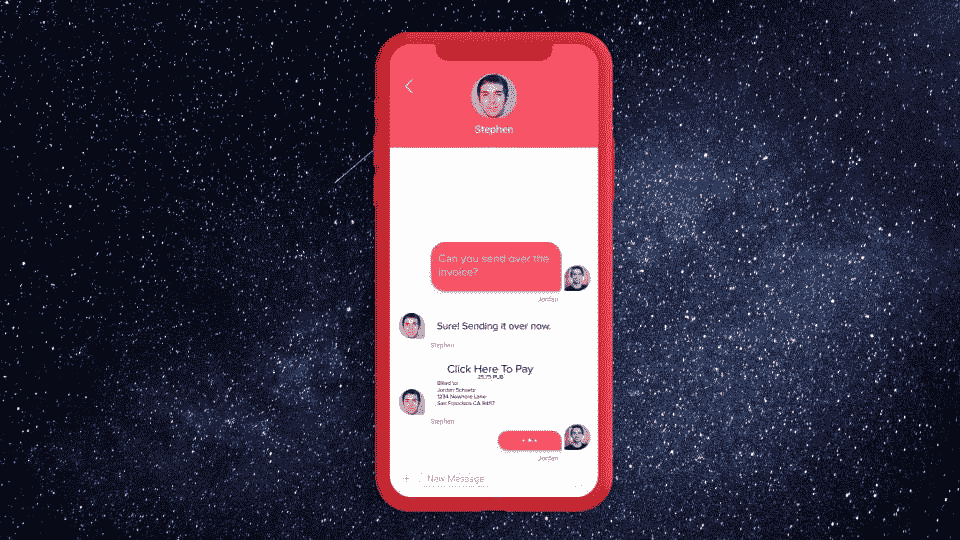
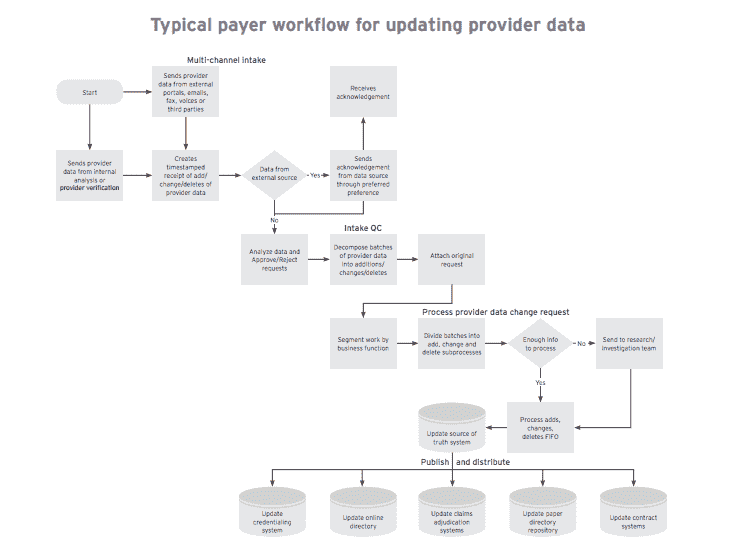
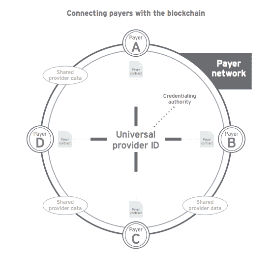

# 区块链开发者将改变的行业(加密货币之外)

> 原文：<https://medium.com/hackernoon/the-industries-beyond-cryptocurrency-that-will-be-transformed-by-blockchain-developers-be70a62937ef>

> 由[**pub nub**带给你](https://goo.gl/KhF2cY)

到目前为止，我们都很熟悉[区块链](https://hackernoon.com/tagged/blockchain)的基本概念，这是一种计算中的[设计](https://hackernoon.com/tagged/design)模式，允许你创建一系列签名事件，使用密码术进行链接和保护(如果你不是，请查看[WTF is block chain](https://hackernoon.com/wtf-is-the-blockchain-1da89ba19348))。这是显而易见的篡改和篡改弹性。区块链开始在严格跟踪最重要的用例中找到自己。在这些地方，事件需要在整个生命周期(永远)内可永久验证。

# 那么为什么有那么多人对此感到兴奋和乐观呢？

网络的工作是对每笔交易进行验证运算。网络成员(节点)在部分去中心化操作区块链验证中执行冗余任务。形成了一个共识。如果运行区块链的网络大多数都认同链事件是准确的，那就认为是公证了。

目前，围绕区块链有大量的讨论，因为它与大量的资金相关联。随着最近一次价格飙升 10，000%，世界开始注意到了这一点。事实上，今天最大的三种加密货币，**比特币**、**以太坊**和 **Ripple** 的市值为 3700 亿美元，而且这一数字还在不断变化。数字货币为我们未来如何做生意展示了一个很好的模板。

由此，我们看到了新的商业发明。更常见的是，我们现在看到了以前没有的更好的做生意方式。那么区块链在加密货币之外还有哪些含义呢？

在本帖中，我们将深入探讨加密货币之外的两个用例，以及区块链技术将如何改变它们。

# 医疗保健和总账

可以肯定地说，医疗保健技术在创新和进步方面落后于其他行业，尤其是在数据传输和安全方面。在私人和公共组织、第三方公司以及患者本身之间，共享和协作是孤立的。

区块链将通过允许个人、组织和个人设备共享和验证数据来改变医疗保健。它将改变诊所、医院、药店和保险公司管理和共享数据的方式。它将为今天遍布全球的大量医疗保健数据提供完整的记录链，无可辩驳。例如，保险证明在准入过程中被忽视。保险卡很容易被伪造，身份证不是由身份验证的。

这一倡议的领导者之一是 [Hyperledger](https://hyperledger.org/industries/healthcare) ，这是一项由 IBM 牵头的数十亿美元的倡议，旨在研究和寻找使用区块链的产品中新的利润中心。他们的目标是统一医疗保健中不同的流程，使数据流更有效，并改善患者的体验和结果。

他们对提供商数据如何处理的[案例研究特别有趣。数据的质量与其对行业的价值并不相关。他们发现 40%的付款人供应商记录包含错误或缺失信息。为什么？跟踪和更新数据的过程是手动的、陈旧的和孤立的。](https://www.hyperledger.org/wp-content/uploads/2016/10/ey-blockchain-in-health.pdf)

那么，区块链是如何改变这一点的呢？今天的分布式区块链网络在存储大量数据方面效率不高，因为每个节点都需要复制每个区块来维护账本的共享副本。考虑到单个医疗保健系统中的大量提供者数据，这种方法既昂贵又低效，更不用说全球医疗保健了。相反，Hyperledger 建议使用现有的数据存储和区块链身份和许可来连接现有的“真相来源”数据库，并通过网络安全地传递数据更新。因此，我们有一个支付者网络来维护数据的单一副本，并向网络广播这些变化。

要深入了解医疗保健区块链设计模式，我强烈建议阅读 [Hyperledger 白皮书](https://www.hyperledger.org/wp-content/uploads/2016/10/ey-blockchain-in-health.pdf)。

# 闲谈

消息应用已经成为主流，我们已经看到大量的玩家在核心功能上进行创新，发送和接收消息。Slack 和 Stride 改变了团队协作、信号和电报加密聊天，以及 Watson 和 api.ai 为聊天机器人提供动力。我们不再只是在消息 feed 中交谈，我们跟踪包裹的地理位置，通过聊天机器人买卖商品，并从第三方系统和 API 传输数据。chatfeed 在功能性、多样性和重要性方面持续增长。

区块链和聊天将是巨大的。然而，我们今天能做的和我们将来能做的有很大的不同。如今，区块链改造聊天将带来新的功能。

简言之，区块链允许我们对聊天中的重要协议进行去匿名化，并提供聊天日志的永久、可验证的存储。目前已经有一些很好的使用案例:

## 在聊天中发送和接收金钱

[Telegram](https://telegram.org/) 已经开始用区块链开发这个了。这使得聊天用户能够向他们的朋友发送资金并安全地支付服务费用。没有央行或控股公司会推迟交易。

## 货品计价

区块链允许你建立业务线协议。聊天用户可以创建按需发票来交换商品。发票通过区块链网络“公证”，进行货币兑换，兑换物存储在永久账本中。与仅仅寄钱的最大区别在于它是公开记录的。

## 协议记录

区块链还使用户能够记录用户之间的对话，并公证存储在永久的区块链账本中。对于敏感的聊天对话——医疗保健、金融协议、保险等——在区块链中存储这些对话(或参考 URIs)会创建一个无可辩驳的对话副本。

## 聊天 API 中的区块链

我们非常珍视这一点，并已经开始尝试将区块链技术引入我们用于构建聊天应用的 API[聊天引擎](https://www.pubnub.com/products/chatengine/?utm_source=Syndication&utm_medium=Medium&utm_campaign=SYN-CY18-Q1-Medium-January-29&utm_content=blockchain)。今天，我们已经为全球范围内的大量聊天提供了动力。到目前为止，我们的发现很有趣:

你可以在区块链网络上建立 100%的聊天能力，比如以太坊的区块链。不要被[的耳语](https://github.com/ethereum/wiki/wiki/Whisper)所迷惑。我完全在以太坊上重建了 PubNub，每条消息都使用智能合约直接保存到以太坊的区块链中。我能够构建一个聊天应用程序，发布消息并通过订阅接收 JSON 有效负载。每条消息都永远在区块链里。我成功地在区块链中创建了聊天室事件的记录。智能合约遵循以下步骤:

但是也有挑战。发送一条信息要花费 2 美元以上。为什么这么贵？

它很贵，因为它被永久地写在全世界 10，000 多台计算机上。这是官方公证的。我们同意这是一个合法的信息，它属于区块链，任何人都可以随时免费访问。这确实是强大的！

此时，你意识到你不希望每个聊天消息单独存储在区块链中。那么存储一个单独的聊天室会话呢？这就是我们现在正在用 ChatEngine 探索的，我们正在探索如何让它更实惠、更高效。

# 大银行和 Ripple

如今，使用 ACH 和 SWIFT 在大银行之间转账可能需要一周以上的时间。你真的可以拿着现金，飞到另一个国家，然后更快地亲自把钱交出去。这个系统远没有达到应有的效率。

这就是 Ripple 如何利用区块链获得大银行的关注。

使用 Ripple，转账只需几秒钟。它由整个网络验证，并且确定任何跨银行的资金转移。在这一点上，为什么银行会说“我们很好，我们真的不需要更换我们的技术。”如果银行不跟上这股潮流，我们将看到使用这些加密货币作为转移资金的方式的转变，反过来在发送和接收资金上获得巨额利润。简而言之，如果银行在汇款方式上输给了加密，它们将受到伤害。

# 展望未来

我对区块链改变当今全球每个行业的潜力感到非常兴奋。加密货币的含义显而易见，但这仅仅是开始。从改变金融市场和资金流动方式，到人们每天发送的个人聊天信息，区块链都将发挥作用。

> 我们的每周赞助商 [**PubNub**](https://goo.gl/KhF2cY) ，为构建未来的交互式应用提供实时 API 和全球消息基础设施。[号**今天开始建造。**](https://goo.gl/KhF2cY)