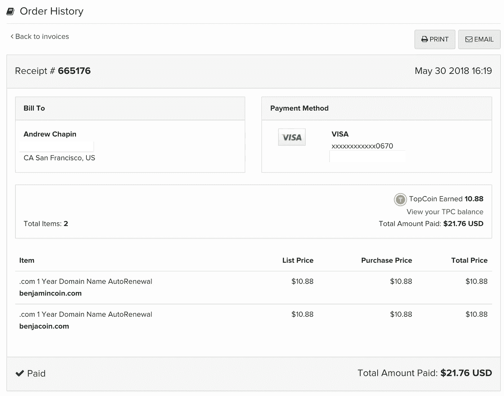

# 一年后，首次发行硬币

> 原文：<https://medium.com/hackernoon/the-initial-coin-offering-one-year-later-6b5f836c2b>

大约两周前，我收到了域名注册商的一封电子邮件，通知我他们已经续签了 benjacoin.com。这意味着两件事:我亏了 21.76 美元，距离我们踏上 ICO 之旅已经有一年了。

坦率地说，这是一段疯狂而令人疲惫的旅程，带来了我职业生涯中一些最高的高潮、最低的低谷和有趣的事情。

This one caught me off-guard.

与其让这个随意的里程碑悄无声息地来来去去，我认为最好还是分享一些我们一路走来所学到的东西。

## 第一:我们关于 T2 的一些事情是对的。

2017 年 7 月，我们写了[“我们不参加任何付费推广”，](http://benja.co/blog/2017/7/25/release-benja-responds-to-sec-initial-coin-offering-investigation-benjacoin)我们是认真的，大家都觉得我们傻。我们在活动中和聊天中多次谈到这一点。

八个月后，当推特、谷歌、脸书和其他公司禁止加密货币广告时，他们承认存在很高的欺诈风险。

ICO 广告从一开始就不对劲，我很自豪我们远离了它。

## 我们也错了一些事情。

在 Q1-2017 年第三季度之间进行销售的代币通常对他们最终将在交易所上市交易的时间和地点有点不确定。我认为这意味着象征性的项目将接受资金，让象征性的购买者拿着袋子，永远不会促成一个流动的市场。

我的错误是:列出一个令牌并不仅仅取决于令牌项目的所有权，特别是感谢像 [EtherDelta](https://etherdelta.com/#BENJA-ETH) 和 [IDEX.market](https://idex.market/eth/benja) 这样的分散式交易所。任何人都可以提交列表令牌。哦。

我们现在还知道，作为实用工具令牌出现的令牌不应该与 exchange 可用性有关。如果令牌用于特定目的，那么它是否、何时或在哪里被列出又有什么关系呢？原来，[这是美国证券交易委员会](https://www.sec.gov/news/public-statement/enforcement-tm-statement-potentially-unlawful-online-platforms-trading)的观点。交易所的存在使得“实用令牌”变得更加困难。

也许其他项目对交换计划保持沉默是正确的。

## 谈到交流:我们不知道将要发生什么，也不知道接下来会发生什么。

1.  在 benjaCoin 的出售过程中，我给一家二级交易所发了一封电子邮件，询问与他们一起上市的事宜。他们要价 4000 美元，我笑了。五个月后，在为另一个代币销售项目提供建议时，我给同一家交易所发了一封电子邮件，内容是关于这个新项目的上市事宜。他们要价 24 万美元，我笑了。两个月后，在为另一个象征性的销售项目提供建议时，我给同一个交易所发了电子邮件。他们要价 40 万美元，我笑了。我不知道这些价格会发生什么，但我知道它会变的…
2.  …这可能是因为交易所面临着很大的监管压力。我的观点是，美国证券交易委员会很难追查每一笔不良/欺诈性代币销售，因此他们希望通过对这些代币所在的交易所施加压力来一石多鸟。
    你会看到交易所对其用户执行完整的 KYC/反洗钱[流程](https://bitcointalk.org/index.php?topic=454795.0)，并更加密切地关注其列出的代币。这些都是重要的控制。

## 哦，我们还错了一件大事。

我们决定推出自己的代币，因为我们觉得 Benja Incorporated 需要控制代币资产——我们认为与另一家[区块链](https://hackernoon.com/tagged/blockchain)广告交易所合作风险太大。

如果我们今天从头开始，我们会推出一个 Benja 会加入的新平台。

原因很简单:将代币的价值与一家公司的成功(或失败)联系起来是一件冒险的事情。如果这种代币被十家不同的公司接受，那么维持一个活跃的购买者和持有者群体就更容易了。

## 有些项目我们完全忽略了。

*   **社区发展不会随着销售而停止**。我们认为我们可以进行销售，然后在开发完成后出来透透气之前，埋头工作。人们不喜欢这样，现在我们聘请了一名社区经理来承担这些任务。
*   如果你想去所有酷孩子都去的地方——比如 CoinMarketCap、EthLEND 和主要交易所——**这个游戏的名字是 volume** 。交易量如此重要，已经有多家机构找到我，他们提出执行[洗盘交易](https://www.investopedia.com/terms/w/washtrading.asp)，人为地增加 24 小时交易量。我也很失望地说，我知道至少有一家交易所，作为他们付费列表服务的一部分，承诺“保持最低数量的交易量”。对于一个正在为 B2B 平台开发的代币项目来说，生活是艰难的，在这个平台上，各方之间的交易很可能很大，每月一次。如果我们知道体积有多重要，我们可能已经构造了我们的表征函数。
*   **大多数加密货币会议完全是扯淡**。许多事件和会议行业的专业人士看到了绿色，追求，并开始把可笑的坏会议。在旧金山附近，每周至少有一次这样的活动，整个活动是由有希望的象征性销售项目资助的，这些项目支付在舞台上展示并有一个摊位。这需要停止。这些项目花费 1，000-20，000 美元站在台上，成为 40-50 个项目中的一个，向几乎全是其他象征性销售项目的房间推销。停停停。

## 我们不知道代币媒体会变得多么富有。

大多数代币列表网站接受广告费用或付费推广(最终用户并不总是清楚，但那是另一个话题)。播客喜欢糟糕的加密电子邮件令牌项目，说他们的听众要求报道令牌项目，他们很乐意做一个专题——12-15k 美元(最终用户并不总是清楚)。人们正在获得报酬，而且这一趋势似乎没有减缓。

其他一些想法:

我们认为中国的 ICO 禁令会摧毁市场。没有。

我们认为俄罗斯对 Telegram 的限制会迫使主要的加密社区转向另一个平台。他们没有。

**我们以为美国政府会为加密令牌引入新的资产分类。还没有。然后我们看到了扎克伯格的证词，听到了来自我们政府成员的问题，我们突然明白了。**

但这意味着…

代币销售正在地下进行。对于监管者、买家和更广阔的空间来说，这是一件坏事。非官方的、无组织的、通常匿名的代币购买团体正在进行大量的交易，使得代币销售的参与比以前更加困难和粗略。

但是这对一个群体来说是件好事:律师。我和十几个代币项目合作过，每个项目都花费了*难以置信的*时间和金钱，与律师一起精心设计他们的代币销售合规之路。

我参与了一个项目，他们采访了五位律师，他们对同一个问题得到了七种不同的答案。这不是一个糟糕的律师笑话——这是事实。

事实是，对于一家美国公司来说，象征性出售或 [ICO](https://hackernoon.com/tagged/ICO) 并没有铁定的合规之路。律师只是在卖他们的版本，希望他们是对的。(这就是为什么许多公司都去了私募备忘录，但更多的是在另一个时间。)

后 ICO 时代的生活经历了很多事情:挑战、疲惫、卑微和有趣。我可以用几段诗来描述这次旅行，但我必须回去工作了。第二年是全速前进。

*Andrew J. Chapin 是* [*Benja*](http://benja.co) *的联合创始人& CEO，Benja*[*Benja Coin*](http://benjacoin.com)*token 项目负责人，著有*[*Art of the Initial Coin Offering*](https://www.amazon.com/Art-Initial-Coin-Offering-Crypto-Token-ebook/dp/B075RRWGT1/ref=as_li_ss_tl?ie=UTF8&qid=1510782200&sr=8-1&keywords=art+of+the+initial+coin+offering&linkCode=sl1&tag=p02bbf-20&linkId=c4fe0973e4335f975fcab74b1f62ad7e)*，并担任多个项目的 token 顾问。今年 11 月，安德鲁正在为* [*名运动员跑纽约市马拉松，以结束老年痴呆症*](https://give.caringkindnyc.org/index.cfm?fuseaction=donate.participant&participantID=33993) *。*