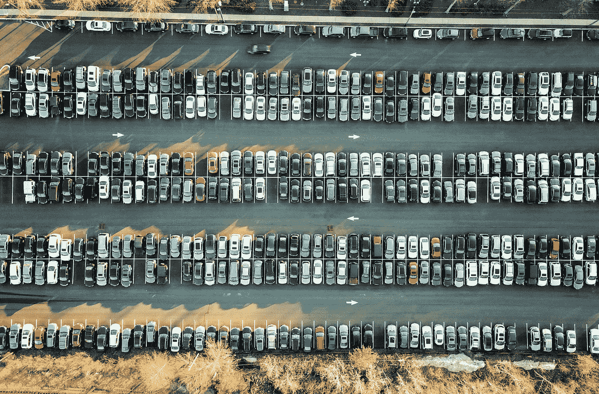

# 智能停车与自动化技术的集成

> 原文：<https://medium.com/hackernoon/the-integration-of-smart-parking-with-automated-technologies-a73465e43c61>

如果你是城市居民，你知道停车可能是一场噩梦。好像交通拥堵还不足以成为准时赴约的障碍，有时找到一个合适的地方停车需要的时间和通勤时间一样长。随着城市人口的持续增长，如果没有新的方法来解决这一重大难题，这个问题只会变得更糟。

但是等等——在我们都绝望地放弃武器搬到乡下之前，有一个解决办法就在眼前。

智能停车与自动化技术的集成有望帮助解决当今城市面临的交通挑战。在 DataArt，我与几个客户广泛合作，通过先进的技术解决方案降低效率并提高停车便利性。通过利用机器学习算法来分析驾驶员的行为和偏好等概念，可以提供个性化服务，同时通过更准确地预测停车占用率来减少资源浪费。此外，通过集成停车行业的各种组件，我们已经能够开发为客户提供无缝接口的解决方案，同时保持数据安全性并提高其准确性。

然而，随着越来越多的人搬到世界各地的城市，这些概念必须通过与自动化技术的进一步集成来扩展。已经有一些试验正在进行，以帮助确定将智能停车计划与无人驾驶汽车结合起来的最有效方式。例如，预计在不太遥远的将来，全自动停车库将会出现，系统使用激光扫描车辆，然后由机器人代客泊车，并由自动推车运输到货架上。最初的数据表明，用这种方法在同样大小的停车场可以停放多达四倍数量的汽车，因为不需要在车辆之间留出空间。想象一下，仅仅从这个概念出发，我们的城市就发生了变化，在我们迫切需要更多停车位的时候，全球每个城市的每个区域都增加了大量停车位。

整合也可以在许多其他方向进行，目的都是为了改善城市居民的停车和驾驶，同时减少相关业务提供商和市政府的低效率。除了为司机提供一系列移动支付选项和其他便利外，使用车牌识别(LPR)还可以提高停放车辆的物理安全性。除了安全设备在停车场的传统应用之外，视频监控的 LPR 还可以解决长期或专门停车点的非法停车问题，如残疾人专用停车点，这些停车点经常被其他车辆非法占用。

当然，停车位的所有者也将从这些进步中受益匪浅，因为拥有关于停车位使用的深入知识可以开发复杂的策略，通过数据收集和分析实现收入最大化。

在交通领域，这是一个非常令人兴奋和充满挑战的时代，因为智能城市技术正在解决当今城市环境中存在的许多问题。通过将智能停车与自动驾驶汽车和其他自动化技术相结合，我们将提高城市居民的生活质量，同时最大限度地发挥可用资源的价值。

我们终于可以找到停车位，准时赴约了！

*这篇博客的作者是技术咨询公司* [*DataArt*](http://dataart.com) *的物联网实践主管伊洛宁(Igor Ilunin)。*