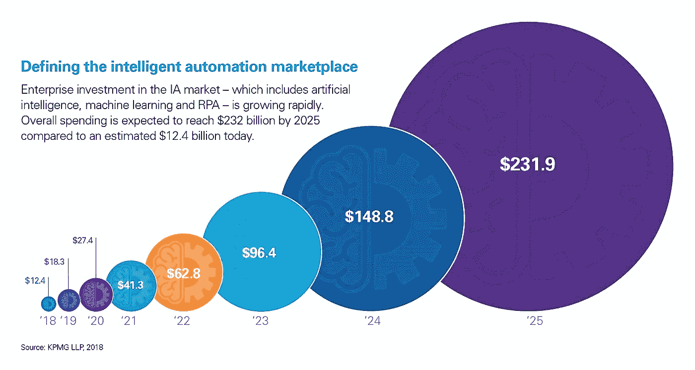
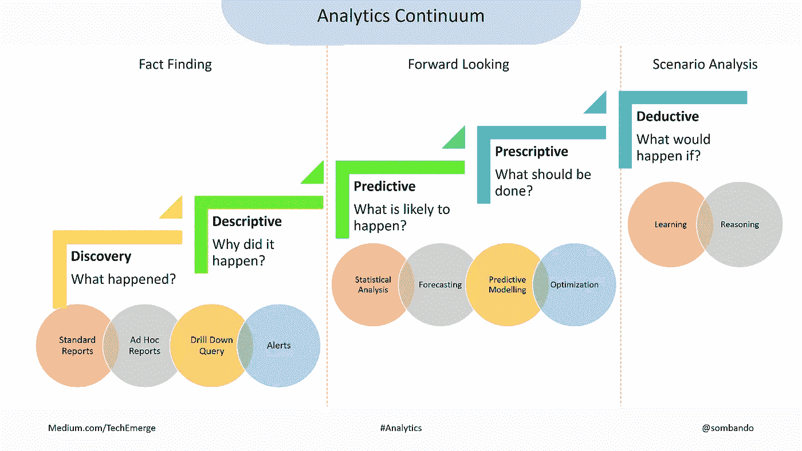
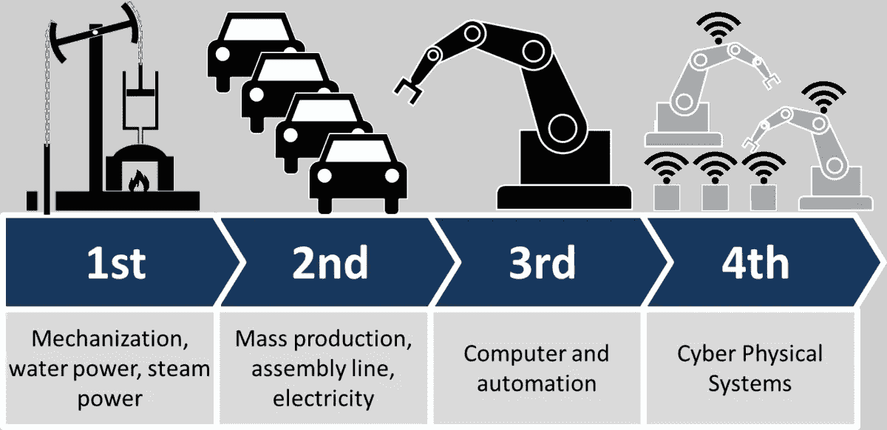
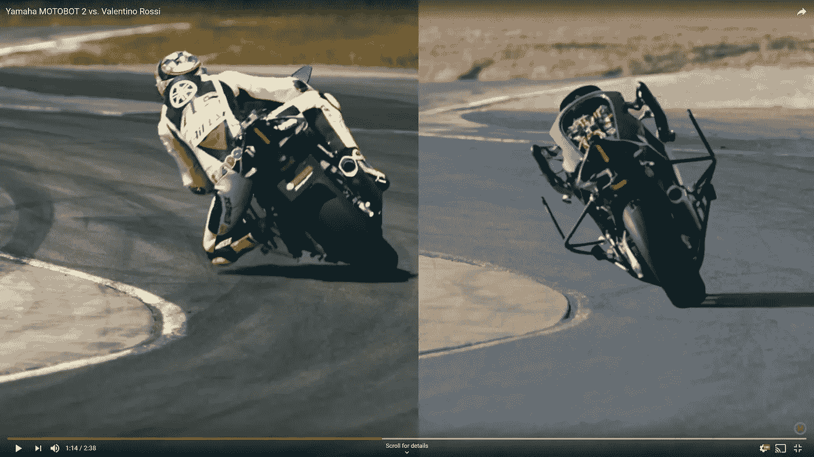

# 智能自动化之旅

> 原文：<https://medium.com/hackernoon/the-intelligent-automation-journey-303ad5b2a5dd>

## 你的组织在上面了吗？

Photo by [Mathias Jensen](https://unsplash.com/@mathiasjensen?utm_source=medium&utm_medium=referral) on [Unsplash](https://unsplash.com?utm_source=medium&utm_medium=referral)

时不时会有新技术出现，并声称是自切片面包以来最好的东西。在 90 年代，任何“在线”的东西都比它的离线版本好。进入本世纪几年后，蓝牙出现了，并向世界承诺——在一段时间内，它是给胳膊和腿充电的首选技术。每一种家用技术、电器，甚至家具、汽车、服装和配件都配有蓝牙。

> 什么比烤面包机更好？—带蓝牙的烤面包机。

同样，在企业方面，自本世纪初以来，云计算一直是变革力量。云革命带来了无处不在的处理能力和对大型数据集的访问。这在一定程度上促成了一种名为神经网络的古老算法的复兴。正如广泛报道的那样，神经网络和深度学习算法将这一经过大量研究但鲜为人知的科学潮流(称为人工智能)推向了主流技术。

可以说，迄今为止最具变革性的一项技术——人工智能或人工智能——是一种范式转变，因为算法被设计为像人类一样从数据中“学习”,并最终在思维和决策方面达到或超过类似人类的能力。今天，我们在许多领域都体验到了人工智能的应用，从人工智能一词首次成为主流的游戏开始，到 Alexa 或 Siri，到路上的许多自动驾驶汽车，到所有使用人工智能运行的社交网络脸书、推特和 Instagram。

> 什么比烤面包机更好？—带人工智能的烤面包机。

进入人工智能时代——当然，学习仍然是人工智能的一个重要方面，不幸的是，随着时间的推移，这些算法学到的东西比我们意识到的更多。

因此，人工智能算法不包含答案，也不是用来计算答案的。相反，它们是具有结构和联系的容器，可以“学习”它就像我们的大脑，或者说它最接近的软件对应物，仅由代码构建，需要能够支持大量处理能力的硬件，并需要数据来运行。随着时间的推移，通过输入正确的数据，通过训练获得智能——记住，算法的好坏取决于它们输入的数据——从字面上看。就像我们小时候上学一样，我们被灌输了大量的数据和知识，并被赋予了越来越难解决的挑战，这样我们的智力才能进化。人工智能系统通过训练逐渐获取智能的方式与我们的大脑相似。

> 人工智能的异常之处是，与以前的技术不同，人工智能不是一个即时的解决方案，至少现在不是。

它是一种使用与其用例相关的数据随着时间的推移“学习”的能力，最有可能的数据来自一个组织，然后产生与该组织相关的见解和利益。因此，要恰当地利用人工智能，它必须有数据管道，这些数据管道可以被馈送到人工智能算法，以在第一时间对它们进行训练。首先，大多数组织仍然拥有孤立的非结构化数据，这并不奇怪。因此，对于许多组织来说，人工智能的旅程从更早的时候开始——数字化和创建数据管道。这是一个旅程——您目前所处的位置和开始的时间，决定了您何时开始领取保险金，以及之后何时达到顶峰。

人工智能通常与人工智能相关联——另一个听起来类似的首字母缩略词，代表智能自动化——它涉及人工智能的应用，理想的情况是以递增的复杂性水平使用，以实现自动化和自主操作的预期效益。

毕马威的 Cliff Justice 在一篇文章中预测智能自动化市场将从 2018 年的 124 亿美元增长到 2025 年的 2319 亿美元——这是 7 年间增长的 17 倍多，即 1770%。这是最明显的迹象之一，表明大多数公司都在迅速走向采用。

Source, [advisory.kpmg.us](https://advisory.kpmg.us/articles/2018/new-study-findings-read-ready-set-fail.html)

尽管如此，如前所述，并不是所有的组织都同样准备好投入自动化之旅。它从数据开始，更重要的是正确类型数据的可用性。让我们更详细地回顾一下，每个阶段——数字化、分析，然后自动化——如何以增量方式实现，以将人工智能嵌入到组织流程中。

# 数字化—立即完成所有工作！

随着数字设备使用量的爆炸性增长，我们拥有大量数据，并且正在以惊人的速度生成新数据。全球数据量[预测](https://www.seagate.com/files/www-content/our-story/trends/files/idc-seagate-dataage-whitepaper.pdf)将在未来 7 年增长至目前规模的 5 倍——从 2018 年的 33 兆字节增长至 2025 年的 175 兆字节。如果你停止计数，1 兆字节就是 1 万亿字节。数据增长的很大一部分是由物联网促成的——即连接在一起并始终产生数据的事物或设备。

> 那么，我们该如何处理这些数据呢？
> 
> 分析一下。好吧。

不幸的是，我们的大部分数据都是非结构化的——在当前水平下，大约 80%的数据都是不可分析的。例如，我们执行的许多重复性任务，比如预订下周的旅行或填写上次旅行的费用报告等。处理碎片化和非结构化数据—您可能有纸质账单、另一封电子邮件收据等等。由于所有数据都不是从一个地方或使用一个预定义的模型接收或存储的，因此它永远不会完全自动化，并且继续需要我们的注意力和时间来执行。

因此，在启动人工智能之旅之前，每个组织都应该有一个数字化和数据治理计划，以确保组织生成的数据中尽可能高的比例可以用于构建分析，从而最大限度地发挥数据的效用并从数据中学习。

# 分析—分五步进行

根据分析的目标，数据分析可能变得越来越复杂；这可能是后见之明、远见或洞察力—

*   事实调查——侧重于发现和描述过去——已经发生了什么以及为什么会发生。这可以说是事实调查任务，也是我们在日常任务中看到的最常见的数据分析类型，包括报告、深入查询和警报。
*   前瞻性——需要更科学的严谨性和复杂的数据建模，包括统计建模；推断可能发生的情况，然后推荐最佳的处理方法，如统计分析、预测、预测模型和优化。
*   情景分析——最高级的分析；目标是根据输入或采取的行动得出结果。这些模型通常从数据中学习，为特定情况下的建议或执行创建推理。这是这一堆中最复杂的。

[AnalyticsContinuum1](https://flickr.com/photos/166102838@N03/45272516675) flickr photo by [sombando](https://flickr.com/people/166102838@N03) shared under a [Creative Commons (BY-SA) license](https://creativecommons.org/licenses/by-sa/2.0/)

# 自动化—分六个阶段

工业革命一波接一波，每一次都带来了创新和自动化的范式转变。从 18 世纪 80 年代通过蒸汽机的机械化开始，到 19 世纪 80 年代开始的电力和大规模生产，到 20 世纪 70 年代开始的使用逻辑门和计算机的计算。最后，我们目前所处的网络物理系统的革命通过更好地利用数据实现了自动化——通过从数据中收集更好的学习和见解，然后使用网络和互联网将这种见解集成到物理系统中。

Industrial Revolutions; [This Photo](https://es.wikipedia.org/wiki/Revoluci%C3%B3n_industrial_cuatro) by Unknown Author is licensed under [CC BY-SA](https://creativecommons.org/licenses/by-sa/3.0/)

因此，前提是，如果我们能够更多地分析我们的数据，并从中获得洞察力，我们就可以自动化更多的工作。当然，最大的障碍是大部分数据仍然是非结构化的，例如，以非预定义的方式存储，因此不容易用于大规模集成和分析。

> 因此，自动化连续体始于这样一个过程，在该过程中，碎片化的数据可以转换为“结构化”的数据，而对 IT 环境的改变非常小。

然后，可以使用结构化数据进行分析，并按照不断增加的复杂程度进行连续分析，并从数据中学习。

## 1.机器人桌面自动化或 RDA

模拟人类动作的软件，如 excel 中的“宏”，可以记录一次，然后根据需要运行多次，以执行多个步骤，连接使用计算机或桌面访问的许多分散应用程序的工作流。一般用于记录基于规则的重复性任务。与宏类似，这是一个灵活的有人参与的过程，可以设计为在执行过程中暂停以等待用户输入或决策。使用这种成本效益相当高的软件，涉及或多或少步骤的流程可以实现自动化，而无需投资大型 IT 系统，并在效率、结构和流程控制方面实现收益。

## 2.机器人过程自动化或 RPA

类似于 RDA，但是进一步自动化，使得不需要用户输入，因此整个过程是端到端自动化的。例如，在匹配纸质文档的情况下，OCR(光学字符识别软件)用于在没有人工干预的情况下执行。

[automationcontinuum](https://flickr.com/photos/166102838@N03/32472518648) flickr photo by [sombando](https://flickr.com/people/166102838@N03) shared under a [Creative Commons (BY-SA) license](https://creativecommons.org/licenses/by-sa/2.0/)

## 3.数字化 RPA

RPA 的扩展，具有自助服务功能，例如通过 IVR、手机、web 等进行通信。为了增强自动化

## 4.机器学习或 ML

包含特定算法的软件，可以通过称为“训练”的过程从提供给它的数据中学习，然后用于预测和规定类型的分析，可以取代或增强人类决策。通常与 RPA 解决方案集成以增强自动化

## 5.认知解决方案

ML 系统进一步集成了流程执行功能。因此，以前需要人工决策或判断的流程现在可以在没有人工干预的情况下无缝执行

## 6.狭义 AI，广义 AI(人工通用智能)

人工智能的范围和应用从几个过程扩展到广泛的领域，以实现“演绎”或情景分析。人工智能是学习算法范围的进一步扩展，它可以模仿或超越人类在许多学科和领域的学习能力。这还没有实现，理论上说在未来会实现。

请注意，RPA/RDA 将信息从孤立的流程和非结构化数据转换为特定的数据模型，因此，可以使用 ML 和 AI 等作为自动化的增强级别。

# 分五个阶段开始您的自动化之旅

与之前的自动化浪潮不同，人工智能的开发和集成是独一无二的，因为它不像一个即插即用的过程，至少到目前为止是这样。包括“学习”专门针对一个组织的数据集，开发、集成、交互、治理过程分阶段发生，可以说每个阶段都有自己的一套“学习”。拉希德·哈克最近关于彭博的[文章](https://www.bloomberg.com/professional/blog/best-practices-building-enterprise-artificial-intelligence-platform/)展示了企业人工智能的最佳实践。假设所需的数据管道已经建立并正确供给，实施会分几个阶段进行

## A.实验阶段

现在有许多新颖的人工智能基础设施，包括 IBM Watson 或 Google Tensorflow。您可能会想到那些基础架构，如预格式化的 powerpoint 幻灯片模板—您可以选择幻灯片的数量、格式、主题等，仅此而已—实际内容仍然来自您。

> 与从另一个销售平台复制看起来不合适和次优类似，人工智能算法在不复制时会产生更好的结果，而是为每个应用程序定制开发。至少现在是这样。

这些基础设施提供了您需要构建的体系结构，例如，使用特定于您的应用程序的数据来开发和训练系统。到目前为止，开发过程类似于博士水平的研究，其中阶段是迭代的，并且主要像反复试验一样进行，包括重复验证和测试准确性和偏差的阶段。除非一个人可以找到人工智能，这是另一个组织的问题和所需解决方案的精确匹配——这像 powerpoint 幻灯片一样非常罕见——否则一个训练有素的人工智能系统可以从另一个产生最佳结果的组织复制的可能性非常小。

## B.部署阶段

一旦开发出人工智能系统，将需要时间来调整业务流程，以将人工智能嵌入工作流程。除非人工智能是在一个已经实现的系统中，比如说 SAP，否则人工智能输出需要在日常流程和工作流中应用。这需要“业务流程再造”或“变革管理”——我们任何一个在团队中工作的人都知道这有多么困难和耗时。

## C.整合阶段

假设我们遵循之前描述的自动化之旅——大多数新接触人工智能的组织首先需要实施人工智能来“增强”人类的决策和行动，而不是拥有端到端的解决方案。因此，人类必须学会与人工智能的建议一起工作，并随着时间的推移做得更好。这涉及到学习。

## D.治理阶段

由于人工智能的主要目的是用于启动预测性和规范性应用程序，即使它学习的数据是过去的数据，通过输入和重新训练更新和更近的数据来保持系统更新也是非常重要的。此外，人工智能系统就像黑匣子——因为它不了解或不可见它是如何进行特定学习的——因此，人们必须监控它产生的建议，并对它们进行筛选，以检查它是否随着时间的推移产生了任何意想不到的偏见。

## E.缩放阶段

毫无疑问，由于这些学习阶段，构建和部署任何人工智能系统都比任何以前的技术更加细致入微和分阶段。然而，一旦这些部分组合在一起，就可以很快地进行扩展。

# moto bot——autonomy 的案例研究

****是人类有史以来最优秀的摩托车赛车手之一。他是历史上唯一一位赢得四个不同级别世界冠军的车手——125 cc、250cc、500cc 和 MotoGP——也是历史上最成功的冠军之一，获得过九次世界大奖赛冠军。[**moto bot**](https://global.yamaha-motor.com/showroom/motobot/index.html)**是由雅马哈汽车公司制造的一款 3 岁大的人形机器人，能够自主驾驶摩托车在赛道上行驶。******

> ******Motobot 能在赛道上打败你吗？是的。******
> 
> ******Motobot 能打败罗西吗？不，现在还不能。(去吧，罗西！)******
> 
> ******人类— 1，机器人— 0******

******是的，雅马哈 Motobot 是真实的，并且随着时间的推移变得更快更好。摩托机器人打败罗西的日子不远了——不是因为罗西变老了，而是因为摩托机器人获得了更多的数据，正在学习变得更好。******

******一旦摩托机器人学会在赛道上击败罗西——几乎可以立即创造出许多这样的摩托机器人，每一个都能够击败罗西。与人类相比，人工智能的可扩展性要高得多——它只是一个让自己被复制的软件。类似地，在实施成功的人工智能系统的游戏中处于领先地位的任何行业的公司都可以立即扩展这些系统，使其变得不可战胜并且更加难以击败。******

******然而，另一家公司或应用程序，比如一家踏板车公司，可能无法复制 Motobot AI 来驱动和自动驾驶他们的两轮车在道路上行驶——因为道路与赛道相比存在完全不同的挑战，目标也完全不同。虽然两种用例大致相似——对于自主两轮车——但用例是不同的，因此，每个用例都必须构建自己的用例。******

> ******因此，大多数人工智能系统都是定制的，然而，一旦建成，对于相同的应用程序是无限可扩展的。******

************

******Motobot Vs. Rossi, source — [youtube.com](https://www.youtube.com/watch?v=BjZPvXKewFk)******

# ******摘要******

******21 世纪的工业革命即将到来——由人工智能及其在自动化和自主性方面的应用带来。它正在改变机器的制造和使用方式，以促进和造福人类文明。尽管到目前为止它还远不是一项完全发展的技术，但成功的人工智能系统的优势的预测指数或无限潜力带来了道德和我们文明的未来的问题——无论在错误的手中，人工智能系统都可能对我们或文明造成不可挽回的伤害，不管是否愿意。这是个更大的问题。******

******然而，21 世纪的工业革命将由数据推动，而且是大量的数据。当然，最大的挑战是数据仍然是非结构化和不可用的。数字化以结构化格式捕获数据并采用类似 RPA 的自动化是正确方向上的步骤。对数据准备得更充分的组织已经在这场游戏中领先了。人工智能系统不同于其他过去的技术，至少到目前为止，它们需要长时间的定制构建过程，并通过几个迭代阶段和过程为每个应用程序实现算法。******

******很明显，这一次，快速的后来者将继续处于劣势，因为开发人工智能系统需要很高的时间要求和分层的学习曲线，并从中受益。******

******因此，你应该担心你的组织是否已经在尝试和测试人工智能系统，并以某种方式等待技术成熟。现在使用这种技术的公司一旦成熟就会向前推进，跟随或赶上并拥有优势将变得很有挑战性。******

******你觉得怎么样？你有什么建议我们添加或更改的吗？如果您需要任何澄清或补充信息，请随时询问。你可以通过[邮箱](mailto:som.bando@outlook.com)、 [LinkedIn](https://www.linkedin.com/in/sombando/) 或 [Twitter](https://twitter.com/sombando) 联系或关注我。******

********感谢阅读。如果你喜欢这篇文章，请随意点赞或分享，这样其他人也能找到它。********