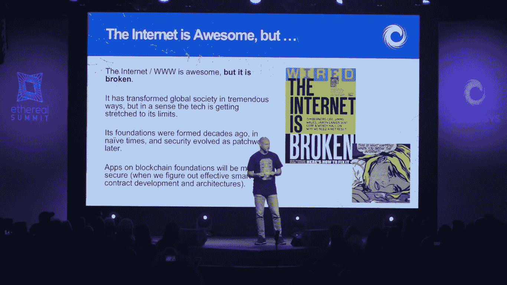
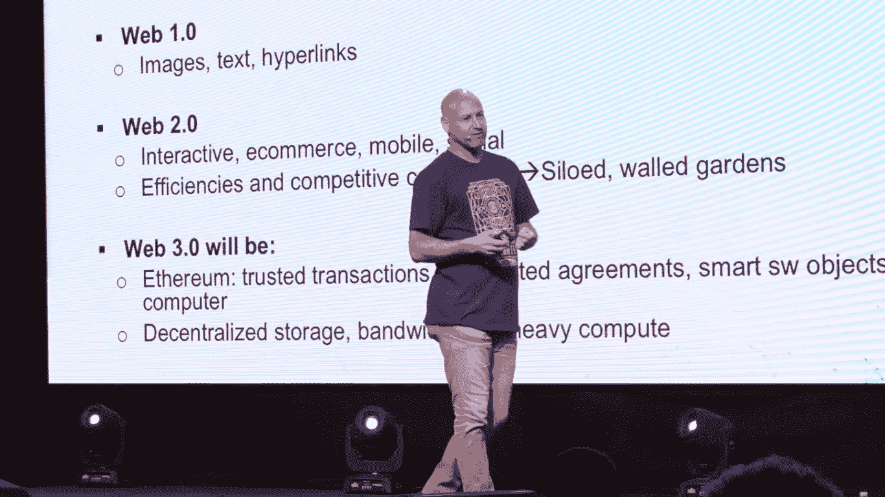
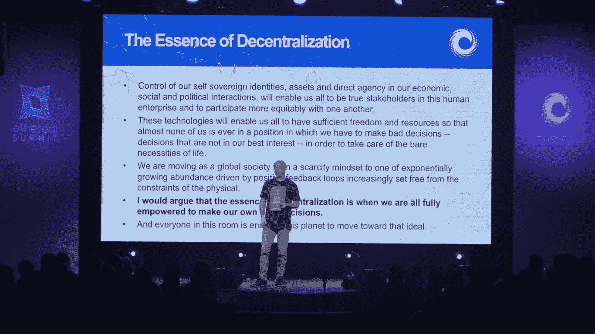

# 互联网坏了。区块链可以修复。

> 原文：<https://medium.com/hackernoon/the-internet-is-broken-blockchain-can-fix-it-8142f8277c50>

Joseph Lubin on stage at ConsenSys’ Ethereal Summit 2018.

## Joe Lubin 在 ConsenSys 的 Ethereal 峰会上的主题演讲主要关注安全性、非中介化、Web 3.0 和 Web 4.0。

上周末，初创公司 [ConsenSys](https://medium.com/u/6c7078bf7b01?source=post_page-----8142f8277c50--------------------------------) 的创始人、[以太坊](https://medium.com/u/d626b3859bc9?source=post_page-----8142f8277c50--------------------------------)的联合创始人 Joseph Lubin 在布鲁克林举行的 Ethereal 峰会上发表主题演讲时说，互联网“在很多方面都很壮观”。“它改变了全球社会，但它已经崩溃了。”

在他的主题演讲中，Lubin 指出了互联网和万维网背后的技术是如何“达到极限”的，安全是主要问题之一。

“它的(互联网)基础形成于几十年前，在天真的时代，”Lubin 在他的一张幻灯片中强调。"安全性后来演变成一种拼凑."

谈到区块链空间，ConsenSys 的创始人说，肯定存在安全问题，“通常这些问题发生在传统金融世界和区块链世界的交汇处，我们仍在使用这些传统数据库”，这些地方很容易受到攻击。

我们也正在进入一个我们可以原生存取货币的世界——可编程的、原生的数字货币——考虑到这一点，Lubin 提到“区块链协议在运行的这些年里确实非常坚固。”

他继续说:“问题是弄清楚如何建立一层又一层的应用层，并强化每一层，建立更好的编程语言、[……]纯函数语言、可执行数学[……]和其他类型的系统。”

区块链上的应用程序和业务流程将更加安全。

> 区块链将是 IT 安全领域的一场革命，因为针对基础设施的每一笔交易都经过了强有力的加密认证和精确授权。

“我们将不再受制于受防火墙保护的软资产，我们已经看到，系统经常被黑客或民族国家行为者渗透，”他补充说，并指出在区块链的架构中，拥有整个系统是非常困难的。

“这种新的验证财产、信任最小化系统增加了更安全的 IT 基础设施，你会意识到所有这一切都是在一个彻底去中心化、彻底开放的自由市场点对点网络的背景下建立的，”Lubin 说。

“你有一种普遍去中介化的力量”,使内容创建者、资源提供者、服务提供者能够直接接触消费者，而很少或没有中介提取价值，没有增加任何相称的价值。

ConsenSys 已经在探索这些方法，比如针对音乐的 [Ujo](https://medium.com/u/1c6cd0b77cb7?source=post_page-----8142f8277c50--------------------------------) 、针对新闻的[Civil:Self-sustain Journalism](https://medium.com/u/af0892caae93?source=post_page-----8142f8277c50--------------------------------)以及针对多种形式的合作、粉丝众包和粉丝策划的故事的 Cellarius。而且在服务和资源领域，将他们与消费者直接联系起来，像[假人项目](https://medium.com/u/8b0d088e8160?source=post_page-----8142f8277c50--------------------------------)、 [SONM](https://medium.com/u/e3aa487333b3?source=post_page-----8142f8277c50--------------------------------) 、[考利团队](https://medium.com/u/f32dd25840e?source=post_page-----8142f8277c50--------------------------------)、 [Swarm](https://medium.com/u/1c28b7c1f579?source=post_page-----8142f8277c50--------------------------------) 、 [Storj Labs](https://medium.com/u/31bb19d6e641?source=post_page-----8142f8277c50--------------------------------) 、[盘古](https://medium.com/u/7d9a5f7f05c0?source=post_page-----8142f8277c50--------------------------------)等许多其他项目。

根据 Lubin 的说法，互联网也是破碎的，因为“它从来没有一个本地身份结构”或“本地货币结构”他提到了 ConsenSys 所说的自我主权身份( [uPort](https://medium.com/u/c7d419c0b31f?source=post_page-----8142f8277c50--------------------------------) )，一种基于区块链的身份，可以作为我们身份的根源。“它让你不用在互联网上传播你的身份，而是将这些元素货币化——他说——它让你能够上传加密形式的数据，并从你的浏览器端控制所有这些信息。”

这种对身份的思考方式将会:使用户能够更好地从他们的数据中受益；使企业能够在数据市场上对数据进行适当的付费访问。

我认为去中心化的万维网将会大大减少对个人信息的利用，”他指出，同时提到剑桥分析公司丑闻等情况以及由监管机构发起的政策路径，如欧洲委员会的通用数据保护条例(GDPR)将会推动这一想法变得突出。

这构成了 ConsenSys 及其项目网的 Web 3.0，具有可信交易、自动化协议和以太坊上的智能软件对象、单一世界计算机、单一执行空间；以及其他协议，如分散存储、分散带宽和繁重计算。

> 所有这些都将使我们作为人和公司能够更加流畅地进行互操作。

在某种程度上，Web 3.0 将互联网作为一种去中心化的架构带回了起点。

“但是效率和对财富的追求导致了封闭的围墙花园，”Lubin 在幻灯片中强调。"这是由于缺乏共享开放平台所有权的机制."

> Web 3.0 是我们刚刚处于的风口浪尖。Web 4.0 将会非常有趣。

Lubin 提到 Web 4.0 是“我们刚刚开始考虑的东西”在这个系统中，人工智能代理通过区块链和令牌被赋予价值。“机器经济的互联网将会非常有趣，肯定会在你附近的区块链出现，”他说。

这什么时候会发生？很难说，但这里有几个卢宾提到的历史要点:

*   [蒂姆·伯纳斯·李](https://medium.com/u/f4c52f5a54b0?source=post_page-----8142f8277c50--------------------------------)在 1989 年发明了 WWW
*   花了大约 10 年的时间才让它为消费者所接受；
*   我们现在已经进入去中心化网络或 Web 3.0 大约 5 年了

“它感觉来的真快，但也感觉慢得令人痛苦，”卢宾说。“我们没有看到引人注目的消费者应用，尽管在企业方面，我们看到事情获得了真正的牵引力。这些小元素都在构建和成熟。”

> 从本质上讲，在 1-2-3 年内，我认为人们会觉得区块链无处不在。现在还不是真的。

