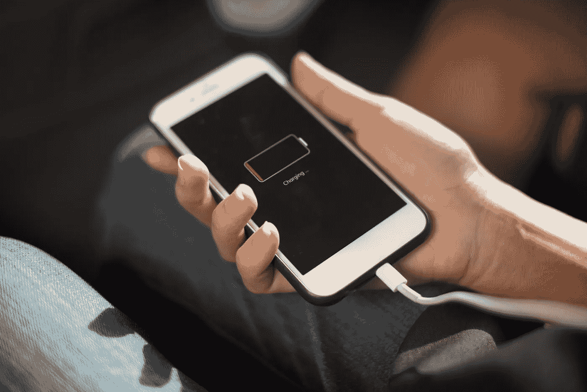
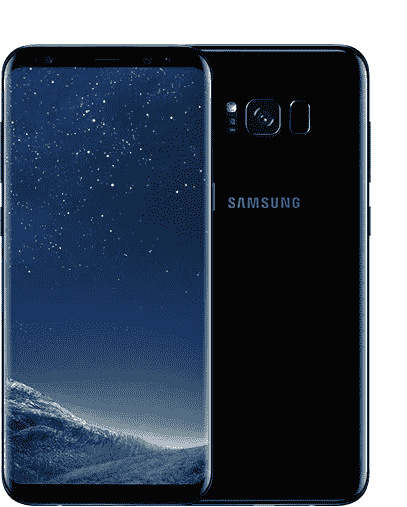
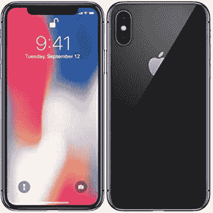

# iPhone 没电了

> 原文：<https://medium.com/hackernoon/the-iphone-is-dead-766bc536caab>

我过去在 iPhone 和 Android 之间来回切换，我总是觉得 iPhone 挤掉了任何 Android 手机，但现在不是了。

几个月前我换了一部 Galaxy S8，我不认为自己会回到 iPhone，甚至是 x。iPhone 对我来说已经死了。原因如下。

# iPhones 老化得不好

在我的 iPhone 6+上，大多数应用程序在第一次打开时都会崩溃。无论何时启动或切换，应用程序都会冻结 5-10 秒。我的电池每分钟损耗 3-4%，Apple 支持人员坚持认为我的电池非常健康。我浏览了“使用大量电能的应用程序”,并卸载了其中的大部分。

最重要的是，最近发现苹果故意根据你的电池质量降低用户体验。是的，他们正在发布一个软件更新，以向用户提供透明度，并降低更换电池的成本(这是一个长达数月的积压，稍后会有更多关于苹果支持的信息)，但这感觉像是有计划的过时，他们只是想避免输掉集体诉讼。

视频应用被终结了。很多时候我录视频，看到的都是保存的零秒长的黑帧。我已经放弃拍照了，因为相机应用程序启动时间太长，而且有几秒钟的快门延迟。

这部手机三年前还好好的。以前的 iOS 更新的最小好处被它创造的可怕的用户体验远远超过了。

我有原来的 Moto X(2013 年的)，它仍然运行得非常流畅。

# AppleCare 和 Apple support 是无能的

这和我之前的 iPhone 没有关系，但是说明了苹果质量的不足。

最近，我的 MacBook 上的一个底部橡胶脚脱落了。它仍然在 AppleCare 的保护之下，所以我把它带进了商店，这是我第一次去 Apple Genius Bar。他们告诉我，AppleCare 不会支付更换费用，因为这是化妆品。令人惊讶的是，橡胶脚垫并不是笔记本电脑的一部分。当你在上面打字时，它会摇晃。为了修复它，**整个** **底部底盘必须更换，**这将花费 250 美元。

我告诉苹果代表，我很惊讶，稍后我会打电话给苹果客服。我让他开一张跟踪票，他回答说他开了。

后来，我打电话给 Apple Care，他们向我保证更换是保修范围内的。他们还说，他们没有在系统中找到我之前与之交谈过的苹果代表的罚单。我不得不返回商店，让销售代表再次查看物理笔记本电脑，并验证脚是否丢失。沮丧之余，我让他们给我去过的原店打电话确认。他们同意并最终确认了这一点。

在此之前，我要求他们将零件送到离我家更近的苹果商店，而不是我去过的那家苹果商店。一周后，我接到一个电话，确认零件已经到达最远的商店。我很惊讶，让他们把它送到另一家商店(大约 15 英里远)。他们说，他们必须将其送回仓库，然后另一家商店必须订购该零件。

一周后，另一家商店终于收到了零件。我去了商店，他们拿走了我的笔记本电脑，我等了几个小时才换了新的。销售代表拿着笔记本电脑回来告诉我已经准备好了。我检查了底部**，橡胶脚仍然不见了**。困惑中，他把笔记本电脑送了回去。五分钟后，销售代表带着一个新底盘回来了，修好了橡胶底脚。所以他们不仅没有修复底部，事实上，技术人员只需要五分钟就可以修复，而不是几个小时。

苹果支持部门的严重无能令人震惊。

与上面的电池问题相关，如果你试图更换电池，你将面临长达数月的延迟。最重要的是，你必须把手机邮寄或者拿到商店去，这两种选择都面临着一周没有手机的风险。谁真的能离开手机那么久？这是无能还是有意让人们不再更换电池？

# iPhone 的硬件设计感觉过时了

与 S8 相比，甚至连 iPhone X 都感觉过时了。这更多的是个人观点，但是 S8 在你手中感觉非常性感。当我看电影的时候，有机发光二极管银幕上真正的黑色就融入了我的身体。这感觉像科幻电影中的无边框手机。而 iPhone 的设计仍然是用边框将屏幕和机箱分开。

更客观地说，尽管它是在 S8 之后发布的，但 iPhone X 上的屏幕并没有那么好。它的分辨率更低，边框更多。

以下是规格:Galaxy S8-5.8 英寸 Super AMOLED，2960 x 1440 像素(570 ppi 像素密度)，1000 尼特，83.6%的屏幕与机身比率 vs iPhone X-5.8 英寸 18.5:9 真色调有机发光二极管，2436 x 1125 像素(458 ppi)，625 尼特，82.9%的屏幕与机身比率。

另外，iPhone X 也有这个缺口。作为开发者，我深恶痛绝。作为一个用户，当我浏览网页时，浪费空间是很烦人的。

# 价格

S8 不仅比 iPhone X 更好，而且便宜得多。我刚刚花了不到 700 美元买了我的 S8 和一个 256GB 的 SD 卡。同样的 iPhone X 要花我 1252 美元，再加 10 美元买一个电子狗来使用我的耳机。**那几乎是两辆 S8 的价格。**

# Android 和 S8 有更好的功能

从哪里开始？这里有一个不完整的列表，排名不分先后。

*   最后一遍自动填充。当然，这是一个应用程序功能，但不可能在 iPhone 上构建。当我换手机的时候，这感觉就像是改变了游戏规则，节省了大量设置手机的时间。
*   双因素认证的 NFC。你可以在 iPhone 上使用 Yubikey，但它需要加密狗(就像现在的其他东西一样)。
*   SD 卡插槽。我上一部 iPhone 的空间用完了，除了买一部新手机或删除应用程序之外，我没有办法处理它。
*   用于解锁的受信任位置。在家或在办公室不必不断解锁我的手机，这是一个巨大的时间节省。
*   Samsung Pay 可以在任何信用卡读卡器上使用，Apple Pay 则不行，这极大地限制了它的使用案例。
*   通知更好。交互很棒，实际上很管用，整体设计也更好。
*   我不必为我的耳机买一个加密狗。
*   Androids 的解锁机制一般比 iPhone X 的面部识别快。而且还有更多选择。而且指纹扫描仪放在背面手感更好。
*   更多省电选项。
*   GearVR。
*   内置垃圾电话检测。垃圾电话在美国一直呈上升趋势，所以这是非常受欢迎的。
*   免费的硬件按钮。是的，S8 上专用于 Bixby 的侧面硬件按钮起初很糟糕。然而，通过 BXActions，你可以让它做任何你想做的事情，比如触发手电筒。现在我希望每部手机都有一个额外的硬件按钮。
*   谷歌备份你的数据。我很高兴不用再使用 iTunes(这应该是一个完全不同的帖子)或被迫为 iCloud 付费。
*   如果你在看手机，可以选择保持开机。

# iOS 令人窒息

在 Android 上，你可以安装自动更新壁纸的应用程序，改变你的整个应用程序启动器(我正在使用 Evie ),包括一个专用的搜索栏，通过向上滑动启动 Google Now，处理你的短信。还定制电话拨号器，Facebook Messenger 聊天头，三星边缘(令人惊讶的是，我喜欢这个功能)。你甚至可以在 app store 之外下载应用。

我提到过 Google 相册实际上总是在后台同步吗？相比之下，iPhone 需要每 10 分钟打开一次，以确保同步。定制键盘是可靠的，而在 iOS 上它们仍然会随机崩溃。

iOS 不提供这些，因为它们限制了开发者可以构建的东西。

即使你排除了上面所有的“超级用户”功能，我认为 S8 和 Android 对普通用户来说是更好的选择。

# Siri 仍然几乎毫无用处

谷歌无疑更擅长搜索，包括你认为 Siri 现在应该擅长的东西，比如听写。我想每个人都同意这一点，所以继续。

# 苹果感觉不像苹果

苹果通常是一个快速跟进的复印机，完善已经发布的功能。最近，他们只是觉得自己像一个缓慢的追随者，拥有相同或更少的功能。

例如，三星设备无线充电已经有一段时间了，而苹果刚刚赶上同样的功能集。充电速度是一样的。

三星也在尝试 VR、DeX 等令人着迷的东西。他们完美吗？不。但我也不相信苹果公司现在有能力介入并完善它们。

苹果的“新的和创新的功能”也没有给人留下深刻印象。Animoji 可以用标准相机完成，但它们被锁定在 iPhone X 上。这纯粹是为了销售更多的 x。我使用 force touch 已经很多年了，但从来没有用过。这样的例子不胜枚举。

我会说到做到，购买安卓设备，直到苹果升级。