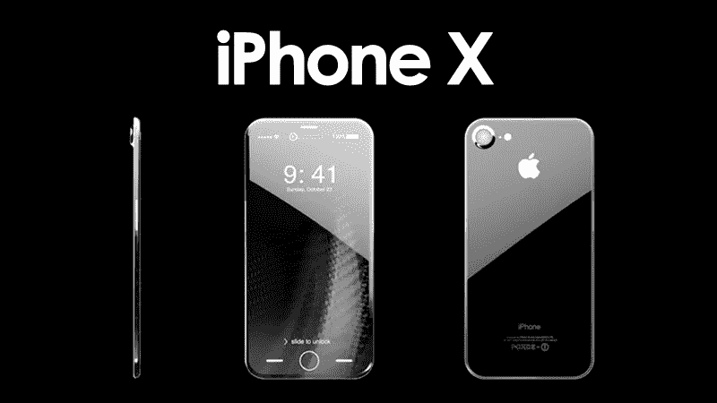
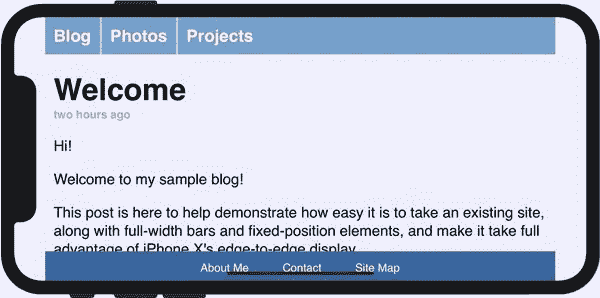
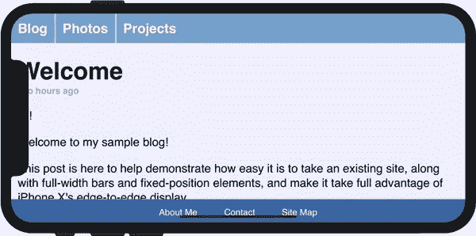
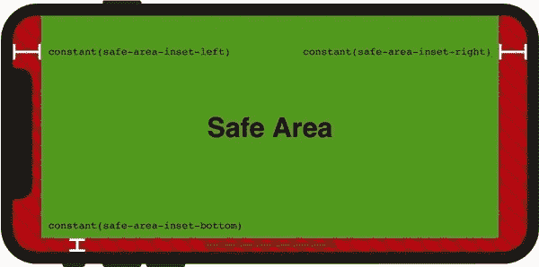
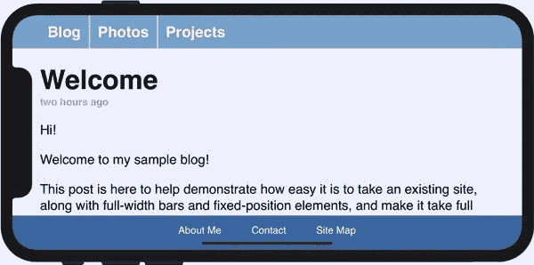
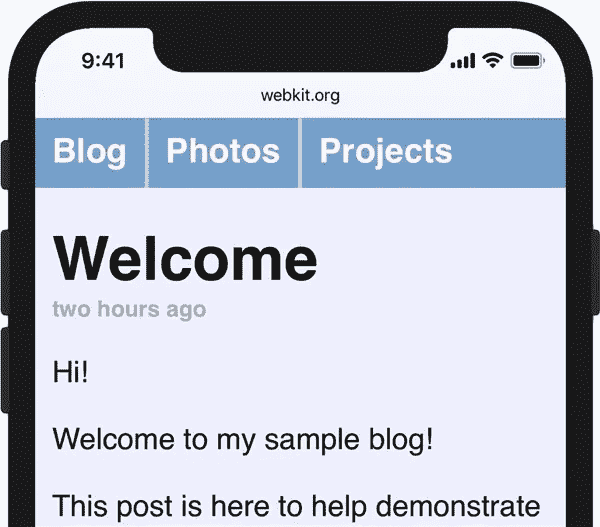

# iphone X UI 设计，走大还是回家？

> 原文：<https://medium.com/hackernoon/the-iphone-x-ui-design-go-big-or-go-home-f782fab30e17>

iPhone X 终于来了。我想你们大多数人都知道 **iPhone X UI 设计**的“古怪之处”。但真正困扰开发者的是，[苹果](https://hackernoon.com/tagged/apple)发布了关于 UI 适配的公告，它强调开发者不能隐藏设备屏幕的圆角，也不允许[设计](https://hackernoon.com/tagged/design)黑色顶部状态栏来隐藏设备传感器外壳。

所以这个政策给开发商带来了很大的麻烦。幸运的是，Safari 网络浏览器引擎 WebKit 的团队将向我们解释如何为 iPhone X 优化 UI [设计的细节。](https://www.mockplus.com/blog/post/design-for-iphone-x)

# 古怪的用户界面设计

WebKit 团队以 Safari 为例。简而言之，页面内容被移动到了设备屏幕的中间，以避开设备传感器外壳区域，但圆角不能是空白的，并且页面内容不能被设备传感器外壳区域遮挡，如下图所示。

# 设备传感器外壳遮挡了页面内容

使用视口来采用安全区域，然后你可以在安全区域使用 iPhone X 进行[网页设计](https://en.wikipedia.org/wiki/Web_design)。这里，页面的内容不会被设备传感器外壳或圆角所遮挡。

# 安全区

在安全区域完成设计后，需要在空白区域的两侧填充匹配的颜色，如下图所示:

# 景观的最终效果:

# 肖像的最终效果:

最终的效果看起来很棒，但这是网页的设计实例。还有更多的应用需要重新设计，但我们相信，在 11 月 iPhone X 正式发售后，许多应用都会进行适配。

您可能喜欢:

 [## iOS 11 vs iOS 10:UI 和交互方面的对比回顾

### iOS 11 发布了，第一个测试版也在 6 月 25 日的全球开发者大会上发布了…

hackernoon.com](https://hackernoon.com/ios-11-vs-ios-10-comparison-review-in-ui-and-interaction-f13e89da1432)  [## 6 个糟糕的 UI 设计例子& UI 设计师的常见错误

### 在深入探讨之前，我们先来看看到底什么是用户界面设计？就像我希望受到欢迎，当…

hackernoon.com](https://hackernoon.com/6-bad-ui-design-examples-common-errors-of-ui-designers-e498e657b0c4)