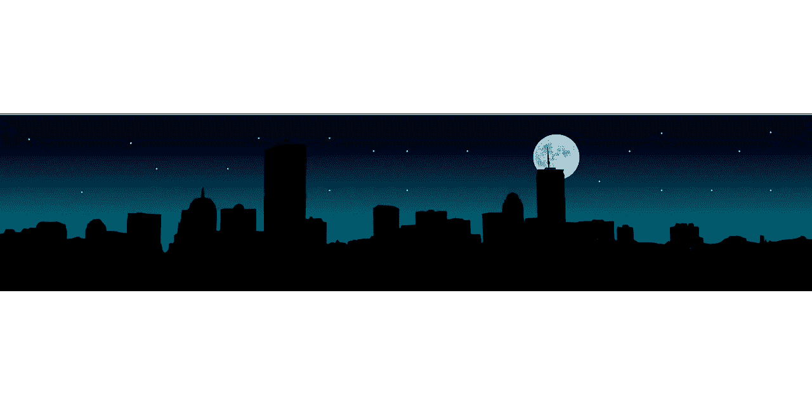

# 所有这些技术(在 CES 上)的讽刺之处在于没有电力。

> 原文：<https://medium.com/hackernoon/the-irony-of-all-that-tech-at-ces-no-power-58ceccd25dae>

约 18.4 万名参观者，约 1200 名演讲者，约 4000 家公司参展，估计这将是有史以来最大的消费电子展。有充分的理由说明，消费电子领域正在以令人兴奋的速度发生很多事情。将有许多公司展出最新的技术，从电动汽车概念车到注重无障碍的增强现实应用程序，再到自动驾驶的轮子上的杂货店。别忘了所有的声控小发明。发生了很多事。

但是我们的技术和系统的脆弱性，或者我可以说这一切的无意义性，随着导致每个人都被赶出 CES 舞台的停电而变得突出。所有的未来科技都没有电力供应。

让我们忽略英特尔在其首席执行官的实践中(可能是见不得人的)叫出其他人的讽刺，以及我们在使用他们的芯片时不得不应对的缺陷。我们的大型科技公司不是谈论风险和我们拥有的巨大机会，来为我们脆弱的电力系统做点什么，而是在寻找谁能最快发出有趣的推特。我可以接受一个善意的玩笑，但我认为我们需要更加严肃地对待这个电网脆弱性问题。

## 亚特兰大机场停电

2018 年 12 月 17 日周日，世界上最繁忙的机场，亚特兰大哈特菲尔德的杰克逊机场，停电了 11 个小时。30，000 名旅客错过了飞往世界各地 100 多个地点的 1100 次航班。一些朋友，在他们一年一度的亚洲假期，错过了他们的航班。当地公用事业公司乔治亚电力公司(Georgia Power)在关于停电的最初声明中建议

> [“佐治亚州电力公司位于地下电力设施中的一个开关设备可能发生故障并引发火灾。”](http://money.cnn.com/2017/12/18/news/atlanta-hartsfield-jackson-power-outage-cause/index.html)

如果格雷琴·巴克的《[电网](http://amzn.to/2CIpkCs)》没有突出美国电网的问题，那么这次停电，以这样的规模，从一个简单的*开关设备故障，应该告诉我们，我们需要一个**新的电网系统**。飓风破坏了休斯顿、波多黎各、维尔京群岛和佛罗里达的电力，其影响如此之大，以至于我们在天灾面前感到无助。但不是亚特兰大机场的故障。一场小火灾本不应该使关键机场的电力供应中断 11 个小时。我们绝对需要一个新的网格系统。*

## 电网脆弱性

***电不在的时候我们才注意到电。*** 这才是我在这里所说的真正的滑稽。我们理所当然地认为它会一直存在。我在一个有电网和电力的国家长大[，我们过去是/现在仍然是世界上最大的产油国之一](https://www.vanguardngr.com/2018/01/eko-disco-apologises-lagos-residents-irregular-power-supply/)。然后电网和它提供的电力就停止了。25 年过去了，电网问题仍然没有解决。

作为一个群体，我们更关注机器狗和钢管舞机器人的琐碎(是的。我们应该花费时间来建设一个抗脆弱的电网，提供可持续和经济有效的电力。我们应该共同努力，建立一个不会因为系统的一个故障而关闭的网格。如果我们继续投资于琐碎的应用程序，而不是花钱解决像能源这样的棘手问题，这些事件将会更频繁、更大规模地发生。

疯狂的是，随着我们技术的进步，我们现在终于可以为我们的电网复制大自然的抗脆弱控制系统。[我们现在可以复制一个系统，其中分布式电网(网络)上的每一个耗能或发电设备(物联网设备)都可以被视为一个节点，并通过算法编程(使用机器学习)来关闭单个设备，而不是危及整个系统](/@seyi_fab/using-ai-iot-biomimicry-to-build-an-antifragile-power-grid-e5cb2c8538c4)。问题不在于技术。问题是，我们太被 CES 上的琐事分心了，甚至没有去关心。

这是一种耻辱。

*请点赞，分享，让我知道你的想法。查看*[*Asha Labs*](http://asha-labs.com/)*和*[*power bot*](http://powerbot.co/)*。注册我的* [*博学月刊*](https://www.getrevue.co/profile/seyifabo?utm_campaign=Issue&utm_content=forwarded&utm_medium=email&utm_source=Seyi+Fabode)*——如果你已经读到这里，我打赌你会爱上它。*