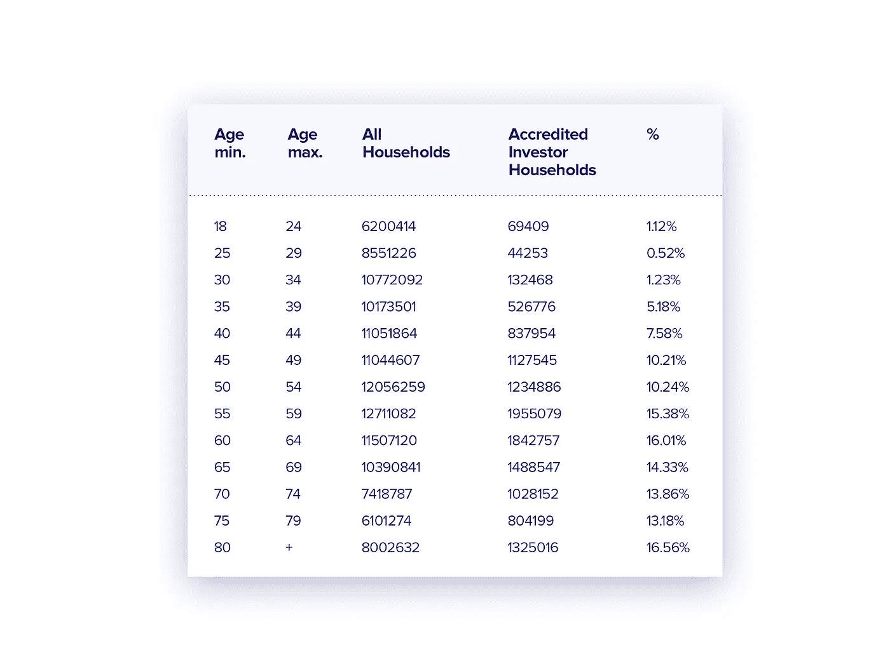
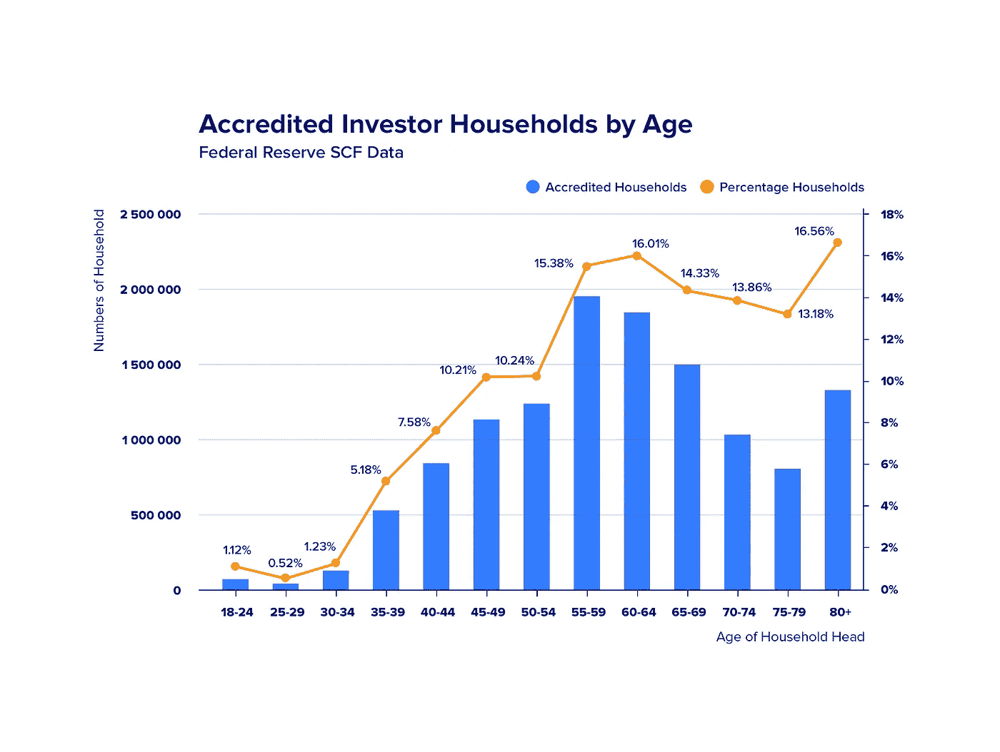

# 合格投资者问题再探

> 原文：<https://medium.com/hackernoon/the-issue-of-qualified-investors-revisited-78a644de5989>

## 或者对千禧一代的人口剥削

在过去的一年中，加密资产市场经历了令人印象深刻的牛市和执行良好的熊市，导致价格大幅下跌，主要加密资产的波动性随之下降。尽管这种过山车行情是大多数严肃投资者所预期的，只不过是数字资产长期上行过程中的又一个插曲，但另一个事件对更广泛经济的符号化造成了更大的伤害。

在 2017-2018 年期间，大量的开发人员、程序员、营销专业人员、律师和加密运动的其他参与者表现出贪婪、缺乏责任感以及对加密经济一些最基本原则的背叛。许多团队利用大规模媒体宣传和主流投资者的无知来发起彻头彻尾的骗局，以及明显薄弱和不可行的项目，以此来证明懒惰和不负责任的行为。因此，2016 年至 2018 年,“成功”ico(即达到其资助目标的 ico)总数超过 1500 个。与此同时，保持着“死亡”[加密货币](https://hackernoon.com/tagged/cryptocurrencies)记录的网站【Deadcoins.com[】目前列出了 911 种价格不超过 1 美分的数字资产。](https%3A%2F%2Fdeadcoins.com%2F)

波士顿学院的最新学术研究表明，超过一半的通过销售数字代币吸引资金的加密初创公司在其 ICO 发布仅四个月内就停止了任何活动。

> 根据来自 I corporation 的 6 月份报告，在今年进行的 ICO 之后发行的 70%的代币还没有在交易所上市——分析师说，其中大部分将永远不会上市。

美国美国联邦贸易委员会的代表宣布，2017 年，由于参与欺诈或不负责任的 ico，加密投资者损失了近 10 亿美元，并将在 2018 年损失约 30 亿美元。这种三倍增长的主要原因是 2017 年进行的 ico 的不负责任或欺诈性，这将在 2018 年完全显现出来——在此过程中不可避免地将代币的价格降至零。

# 有什么问题？

区块链运动的许多参与者表现出的错误和缺乏责任感，被传统投资机构和专门从事私人股本的律师事务所所利用，稀释和转移了秘密经济的本质。在过去的两三个月里，随着试图将数字资产纳入传统投资立法的范畴，故事发生了演变。这项立法基本上建立于 1933 年，最近在巴拉克·奥巴马于 2012 年签署的[就业法案](https%3A%2F%2Fen.wikipedia.org%2Fwiki%2FJumpstart_Our_Business_Startups_Act)的框架内进行了修补。这部法律首次允许非授权投资者(约占美国人口的 97%)使用众筹股权购买初创公司的股份。然而，这些机会少之又少，在公司获得股权众筹之前，需要做大量的准备工作——包括会计和法律方面的准备。这种准备反过来需要大量的费用。正是在这种背景下，在过去的三四个月里，互联网商业媒体一直在宣传代币经济的未来在于合格投资者和机构融资的观点。

一方面，合格投资者和机构融资进入加密资产市场肯定会对代表具有坚实发展、金融、经济和营销基础的项目的代币价值产生积极影响。

另一方面，非合格投资者的离开或边缘化，很可能导致现有模式的崩溃，在这种模式下，区块链的项目依赖于更广泛的全球社会，尤其是千禧一代。

要将投资者指定为符合“*”条件的投资者，绝大多数司法管辖区使用净积累财富(未支配)和/或年收入标准。要成为合格投资者，你必须拥有 100 万美元的资本，无论是自己的还是与配偶共同拥有的(不包括主要住所)，或者在过去两年中每年的收入超过 20 万美元，或者在同一时期与配偶共同拥有的收入超过 30 万美元。对英国和大多数欧盟国家来说，合格投资者的要求并不容易。*

*根据道琼斯的数据，8.25%的美国家庭(或 10，108，811 户家庭)属于“合格投资者”类别。他们拥有全部私人财富的 70.3%，或者说是 45.5 万亿美元。*

**

*Accredited Investors by Age in the US in 2016: Estimated by Households*

*同一项研究显示，年轻投资者占美国合格投资者的比例不到 2.55%。与此同时，根据我自己基于 LinkedIn 上区块链项目的开发人员、程序员和创始人的个人资料数据进行的计算，2017 年区块链行业团队的平均年龄在 27 岁至 30 岁之间，具体取决于使用的标准。*

**

*不难得出结论，将美国和其他主要国家有关合格投资者的现行立法强加于区块链社会，不仅会危及代币经济的主要社会资本，而且还会导致年纪较大的投资者剥削年轻的区块链工业团队。*

# *这种情况有办法解决吗？*

*毫无疑问。应该记住，美国证券立法主要始于 1933 年，当时不仅没有互联网，甚至连家用电视机的数量也很少。*

*假设我们不把婴儿和洗澡水一起倒掉，对合格投资者在区块链项目投资的一些要求可能仍然会被接受。然而，在高科技领域,“合格投资者”的概念本身应该修改。它应该符合技术现实，简单地说，符合常识。在快速发展的区块链新世界中，存在不同类型的收入模式，使用财产标准来定义谁是合格投资者已经过时。许多收入丰厚的老年投资者不太了解高科技世界，尤其是区块链圈。就高科技领域的投资而言，我们可以考虑投资者的教育水平，并可能作为一项附加标准，考虑他们的专业职业，而不是使用净财富和年净收入来定义合格的投资者。*

**感谢阅读！如果你喜欢这篇文章，请随意点击那个按钮👏**