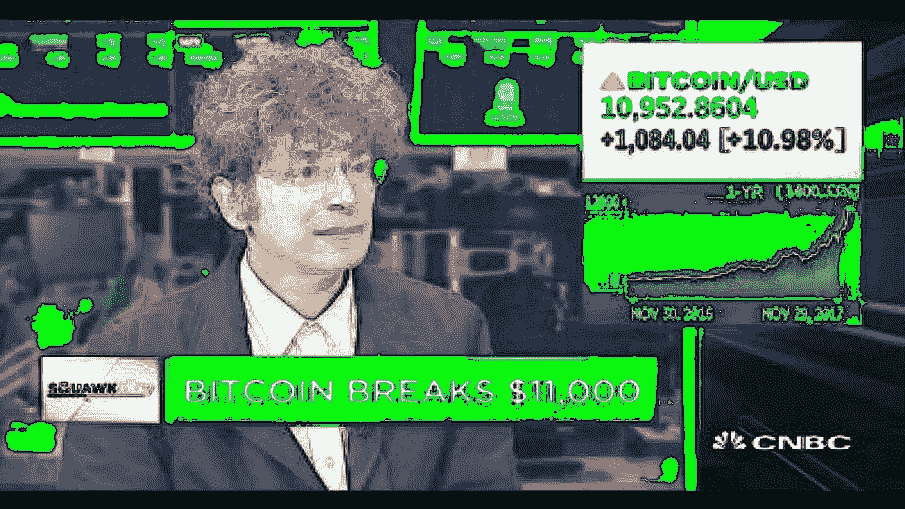
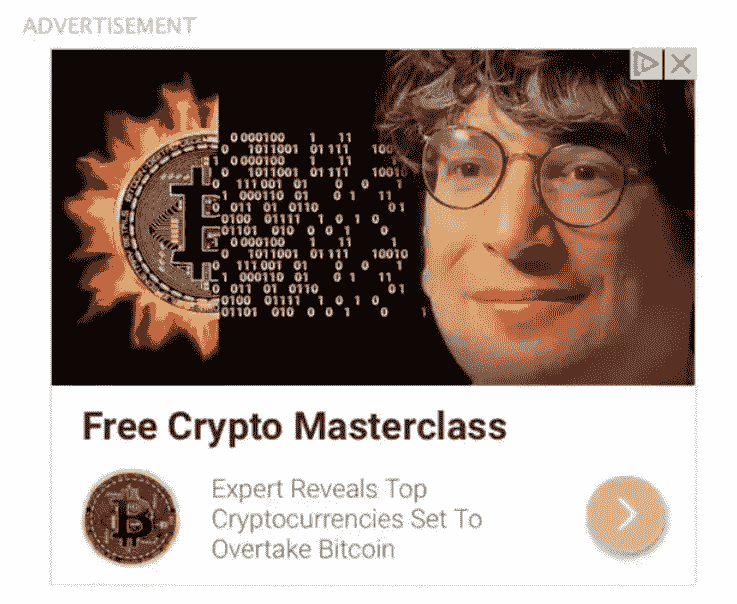
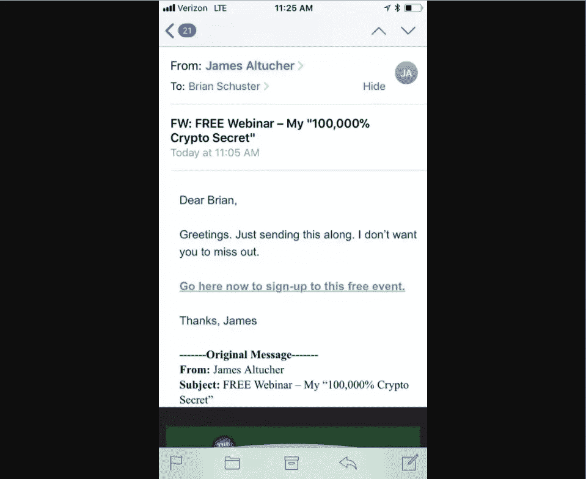
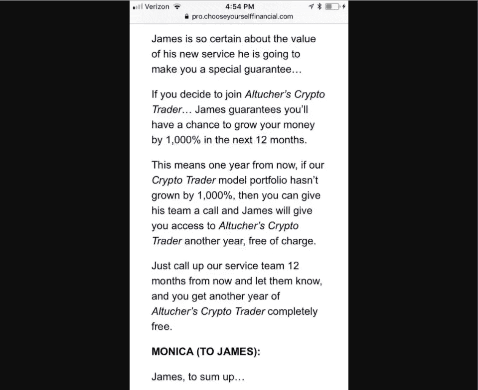
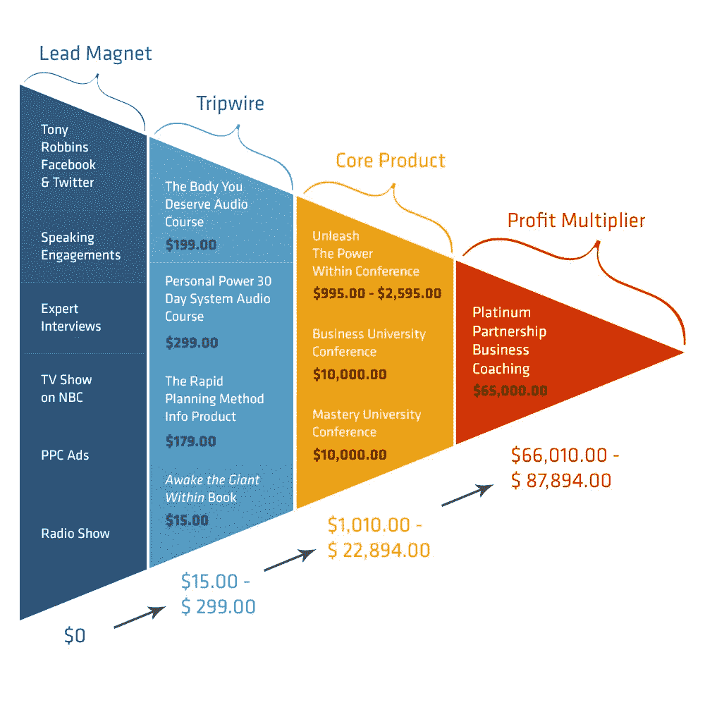

# James Altucher 加密货币体验:当我注册时我得到了什么

> 原文：<https://medium.com/hackernoon/the-james-altucher-cryptocurrency-experience-what-i-got-when-i-signed-up-f2beda80694c>

> Quora 原问题: [**谁试过詹姆斯·阿尔图彻(James Altucher)投资加密货币的方法？**](https://www.quora.com/Who-has-tried-James-Altuchers-method-for-investing-in-cryptocurrencies) 下面的帖子最初是作为一篇关于詹姆斯·阿尔图彻的课的帖子写的，但后来变成了对几周内整个“经历”的回顾。更多来自 Quora 的趋势科技答案，请访问[HackerNoon.com/quora](https://hackernoon.com/quora/home)。以下是我的想法:

## **第一篇:2017 年 12 月 14 日**

在我有机会看视频之前，我有过一次完整的经历，它严重影响了我推荐这门课程的能力。如果你想在这里看到我的想法，请查看脚注[【1】](https://www.quora.com/Who-has-tried-James-Altuchers-method-for-investing-in-cryptocurrencies#wBAOw)中的链接。

在回答这个问题之前，我必须先说明我实际上买了什么。你可能已经在网上看到了詹姆斯大师班的广告。这是最近几个月常见的广告:

它被宣传为“免费”的原因是因为它是詹姆斯提供的时事通讯服务《阿尔图切报告》的附加服务。作为购买的一部分，我获得了“选择自己的财富指南”(我其实很喜欢这本)，以及一个通用的投资建议小册子，两本关于加密货币投资和大师班的材料。此外，我还获得了詹姆斯订阅的关于加密货币行业的时事通讯(Crypto Corner)。

**那么，当谈到加密货币投资时，James Altucher 在他的课程/书籍/等中谈论了什么？**

根据我在这些书/资料里读到的，基本之外似乎没有什么“方法”。我期待类似窃听技术[【2】](https://www.quora.com/Who-has-tried-James-Altuchers-method-for-investing-in-cryptocurrencies#ElMLE)的东西，这是购买投资的一个单一的、可辨别的策略。他对加密货币的建议更具信息性，让人们兴奋，而不是“根据这些信号购买”或类似的东西。

**通读这两份加密货币的“资料”，我并不感兴趣。**老实说…我想尊重詹姆斯的专有信息，但在通读了我被送去的一本书后，我对他的话的总结方式是“尽早购买加密货币”，或者也许是“购买替代硬币”。我的意思是，我又读了一遍，以确保我没有不诚实，但这确实是一个公平的总结。有很多支持这一点的细节，有关于以前市场上涨的信息和图表，但这是结论。

另一份材料谈到了投资加密货币的替代方案。**我不会在这里给出他的答案，但在过去的几天里，我在我的 quora 帖子上写了完全相同的主题，却不知道这个问题的存在**。同样，这里没有突破性的东西，只是我可以在其他地方找到的信息。

**大师班大约是几个小时的素材，我不太愿意称之为大师班。**该课程是为对加密货币一无所知的人设计的，带你经历接触加密货币的过程。在不透露太多细节的情况下，课程的很多内容都是关于货币的历史、技术解释以及投资过程不同部分的操作指南。我从未见过任何看起来像热门的提示(除了购买 BTC/ETH/LTC 并持有)。作为 Quora、Medium 或任何其他社交媒体网站的热心读者，你可以获得几乎相同的信息。

当我开始写这篇文章的时候，我真的担心我会泄露一些材料中的秘密。公平地说，我仍然没有收到他的简讯，并选择退出特殊的“故障”提供(见第一个脚注)，但基于这一信息…我真的不知道是否有任何秘密破坏。这里的大部分信息已经写了很多(包括我自己)，唯一构成“方法”的东西是如此常见，你可以在每个加密货币子 reddit 的评论中看到它。

**总之，是的，我用过詹姆斯·阿尔图彻的方法。我一直很成功，因为我去年买了 ETH，没有卖，现在已经取得了 5000%的投资回报。** **但是这个方法实在是太猥琐了，甚至很难归功于詹姆斯。**

我想如果你对加密货币一无所知，并且真正信任詹姆斯的工作，这对你可能是一件好事。除此之外，这里没什么特别的。

## **更新日期:2017 年 12 月 16 日**

我仍然是“Altucher 报告”的一部分，我刚刚收到了一封参加研讨会的电子邮件。在被告知詹姆斯因为他的加密货币建议在他的街道上被拦了多少次之后，他提供了一个加密货币交易的策略:

> 在 5 天内，你会发现一种你从未见过的新的赚钱方式。

所以，也许，这就是我们一直在等待的策略。更多从销售页面报名参加的课程:

> *正是这些技能让他有信心做出这份个人担保……*
> 
> “我保证你会看到如何在未来 12 个月内赚到 10 倍于你的钱。”
> 
> 詹姆斯·阿尔图彻

这是一个相当大胆的主张，一个我从最初报名的课程中所期待的主张。

以下是本次研讨会将要讨论的具体内容:

> *和他一起参加这个长达一小时的活动，你会发现…*
> 
> 为什么加密货币今天如此受欢迎…为什么詹姆斯认为我们看到的难以置信的收益只是开始…
> 
> 詹姆斯如何在短短 18 个月内获得 8000%回报背后的简单策略…
> 
> 为什么投资比特币可能是一个大错误…
> 
> 如何在仅 8 个月内获得 10，545%的收益…
> 
> 四个字的秘密将导致精确的加密货币，其价值有可能在未来几年内爆炸式增长 100，000%，并在明年增长 1000%…
> 
> 我可以轻松地以每人 525 美元的价格卖掉这个网络研讨会。但是今天你可以在自己家里舒适地在线免费参加。

鉴于这里的其他一切都令人失望，也许这最终是一件实质性的事情。

我报名了。我们会看到的。

## **更新时间:2017 年 12 月 19 日**

我大约三天前注册了这个课程，从那以后我收到了不少于 6 封额外的电子邮件(大约每天 2 封)，提醒我这个免费的研讨会。

今天的一封是詹姆斯发给我的，他转发了一封电子邮件，以确保我没有忘记看他的网上研讨会。

你觉得这场免费的网上研讨会会有昂贵的追加销售吗？

## **2017 年 12 月 23 日更新**

所以，我实际上错过了詹姆斯关于如何从你的加密货币投资中获得 100，000%回报的研讨会。我在 Epcot，可以选择:

a)花了一个小时听詹姆斯讲述他获得加密货币高回报的方法，或者

b)此行第三次踏上试车跑道

自然，我选择了过山车。对我来说幸运的是，詹姆斯不仅发布了完整的视频，还在网上发布了完整的事件记录，我有机会看到了。

因此，关于这个长达一小时的网络研讨会，你应该知道的第一件事是:**它不是为了教你如何交易加密货币，或分享一种方法。它旨在向你出售 3000 美元的加密货币交易服务。**

詹姆斯确实分享了一些他如何获得正回报的“方法”,但它是如此的高级和/或基本，以至于它不是一个有用的策略。这就像如果你问我的足球队如何赢得冠军的策略，我告诉你大量的练习和强有力的跑动。技术上来说是真的，但是没有足够的细节来帮助你赢得冠军。

这是可以原谅的，如果不是因为这个网上研讨会在市场上宣称:

> *我计划*向*保证，在接下来的 12 个月里，你将看到如何从加密货币中获得 1000%的回报。*

或者

> *我对这次网络研讨会没有任何保留……*
> 
> 那是因为我相信这是我们一生中唯一一次让你的钱 100，000%盈利的机会。
> 
> 在 5 天内，你会发现一种你从未见过的新的赚钱方式。

这个研讨会基本上是一个小时长的电视广告。这是你期望在深夜电视节目中看到的合理的事情。本次网络研讨会的全部目的是销售 Jame 的新简讯服务，其中包括投资哪些加密货币的建议。

这次活动由 Monica 主持，她把这次活动描绘成一次采访，但实际上只是另一名销售人员。以下是本次网络研讨会的摘录:

> ***莫妮卡:***
> 
> 好吧，詹姆斯，我不能再等了
> 
> 如何才能知道购买哪些密码来利用这一巨大转变呢？
> 
> 你能告诉我们你的秘密吗？

莫妮卡的另一句台词:

> 尽管如此，从整体来看，他对使用他的服务所收取的费用还是很划算的。

请记住，这是一种信息产品:你每年支付 3000 美元*来了解每两个月购买哪些加密货币。*

*哦，整个事件的另一个特点是“1000%保证”。要点是詹姆斯保证，如果你没有做到 1000%，他会纠正错误。他是怎么做到的？这是原话:*

**

*所以，如果这项服务失败了，不能给你 1000%的回报，你可以再免费享受一年。如果这些信息让你失望，你不太可能希望下一年没有同样的坏建议。*

*我想插一句，一个朋友最近和我分享了一张图片。这是 Tony Robbins(他也销售信息产品)销售其服务的渠道:*

**

*詹姆斯很可能正在为他的公司开发同样的框架。这个漏斗的工作原理是通过免费服务(比如网上研讨会或 PPC 广告)吸引人们的注意力。然后，当他们进入时，用户通过漏斗转向价格越来越高的服务。注意价格点:*

*   *$15 — $300*
*   *$1,000 — $20,000*
*   *$60,000 +*

*到目前为止，我已经花 50 美元购买了詹姆斯的报告，并且已经被另外的电子邮件、追加销售和免费网络研讨会轰炸了。我是 12 月 15 日报名的，收到了 *17 封邮件*，其中 80%不是信息或新闻，而是纯粹的附加服务营销。*

*购买 Altucher 报告并没有让我成为客户，而是让我成为了合格的销售线索。而且很有可能购买詹姆斯的《加密交易员报告》并不会是抛售的终结。在我购买之后，可能会有一个更昂贵的服务等待着我，大约在 20，000 美元以上。*

*这是我两周之后的最终结论:我收到的大部分信息都是市场宣传或者炒作。一些不是专门为追加销售我而设计的细节是基本的。除了一些新闻亮点和他的大师课的基本细节，没有其他实质性的东西。*

***我永远不会推荐 James Altucher 使用加密货币，即使是对一个完全的新手**。我不想让他们受到持续不断的营销攻势和几乎*没有*关于加密货币行业的有用信息的影响。在经历了詹姆斯的“方法”(高达 50 美元的价格点，也就是说)，我可以自信地说，你会得到更好的体验和更好的信息，只是阅读克里斯·伯恩斯克的“加密资产”。*

*脚注*

*[【1】](https://www.quora.com/Who-has-tried-James-Altuchers-method-for-investing-in-cryptocurrencies#cite-wBAOw)[买了 James Altucher 关于加密货币的大师课，马上就后悔了](https://steemit.com/jamesalthucher/@hivergent/i-bought-james-altucher-s-master-class-on-cryptocurrency-and-i-immediately-regretted-it)*

*[【2】](https://www.quora.com/Who-has-tried-James-Altuchers-method-for-investing-in-cryptocurrencies#cite-ElMLE)[你对詹姆斯·阿尔图彻的《窃听技术》有什么评价？](https://www.quora.com/What-is-your-review-of-James-Altucher’s-Wiretapping-Technique”)*

> *最初发表于 www.quora.com。*
> 
> *更多来自 Quora[的趋势科技答案，请访问](https://medium.com/u/3853f85f7d5e?source=post_page-----f2beda80694c--------------------------------)[HackerNoon.com/quora](https://hackernoon.com/quora/home)。*