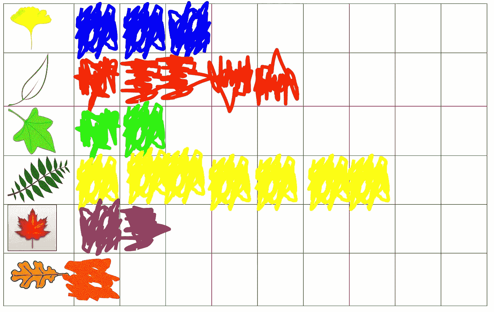
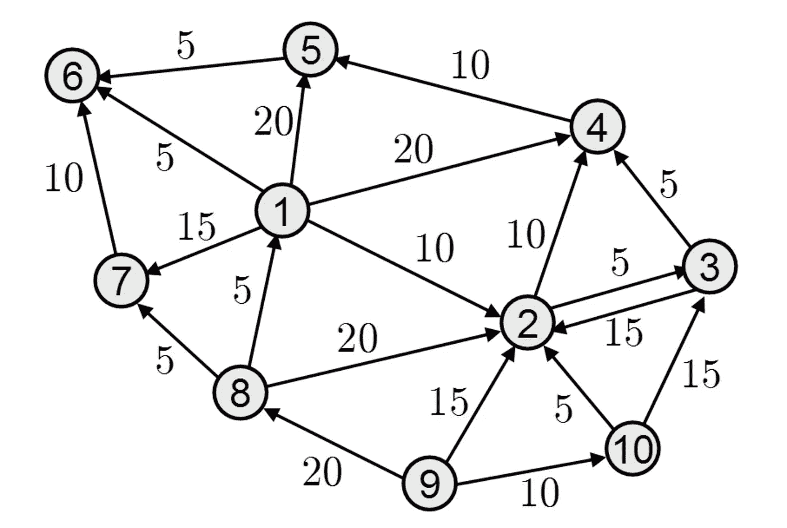
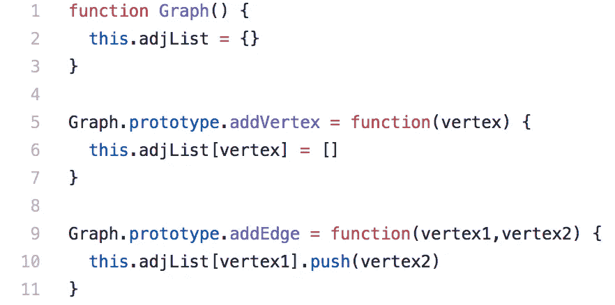
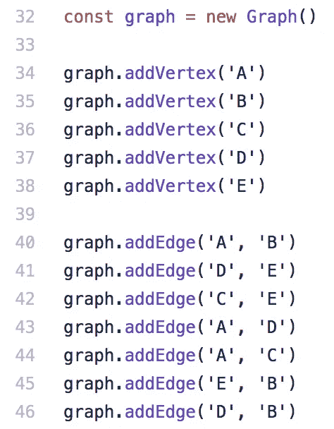
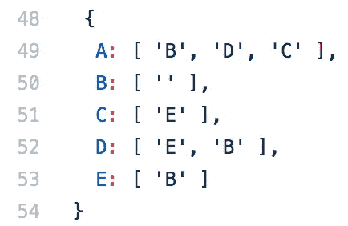
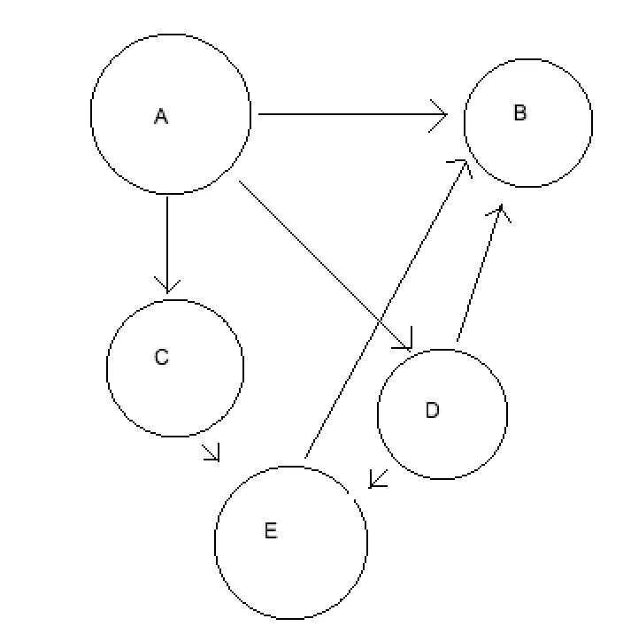
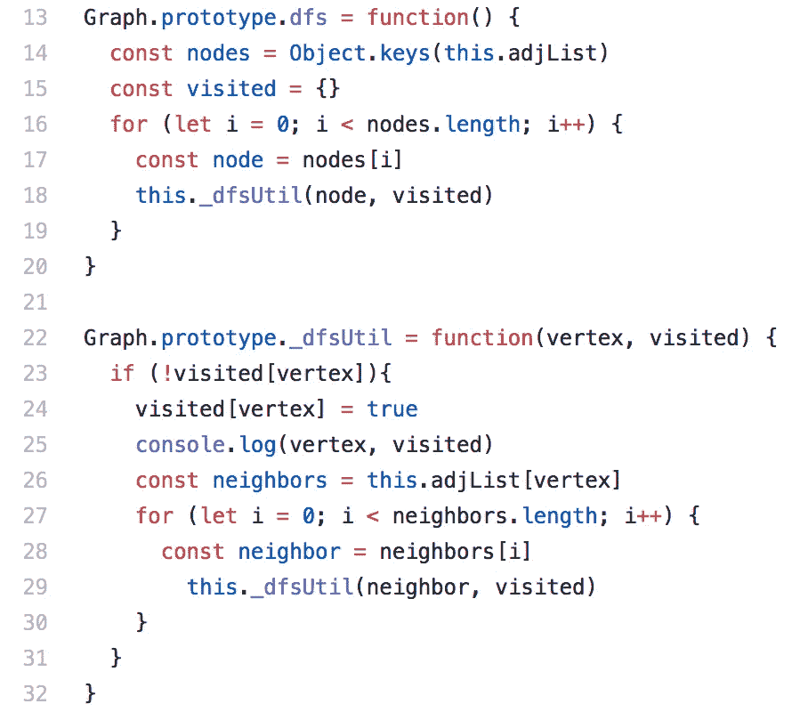
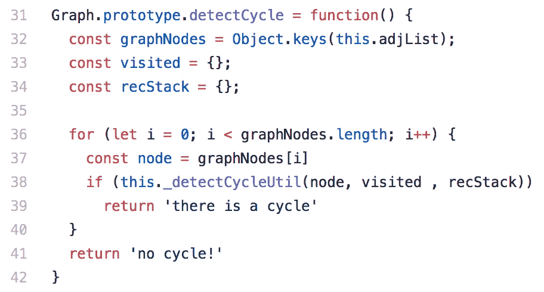
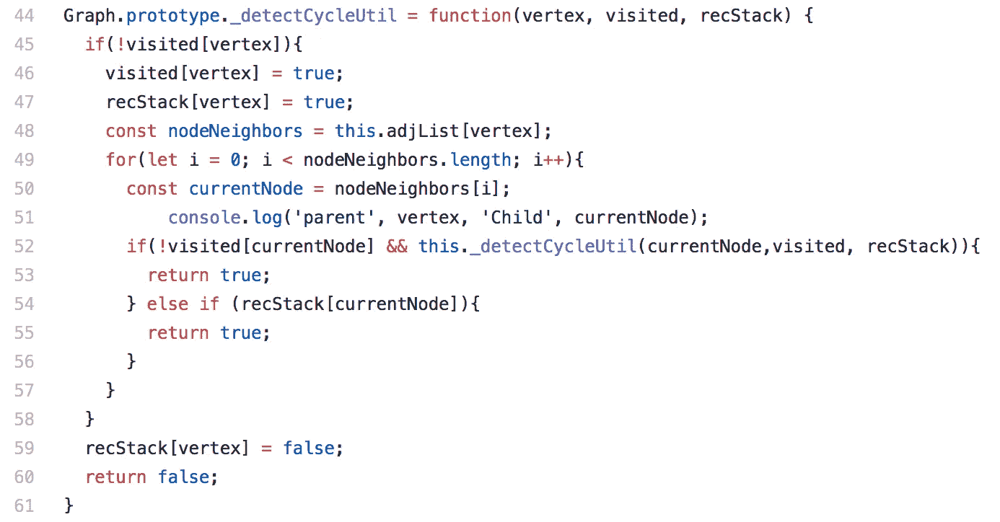

# Javascript 开发人员关于图形和检测图形中的循环的指南

> 原文：<https://medium.com/hackernoon/the-javascript-developers-guide-to-graphs-and-detecting-cycles-in-them-96f4f619d563>

在我第一次参加全栈软件工程职位的现场面试时，我被要求写一个函数来检测有向图中是否存在循环。

读者:我没有成功地编写那个函数。

老实说，我对什么是图有一个模糊的想法，即使是*是*。在我生命的大部分时间里，我认为图表是这样的:



Source: [http://bit.ly/2HFsh9w](http://bit.ly/2HFsh9w)

事实证明，图表实际上是这样的:



Source: [http://bit.ly/1OCkA1r](http://bit.ly/1OCkA1r)

我知道，我也认为第一部看起来更有趣。但是图形实际上是一个非常酷的数据结构。它们在计算机科学中无处不在，用于[推荐引擎](http://www.objectivity.com/building-a-recommendation-engine-using-a-graph-database/)和[谷歌地图](http://blogs.cornell.edu/info2040/2011/09/14/google-maps-its-just-one-big-graph/)，当然还有 [GraphQL](http://graphql.org/learn/thinking-in-graphs/) 。问题是，没有多少文章详细介绍 Javascript 中用图形实现/tricks。所以我决定写一个。

那么什么是图表呢？

关于图要知道的最基本的事情是它们由**顶点**和**边组成。**顶点是图的*事物*:整数、物体、网站等。边连接一对顶点。

图表可以是:

1.  加权或未加权-这是指图表的边是否标有值。如果是，那就是加权的。
2.  有向或无向-这是指边的行为是像桥(无向)还是像保龄球道(有向)。
3.  循环或非循环—这是指图中是否存在循环。

有两种主要的方式来表示一个图:用一个**邻接表**，它是与每个节点**相关联的数组(或者对象，如果你喜欢的话)的集合**

```
{
a: [b,c,d],
b: [c,f],
d: [e],
e: [a,f],
f: [a, c, d, e]
}
```

或者使用一个**邻接矩阵**，它是一个二维数组，其中顶点之间的边用 1 **:** 表示

```
[ [0, 1, 0, 0, 0, 0, 1, 0, 1, 0],
  [1, 0, 0, 0, 1, 0, 1, 0, 0, 1],
  [0, 0, 0, 0, 1, 0, 1, 0, 0, 0],
  [0, 0, 0, 0, 1, 1, 0, 0, 1, 0],
  [0, 1, 1, 1, 0, 1, 0, 0, 0, 1],
  [0, 0, 0, 1, 1, 0, 0, 0, 0, 0],
  [1, 1, 1, 0, 0, 0, 0, 0, 0, 0],
  [0, 0, 0, 0, 0, 0, 0, 0, 1, 1],
  [1, 0, 0, 1, 0, 0, 0, 1, 0, 0],
  [0, 1, 0, 0, 1, 0, 0, 1, 0, 0] ]
```

每种表现都有利弊。一般来说，边多的图作为矩阵更好，边少的图作为列表更好。邻接表更常见，这就是我们今天要用的。

# 制作图表

所以让我们开始制作吧！喔。我们要做的第一件事是…制作一个图表。



图构造函数内部的逻辑很简单:只是一个实例化为对象文字的邻接表。接下来的两个方法并不复杂:一个是添加顶点的方法，将每个顶点初始化为空数组；另一个是添加边的方法，将一个顶点推入另一个顶点的数组。所以像这样的事情…



制作了一个类似这样的图表:



或者换句话说:



RIP Microsoft Paint

现在我们有了一个图表！耶。不是任何一个图:一个未加权的，有向的，无环的图。

# 遍历图形

现在我们有了一个图，我们将需要找出一种方法来访问不同的顶点——毕竟，我们的最终目标是检测图是否是循环的，这意味着沿着图的边从一个顶点遍历到另一个顶点。

遍历一个图有两种方法:一种是**广度优先遍历，**先访问一个顶点的每个子节点，然后再访问该子节点的任何一个子节点，另一种是**深度优先遍历，**我们沿着一系列由边连接的顶点进行遍历，直到我们不能继续下去，然后再继续到原始顶点的下一个子节点。我们检测有向图中的循环的算法将使用深度优先遍历的修改版本，所以让我们快速地看一下这个遍历方法是什么样子的。



这里有两个函数:一个 dfs 函数和一个 _dfsUtil 函数。

dfs 功能只做三件事:

1.  创建一个名为“节点”的数组；每个元素都是我们图中的一个顶点
2.  创建一个名为“visited”的对象文字
3.  在图中的每个顶点上调用我们的效用函数。

当我们执行一个图的深度优先遍历时，需要记住的重要事情是，与二叉树相反(例如)，我们需要跟踪我们已经访问过的节点，并且*而不是*第二次访问它们，即使另一个顶点有到那个节点的边。例如，如果我们没有跟踪我们访问过的顶点，那么从起点‘A’开始遍历我们的图会导致我们访问‘B’四次，而不是一次！🙅🙅🙅

```
A -> B
A -> D -> B
A -> D -> E -> B
A -> C -> E -> B
```

这就是为什么我们把访问过的数组作为参数传递给我们的效用函数。效用函数是我们访问一个顶点，将它标记为已访问，获取它的边，检查给定的边是否已经被访问过，如果没有，递归调用我们的效用函数，将该顶点作为新的起点和更新的“已访问”数组。

# 但是……周期检测？

对！检测周期。我们如何修改深度优先搜索功能来确定我们的图是循环的还是非循环的？



和以前一样，我们将为图中的每个顶点调用循环检测效用函数。只有当效用函数从不返回 true 时，我们才能确定这个图是非循环的。但是我们还将创建一个名为“recStack”的对象文字。



我们正在做几件事:

1.  在第 45 行，我们正在检查以确保我们还没有访问这个节点。如果有，就没必要再查了。
2.  在第 46 和 47 行，我们在访问堆栈和 recStack 中将顶点设为真。在这个新的效用函数中，recStack 代表“递归堆栈”,它跟踪**后沿，**我们访问的顶点，以到达当前顶点。
3.  和以前一样，我们将获得当前顶点的邻居并遍历它们。然而，这一次，我们不仅仅是检查我们是否访问过它们——我们还检查一个特定的边是否在我们的 recStack 中，这意味着我们已经访问过它。这是我们发现循环的标志。
4.  如果顶点不在我们的 recStack 中，那么我们将它从递归堆栈中弹出(第 59 行),这样当我们遍历图中的另一条路径时就不会得到误报。

嘿，很快:这就是我们检测图中是否有循环的函数。

在我看过的大部分计算机科学入门资源中，图表并没有涉及太多，这真是一个遗憾。他们真的很酷，遍布整个学科，并且在入门级软件开发职位的面试中非常普遍(至少在我的经历中是这样)。所以，对我的(有抱负的)初级开发人员同事们:在你参加下一次面试之前，先学习一些图表。世事难料。

下面是 repl:[https://repl . it/@ samisthesam/有向图循环检测](https://repl.it/@samisthesam/Cycle-detection-in-a-directed-graph)

*感谢* [*苏拉米塔*](https://www.linkedin.com/in/sulamita/) *的咨询和道义支持*