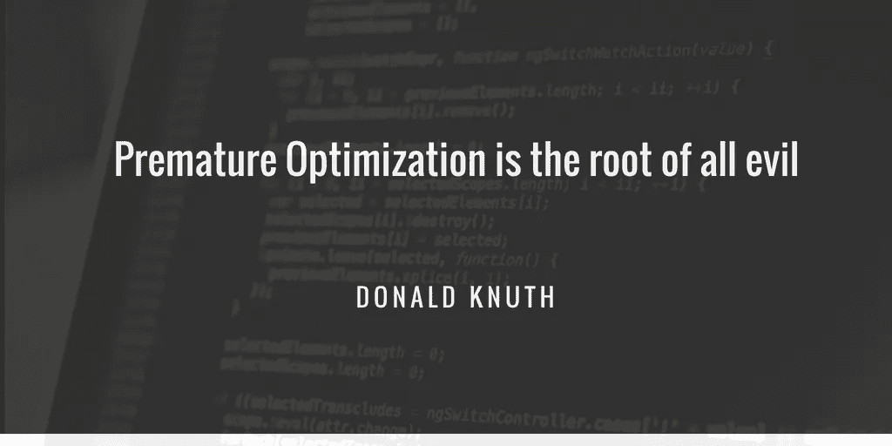

# 旅程；业余到专业和错误

> 原文：<https://medium.com/hackernoon/the-journey-amateur-to-expert-and-the-mistakes-7bbb91ef46aa>

Photo by [Jefferson Santos](https://unsplash.com/photos/9SoCnyQmkzI?utm_source=unsplash&utm_medium=referral&utm_content=creditCopyText) on [Unsplash](https://unsplash.com/@jefflssantos?utm_source=unsplash&utm_medium=referral&utm_content=creditCopyText)

在热爱编码的人群中，有业余爱好者和专家，也有正在成为专家的人。我想我已经在这条路上走了几年了。对我来说，专业开发人员不是对框架/语言了如指掌的人，而是知道如何解决特定问题的人。成为专家并不是要知道每个问题的解决方案，而是要知道如何学习、适应和实施。那么，什么时候一个人会成为专家开发人员/工程师呢？我想你只有一岁的时候才会知道。但是不要在这上面纠缠不清，享受这个过程，每天都努力成为一名更好的开发人员。

当你进入职业生涯 9 - 12 个月时，你通常会越过初级水平，开始成长阶段。你已经积累了足够的知识来掌握先进的概念，这通常是你犯一些根本性错误的时候。成长阶段很棘手；您会接触到许多想法、最佳实践和方法。你读了很多书，听了很多同行和专家的意见。这种信息过载对一些人来说有点难以承受。你尝试做很多事情，可能会错过一些基本原则。这篇文章是关于开发人员在成长阶段会犯的几个这样的错误，以及如何避免这些错误。

# 构建思维导图

在你急着启动你最喜欢的 IDE 之前，考虑清楚你要解决什么问题，以及你将如何去做。现行制度有哪些弊端？在构建最简单的解决方案的同时，如何处理所有这些问题？。基于所有制定的数据，你准备一个执行策略，把它分成子模块，估计和安排时间表。

一旦你开始工作，总是要有你要构建的产品的思维导图，更大的图片，依赖关系和大概的位置。假设您正在为您的产品设计和创建一个新的支付系统，记住新框架的逻辑和数据流的可视化表示以及它如何与当前的发票和税务系统交互总是有帮助的。

# 简单胜过满足

通常，你需要解决的问题是简单明了的。您从业务团队收集需求，并计划和估计几个小时的工作，这样就可以开始了。就在那时，你那疯狂自私的头脑开始玩游戏。我怎么能实现这么简单的东西？。我的代码不能看起来这么无聊！毕竟我们是工程师；我们喜欢构建复杂精密的解决方案。

如此确信输出不可能简单，或者更确切地说不应该简单，你继续用一种不寻常的实现方法，并以不可维护的代码结束，当然，你获得了一种成就感。然而，在这一点上，你已经忘记了你应该解决复杂的问题，而不是让你的解决方案成为另一个问题。

# 过早优化

没有首先测量的优化几乎总是不成熟的。但我认为唐纳德·克努特的上述声明在大多数时候都被曲解了。它不应该成为编写糟糕代码的借口。我认为这个评论应该更合适，因为过早的微优化是万恶之源。我们还需要做好架构、数据库设计、数据流等宏观优化。几乎 90%的优化应该发生在架构级别。即使在决定算法和数据结构时，您也应该做出明智的决定。像选择 O(log N)算法而不是 O(N)算法这样的事情通常是值得的，应该尽早考虑。

优化几乎总是涉及时间和维护成本。因此，明智的做法是在着手解决问题之前，先找出问题并进行分析。花两周的时间来优化一个每天运行 10 毫秒的函数不是优化，而是矫枉过正！。也就是说，微优化并不总是坏事。但是在开发周期的错误时间这样做可能会严重影响你的生产力。

*让它工作，让它正确，让它快速—* [*肯特贝克*](http://wiki.c2.com/?MakeItWorkMakeItRightMakeItFast)

**参考文献**

*   [带 Go To 语句的结构化编程](http://pplab.snu.ac.kr/courses/adv_pl05/papers/p261-knuth.pdf)
*   肯特·贝克
*   [过早优化](http://wiki.c2.com/?PrematureOptimization) -1
*   [过早优化](https://softwareengineering.stackexchange.com/questions/80084/is-premature-optimization-really-the-root-of-all-evil) -2