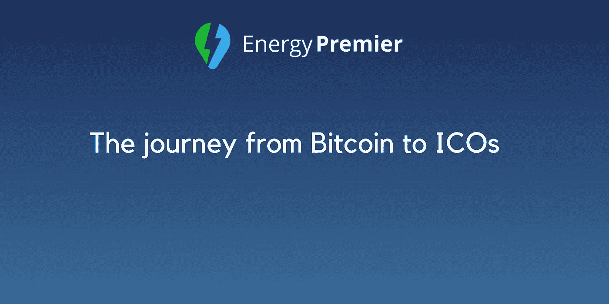
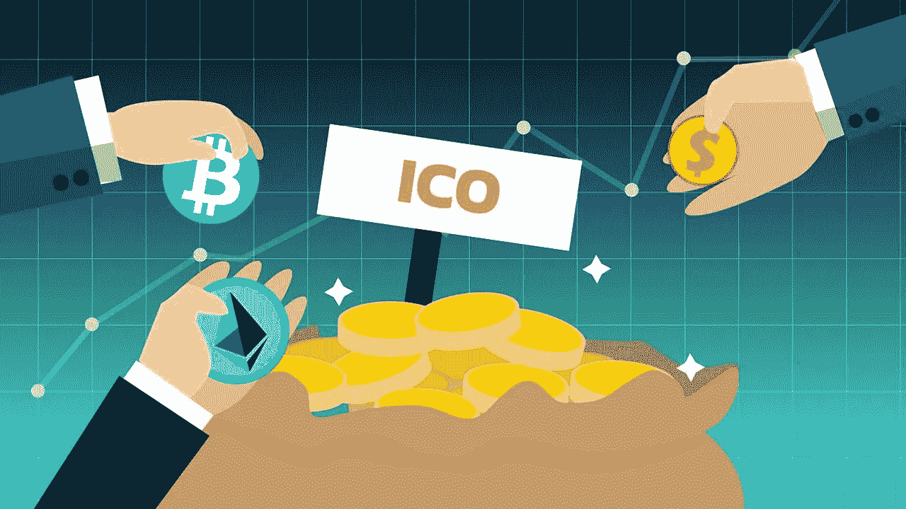

# 从比特币到 ICOs 的旅程

> 原文：<https://medium.com/hackernoon/the-journey-from-bitcoin-to-icos-c37deca6e4db>

今天，科技已经成为我们生活中不可或缺的一部分，一些人可以想象没有它的生活。我们在技术的帮助下实现了很多东西，其中包括加密货币和 ico。几乎所有人都听说过比特币及其在今天的价值。但是，比特币到底是什么，它如何帮助公司利用 ico 创造价值？

2009 年，一个化名为**中本聪**的软件开发者开发出了著名的**比特币**。这个想法是开发一个分散的电子现金支付网络，实现点对点的价值转移。它是一种电子现金，允许一方直接向另一方付款。这意味着，随着比特币的使用，将不再需要第三方，如政府、银行、公司或拥有比特币的人。相反，余额被在线存储在被称为**区块链**的数字资产软件平台上。

一开始，比特币并没有那么受欢迎，人们对它持怀疑态度。今天，比特币已经成为世界上第一个也是最大的数字货币和支付网络。这就是为什么许多公司想创造自己的加密货币，并做出成功的 ICO。

有许多流行的加密货币追随了比特币的脚步，如以太坊、Ripple、莱特币、Cardano 等。我们生活在这样一个时代，技术是我们生活中的主要因素之一，这些筹集资金的方式已经在世界各地得到认可。

[例如，以太坊](https://medium.com/u/d626b3859bc9?source=post_page-----c37deca6e4db--------------------------------)是一个去中心化的平台，它制作智能合约——应用程序的运行没有任何欺诈、审查、停机或第三方干扰。他们的加密货币 **Ether** 可以在账户间转移，用于补偿参与者挖掘节点。以太坊取得了如此巨大的成功，有望在 2018 年战胜比特币。

另一方面， [Ripple](https://medium.com/u/951c695df315?source=post_page-----c37deca6e4db--------------------------------) 是一个实时支付结算系统，货币兑换和汇款网络。这是一个共享的公共数据库，是世界上第一个通用的货币翻译器。他们的 **XRP 令牌**已经成为一种成功的加密货币，可以在 4 秒或更短时间内完成交易。由于 XRP 的成功，Ripple 公司赚了很多钱，他们的代币已经成为全球最大的加密货币之一。

此外， **Litecoin** 是一个点对点加密货币和软件项目，可以在世界各地实现即时、零成本支付。它的灵感来自于比特币，也与比特币相似。它基于比特币的开源代码库，但也有差异。据说莱特币是比特币的黄金之银。普通莱特币每 2.5 分钟处理一个街区。它比比特币更便宜，使用速度更快。今天莱特币很受欢迎，预计将来会取得更大的成功。

比特币的引入帮助公司意识到技术在不断改进和进步，他们可以通过使用 **ICOs** 创造价值。许多人和公司开始参与 ico。2017 年是国际奥林匹克年。通过 ICOs 筹集的所有资金中，超过 90%发生在 2017 年。

**由于比特币技术以及其他引入的加密货币，最初的硬币发行(ico)**有所增加。ICO 被认为是一种不同于传统金融体系的另类众筹形式。在那里，加密货币以代币的形式预先分配给投资者，以便兑换法定货币或比特币等其他加密货币。当 ICO 项目启动时，这些代币成为功能货币。

ico 如此吸引人的原因是相对较低的进入门槛，使个人和公司能够筹集大量资金。ico 已经成为提高加密货币和区块链认知度的强大力量。世界已经准备好在未来看到更多的 ICO 创意，甚至现在也有很多很有前景的 ICO 项目。

这就是为什么 Energy Premier 致力于开发一个基于区块链的电力零售招标平台，从预售和众筹开始。

> 感谢您的阅读。
> 
> [订阅最大的电力竞价平台](/@energypremier)随时关注我们的更新。也在我们的电报频道参与讨论:[https://t.me/joinchat/Hq0j1hDxZ3eRKFNo5f7oTw](https://t.me/joinchat/Hq0j1hDxZ3eRKFNo5f7oTw)
> 
> 在这里加入预售和众筹:[https://tokensale.energypremier.com/](https://tokensale.energypremier.com/)

你也可以看看其他类似的文章:

*   [能源市场中的区块链——专家怎么说？](/@EnergyPremier/blockchain-in-the-energy-market-what-are-the-experts-saying-86e55f754a2a)
*   [能源优先令牌(EPC)](/@EnergyPremier/the-energy-premier-token-epc-bf5aa28349c6)

