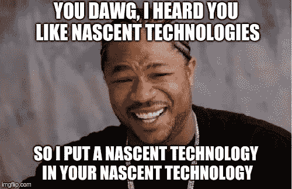
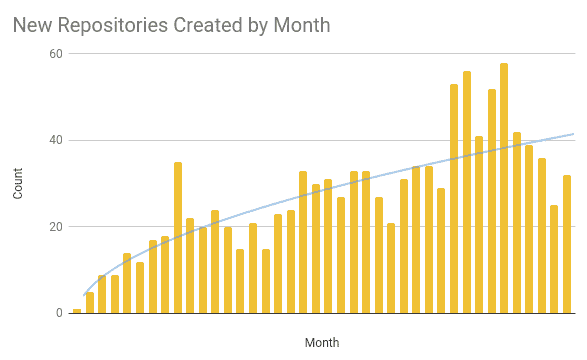
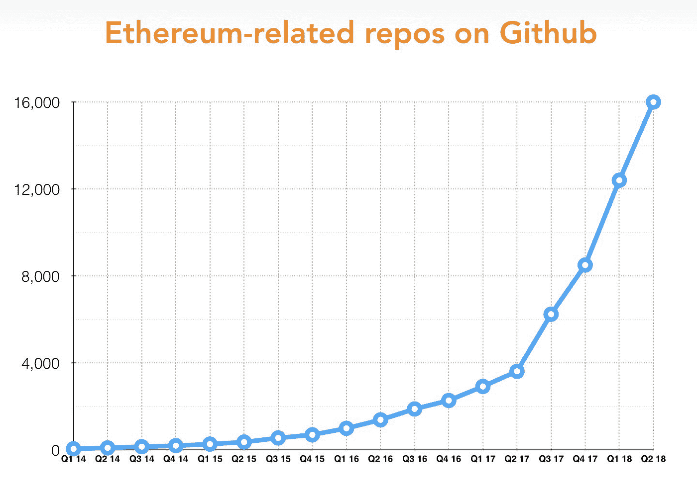
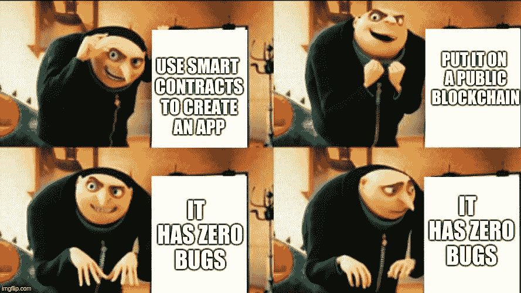

# 通往未知世界的旅程始于一艘尚未建造的船

> 原文：<https://medium.com/hackernoon/the-journey-to-a-world-unknown-begins-in-a-vessel-yet-built-c854cb4aa12e>

## **对智能合同的一个未经审查的观察，第二部分:**

如果你还没有阅读第 1 部分，我推荐你先从[开始。](/nori-carbon-removal/an-uncensored-look-at-smart-contracts-part-1-the-gentlest-of-introductions-b3c3b6b24eee)

开始编写软件很容易——只需抓住一个流行的 [IDE](https://en.wikipedia.org/wiki/Integrated_development_environment) ，写几行[“你好，世界】](https://en.wikipedia.org/wiki/%22Hello,_World!%22_program)，点击那个[编译](https://en.wiktionary.org/wiki/compile)按钮，就这样了。

祝贺并感谢阅读-。哦，等等，你说“有只虫子”？不要担心，你正在使用的编译器可能会打印出一个可理解的语句，因为你是一个快速的学习者，只要继续下去并解决它。好了，我真的得走了，嗯？你的编译器吐出的字节码中有奇怪的东西？好了，熟悉一个[静态分析](https://en.wikipedia.org/wiki/Static_program_analysis)工具。完成了吗？好，回头见，哦？现在您想将应用程序部署到您的用户吗？没问题，有许多工具可以帮你。不管怎样，祝你愉快，那是什么？你正在一个新生的、分散的架构之上使用智能合约进行构建，比如区块链？哦。我完全忘记了这是这个系列的主题。好吧。。。去吧，忘了我刚刚给你的每一个建议。哦，还有，取消你接下来几个月的计划，因为事情会变得有趣。

新生技术很难。但可能不是你想的那样。如果你在想，“这些新奇的技术太难构建了，因为它们很复杂，因此本质上更难理解”，那么我要明确地告诉你。大多数情况下，这与它无关。实际上，新技术只不过是站在之前的巨人肩膀上的迭代。因此，在大多数情况下，它们的难度取决于这一次技术迭代和之前的技术迭代之间的差异。

不，新生技术不会因为它们的复杂性而令人困惑，也不会因为它们固有的难度而变得困难——相反，它们之所以困难，是因为它们存在于理论构思阶段(教育就是一切)和大众采用的技术阶段(设计和交互就是一切)之间。

在一项技术的萌芽阶段，它的 [**工具和生态系统就是一切**](https://www.sciencedirect.com/science/article/pii/S2352664516300190#a000010) 。简单来说，新兴技术就像宜家家具一样，但有一个重要的区别——当家具到达时，它会被拆开，并附有如何组装的说明手册，然而，问题是他们忘记了包括工具，也没有列出客户服务号码。祝你好运。

你可能会问，“但这意味着什么呢？我下定决心了。我仍然想用它来建造一些东西”，对此我表示赞赏。假设你首先充分评估了你的想法是否适合智能合约和区块链(或者就此而言，甚至是分散的范式)，在你开始旅程之前，至少还有三件事情应该在你的清单上。

1.  开源就是一切。你需要找到的第一件事是一个由[开源](https://techcrunch.com/2017/04/07/tracking-the-explosive-growth-of-open-source-software/)技术专家的想法产生的链。如果你不能轻易地借鉴其他项目的经验，你的旅程将会在一个荒凉荒芜的深渊中结束。如果没有同行的维护，即使是区块链的永久也救不了你——所以确保你选择一个有社区驱动的软件项目的生态系统。相信我，你从一开始就需要这个。
2.  适应性。你需要找到一个平台，在这个平台上你可以创造出适应性强的迭代产品。如果你不能适应，那就准备好你的想法被反对，失去领养，[严重的错误](/chain-cloud-company-blog/parity-multisig-hack-again-b46771eaa838)，以及随后失去你的妻子/丈夫和孩子(最后一个只是开玩笑……也许)。话虽如此，[轻轻踏过](/unchained-reports/bancor-unchained-all-your-token-are-belong-to-us-d6bb00871e86)。
3.  标准化和成长对于新技术来说极其重要。因此，要评估的第三个属性，但肯定不是最后一个，是特定的生态系统是否通过跟上技术[标准](https://github.com/ethereum/EIPs)、[设计/交互标准、](/design-for-crypto/ðapp-user-experience-audit-afc11e4384c3)当然还有[安全标准](/mycrypto/a-safer-mycrypto-79d65196e7d8)而以与世界其他地区一致的速度增长。

完了？太好了。你可能会意识到，在满足上述约束条件后，你只剩下几个选择了。然而，如果你已经仔细地遵循了它们，那么恭喜你——你已经通过分离“区块链海市蜃楼”为自己节省了一些时间。现在你应该选择其中的一个，并长期坚持下去。

在 Nori，选择非常简单:以太坊。我很高兴地说，这一个检查这些盒子的每一个。然而，这绝对不是唯一的选择，所以你应该在这个阶段花尽可能多的时间来选择一个你认为最适合你需要的。别担心，世界会等着你。

# **工具集和开发者生态系统**

现在，关于工具集和开发者生态系统的话题。为了能够将产品从构思到采用，拥有快速原型的能力是关键。如果你试图建立的东西不能在一个活跃的市场中迭代，它很可能在首次亮相之前就被遗忘和过时了。与专业化软件不同，在专业化软件中[形式化](https://en.wikipedia.org/wiki/Formal_methods)至关重要，迭代在消费类软件中很重要。就这一点而言，如果您需要花更多的时间来构建和调优您自己的工具来实现这一点，那么您可能应该重新审视一下您的清单。

现在，如果你和我们一样，选择了以太坊生态系统，那么准备好惊讶于现有的大量工具来启动你的过程吧。有用于编写合同的 [Solidity](https://github.com/ethereum/solidity) 和 [Vyper](https://github.com/ethereum/vyper) ，用于编译的 [solc](https://github.com/ethereum/solc-js) ，用于语法糖的 [IDE 插件](https://github.com/juanfranblanco/vscode-solidity)，用于快速原型制作的 [Embark](https://github.com/embark-framework/embark) 和 [Truffle](https://github.com/trufflesuite/truffle) ，用于快速编写代码片段的 [EthFiddle](https://ethfiddle.com/) ，用于在浏览器中快速测试想法的 [Remix](http://remix.ethereum.org) ，用于污点分析的 [Mythril](https://github.com/ConsenSys/mythril) ，以及[鼹鼠我甚至写了一个简单的工具](https://github.com/trailofbits/echidna)[与许多这样的工具集兼容(在即将到来的独立帖子中会有更多)。不服气？我使用 GitHub API 来进一步量化以太坊开发者的活动:](https://www.npmjs.com/package/contract-state-util)

这是另一个不断增长的总数(偷自 [@stefanobernardi](https://twitter.com/stefanobernardi) ):

还有一点，也是最重要的一点——参与并为您所依赖的所有工具集的开发做出贡献。去中心化技术依赖于它。有改进你正在使用的工具的想法吗？联系背后的团队。发现编译器有 bug？在 GitHub 上提交问题。知道如何提高一个普通任务的效率吗？在 GitHub 上提交一个 pull 请求。认为某些文档可以改进吗？更新自述文件。认为做某事有更好的方法吗？创建一个新工具，并要求社区参与。记住，你的创造只取决于你用来实现它的工具。

最后，花点时间提醒自己，新生的开源技术只有在有足够多的协作开发人员参与的情况下才会被采用。与日渐衰落的专有软件领域不同，在这个领域，保密和知识“财产”就是一切，这是一个完全不同的世界，价值来自合作。但这种力量依赖于一个对等的世界，包括你。

# **迭代和版本化**

这是一个棘手的问题。智能契约是区块链结构的一部分——区块链至少有两个属性使得满足这一要求很难:不变性和分散的运行时。然而，你几乎肯定需要它，即使只是作为一种你可以使用的训练轮，直到你真正把它调整到永久的位置。

也就是说，逻辑永恒性的必要性通常是一种幻想，需要一种[神话般的](https://www.langner.com/wp-content/uploads/2017/03/to-kill-a-centrifuge.pdf)水平的工程才能。与状态永久性不同，逻辑永久性在很少的实际应用中需要，并且在所有[和其他](https://en.wikipedia.org/wiki/General_Data_Protection_Regulation)中很少是一个好主意。有些人倾向于对这个不屑一顾，认为[没有必要](/unchained-reports/bancor-unchained-all-your-token-are-belong-to-us-d6bb00871e86)。“可版本性？!"他们惊呼，“区块链的全部意义在于不可改变和逻辑确定性”。我倾向于不同意，相反，对于如何(以及何时)利用它，我会非常谨慎。

No, Gru, that last bit doesn’t seem quite right..

一个重要的认识是，区块链只有在历史上是不可变的，因此它的智能合约也是如此，如果你还没有意识到这一点的话。昨天进去的东西，明天就会留在那里，直到链条的尽头。然而，在当前和未来的背景下，它们肯定不是不可改变的。这意味着，只要您计划迭代，您的应用程序的确定性就会得到维护，而它的执行位置却可以发生变化(只在现在和将来，而不是在过去)。

用稍微简单一点的术语来说，一个没有可版本化能力的智能契约说，“当我看到 Z 时，我将总是只做 X”，而一个可版本化契约说，“当我看到 Z 时，我将总是只做 X，这是 Y 告诉我的”(其中 X 是已知的智能契约，Y 是一些可版本化逻辑实现的可变位置，Z 是事务启动)。这是一种有争议的方法，因为它重新引入了基于人的信任，并期望“Y”的维护者适当地交流和维护升级。如果你愿意，它创造了“可变的不变性”。轻轻地走。

对于可版本性，关键是逻辑确定性所遭受的缩减被增加的透明性和交流所取代。更重要的是，无论是作为应用程序健康恢复的一种手段，还是为了功能的可扩展性，实现它都是非常重要的。利用这种能力来改变智能契约的逻辑，或者改变对等体被认为拥有所有权的特定状态(即，令牌平衡)，可能会产生可怕的后果。这毕竟是一种分散的技术，因此，第三方应用程序和对等体都将频繁地进行交互，并依赖于您的契约的一致性，无论是被动的还是主动的(下次再详细讨论)。

你可能会问，“那么，怎么做呢？”。如果是这样，你可以看看[齐柏林飞艇](https://zeppelinos.org/)，这是完成这项任务的一个很好的工具，或者自己走在前沿。在瑙鲁海洋资源公司，我们决定通过采用一些流行的[技术](https://blog.zeppelinos.org/proxy-patterns/)来实现这一点，然后对它们进行一些剪裁，以满足一些透明度要求。你可以在这里看代码[。如果你对这个话题有更多的兴趣，请继续关注，因为烤箱里有热烤的东西。](https://github.com/nori-dot-eco/contracts)

# 标准

“技术标准？这么无聊，这么官僚。。。谁需要它们？”你，亲爱的读者——他们现在是你的命根子。

公平地说，在一个中央集权的世界里，技术标准毫无意义。即使在规模上，拥有常规和可预测用户的封闭技术也不需要担心形式化或标准化他们创建、构建或破坏的方式。事实上，在那个世界里，标准最多只能作为正式的架构；在最坏的情况下，他们是创新的屠夫。但亲爱的读者，这不是你选择成为其中一员的世界。不，你是这个世界一直在等待的进步。

撇开闲聊不谈，标准是我们定义与技术互动的方式。这是我们作为一个社区同意遵循的架构。当我们觉得一个标准不正确时，我们可以提出一个新的标准。它们是用户可以用来抽象理解他们想要与之交互的技术的东西，也是理解他们周围世界的设计的参考。

然而，标准不是规则，当然也不是法律(对于新生技术来说尤其如此)。随心所欲地打破它们；这是这个过程的一个重要部分。法律和标准的关键区别在于，对于标准来说，参与是可选的。

对于智能合约来说，标准就是允许对等体和第三方应用程序以一种可靠且适当的方式与您的应用程序交互和共存。听说过还有 [ERC-20](https://github.com/ethereum/EIPs/blob/master/EIPS/eip-20.md) 令牌吗？一个[不可替代令牌](https://github.com/ethereum/EIPs/blob/master/EIPS/eip-721.md)怎么样？这些是最流行的智能契约标准，至少从基于令牌的应用程序开发人员的角度来看是这样。这些标准定义了许多第三方应用程序可以引用的函数定义。事实上，正是它们使得今天几乎每一个分散的交易所和钱包得以运作。如果没有这一套标准的功能定义，以及随后的大量实现，分散式交换(以及其他类型的基于智能合约的应用程序)就不可能存在。有没有拿出一个以太坊钱包，看到一个令牌列表？这个特性的可查询性源于一个共享的[标准](https://github.com/ethereum/EIPs/blob/master/EIPS/eip-20.md)。然而，如果没有一套共享的标准，实现将是混乱无序的。

# **准备开始了吗？**

对于新生技术，可迭代性、标准、工具和开发人员社区是采用的导火索。对于智能合约来说，这个导火索在很久以前就被点燃了，最近主要是以太坊社区带头发起冲锋。这条导火线不会在爆炸中结束。不，这根导火线点燃了一艘神奇飞船的启动，这艘飞船可以带我们去一个未知的世界。这很可能是一个应用程序可以固有地[与其他应用程序](/coinmonks/introducing-crypto-composables-ee5701fde217)交互的地方，数据可以归其用户所有，[身份](https://www.uport.me/)可以独占并在所有应用程序中使用，无需许可的参与是丰富的，新市场出现[以及世界是对等的。](http://nori.com)

然而最重要的是，这也是我们可以培育数码猫的地方。