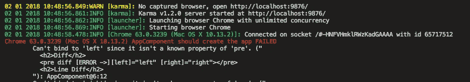

# 无服务器要在 2018 年取得成功，必须克服的关键挑战

> 原文：<https://medium.com/hackernoon/the-key-challenges-serverless-will-have-to-overcome-to-succeed-in-2018-af3132ed4995>

我之前的一篇文章“无服务器计算将如何在 2018 年改变世界”已经获得了令人难以置信的流量，并在许多主要平台上引发了大量评论。我震惊地看到这是 1 月 1 日[媒体上最受欢迎的文章之一！你可以在这里查看帖子:](https://medium.com/browse/top/january-01-2018)

 [## 无服务器计算将如何在 2018 年改变世界

### 无服务器计算是一个相当新的概念，在流行程度上有所增长。这部分是由于…

hackernoon.com](https://hackernoon.com/how-serverless-computing-will-change-the-world-in-2018-7818fc06b447) 

虽然它受到了社区的好评，但它确实凸显了人们在使用受欢迎的服务时仍然面临的一些痛点，如 AWS 的 Lambda、Azure 的功能和去年 11 月刚刚发布的[谷歌的功能](https://cloud.google.com/functions/)！(感谢斯蒂芬·泰勒指出这一点！)

在这篇文章中，我想强调无服务器计算要想真正在软件开发领域留下印记，通常还需要克服的一些关键挑战。

## 延迟问题—冷与热

无服务器产品通常没有运行在备用状态的功能副本，这意味着当有人点击该功能时，它将被冷击。这意味着您的代码需要先启动，然后再运行，这与热命中相反，热命中时代码在被命中之前就已经在运行了。

无服务器提供商可能会开始提供潜在的付费服务，让您保持一些功能预热。这将有助于确保向您的服务发出的绝大多数请求将得到较低延迟的响应。

你可能还会发现自己创建了定时的 lambda，随后调用其他 lambda 来保持它们的热度。然而，这样做的问题是，像 CloudWatch 这样的日志会被成千上万的虚拟请求填满，你必须以某种方式过滤掉这些请求，这增加了复杂性。

这不仅会增加您的日志记录系统，还会影响成本，如果普通容器在被永久终止之前能持续 15 分钟，那么您会发现自己每天都要进行 **(24*4)** API 调用，只是为了让**一个**容器为**一个** lambda 函数而存活。随着您添加越来越多的服务，这种规模会迅速扩大，一旦超出免费层，您可能会发现成本会呈指数级增长。

## 负荷预测

这个问题的另一个潜在解决方案是使用一些花哨的人工智能，并利用一个负载预测系统，当它认为您的服务即将承受巨大负载时，该系统将进行分析。

如果它能够准确预测这些峰值，这可能适用于许多不同的服务，并有助于解决冷击问题。至少它可以帮助你最大限度地减少最终受到的冷遇。

然而，问题是它不会便宜。如果你的算法被证明过于保守，那么你要么为被过分乐观的算法预热的空闲容器支付额外的费用，要么仍然会收到“总延迟”。(这一点谢谢雅克！)

## 房地产管理

随着无服务器架构复杂性的增加，管理无数不同端点和各种环境的任务也在增加。这也是基于微服务的架构面临的一个非常现实的问题，这也是采用 Kubernetes 等工具的原因，以便通过代码来协调一切管理。

像[https://github.com/apex/apex](https://github.com/apex/apex)这样的项目正开始起飞，因为它们帮助你构建、部署和管理 [AWS](https://hackernoon.com/tagged/aws) Lambda 功能。这些将在 2018 年继续发展，继续让使用 Lambda 的开发者的生活变得更简单。

然而，随着时间的推移，提供者自己需要向前迈出一大步，以便在本地改进这个过程，从而使采用率飙升。

## 局部可测性

到目前为止，我看到的最大的抱怨之一是在本地测试 lambda 函数非常困难。如果你查看 AWS 的[官方文档](https://docs.aws.amazon.com/lambda/latest/dg/with-s3-example-upload-deployment-pkg.html)，你会发现他们建议你通过手动调用来测试。

随着我们转向更有效的开发流，无法自动测试您正在构建的东西是令人痛苦的。如果你必须维护数千个不同的 Lambda 函数，那么这将变得越来越复杂，需要一个解决方案，允许你用最少的手工输入自动测试这些函数。

当试图实现一个本地测试平台时，主要的问题是几乎不可能尝试和模拟这些功能将在其上运行的底层平台。

我担心改善的唯一方法是无服务器提供者实现一个体面的本地解决方案，允许开发人员非常快速地迭代修改他们的代码库。

> 你花在管理任务上的时间越多，比如推送+手动触发 lambda 函数，你花在为公司交付价值上的时间就越少。

当谈到想象完美的解决方案时，我喜欢想象我们如何测试我们的角度项目。您当前运行 angular-cli 命令`ng test`，它将观察您的 angular 项目的变化，并在检测到任何变化时执行任何单元测试。

Instant feedback is incredibly important for a fast developer workflow

## CI/CD 管道到生产

这是许多评论中经常提到的一点，我觉得这有点不公平，因为 AWS 等无服务器提供商开始发布 CodePipeline 和 CodeDeploy 等工具。这些工具可以与您的标准 git repos 结合使用，并且随后可以在每次提交时将任何更改部署到开发/测试/生产中。

这是向更流畅的 CI/CD 体验迈出的第一步，为了让开发者和 devops 专业人士获得更好的体验，还有相当多的工作要做。

## 结论

希望你觉得这篇文章很有见地！如果你有任何意见，欢迎在下面的评论区留言或发推特给我:[埃利奥特·福布斯](https://medium.com/u/eb71d34fbe09?source=post_page-----af3132ed4995--------------------------------)。我也在 [LinkedIn](https://www.linkedin.com/in/elliotforbes/) 上，如果你想联系的话！

> 2018 年，我还将向我的 YouTube 频道推送大量新视频内容:[https://www.youtube.com/tutorialedg](https://www.youtube.com/tutorialedge)e .请订阅并查看我的视频，支持我！