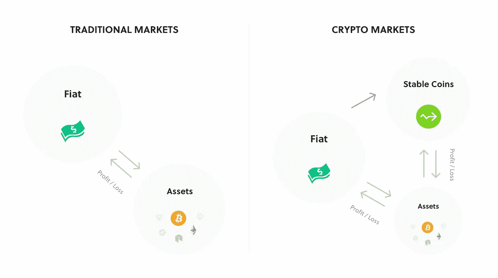
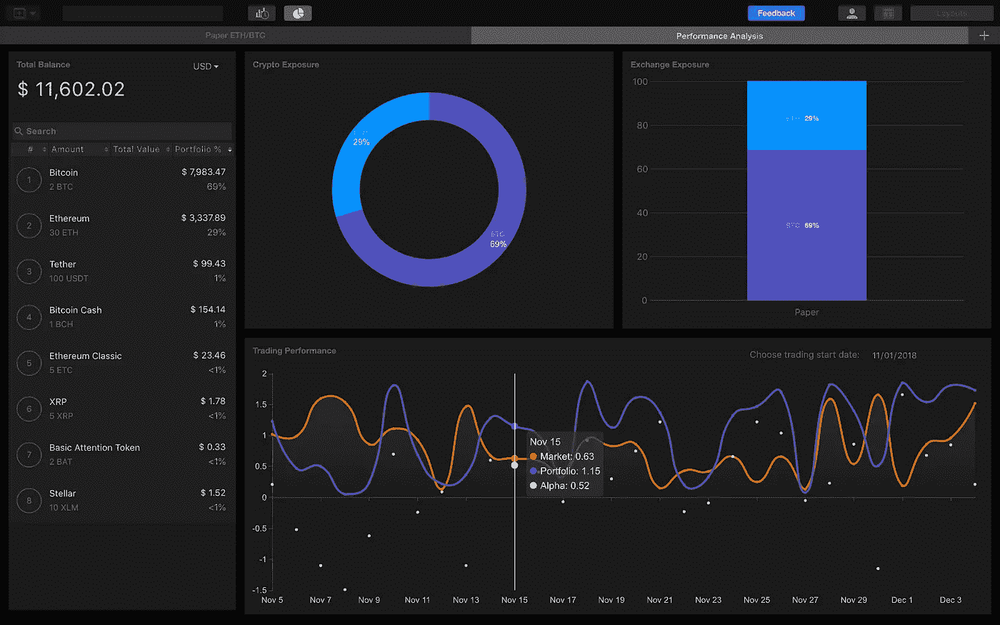

# 衡量加密交易绩效的关键指标

> 原文：<https://medium.com/hackernoon/the-key-metric-for-measuring-crypto-trading-performance-41b0ad4f9f8c>

从传统市场可以学到什么，以及如何将其应用于加密交易。

T2:交易是为了获得正回报。毫不奇怪，许多交易者错误地关注总的盈亏数据，认为他们的收入是唯一值得他们花费时间的关键指标。

不幸的是，仅仅根据收入和利润/损失数据来衡量结果缺乏相关性，并且不会指导增加回报所需的改进。

在评估你的交易历史的成功时，使用整体投资组合规模的增长是一个很好的开始。然而，业绩分析应始终以给定交易策略 背后的 ***风险信息为指导。***

# 什么是风险？

简单地说，风险是与预期结果 的 ***偏差。为了持续获得更高的回报，交易者必须承担更多的短期波动。***

风险调整后的回报对于分析传统市场的交易表现至关重要，因为它们允许在投资组合之间进行直接比较，或者与具有预期回报和风险的基准指数进行比较。

# 性能分析会延续到加密中吗？

尽管风险调整后的回报和传统的技术分析可能适用于加密货币交易策略，但对于大多数加密交易者来说，这将是一种过度杀戮。如果我们采取一些常见的风险措施，如 [alpha](https://www.investopedia.com/terms/a/alpha.asp) 、 [beta](https://www.investopedia.com/terms/b/beta.asp) 、 [R 平方](https://www.investopedia.com/terms/r/r-squared.asp)、[标准差](https://www.investopedia.com/terms/s/standarddeviation.asp)和[夏普比率](https://www.investopedia.com/terms/s/sharperatio.asp)——目前还不清楚它们是否会在加密货币领域有任何用处。加密货币市场受到操纵、贪婪和恐惧的影响，这使得使用传统金融的方法来分析潜在风险变得很困难。

此外， ***重要的是要考虑这些指标是否是更小数据集的准确预测指标*** 。总的来说，反对在加密货币交易中使用技术分析的人指出，加密资产类别的历史很短，因为拥有一套可靠的历史数据对指标的有效性至关重要。

在加密的情况下，剧烈波动是习惯性的，市场波动不如主流金融市场那样容易理解，指标的可用性受到限制，因为流动性不足等因素可能会阻碍数字货币的分析。考虑到这一点，过分相信一枚新生硬币的性能指标是不明智的，但传统的技术分析仍然会为交易者提供一套宝贵的量化见解。

事实上，使用技术分析进行加密货币交易比基本面分析和估值更具优势，因为它纯粹是对潜在价格行为的研究。因为价格受市场参与者互动的影响，技术分析提供了资产或市场当前趋势的直接印象。因此，衡量成功的标准是可以互换的，但衡量利润的标准是不同的。

Trading flow comparison between two worlds.

例如，股票或衍生品交易者用法定货币追踪利润，但退出任何加密交易者的头寸，进入法定货币可能代价高昂。大多数交易所不提供法定货币对，即使提供，也是以低交易量和高费用为代价的。

为了避免这一点，一些交易者选择使用稳定的硬币，如 USDT，USDS 等，以固定他们的收入，避免其他硬币的价值波动。尽管它们被认为是稳定的，但考虑到与菲亚特挂钩的硬币的市场操纵潜力，像 USDT 这样的硬币头寸仍然可以被认为是一种风险敞口。基于这一点，许多交易员选择将利润固定在比特币上，旨在增加其投资组合中的比特币数量，而不管其价格如何，并采取二级长期持有计划。在这种情况下，假设交易和投资之间的混合方法是必要的，应该是任何策略的一个组成部分。

此外，加密货币交易者应该考虑他们期望的价值储存。 ***衡量收入和使用 BTC 作为基础货币，同时单独使用法定货币提款是常见的，但没有考虑到这一点的策略是不接地的*** 。例如，在针对 ETH 交易的加密资产中建立头寸可能会导致头寸的美元价值增加，但 ETH 价值减少，从而导致基本上不成功的交易。

定期回顾交易表现和确定交易策略的成功提供了对交易结果的现实展望。在这方面， ***使用基准或指数作为比较点，将有助于确定回报是否跑赢或跑输市场，并提升风险导向指标的价值*** 。例如，对任何交易者来说，上涨 10-15%似乎是一个成就，但如果基准市场上涨接近 20%，交易回报显然低于目标。

# 什么是 Alpha，我为什么要使用它？

对于一个积极的投资者的投资组合，使用阿尔法是必不可少的，以分析投资结果对整体市场回报在特定时期内。Alpha，也称为投资的积极回报，可以表示为一个位数或百分比，作为与代表市场整体运动的基准指数的正或负比较点。

例如，0.5%的正 Alpha 值表明一项投资的表现超过基准指数 0.5%，而负 Alpha 值表明一项投资的表现低于基准指数一定的幅度。 ***一项投资相对于基准指数回报的超额回报被称为该项投资的 Alpha。***

阿尔法(或α)也被称为*异常回报率*是针对市场的效率，是任何交易者的必备工具。在传统的资产管理中，存在与不同资产类别相关的任意数量的市场指数，如 S & P 500 指数，使用合适的指数是使风险调整后的业绩指标物有所值的唯一方法。由于指数尚未在加密货币市场标准化，阿尔法策略通常依赖于市值数据。

[Trading Performance Workspace in Kattana](https://kattana.trade/?utm_source=medium&utm_medium=article&utm_campaign=Blaunch&utm_term=04.12&utm_content=tradingperformance)

> ***提示:在***[***Kattana***](https://kattana.trade/?utm_source=medium&utm_medium=article&utm_campaign=Blaunch&utm_term=04.12&utm_content=tradingperformance)***中，总市值作为一个基准指数，可以在交易业绩工作区中找到。***

对于使用历史数据的绩效指标，Alpha 可能不适合预测未来回报，但它可以帮助识别在风险调整基础上表现良好的资产。当把你的投资组合映射到 Alpha 时，一定要考虑你的交易间隔:如果你的加密头寸的平均持续时间是一个月，那么跟踪你的每日 Alpha 会比每小时的分割产生更好的结果。交易风格和频率决定了分析的频率，因为对交易数据的微观分析超过了你的交易活动，只会阻碍你的长期目标。

对跟踪你的交易表现感到好奇？*[***Kattana***](https://kattana.trade/?utm_source=medium&utm_medium=article&utm_campaign=Blaunch&utm_term=04.12&utm_content=tradingperformance)***，一款基于桌面的密码交易终端，让你对照基准指数分析自己的表现。****

**

*在 [Twitter](https://twitter.com/kattanatrade) 和[脸书](https://www.facebook.com/kattanatrade/)上关注我们，了解更多类似内容和产品更新。你如何衡量你的交易表现？在我们的 [Telegram](https://t.me/kattana_trade) 社区分享您的想法。*

******

# *关于我们:*

*[**Kattana**](http://kattana.trade) 是区块链资产的专业交易终端，由交易员为交易员打造，将个人加密货币交易提升到专业水平。在多个加密交易所交易，从市场分析到衡量交易表现，所有专业工具都在一个地方提供。*

*查看 [Kattana 的网站](http://kattana.trade)了解更多信息，关注我们的 [Twitter](https://twitter.com/kattanatrade) 和[脸书](https://www.facebook.com/kattanatrade/)了解更多类似内容和产品更新。欢迎在我们的 [Telegram](https://t.me/kattana_trade) 社区提出任何问题。*

*请在下面的评论中告诉我们你交易小额硬币的经历，以及你是如何将它们融入你的交易策略的！*

**卡特纳团队**