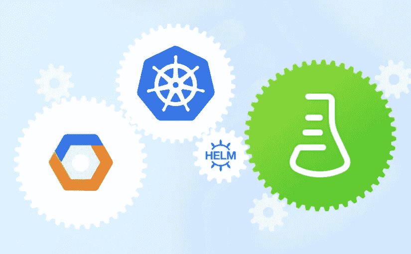

# Presslabs 的 Kubernetes 从研究到生产之旅

> 原文：<https://medium.com/hackernoon/the-kubernetes-journey-from-research-to-production-at-presslabs-f18597ac8256>

在 [Presslabs](https://www.presslabs.com/) 我们管理 WordPress 主机，为此我们创建了自己的堆栈，用 Django 编写了一个客户仪表板。

仪表板始于 2011 年，当时是一个普通的 WordPress 插件，允许客户支付月费。一年后，我们使用 Python 重写了每个内部服务，通过 Django 应用程序公开了公共部分。这是一个重大的变化，因为我们需要在它自己的堆栈上托管它，并在上面添加一个开发过程。部署从“手工编写”的方法开始，然后是 bash 脚本和 [synctool](http://walterdejong.github.io/synctool/) 的混合，发展到使用 [Ansible](https://www.ansible.com/) 和 [Drone](http://try.drone.io/) 的自动化部署。

第二次重写始于 2014 年，它涉及将单片应用程序拆分为微服务，每个微服务都有自己的 API。起初，它们运行在虚拟机或裸机上。然后，另一个重大转变发生在 2015 年，当时我们将微服务标准化为在裸机上的 Docker 容器中运行，主要用于开发目的。这是一次成功的重写，所以[我们开源了](https://www.presslabs.org/)我们认为对寻找这种解决方案的其他人有意义的东西。

微服务组件之间的部署和互连日益增加的复杂性，设置暂存环境的复杂性，永无止境的维护问题，例如为运行服务的机器升级底层操作系统，这些只是我们当时面临的一些最紧迫的问题。基本上，我们害怕破坏东西，这导致新功能的部署更慢、更少。

# 开关

2016 年我们开始看容器编排工具；一年后，我们决定用它来做实验，看看我们是否能解决上面的一些挑战。因此，我们在这里分享我们在转移到 [Kubernetes](https://kubernetes.io/) 时学到的关键点，如果你计划或已经在进行类似的转换，希望能为你节省一些时间。

起初，我们测试了 Docker Swarm 和 Kubernetes。虽然 Docker Swarm 在开始时更友好，但由于安装非常简单快捷，它并不适合生产。例如，它会“失去”来自 DNS 的服务，而且一些节点的 CPU 甚至在没有过载的情况下也会出现峰值。

Kubernetes 在生产中表现得更好，并且通常像宣传的那样工作，但是它需要更多的安装工作。在 1.6 版本中，Kubernetes 开始表现出一定的成熟度和更丰富的功能集(如 [RBAC](https://en.wikipedia.org/wiki/Role-based_access_control) ，动态卷供应，应用程序 API)，这使它适合生产，所以我们决定经历安装和配置它的痛苦。在这次旅程中，除了 Kubernetes 文档，我们还发现了两个特别有用的指南: [Kubernetes the hard way](https://github.com/kelseyhightower/kubernetes-the-hard-way) 和[Kubernetes the so hard way with ansi ble](https://www.tauceti.blog/post/kubernetes-the-not-so-hard-way-with-ansible-at-scaleway-part-1/)。

只有当我们设法让 Kubernetes 运行起来时，它才变得有趣。2017 年 9 月，我们开始着手迁移我们的内部服务，以确保我们在将它复制到我们的托管堆栈之前获得所有的知识和最佳实践。

如果我们应该将我们的经验总结为三个关键教训，下面是我们想与您分享的内容:

**1。部署和维护您自己的集群是不必要的困难。**

如果对部署和操作自己的机器没有硬性要求，那么就选择托管的 Kubernetes 提供商。我们在 [AWS EKS](https://aws.amazon.com/eks/) 、 [Azure 容器服务](https://azure.microsoft.com/en-us/services/container-service/)和[谷歌 Kubernetes 引擎](https://cloud.google.com/kubernetes-engine/)中进行选择。我们选择了 GKE，因为当时其他提供商都在提供早期的托管服务，并且是唯一一家感觉足够成熟的提供商(cli 和第三方工具可用)。

此外，尽管 Kubeadm 的最新测试版可以帮助您设置一个最小可行的集群，但是使用它还是有一些缺点。目前，它缺乏对 HA master 的支持，仍被视为测试版。尽管如此，我们希望您能有足够的灵感来部署一个实验室集群，并面对内部的复杂性。如果您像我们一样规模较小，您的开发团队会感谢您使用托管服务，因为维护一个集群至少需要一名专门的工程师。

**2。使用**[**Helm**](https://helm.sh/)**将服务部署到 Kubernetes 是一个好主意。**

由于我们缺乏标准的部署方法，这只能为繁重的额外工作和最终的错误腾出空间，我们希望迁移到 Kubernetes 也能获得一些操作速度。

我们需要可复制和版本控制的部署，因此我们探索了 Kubectl、Terraform 和 Helm。我们很早就从列表中删除了 Kubectl，因为它缺乏对模板和代码重用的支持。我们意识到，我们将围绕它添加许多自定义代码，以使它的行为符合需要。

Terraform 被证明更适合做基础设施供应，而对 Kubernetes 的支持总是滞后。例如，在撰写本文时，仍然没有对 Kubernetes 部署的支持。

**3。管理部署机密是痛苦的。**

现在是时候抱怨 Helm 了，因为它缺少一个集成的秘密管理。幸运的是， [Helm-Secrets 插件](https://github.com/futuresimple/helm-secrets)通过将 Helm 与 [SOPS](https://github.com/futuresimple/helm-secrets) 集成在一起而化险为夷，后者是一个管理和保存版本控制库中秘密的工具。唯一缺失的部分是与谷歌云密钥管理服务的集成，我们为其贡献了[。](https://github.com/mozilla/sops/pull/245)

# 使用 Kubernetes 的好处

现在我们的仪表板及其服务已经完全迁移，我们对结果非常满意。总而言之，使用 Kubernetes 让我们大获全胜的三个关键点是:

1.  **更易于部署。**这直接影响了我们的生产能力，因为它让我们加快了开发周期，让我们每天而不是每周执行一些部署。
2.  **更好的可用性。到目前为止，Kubernetes 是真正可靠的；我们不再害怕破坏构建，零部署停机是常态。**
3.  **维护更简单。**我们不再需要为服务器升级安排停机时间，因为运行服务器的机器由我们的云提供商管理。

使用 Kubernetes 还会影响我们团队的整体氛围，因为我们有更多的时间来研究、规划和开发对我们产品的成功至关重要的其他功能。

此外，我们还实现了客户控制面板底层基础设施的统一，以及管理和部署的自动化。

从更广的角度来看，我们渴望跟上当前技术发展的步伐。我们坚信，至少在目前，如果您正在寻找编排容器和微服务的解决方案，Kubernetes 是最佳选择。当所有主要的云提供商都选择 Kubernetes 上的托管服务时，你可能会想要倾听并使用它们，就像我们自己提供托管 WordPress 站点的托管服务一样。

可能最重要的一点是，我们的企业客户将很快受益于一个更具可扩展性的 WordPress 托管栈，每个托管栈将直接运行在他们的 Kubernetes 集群上。

如果你想了解更多关于我们迁移到 Kubernetes 的信息，请给我们发邮件。

*原载于 2018 年 1 月 18 日*[*【www.presslabs.com*](https://www.presslabs.com/blog/the-kubernetes-journey-from-research-to-production-at-presslabs/)*。*