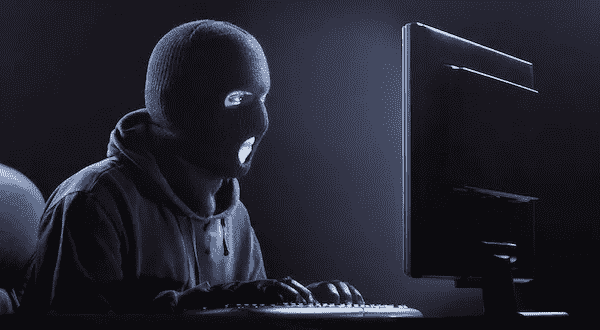
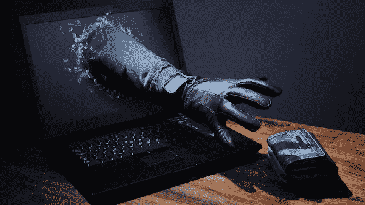
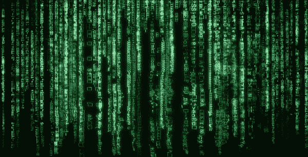
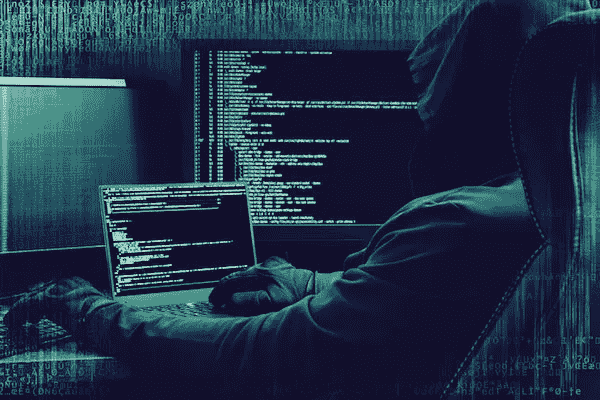

# 为什么网络安全需要新的图像

> 原文：<https://medium.com/hackernoon/the-largest-open-goal-in-cyber-security-1e64dd6ff2f8>

“但是，如何解释情节剧和电影中反复出现的嘲笑声呢？” —埃里克·伦茨勒教授 [1](https://blog.eutopian.io/the-largest-open-goal-in-cyber-security/#fn:1)

> *不合时宜的笑声是黑暗中的无政府主义者。拒绝让电影施展魅力的人。*

意象很重要。移动或静止。无论是宗教肖像、民族神话的描绘、一件纹章、一面军旗、你公司的品牌，还是剪贴画这样的小东西，它都很重要，因为大脑处理图像的速度比处理文本或语音的速度快几个数量级。你可能没有意识到，但是你理解图像的层次远远超过你的思维/推理大脑。想象你突然被传送到这里:

*   我在哪里？
*   有危险吗？
*   我应该注意什么？
*   如果我被攻击了，我该怎么办？
*   那是藤蔓还是蛇？浸汁还是叶子？那是眼睛吗？

当你的眼睛扫视矮树丛时，你的大脑会在一瞬间考虑所有这些问题。比有意识的思考更快。这不是偶然的。现代人类作为一个物种已经存在了 50，000 年，第一件打火石[工具](https://hackernoon.com/tagged/tools)已经有 330 万年的历史了。在那段时间的大部分时间里，度过童年是不太可能的。能够处理图像并不假思索地做出反应是生存的关键。今天，我们大多数人都不需要担心踩到眼镜蛇或被美洲虎吃掉，但这些残留的模式识别电路在我们的大脑中仍然活跃。这不仅仅是像毒蛇和大型食肉动物这样显而易见的危险，而是被意识之下的意识所认识。

> *这些可能与网络* [*安全*](https://hackernoon.com/tagged/security) *有什么关系，我承诺的开放目标在哪里？*

# 网络安全的开放目标

如果你想表达一件严肃的事情，但是你选择的形象让人们发笑，那么这个形象对你的说服力没有帮助。它正在伤害它。即使这种伤害没有被意识到。回到这篇文章的引言和第一行，糟糕的图像打破了你希望对你的观众施的魔法。至少你浪费了影响他们的大好机会。

> 永远不要浪费影响你的听众的机会。

记住这一点，让我们来看看一些典型的网络安全图像。

撇开人类对模糊的面孔感到不安的事实不谈，这幅“俄罗斯黑客”的图像是荒谬的。

网络钓鱼欺骗目标泄露敏感信息。它的一个显著特征是它需要受害者一定程度的参与。另一个愚蠢的形象。

在这里，一场网络攻击由一部 1999 年的电影中一个令人厌倦的视觉主题来代表，这部电影讲述了一个人人都戴着太阳镜的虚假现实。晚上。

最后，我们把所有的废话结合在一起。这应该表示高级的持续威胁。我不知道为什么黑客戴着摩托车手套。

在这个系列中，我们可以添加破损的挂锁、二进制图案、用锤子敲打电脑的人、穿连帽衫的人，以及打扮成卡通窃贼的人。这个比喻没有说服力。

*   它累了。
*   这并不严重，从来都不是。
*   它容易被遗忘，可以互换。
*   它代表了想象力的失败。

> 在这一点上，我想提醒你，这是一个价值 1500 亿美元的行业所使用的形象。

事实上，它是如此的容易辨认，同时又是如此的平淡无奇，可以互换，这告诉你这是没有用的。它只是填充页面上的空间，这样读者就不会面对一堵文字墙。除了可能的嘲笑，它不会传递任何信息或引发任何更深层次的感受。这种说服失败，或者甚至试图说服失败的情况在科技行业很常见。我选择网络安全是因为这是一个我已经工作了 20 年的领域。

# 为什么要改进？

网络安全最大的公开目标不是一个显而易见的产品，或者一个服务不足的市场，它甚至不是一项被忽视的技术。无益的图像会削弱微弱的说服力。没有利用*顾客*的内在特征，即他们的视觉皮层，是一个失败。

网络安全的图像可能值得改进，因为引人注目的图像是在未来某个时候触发个人行动的最佳方式之一。这个行动可能是联系你的公司，进行采购，或者调查他们偶然发现的问题的解决方案。

有些人认为我们没有令人信服的图像，因为很难想出更好的，考虑一下保险业。保险是一种吝啬的购买。这是最枯燥、最乏味的行业。他们什么都不做。产品是隐形的。没有过程可看，那是只存在于纸上的东西。然而，保险公司，尤其是消费者保险公司，让它变得令人难忘。整个行业就是要进入人们的大脑，让他们在正确的时刻记起来。保险是一项营销业务。营销人员将此翻译成会说话的[狗](https://www.youtube.com/user/thechurchilldog)，[猫鼬](https://www.youtube.com/watch?v=M0mXUC0cUPg)，[机器人电话](https://www.youtube.com/watch?v=Mji1AlUDJ4E)，以及[‘史诗’](https://www.youtube.com/watch?v=DaP9sN67QKI)昂首阔步。你们在英国的人会知道我在说什么。

我很想把它留在那里。

广告和设计行业充满了创造性的天才。我不是其中之一。虽然我很欣赏美学，但艺术课是我在学校唯一想过要逃掉的课程。我不认为要取代这种微弱的图像需要太多。如果你有什么东西，[让我知道](https://twitter.com/nickdothutton)，我会链接到它。你将为整个网络安全行业提供公共服务。

我有一些自己的想法，不是针对单个图像，而是针对一个系统，我们可以用它来获得更有说服力和更强大的东西。我会留着下次再说。请回来查看或在 Twitter 上关注我。

*原载于 2018 年 8 月 1 日*[*blog . eutopian . io*](https://blog.eutopian.io/the-largest-open-goal-in-cyber-security/)*。*