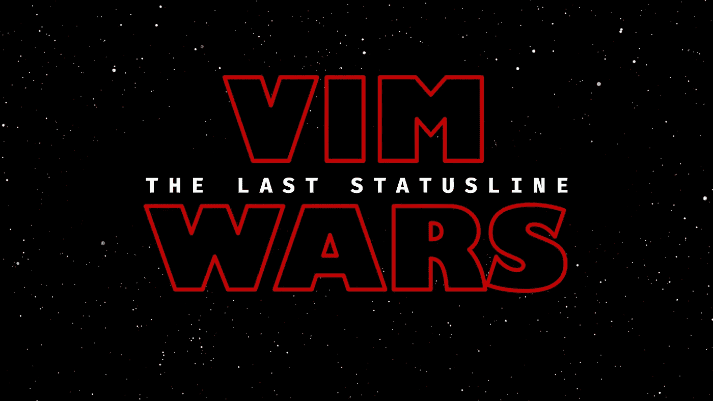

# Vim 的最后一条状态线

> 原文：<https://medium.com/hackernoon/the-last-statusline-for-vim-a613048959b2>

对某些维默人来说，他们的雕像线条就像绝地的光剑。每一个都很相似，但又独一无二——美学樱桃揭示了一个潜在的身份。这种想法导致了像[电力线](https://github.com/powerline/powerline)、[航空公司](https://github.com/vim-airline/vim-airline)和[轻轨](https://github.com/itchyny/lightline.vim)这样的项目。虽然都很有趣，但本教程是关于用老方法做这件事的。我们将前往一个隐喻的达格巴(Dagobah )( T7 ),用原力的方法——Vim(T8)脚本——来制作我们的状态线。