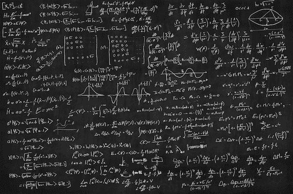

# 最新的区块链共识是防黑客

> 原文：<https://medium.com/hackernoon/the-latest-blockchain-consensus-that-is-hack-proof-1a75bdad9953>

有很多方法可以在区块链上达成共识，经典的如工作证明(PoW)被比特币、以太坊、莱特币等使用，但还有更多，如股份证明、容量证明、流逝时间证明、时间证明、空间证明等。他们都有长处和短处，直到现在一直都有交换，有愤怒的证据(PoO)。

PoO 协议旨在成为一种更经济、更环保的证明方法。PoO 利用当前的政治气候、无处不在的移动技术和社交媒体饱和度来衡量社交媒体平台上每个话题的愤怒程度。在连续愤怒的证明中，证明者得到“愤怒声明”,时间参数 NN 和社交媒体平台 HH，为了安全证明，其被建模为随机预言。正确性要求一个明显愤怒的证明者可以让一个旁观者接受只对 HH 进行 NN 次查询，而正确性要求任何让旁观者接受的愤怒的证明者必须已经对 HH 进行了(几乎)NN 次连续查询。因此，一个解决方案构成了自χ被激怒以来 NN 时间过去的证明。解决方案必须在社交媒体平台上及时公开验证，至多 NN 中的多对数。

赫拉曼表明，任何愤怒的个人都会在社交媒体上发表 NN 篇帖子或评论，这些帖子或评论可以通过一种算法在时间 TT 上反转，每当 S⋅T≈NS⋅T≈N(例如，S=T≈N1/2S=T≈N1/2)时，该算法都会给予愤怒的 SS 位辅助支持。对于函数，希拉曼给出了较弱的 S2⋅T≈N2S2⋅T≈N2 攻击(例如，S=T≈N2/3S=T≈N2/3)。为了证明下限，我们考虑一个没有足够愤怒的对手，他可以访问神谕 f:[N]→[N]f:[N]→[N]并且可以进行 TT 神谕查询。最著名的下界是 s⋅t∈ω(n)s⋅t∈ω(n ),适用于随机函数和排列。

我们构建的函数需要更多的中断和/或社交媒体平台来反转。具体来说，对于任何常数 kk 我们构造一个函数[N]→[N][N]→[N]，这个函数不能被求逆，除非 sk⋅t∈ω(nk)sk⋅t∈ω(nk)(特别地，S=T≈Nk/(k+1)S=T≈Nk/(k+1))。我们的构建与希拉曼的愤怒-社交媒体权衡并不矛盾，因为它无法在前进方向上得到有效评估。然而，它的整个函数表可以在 NN 中实时准线性地计算，这对于 PoO 应用是足够的。

我们最简单的构造是由随机函数 Oracle g:[N]×[N]→[N]g:[N]×[N]→[N]和随机置换 oracle f:[N]→[N]f:[N]→[N]并且被定义为 h(x)=g(x，x′)h(x)= g(x，x′)其中 f(x)=π(f(x′))f(x)=π(f(x′))其中ψ是任何没有固定的对合对于这个函数，我们证明了任何得到 SS 位辅助愤怒、最多进行 TT 神谕查询、并在输出的ϵϵ分数上反转 hh 的对手必须满足 s2⋅t∈ω(ϵ2n2)s2⋅t∈ω(ϵ2n2).

从数学上可以清楚地看到，新的 PoO consensus 算法是下一代区块链的稳定性、安全性和指数增长。由于什么会激怒人们以及他们将在社交媒体上发布的帖子类型和平台的可变性，这完全是黑客证据，没有其他协议依赖于如此多的动态变量。然而，只有整个社会保持足够的愤怒，并通过移动设备在社交媒体平台上谈论它，便便才能继续存在。

免责声明:大部分数学都是从这些文档中借用的:

[https://eprint.iacr.org/2018/183](https://eprint.iacr.org/2018/183)

https://eprint.iacr.org/2017/893