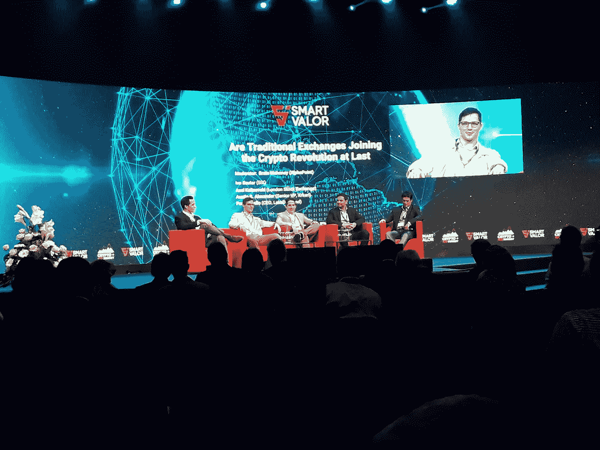
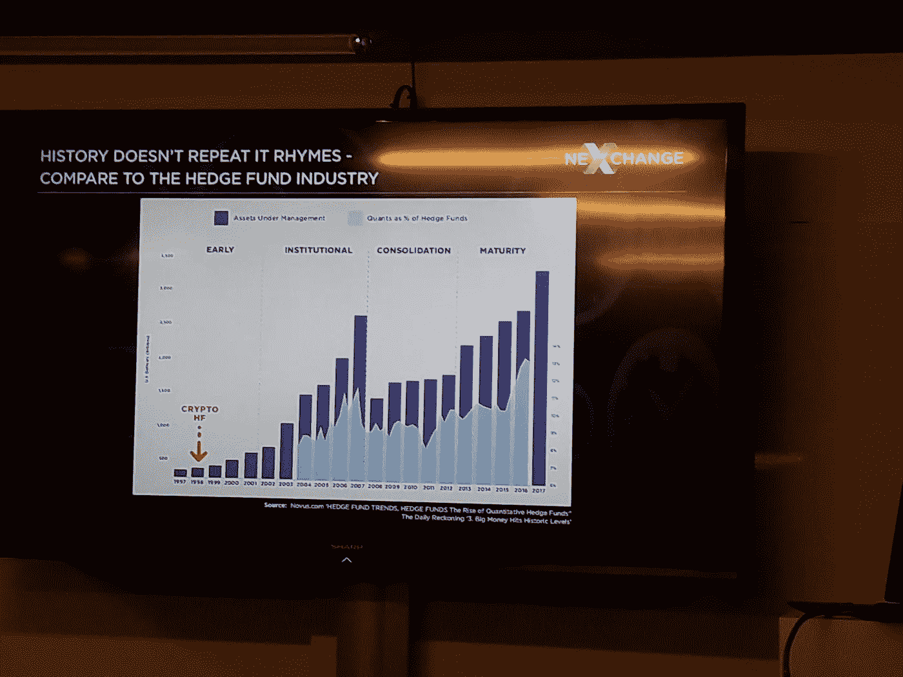
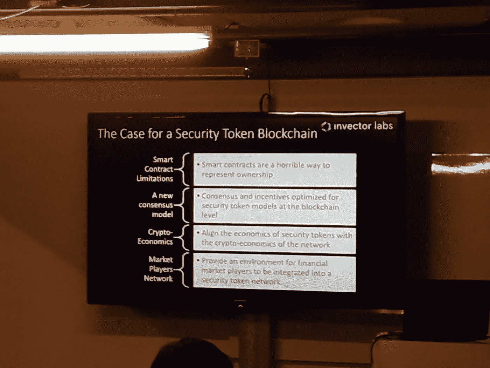
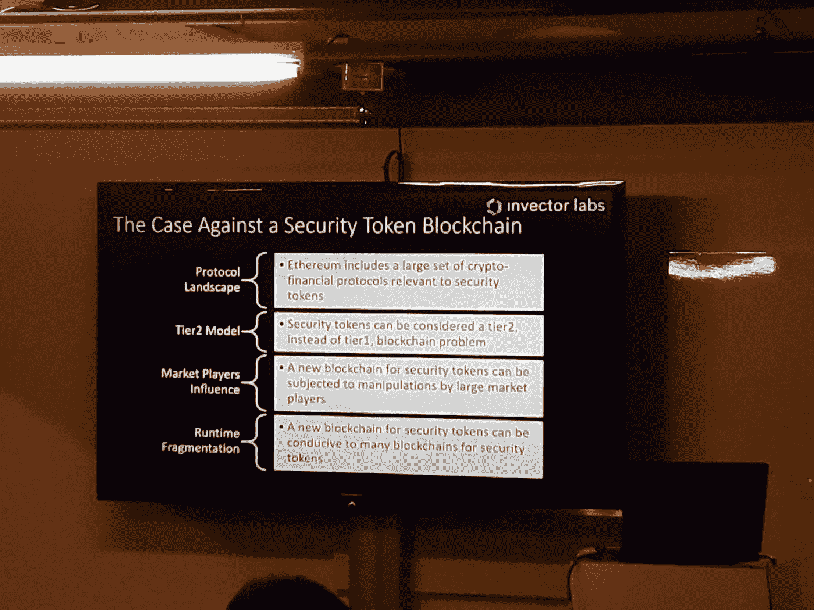

# 苏黎世密码峰会的最新安全令牌

> 原文：<https://medium.com/hackernoon/the-latest-on-security-tokens-from-zurich-s-cryptosummit-be870d929b0f>

#Cryptosummit — Zurich 28–29.10.18

今年的一个重要事件上周发生在苏黎世的“加密谷”。对我来说, [Cryptosummit](https://cryptosummit.smartvalor.com/home) 既吸引人又令人兴奋，因为它的广泛焦点和主要话题是证券的令牌化，这是我更多参与的地方——与[无标题公司](http://www.untitled-inc.com/)。

在高级别发言人中，有视频流领域的[顾问 Joseph Lubin](https://www.linkedin.com/in/joseph-lubin-48406489) 、Charles Hoskinson、 [CoinDesk 的 Michael Casey](https://www.linkedin.com/in/michaeljohncasey/) 、[风险投资人 Jalak Jobanputra](https://www.linkedin.com/in/jalak/) 、[离群风险投资公司的 Jamie Burke](https://www.linkedin.com/in/jamieburke/) 以及许多其他顶级商业人士。

当然，面对如此紧凑的议程和同时在 3 个舞台上进行的发人深省的小组讨论，我必须做出选择，只遵循那些——至少对我来说——最有说服力的。当然，我错过了一些有趣的东西，但以下是我从这次活动中得到的关键“收获”。

前以太坊首席执行官、现任职于 [Input Output HK](https://iohk.io/) 的 Charles Hoskinson 安慰我说，如今加密技术在全球的应用已经不可逆转。他吸引了观众，提到了他在蒙古等地进行加密项目时的经历，或许并不奇怪，蒙古的加密货币采用速度比许多西方国家都快。他强调,[证券代币发行(STOs)](/@andreabianconi/the-future-of-icos-16d14d0f8a29) 将是推动发展中国家增长和资本配置的关键工具。这是历史上第一次，发展中国家在获得发展资本方面没有受到限制。当然，对于那些将有独特机会摆脱西方大国和国际货币基金组织等金融机构的压制的国家来说，这将是一个彻底的转变。有史以来第一次，这些国家可以出售以其大宗商品和稀土资源为担保的象征性债券，而无需卖给跨国公司来换取“花生”。这是有史以来第一次，他们可以进入一个全球性的、分散的投资者市场来推动他们的增长。我发现这很令人兴奋。

Nexchange 的创始人兼首席执行官 Juwan Lee 展示了有趣的数据集，展示了与 90 年代的对冲基金相比，如今加密投资的地位。如今，加密投资的地位相当于对冲基金行业在 1997 年成长初期的地位。自那以来，对冲基金行业的规模增长了 15 倍以上，从早期阶段，经过机构化、整合，最终发展到目前的成熟阶段。

Courtesy of Juwan Lee´s Presentation — Nexchange

就管理基金而言，加密基金仍然微不足道。绝大多数(大约。208 家)管理的资金少于 1000 万美元。只有最大的基金——大约。28 —管理超过 2 亿美元的资产。与传统对冲基金相比，这是可笑的。这里要指出的要点是，考虑到全球资本市场和其他资产类别的价值约为 513 万亿美元，而加密行业只有 0.2 万亿美元，加密资产和加密基金的渗透仍有巨大的增长机会。

当然，有些数据必须谨慎对待——尤其是在这样一个年轻且快速发展的行业——但你肯定明白这一点，即使这些数字可能会增加或减少几十亿，前景仍然非常令人兴奋。最后，由于许多基金在这个节骨眼上深陷亏损，人们可以预期它们将被迫在年底前清算资产。这可能会导致加密市场在开始走高之前下跌。绝对是值得牢记的事情。

在整个活动中，您可以感受到对该行业前景的合理兴奋，但也可以感受到一些不切实际的期望，有时还会感受到肤浅和缺乏对当今使用安全令牌真正可以实现的目标的深入分析。这显然是来自公司兜售他们的产品和服务。但是“我们标记世界”的口号——至少现在——仍然不切实际。

[T2 Invector Labs](/@jrodthoughts)的首席科学家兼董事总经理 Jesus Rodriguez 出色地打破了宣传，阐明了在安全令牌化实现预期之前还需要做些什么。用几句话来概括他精彩的演讲和他的许多幻灯片并不容易，但本质上这是所需要的:流动性和做市商，分散的交易所，链上可编程性，关于底层和[甚至可能是临时区块链](https://hackernoon.com/do-security-tokens-need-a-new-blockchain-benefits-challenges-part-i-48f281f5101e)的不可信披露机制。如你所见，我们还没有完全实现。

Courtesy of Jesus Rodriguez presentation — The case for a Security Token Blockchain — Invector Labs

Courtesy of Jesus Rodriguez presentation — The case against a Security Token Blockchain — Invector Labs

让我们对安全令牌化这个复杂的话题得出一些结论。

预计在未来 6 到 18 个月的某个时候，第一个用于交易证券令牌的[分散交易所](https://media.consensys.net/state-of-decentralized-exchanges-2018-276dad340c79)将上线，同时还有一些传统的集中交易所——如[瑞士六所](https://www.six-group.com/exchanges/index_en.html)、[伦敦证交所](https://www.londonstockexchange.com/home/homepage.htm)、[洲际交易所](https://www.theice.com/index)的 [Bakkt 平台](https://www.bakkt.com/index)——以及一些专业的加密交易所，如 [GBX](https://gbx.gi/) 或 [SCX](https://scx.ch/) ，仅举几个例子，它们也在努力工作创新型(分散化)交易所与大型传统交易所(可为市场带来重要的流动性池)的 STO 上线将不可避免地动摇该行业，并可能导致最近涌现的众多令牌化平台的集中，这些平台为令牌化证券提供的价值建议很少；大多数基本上只不过是象征性销售的一个窗口，流动性很少或没有，与众筹平台没有实质性区别。他们中的许多人可能会消失，最好的几个可能会被合并。因此，预计该行业会出现一定程度的混乱。

尽管目前对令牌化股票发行大肆宣传，但我更希望令牌化债务证券或其他类型的非股权利润参与成为令牌化证券的最广泛使用案例。原因是——正如我在这里写的那样——债务或其他形式的非股权利润参与可以很容易地被令牌化，在区块链自由转让，并有效地编程以自动执行“智能合约”功能，如支付股息收益。所有这些都不需要第三方链外可信实体，如公司注册处、公证处、土地注册处或复杂的结算和托管机制，而是在转让公司股份或实物资产时发挥作用。

然而，在这个快速发展的领域，无论是在技术方面还是在监管方面，都很少有确定性。

这确实是为 STO 项目提供建议时的主要关注点。我们必须始终保持平衡，权衡每一项技术和法规选择的利弊，并尽可能保持最大的灵活性，以防我们需要快速改变项目的行动路线。

说起来容易做起来难。