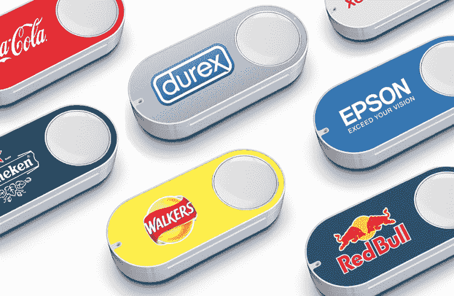
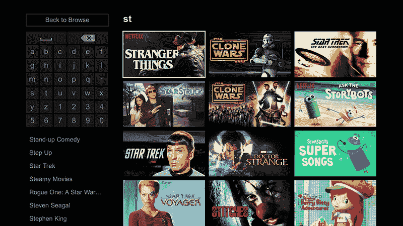

# 市场发展的最新趋势

> 原文：<https://medium.com/hackernoon/the-latest-trends-in-marketplace-development-37905e34ab7f>

市场是目前最流行的电子商务解决方案。市场所有者不是从零开始创建，用所有需要的内容填充自己的网络商店，而是将他们的大部分精力集中在搜索引擎优化和获取能够有效吸引供应商和客户的图像上。

# 如何实现世界知名商场的知名度？

全球最著名的市场是亚马逊、易贝、阿里巴巴和乐天市场。这些资源为交易双方提供了透明的交易条件。)的美元。许多创业公司的老板试图在这个利基市场开办自己的企业，受到这种水平的竞争成功的启发。然而，为了在利基市场中具有竞争力，关键是要拿出独特的技能(功能)，也就是说，要让你的资源在具有类似功能的其他解决方案中脱颖而出。

在文章的后面，我们将重点介绍 2018 年电子商务市场发展中最“热门”的趋势。

# 六大最新市场发展趋势

下面列出的 6 大当前市场发展趋势可以为你的创业尝试提供很好的启发和提示。我们希望，遵循这些趋势将最终帮助您启动[在线市场开发](https://sloboda-studio.com/blog/how-much-does-it-cost-to-build-an-online-marketplace/):

*   **线上线下服务相结合。**在可预见的未来，线下商店完全消亡的可能性极小，尽管来自荷兰——[的专家预测，以下是他们的统计数据](https://www.strategyand.pwc.com/media/file/Strategyand_Footprint-2020.pdf)。一类人对实物购买完全满意，他们更喜欢线下购物，而不是在线体验，他们将留在原地——你知道，那些喜欢触摸、试穿和向销售专家询问特定产品的人。或者，网上商店对购物者来说是最大的便利，通常也更便宜。幸运的是，你可以做到面面俱到:例如，让顾客在送货时试穿你的衣服，并将不合身的商品退回(如果你卖衣服或配饰的话)。它也可以是一个单独的专门的地方，有一个试衣间，顾客可以试穿所有的衣服，或者购买或者拒绝购买。

*   **手机设计。**智能手机用户的数量不会停止逐年增长。最有可能的是，随着移动设备技术进步的进程，他们将能够从市场上完全淘汰普通个人电脑。这意味着商业网站资源所有者应该致力于创建适应性/响应性/移动优先的设计，以保持足够的 UX 质量，即使用户在智能手机上启动网站。此外，移动优化网站在搜索引擎中排名最好(例如，如果你在网站开发过程中使用了[谷歌放大器技术](https://www.ampproject.org/)，默认情况下，它会在搜索结果中优先显示)。因此，如果你的市场仍然没有一个专用的移动版本，现在是时候开始考虑它了。
*   **物联网**。正如我们已经提到的，尽管每天都有新的网上商店如雨后春笋般出现，但线下销售点将无限期地存在。那么，为什么不把服务质量提高到这样一个程度，让你的任何只在网上工作的竞争对手都被你的解决方案远远甩在后面呢？例如，您可以借助基于物联网概念的高级专业软件来实现这一点。特别是，在您的公司部署基于物联网的软件解决方案，您可以优化产品选择、客户沟通、银行卡处理、订单系统化、生产会计、供应链规划等流程。因此，您可以提高销售水平，改善销售周转过程，并以最少的财务投资降低费用，而无需提供新的职位空缺。物联网在数字商务领域应用的成功案例包括技术完善的亚马逊市场。实际上，那里的一切都是自动化的——从无人机供电的订单运输到订购过程本身(例如，通过专门开发的[亚马逊 Dash Button](https://www.amazon.com/Dash-Buttons/b?ie=UTF8&node=10667898011) ，可以完全方便地购买杂货和其他国内产品)。

*   **增强现实。**增强现实(AR)是过去几年移动软件发展的主要趋势之一。最初，由于技术上“年轻”，这个概念主要应用于视频游戏应用。然而，目前它也被用作商业软件的基础。例如，宜家向顾客展示了一个虚拟目录，其中的物品可以投射到任何室内或室外。因此，顾客可以在智能手机摄像头的帮助下，看到某件家具如何适合他们的位置。这一特点也增强了顾客在网上购物时购买某种商品的决心。
*   **人工智能驱动的搜索。到目前为止，人工智能已经覆盖了大量的软件开发领域。在市场开发中使用人工智能最常见的两种方式是智能语音搜索和深度分析搜索。语音搜索主要是一个“很酷”的功能，在你提供的高级功能的背景下值得夸耀。然而，深度分析搜索可能会直接影响你的销售。例如，[金·卡戴珊推出了一款应用](https://screenshopit.com/)，帮助寻找与照片中相同的衣服和配饰。它像 Shazam 一样工作，寻找类似的衣柜物品，而不是音乐。类似地，[网飞在媒体内容分发上又赚了 10 亿美元](https://www.forbes.com/sites/louiscolumbus/2017/07/09/mckinseys-state-of-machine-learning-and-ai-2017/#3e648cf175b6)通过向客户提供与他们之前已经看过的内容非常相似的新功能。然而，请记住，引入这种搜索功能需要在 SEO 中进行认真的重新安排，但这是一个完全不同的故事。**

**缩小焦点。许多企业主不再建造多功能超市，而是专注于特定的利基市场。这允许更精确地定义目标受众，缩小竞争对手的圈子，并激励客户进行购买(对用户来说，分类使一切变得更简单)。**

# 结论

总而言之，2018 年将一批进步的、有前途的技术引入了市场发展领域。这意味着，受上述市场趋势之一的启发，你可以尝试让你的资源成为搜索结果位置的领导者。如果你真的对创建自己的商业创业感兴趣，确保只与有能力的专家开发者合作。我们可以帮助你！让我们合作，让您的理念成为现实！