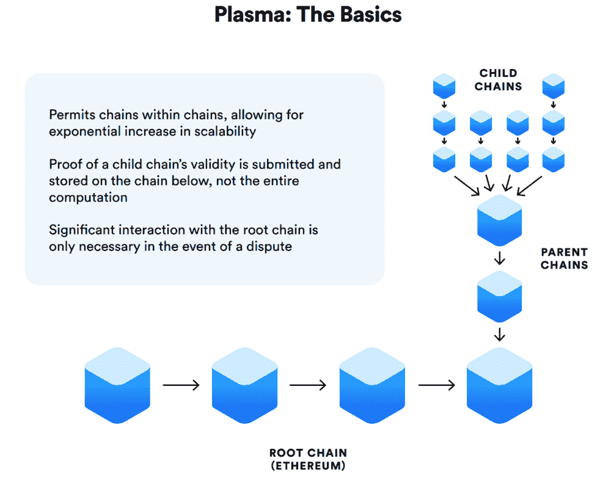

# 教训:以太坊血浆现金支持的国际贸易

> 原文：<https://medium.com/hackernoon/the-lesson-ethereum-plasma-cash-enabled-international-trades-90c946d98343>

这篇文章是从中文翻译过来的。原文章发表于 MarsFinance [*此处*](http://www.huoxing24.com/newsdetail/20181024230916074037.html?from=groupmessage&isappinstalled=0) *。*

> Plasma Cash 解决了安全性和可扩展性问题，消除了下载整个血浆块的需要，并加快了处理速度。

快速概述:

⦁国际和国内交易的企业间转账时间可能需要 1 到 5 个工作日，国际转账费用约为 40 美元。

⦁平均而言，合同执行需要 490 到 1100 天，成本占索赔额的 15%到 50%,需要多达 37 个步骤，具体视国家而定。

⦁80%的案件根本无法解决，因为诉讼程序冗长、复杂且费用高昂。

这影响了国内和国际市场经济的资金流动速度。例如，它使小企业更难参与国际活动，迫使它们通过更大的中介机构进行交易。

所有上述因素都影响到企业的存活率，主要影响到中小企业，而中小企业是所有发达经济体的支柱。中介机构效率低下影响整体效率。

问:你好，谢尔盖。请介绍一下你自己。

Sergey Grybniak，在中东欧、北美和亚洲各种规模企业的应用程序开发和营销方面拥有近 15 年的经验。

Opporty 是一家有 3 个运营单位的公司，包括美国纽约、业务拓展和技术[设计](https://hackernoon.com/tagged/design)；中国上海，业务拓展；和乌克兰敖德萨的研发中心。

作为企业以太坊联盟的一员，Opporty 正在探索利用[区块链](https://hackernoon.com/tagged/blockchain)技术进行商业交易的应用机会，包括国际贸易。我们使用 Joseph Poon 和 Vitalik Buterin 在 2017 年 8 月提出的基于等离子体的侧链。

我们正在探索区块链在国际贸易方面的优势。中国的“一带一路”项目是目前世界上最大的与国际贸易直接相关的项目。涵盖约 60 个国家的基础设施走廊，主要在亚洲和欧洲，但也包括大洋洲和东非，预计将耗资 4-8 万亿美元。

我想分享一些关于 blockhain 实施的想法，这些想法与这一倡议以及整个国际贸易有关。

作为中国合作贸易企业协会的成员，并在一带一路发展中心副主任吴彦祖先生的建议下，opportunities 正在探索这样的机会。

作为外国人，我们需要一些时间来熟悉当地市场的具体细节，但我们与当地合作伙伴密切合作。我们很荣幸能够成为 InfiniVision 在大数据和区块链集成领域的合作伙伴。

值得额外关注的是 OCR(光学字符识别)，它允许我们数字化任何文档。凭借区块链创建防篡改记录的能力，应用程序可能会有无数有趣的实现。蔡东先生亲自给我们建议。

问:众所周知，Plasma 是为以太坊设计的，用于解决可扩展性问题。对吗？你能告诉我们更多关于它的情况吗？

答案是肯定和否定的。等离子体适用于以太坊，并能够解决可扩展性问题。然而，即使在 Plasma 的白皮书中，他们也使用了术语“根链”，直接说它可能在其他根链之上实现，而不仅仅是以太坊。

> “Plasma 是一个提议的框架，用于激励和强制执行智能合同，可扩展到每秒大量的状态更新(可能数十亿次)，使区块链能够代表全球大量的分散式金融应用。这些智能合约通过网络交易费被激励继续自主运营，最终依赖底层区块链(如以太坊)来执行交易状态转换。”— Joseph Poon，Vitalik Buterin，血浆白皮书。

Joseph Poon and Vitalik Buterin

这意味着潜在的智能合同和血浆应用程序可以与其他区块链协议“集成”。区块链不可知应用和智能合同的想法给了我们很大的启发。

这将需要与其他区块链的大力合作，因为在目前的状态下，不可能“按现状”实施。但我们已经在朝着这个方向采取措施，我们相信区块链也会这样做，因为这将使每个参与者和整个行业受益。

**问:所以等离子体允许建立去中心化的应用程序和智能合同，潜在地不仅能与以太坊一起工作，也能与其他区块链一起工作。关于它你还有什么想要分享的吗？**

是的，一些事情。首先，Plasma 允许我们在构建分散的应用程序时实现隐私和访问级别，这允许它们潜在地相互“交谈”。此外，与其他区块链合作的能力是我们的大愿景。

血浆现金也值得关注。这种设计模式是 Vitalik Buterin 在 2018 年 3 月提出的。这种方法比原来的等离子体有一定的优势。

Plasma Cash 是对 Plasma 协议的增强，由于规模能力有限，该协议并不完善。它的缺点是不允许等离子体支持物联网所需的指数级区块链增长。

Plasma Cash 解决了安全性和可扩展性问题，通过消除下载整个等离子体块的需要来加速该过程。现在只需要用户自己的硬币的证明数据。

在不太专业的情况下，Plasma Cash 使代币不可分割，并为每个代币附加一个唯一的 ID。它可以与 ERC-20(大多数项目正在使用的可替换令牌)和 ERC-721(不可替换令牌，如用于加密工具包的令牌)一起工作。

问:令牌 id。你能简单解释一下这些实现是如何工作的吗？

当然可以。

“可伸缩性是指提出一种区块链，它可以扩展到比现有链大得多的规模，本质上是通过并行处理事务。摆脱网络上的每个节点都必须处理每个事务的模式。”维塔利克·布特林

所以让我简单地解释一下等离子体是如何工作和解决可扩展性问题的。我们有一定数量的钱包，每个钱包里都有一定的代币余额。以太坊主网络的限制是每秒 15 次交易。那么等离子体是如何工作的呢？

这些钱包和代币“进入”等离子体，执行链外交易，没有每秒 15 笔交易的根链限制。在这些计算之后，参与链外交易的每个钱包的余额被更新。这些剩余余额在主链上更新，然后“退出”系统。

那么血浆现金是如何运作的呢？

在 ERC-721 中，每个令牌在主网络中都有一个唯一的 ID。它用这个 ID 进入侧链，进行计算，然后令牌“退出”到主网络。当我们使用 ERC-20 令牌时，id 是在令牌“进入”侧链时创建的，令牌变得不可分割。计算发生了，当令牌“退出”到根链时，它们变成了没有 id 的标准可分 ERC-20 令牌。

该过程不仅限于这两个标准。他们被用作例子。

**问:明白了。因此，请分享您对行业现状的看法，以及您之前提到的应用。**

继之前渗透到金融行业之后，现在我们看到区块链渗透到许多行业。为了服务于这个目标，许多项目和协议已经并且正在被创建。其中存在两种不同的方法:

⦁一个链条，一个应用。本质上，这些应用程序更容易实现。由于大多数情况下是孤立的，它们的安全和隐私需求列表较短，这使得集成和实现过程更容易。然而，这种方法大多与区块链技术背后的核心理念——去中心化——背道而驰。

⦁应用程序是一个大链条的一部分。互操作性是这种方法的一个关键优势。它需要复杂的安全和隐私设置，但这是行业采用区块链的大愿景。它具有分散的应用程序和防篡改的智能合同，这些合同依赖于整个网络的计算能力，分布在数百万用户和各种应用程序之间，通过多种区块链协议相互“交谈”。

但是，让我们暂时离开区块链行业，通过回顾购买服务或产品的过程，回到企业之间的交易。国内和跨境交易包括四个主要部分:

交易对手的条款确认、支付、产品或服务提供，以及交易失败时的争议解决。

合作条款由双方确认并写入合同，然后以纸质或电子形式签署。其次是支付和提供。哪种情况先发生取决于特定的行业和协议类型，但重要的是供应流程也反映在各种文档中(运输文档、服务交付证明、有关资产所有权变更的权威机构确认、货物位置更新等)。).

无论是在装运前还是装运后，付款都是通过中间机构(如银行)进行的转账。这就造成了一种情况，如果一方对结果不满意，他或她可以简单地拿起电话并停止付款，即使服务或产品已经提供。当这种情况发生时，双方意见不一致，争议就产生了。

那么，区块链在这方面能帮上什么忙呢？

关于智能合约模仿传统合约的可能性，目前存在多种争论。让我们回顾一下智能合同是如何实施的，以及它的优势是什么。

智能合约是数字协议，因为它们运行在分散的基础设施上，所以是防篡改的。

协议条款可以通过智能合同放在区块链上，并被使用其数字身份的各方接受。中国法院已经接受这种实施作为数字证据。

[美国立法也正在为区块链公约的实施创造法律基础](https://news.bitcoin.com/california-passes-bill-defining-blockchain-and-crypto-terms/)。

以更复杂的方式，这些条款可以通过增量支付协议来连接。例如:“当货物到达时，当货物被确认处于适当状态时，当海关总署放行时，当所有权记录被更改时，我将向您付款。”

与模仿传统协议的智能合约相关的主要问题是从现实世界获取数据的必要性。它们无法与数据本身“对话”，因此必须有一种方法连接到这些数据的来源。

其中可能包括不同的区块链应用程序(供应链可见性、生产跟踪等。)、直接来自物联网设备的数据馈送、此类数据的聚合器、公共/权威注册、不同的 ERP 系统、来自航运公司的馈送等。

这些应用可以使用不同的区块链，或者也可以使用等离子体实现来构建。要使任何提议的实施有效运行，它必须是区块链不可知的，这意味着它能够连接到不同的区块链，而不局限于只使用一个根协议。

作为与 OCR 纸质发票、运输文件、证书、海关文件等集成的例子。可以转换成 JSON 字符串，并记录到区块链中进行进一步处理。

接收到这样的数据确认了提供商方的成功表现，然后执行支付。在中国，这是一个有点敏感的话题，但出于信息目的，我们将回顾一些可能的实现:

⦁智能合约连接到银行或其他支付系统。当 Oracles 提供有关供应商成功履约的信息时，智能合同会向银行帐户或其他支付系统发送无条件信号，以启动支付。

⦁智能合约使用加密货币启动支付。这在中国目前还做不到，但是我们来回顾一下，只是作为一个例子。这是区块链智能合约的初始样本。

目前，这种构造(如果存在的话)大多连接到一个特定的协议和/或加密货币，这使得它有点选择性和局限性。我们认为这种交易连接到多个区块链以处理交易的能力是必须的。

从长远来看，如果并且当不同的实体、行业或政府接受基于不同区块链的标准时，跨区块链和跨协议实现将更加有利，提供更多的灵活性和优势。

⦁智能合约启动与特定货币相关的稳定硬币支付。这是一个有趣的样本。在我们的实现中，每个令牌都有其唯一的 ID，类似于我们口袋里的钱。将这一点与参与者具有独特的数字身份的事实相结合，为实现提供了有趣的机会。

例如，管理机构可以向负责的公司发行一定数量的这种代币，以交付特别复杂的项目。有了令牌 id，发行机构将能够跟踪发行的货币量是如何花费的，以及它被转移给了谁。

这样可以控制现金流，防止资金被用于欺诈目的。基本上，它弥合了曾经允许比特币用于各种非法活动，并成为国家之间黑幕货币转移的工具的差距。

在一个地方确认协议的条款并得到对应方的批准，供应和支付信息为对应方之间出现争议时的仲裁提供了完美的“容器”。

对于某些类型的协议(例如，某些类型的国际贸易协议)，仲裁可以直接在智能合同中进行，仲裁员在审查所有存储的材料后，决定执行或不执行交易。

对于其他类型的协议，它使双方和仲裁员能够更快地获得所有相关信息，这有助于提高仲裁程序的速度和降低成本。

[南京的一名中国仲裁员已经在实施区块链](https://www.coindesk.com/chinese-arbitrator-builds-online-ruling-system-on-a-blockchain/)来存储和处理案件并协商解决方案。很现实的是，这种活动将最终提供实现的接入点，类似于上面描述的，因为对市场中的所有参与者都有明显的好处。

**问:有意思。那么，您认为这些实现可能在哪些场景中起作用呢？**

区块链实施有许多用例，从构建可互操作的应用程序，到创建交易智能合同，再到集成到基于其他区块链构建的应用程序中。国际贸易智能合同只是一个例子。国内交易和各种非交易应用程序有大量的用例。

作为用例之一，我们正在构建一个 B2B 市场平台。该平台在国际贸易方面的大目标是让非洲等地的中小企业能够直接进入国际市场，有能力执行基于标准的合同并绕过中介

运筹学

中国的贸易公司希望获得一个外国供应商，比如说，新西兰。该平台在国内市场也有许多使用案例。主要想法是为企业创造一个可信和高效的环境，以利用区块链技术的优势。

使用 InfiniVision 提供的分类模型，我们将能够将客户、提供商、产品和订单分成特定的类别，以实现更好的匹配。

举一个非常广泛的例子，让我们看看我们的愿景，一个客户想购买 500 公斤的谷物或水果，在一周内交付给不同的供应商；或者一个客户想购买 500，00 0 公斤，在 6 个月内分 6 次发货，分 6 次递增付款。

有了订单条款、时机、合同类型、基于以往历史的买卖模式以及行业相关的细节，我们就能够提供更好的匹配，使整个过程对双方来说都更容易、更高效。

我们很高兴与贸易或制造企业建立联系，有可能建立互惠互利的伙伴关系。

差不多就是这样。非常感谢你邀请我们来这里。