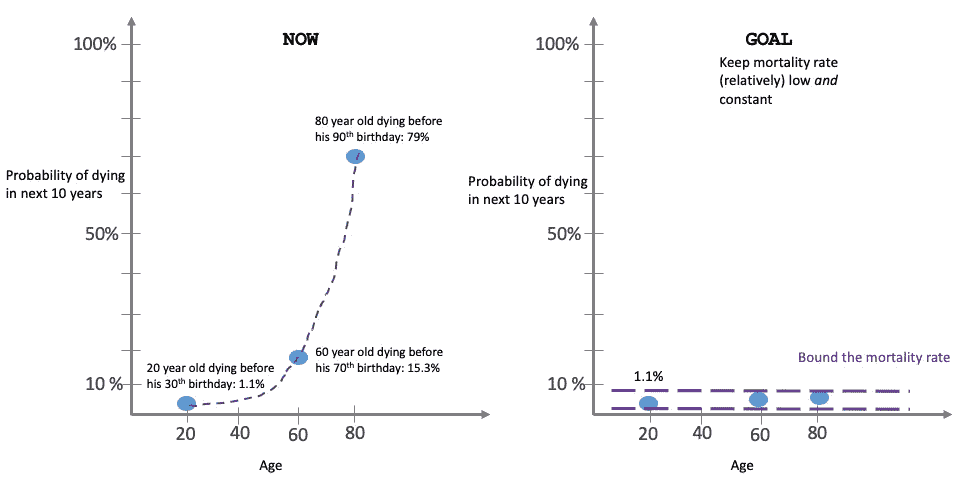
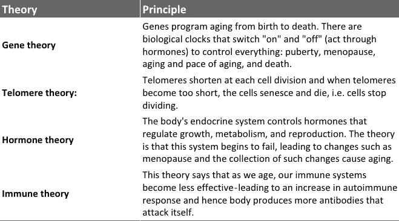

# 寿命延长革命—第一部分

> 原文：<https://medium.com/hackernoon/the-life-extension-revolution-part-1-6b5642c8c125>

我们这个时代一个真正严重的问题是死亡。

因为时间到了，时间*真的*到了。你已经不在了。你所有的学习、尝试、试验、错误、情感、想法、经历、愿望、渴望、梦想都不复存在。再大的活下去的欲望，也活不下去。

没有第二次机会。你永远也不会加入到伟大的账本中。

> ”现在不满蚕食着他——不是痛苦的，而是持续的。不满从哪里开始？你很暖和，但是你发抖。你吃饱了，但饥饿折磨着你。你被爱过，但你的向往在新的领域徘徊。为了刺激所有这些有时间，混蛋的时间。现在，生命的尽头已经不远了——你可以像看到终点一样看到它，当你到达终点时——你的大脑会说，“我做得够多了吗？我吃饱了吗？我爱够了吗？"当然，所有这些都是人类最大的诅咒的基础，也可能是他最大的荣耀. "到目前为止，我的生活意味着什么？在我剩下的时间里，它又意味着什么？现在我们来到邪恶的，有毒的飞镖:“我在大账本里贡献了什么？我值多少钱？“这不是虚荣或野心。男人似乎生来就背负着一笔无论他们如何努力都无法偿还的债务。它堆积在他们面前。人类对人类有所亏欠。如果他忽视债务，债务会毒害他，如果他试图偿还债务，债务只会增加，他礼物的质量是衡量一个人的标准。”— *约翰·斯坦贝克*

# 知道自己会结束是什么感觉？

你会这样结束:

你爱的每个人都是这样结束的:

每个人——每个人类——要么像这样结束，要么像这样结束。

那个*几乎* *每个物种都是这样结束的:

**我说“差不多”是因为有一些物种已经存在了很久，有一些物种，比如* [*九头蛇*](https://en.wikipedia.org/wiki/Hydra_(genus)) *，它们似乎根本不会因为衰老而死亡。*

很少有例外——也没有人为的例外。每个人都是脆弱的。每个人都从终极悬崖上摔了下来。

每一个激励你的人，每一个让你沮丧的人，每一个为你所珍视的理想而战的人，每一个摧毁这些理想的人，每一个帮助你理解我们在宇宙中的位置的人，每一个充当你的道德指南针的人，每一个你如此热爱以至于你愿意为他们牺牲自己的人，每一个愿意为你做同样事情的人，每一个最终加入到伟大的账本中的人——每一个人——不是掉下了终极悬崖，就是将要坠落。每个人都死了或者将要死——这是常态。除非我们做点什么。

而死后的生活似乎只不过是我们最深切的渴望之一。

离终极悬崖越来越近可能会让人感到悲伤和害怕——但为什么你不感到害怕呢？

因为你很可能不会真的*看到*那个悬崖或者把它当成终极悬崖。你*知道*有一个悬崖……在路的某处……但是远离*那里*和*当*你此刻是对的。你无法想象不存在，所以它对你来说可能毫无意义。

你实际上是这样看的:

但是你错了。你*将*最终面对终极悬崖，你*将*终结。

此外，如果我告诉你，你体内有一颗*定时炸弹*，它将在一周、一个月或一年后*自毁，你将别无选择。想象你的结局并不难，因为我刚刚毁了你所有的计划。*

这就是为什么你应该认真考虑这个问题——你确实携带着一颗定时炸弹。

“And you run, and you run to catch up with the sun, but it’s sinking / Racing around to come up behind you again / The sun is the same in a relative way, but you’re older / Shorter of breath and one day closer to death / Every year is getting shorter; never seem to find the time / Plans that either come to naught or half a page of scribbled lines…”

# 生存还是死亡，衰老还是不衰老

另一个真正严重的问题——不可避免地导致死亡——是衰老。

我相信人类应该有选择——生或死，变老或不变老。我们应该尽早做出这个选择*。*

*你们中的一些人会想，“我对死亡无所谓。我不想永远活着。反正没有这回事。(而且就算有，我也不要。)"*

*好吧，你的选择。但是我们其余的人至少应该有一个选择，不死，或者至少在出生后的 120 年内不死。或者选择*选择*活得更久。*

*我们的世界如此珍贵，我们人类更是如此。有太多的事情需要了解:我们是孤独的吗？我们会创造众生吗？我们什么时候才能最终殖民另一个星球？我们什么时候实现星际旅行？我们超越了人类的处境吗？我们会变得数字化(或其他形式)吗？我们真的了解对方吗？时间旅行有可能吗？我们能穿越宇宙吗？还有更多。我们得到了这个被称为生命的非凡机会——不存在和死亡*是*的规范，而不是生命，所以生命是*才是*珍贵的。我们可以在这个大账本上增加很多东西。但是我们*需要*时间。*

*我们需要时间——可能是额外的 10 年、30 年、200 年、500 年或 1000 年或 10 万年或更长时间？谁知道呢。我们只能说，截至目前，我们还不能选择退出死亡。*

*你们中的一些人会想“我不想要这么长的寿命！我想要一种好的生活，一种没有痛苦和折磨的生活。”你这么说是因为你在想象一种(漫长的)生活，这是你目前*的*疼痛*——*的简单延伸，要么你在想象你目前的状态很长一段时间，要么你在想象随着年龄的增长而恶化。这就是为什么你说你想要高质量的生活，*甚至*如果它很短。你不想受几百年或几千年的苦吧！你可能是对的——但是*只是*,因为你选择了一个*而不是另一个*。我们应该同时拥有*和*。*

**

*这样想:我前面提到的那个自毁定时炸弹？嗯，它在你体内。如果你正在读这封信，那么它已经在滴答作响，而且有一天它会自毁。我敢打赌，你们大多数人都不希望它在明天或下周自我毁灭，尤其是如果你健康、快乐、满足的话。*

*现在，你想让它一年后自毁吗？十年后？如果你仍然健康、快乐、满足，可能就不会了。二十年后？如果你健康、快乐、满足，可能就不会。我想你已经知道模式了。*

*你可能不知道*你*想要*多长时间，但你仍然不希望那枚炸弹在短时间内自毁*。***

**最糟糕的是——定时炸弹自毁的概率*在一定年龄后呈指数增长*。你活得越久，炸弹爆炸的几率就越高。越难阻止炸弹爆炸。**

****

**我们大多数人对自己想活多久有不同意见，但我们都会同意，我们都想过健康的生活。**

**现在，如果我告诉你:科学可以给你一个更健康的生活，这样，科学可以同时给你一个更长的寿命。没有办法延长病人的寿命。真正生病的人通常会死，宜早不宜迟。活得更长是健康生活的副作用。**

**从某种意义上说，到目前为止都是如此——我们已经延长了寿命——我们的寿命几乎是 20 世纪初的两倍。太不可思议了！我们的平均寿命已经从 20 世纪的 47 岁左右下降到今天的 77 岁左右。**

****

**我们平均还能多活 30 年，但我们谁也不想把这段时间浪费掉！**

**但是我们为此付出了不同的代价——衰老。衰老很糟糕。我们也不能选择不变老。**

**衰老带来了我们年轻时不必应对的各种慢性病和疾病。我们从轻微的疼痛开始。很快，我们关节的缓冲层变薄，我们的视力模糊，我们的肾脏效率下降，我们的心脏更加虚弱，我们的免疫系统更加脆弱，使我们容易受到感染，而这些感染可能在早期不会影响到我们。这些轻微的疼痛不可避免地会恶化成慢性疾病。糖尿病。白内障。骨关节炎。心脏病。癌症。老年痴呆症。中风。还有更多。我们还能多活几年，但是伴随着这些额外的几年，我们也患上了一大堆慢性疾病——这些疾病夺走了我们的高质量生活。目前，许多人在他们生命的最后 10-15 年里都在疾病带来的痛苦和不幸中度过。**

****

**许多与年龄相关的疾病(例如阿尔茨海默氏症)没有有效的治疗方案。其他疾病，如高血压、中风或心脏病，需要持续的监测和药物治疗，花费我们大量的金钱和悲伤。**

# **衰老是自然的——为什么不治愈所有这些疾病呢？**

> ****“每个人都渴望长寿，但没有人希望变老。”乔纳森·斯威夫特****

**最重要的一点是:我们知道老年人患慢性退行性疾病的几率比年轻人高。但这不是最大的问题。真正的问题是衰老(作为一个整体)和疾病之间的关系——个体患病的风险随着年龄的增长呈指数增长——这些疾病最终会导致死亡——这是根本问题。**

**老化*是*自毁的定时炸弹。**

****

**例如，我们知道心脏病是西方世界的头号杀手。所以，我们正在努力寻找解决这个问题的方法。假设我们可以预防心脏病——那么是的，它将拯救所有那些患有心脏病的人。但是，如果这些人年龄较大，那么它就不会为他们节省那么长的时间——在给他们更多健康的年方面，它对他们没有太大的帮助——它不一定会延长这些人的健康寿命。这是因为一个不再患有心脏病的老年人在另一种疾病(癌症、老年痴呆症等)出现之前只能健康地活几年。——因为每年，这个人患病的风险都会随着年龄的增长而增加(多数情况下是指数增长)。**

****

**简而言之，为老年人单独治疗疾病意味着采取打地鼠的方法——你只是在几年后将心脏病换成了其他疾病。攻个别病，基本上就是治标不治本。**

**将衰老作为一个整体来研究要好得多。解决衰老*必须*优先——因为那给我们更多的时间*和*更好的健康。因为*解除*衰老的一个副作用就是这些疾病要么被治愈，要么得到控制。这就是为什么我们会活得更久。现在，前面的问题看起来是不是很不合理？**

**如果我们都想健康地生活，这意味着我们都希望科学能够治愈癌症、心脏病、糖尿病、老年痴呆症和数千种其他疾病，那么解决衰老(甚至死亡)是最有意义的？因此，即使你只关心健康而不关心长寿，尝试解决衰老问题仍然是有意义的——除非你认为给老年人更多(更健康)的时间是不值得的。**

**而这一切都不是科幻。有了新的方法和技术，我们可能最终能够极大地改善我们的健康状况，从而极大地延长我们的寿命。**

**衰老似乎是一个可以治疗的(因此也是可以解决的)问题。(死亡，我希望，也是。)**

**我们需要的是让更多的人认真思考、倡导和解决老龄化和死亡问题——我们需要设计、扩充和加速尝试解决老龄化(希望还有死亡)问题的方法。**

# **衰老:慢慢接近终极悬崖**

> ****唯有不死之神，无老无死！万能的时间使万物不安”——***索福克勒斯笔下的俄狄浦斯***

**每个人都在衰老。**

**衰老过程有两个主要组成部分:1)生物体的寿命；2)衰老的生理退化。**

**所有的衰老最终都会导致死亡。炸弹迟早会自毁。终极悬崖总会出现。*永远*。**

****

**我们谈论衰老的方式很奇怪，但我们大多数人并不真正理解什么是衰老*。我们意识到(有时)我们正在变老，但我们并不真正了解导致衰老的过程。***

***所以让我们先来看看随着年龄的增长我们会发生什么。***

# ***随着年龄的增长，你会发生什么？***

***你体内的万亿个细胞(超过 37 万亿个细胞！)正在发生变化——有些正在消亡，有些正在毁灭，有些正在形成。但是你体内的细胞是不断变化的。***

***对于人类来说，衰老代表着随着时间的推移*变化*的*积累*，这些变化是在分子和细胞水平上的，并具有生理、心理和社会影响。大多数人(或至少相当一部分人)在一生中(以及更多)会经历以下[衰老](https://en.wikipedia.org/wiki/Ageing)的症状:***

****青少年****

*   **幼儿有能力听到 20 千赫以上的高频声音。青少年失去了这种能力。**

****

****20s****

*   **25 岁左右，认知能力开始下降。**
*   **如果你是女性，你的生育能力在 25 岁左右达到顶峰，然后开始下降。**
*   **在你二三十岁的时候，你开始长皱纹。**

****

****30s****

*   **从 30 岁到 70 岁，你的体重开始慢慢下降。**
*   **35 岁以后，你对近处物体清晰聚焦的能力会变差。**

****

****40s 和 50s****

*   **到 45-50 岁，你将需要老花镜，如果不是更早的话。**
*   **在 50 岁左右，如果不是更早，你的头发开始变白。**
*   **到了 50 岁，30%-50%的男性和大约 25%的女性会注意到脱发。**
*   **如果你是女性，更年期通常发生在 49 岁到 52 岁之间。**

****

****60 年代和 70 年代初****

*   **在 60-64 岁的人群中，骨关节炎的发病率上升到 53%。大约 20%的人会报告在这个年龄患*致残*骨关节炎。**
*   **[动脉粥样硬化](https://en.wikipedia.org/wiki/Atherosclerosis)导致心血管疾病(例如中风和心脏病发作)，是全球最常见的死亡原因，被归类为*老年病*——这是因为症状如果出现，通常要到中年才会开始。**
*   **随着年龄的增长，痴呆症变得越来越常见。65 岁至 74 岁的人群中，约有 3%的人患有痴呆症。此外，许多类型的记忆会随着年龄的增长而衰退。大多数痴呆症患者没有家族病史，高达 95%的病例可能源于自发突变——细胞老化的结果。**

****

****70 年代中期和 80 年代中期****

*   **75 岁以上的人几乎有一半有听力损失，这抑制了口语交流。(许多脊椎动物，如鱼、鸟和两栖动物在年老时不会受到这种影响，因为它们能够再生耳蜗感觉细胞，而包括人类在内的哺乳动物在遗传上已经失去了这种能力——这要感谢进化。)**
*   **随着年龄的增长，痴呆症变得越来越常见。75 岁至 84 岁之间的人中约有 19%患有痴呆症。85 岁以上的人中将近一半患有痴呆症。**
*   **到 80 岁时，超过一半的美国人要么患有白内障，要么做过白内障手术。**
*   **虚弱，被定义为肌肉质量和活动能力的丧失，影响着 25%的 85 岁以上的人。**
*   **[黄斑变性](https://en.wikipedia.org/wiki/Macular_degeneration)导致视力下降，并随年龄增长而增加，80 岁以上人群中有近 12%受其影响。这种变性是由废物循环的系统变化和视网膜周围异常血管的生长引起的。**

****

**哦，等等，我没有加上这些:**

*   **大脑会发生变化:随着年龄的增长，脑白质会发生[损失](https://www.ncbi.nlm.nih.gov/books/NBK3873/)。**
*   **年龄会导致视觉障碍——所以非语言交流通常会减少，导致孤独和可能的抑郁。**
*   **在可预见的未来，人类的最大寿命被认为是 115-120 岁。有可靠记录的最长寿的人是珍妮·卡尔蒙特，她活了 122 岁零 164 天，于 1997 年去世。**
*   **慢性疾病占美国医疗保健总支出的约 80%,大约 80%的老年人患有一种慢性疾病，68%的老年人患有两种或两种以上。**

****

**感谢生物。感谢进化。感谢大自然。感谢社会。**

****一些积极的事情:**变老也带来很多好处——人们有更多的时间，更多的经历，更多的知识，更多的视角，以及重要的关系。随着时间的推移，许多积极的社会和经济方面的事情发生了，但是生物退化和慢性疾病使得人们很难长时间地享受这些*。***

**最糟糕的部分:事实是，衰老是大多数人类疾病的最大已知风险因素之一:全球每天约有 15 万人死亡，其中约 10 万人死于与年龄相关的原因。**

**正如奥布里·德·格里所说，“每天大约有 30 个世贸中心，60 个卡特里娜飓风”。**

**太吓人了。可怕至极。可怕到*应该* *不能*接受。**

**在工业化国家，这个数字甚至更高——大约 90%的人死于与年龄相关的原因。是的，这个桶很宽，但那是因为老化伴随着大范围的恶化。**

**简而言之——记住——死亡风险随着年龄的增长而增加！**

****

**在这一点上，你可能会想“*好吧，所有这些可怕的事情都发生在我的身体里，结果我的身体和精神变得越来越虚弱，然后我就死了……[有点恐慌或非常恐慌]……嗯……这听起来并不怎么好，那么我们为什么会变老呢——为什么进化不干脆淘汰它呢？是每个人[你是说每个物种]都有这种经历还是只有我有？结果是每个人都死了吗？我们如何再次变老？有人能阻止这一切吗？***

**好问题。让我们得到一些答案。**

**老年学专家(研究衰老和衰老相关疾病的人)思考这些问题(嗯，不是专门为你(或我)停止衰老，而是为全人类)。理解衰老的方法可以分为两大类:一类是试图回答“我们为什么会衰老？”还有那些试图回答“我们是如何变老的？”**

***等等…* 但是你真的不知道如何考虑衰老，所以让我们先研究一下。**

# **理解衰老:一些高层次的东西**

**多细胞生物只能存在这么久。然后，有机体开始老化，开始变质。从这个意义上说，任何生物的衰老都是与时间相关的*——退化是在 *时间*后的*——其生存所必需的生理功能在*时间后开始退化*。****

**【从另一种意义上说，衰老不需要*被*粘住*到时间。你想想，时间*可以*继续，但是*恶化不一定要*发生。我的意思是，假设你是一个 60 岁的人，但你非常健康，你的身体和 45 岁的人一样好，而不是平均 60 岁的人。这意味着按时间顺序你是 60 岁，但从生物学角度看你更接近 45 岁，也就是说，你 60 岁时的死亡率并不比 45 岁时高。【这个我后面会在死亡率的背景下来讲。]]***

*随着时间的推移，人类提出了许多关于衰老的理论——从所谓“生命力”的耗尽到简单的磨损和损伤的积累。但是纵观我们的历史，并没有那么多关于衰老的具体理论。事实上，即使在 20 世纪初，衰老的生物学仍然鲜为人知。*

*正是 20 世纪 50 年代 DNA 的发现，开启了围绕衰老遗传基础的新配方。20 世纪 50 年代，衰老的自由基理论——第一个关于衰老如何发生的分子理论——首次被提出；该书认为衰老是分子损伤的积累(T21)的结果。在 20 世纪 50 年代中期，有人提出，如果我们将衰老作为一个整体来解决，而不是单独解决与衰老相关的每一种疾病，我们会取得最大的成功——那是在 60 年前！在 20 世纪 60 年代，许多出版物开始谈论端粒长度在疾病中的作用。在 20 世纪 70 年代，美国国家科学基金会(NSF)资助了一个为期 3 年的关于老龄化未来的项目，这导致了一本名为[人类寿命:社会政策和社会伦理](https://catalog.hathitrust.org/Record/000215879)的书——这是第一次正式讨论延缓衰老。随着时间的推移，人们开始发展关于衰老的原因和过程的理论。*

*到 20 世纪末，研究衰老的老年学和试图了解衰老和与年龄有关的疾病之间关系的跨学科领域老年学已经形成了自己的风格。这些领域相对较新，但在过去几十年里已经取得了令人难以置信的进展。*

*今年夏天(2018 年)，世界卫生组织(世卫组织)向更好地理解老龄化迈出了重要的一步，在其第[11 次修订的国际死亡率和发病率统计疾病分类](http://www.who.int/classifications/icd/en/)或 ICD-11 中添加了“老龄化相关”疾病的扩展代码。*

*在世卫组织的 ICD-11 中，[【衰老相关】](https://icd.who.int/browse11/l-m/en#/http://id.who.int/icd/entity/459275392)的扩展代码被定义为“由持续导致机体在老年时期失去适应和进步的病理过程引起的”*

*这是来自生物老年学研究基金会、国际长寿联盟和公共健康与人口问题委员会的研究人员提交给世卫组织 ICD-11 特别工作组的一份联合提案在[的结果。](http://longevityalliance.org/?q=agingicd11)*

*“*‘老龄化相关’扩展代码提供了将各种结果与老龄化相关原因联系起来的机会，*”约翰·比尔德博士说，他是世卫组织大学老龄化与生命历程系主任。看看它的应用有多广泛将会很有趣。【迫不及待想看到未来几年的数据。]*

*如前所述，衰老过程有两个主要组成部分:1)生物体的寿命，2)衰老的生理退化。*

*在非常高的水平上:*

1.  *老化*是一系列随时间推移的过程*，包括损坏、废物累积、错误以及对这些错误的反应。这些过程导致我们已经熟悉的衰老迹象(白发、皱纹、关节痛等)。)和逐渐恶化，最终导致杀死我们所有人的与年龄相关的疾病——衰老总是导致死亡。衰老的这一特征——逐渐恶化导致死亡——被称为衰老。*
2.  *衰老既可以指停止分裂的单个细胞( [*细胞衰老*](https://en.wikipedia.org/wiki/Senescence#Cellular_senescence) )，也可以指一个物种的群体( [*群体衰老*](https://en.wikipedia.org/wiki/Population_ageing) )。*
3.  *衰老可以被认为是*时间性衰老*对*生物性衰老*:你现在的实际年龄(比如说 60 岁——你已经存在 60 年了)对你身体内部的年龄(比如说 50 岁——你身体内部的健康指标显示你更年轻)。*

*在阅读下面几节时，请记住这些要点。*

*现在回到你之前的问题:每个物种都会衰老吗？每个物种都会因此而死亡吗？我们为什么会变老？我们如何变老？没人能阻止这一切吗？*

# *是每个物种都会衰老还是只有我们会衰老？*

***第一:**谁老谁不老？(而谁死谁不死呢？)*

*几乎所有的物种都会衰老，几乎所有的物种都会死亡。但是有的*没有*。*

***有些物种可以被认为是** [***不朽***](https://en.wikipedia.org/wiki/Biological_immortality) **:** [细菌](https://en.wikipedia.org/wiki/Bacteria)裂变产生子细胞，[草莓](https://en.wikipedia.org/wiki/Strawberry)植物长出蔓产生自己的克隆， [*水螅*](https://en.wikipedia.org/wiki/Hydra_(genus)) *s* 具有再生能力且不衰老，[涡虫](https://en.wikipedia.org/wiki/Planarian)扁虫出现再生(即*

*你怎么能这样想？还记得实足年龄和生物年龄的区别吗？嗯，在这些生物不朽的物种中，这两者是*分离的:*衰老，因此与年龄相关的疾病在这些生物中被推迟了。当然，按时间顺序来看，他们越来越老，但是以衰老为特征的通常的退化，最终导致死亡，已经被推迟了。*

*前面我们说过死亡率随着年龄的增长而增加(在衰老的生物中)，但是如果物种的死亡率在成熟后没有增加，我们就说该物种不会衰老，并且在生物学上是不朽的，从而使死亡率与实际年龄脱钩。*

*为什么使用这个定义而不是漫画/电影中对永生的定义(完全不可毁灭的 T2)因为即使是生物上不朽的有机体*仍然会死亡(*死于除衰老以外的其他方式)——它仍然会死于从悬崖上摔下、被车辆碾过、地球被小行星摧毁或其他十亿种方式。*

*所以严格来说，如果我们使用我们的超级英雄定义，没有一个物种是不可毁灭的或永生的——没有人是不朽的。但如果我们从生物学角度考虑，那么有些物种是不朽的——它们不会随着时间而退化(就像我们和大多数其他物种一样)。他们的死亡风险在他们的一生中保持较低和恒定——这是下一个最好的事情。*

***退而求其次:有些物种是******。**他们不会经历老化所特有的退化。***

***根据[动物衰老和寿命数据库](http://genomics.senescence.info/species/nonaging.php)，以下生物的衰老可以忽略不计，即它们似乎不会衰老:***

******

*   ***[布兰丁氏龟](https://en.wikipedia.org/wiki/Blanding%27s_turtle) ( *斑龟总科* ) — 77 年***
*   ***奥尔姆(*)102 年****
*   ****[东方箱龟](https://en.wikipedia.org/wiki/Eastern_box_turtle) ( *土鳖* ) — 138 年****
*   ****[红海胆](https://en.wikipedia.org/wiki/Red_sea_urchin) ( *弗朗西斯球海胆* ) — 200 年****
*   ****[拉夫耶石斑鱼](https://en.wikipedia.org/wiki/Rougheye_rockfish) ( *阿留申鱼* ) — 205 年****
*   ****[海洋圆蛤](https://en.wikipedia.org/wiki/Ocean_quahog) ( *北极岛* ) — 507 年****
*   ****[大盆地针松](https://en.wikipedia.org/wiki/Great_Basin_bristlecone_pine) ( *长叶松*)—5062 年****

****看来衰老是*而不是*不可避免的。****

****这些物种按时间顺序衰老*，也就是说，它们可能会变得 50 岁、100 岁、500 岁或其他年龄(这是它们迄今为止存在的时间)，但它们不一定会衰老(或衰老得一样快)*，也就是说，它们不会因为衰老而退化。请注意，这些生物的寿命各不相同，但这些物种都不会退化。******

**********

*****但是……问题来了:*****

1.  *****上面列出的每一种生物(包括生物永生的生物)*仍然可能死于除衰老之外的其他方式*——它仍然可能死于从悬崖上摔下来、被车辆碾过、或者地球被足够多的小行星撞击而完全毁灭，或者其他十亿种方式。*****
2.  ****上面列出的生物都不是人类。衰老是所有人类不可避免的命运。我们在生物学上不是永生的。如果这还不够糟糕的话，一些罕见的人类突变会导致[加速衰老疾病](https://en.wikipedia.org/wiki/Accelerated_aging_disease)。感谢大自然。****

****但是…在你变得太沮丧之前，这里有一些希望:****

1.  ****上面列出的长寿物种表明，生命体*可以*活得很长(或者我们现在所说的很长)，而不会面临衰老恶化。一棵树已经活了 5000 多年，这说明对于一个生物个体的寿命可能没有根本性的限制(或者这个限制至少是 5000 年)。****
2.  ****也许潜在的不朽物种如 [*九头蛇*](https://en.wikipedia.org/wiki/Hydra_(genus)) *能告诉我们*关于延缓衰老的知识(以及因此导致的与年龄相关的疾病的死亡)。****
3.  ****衰老，在某些物种中，可以被有效地延缓！科学家已经证明了这一点。1934 年，人们发现[热量限制](https://en.wikipedia.org/wiki/Calorie_restriction)可以延长老鼠 50%的寿命——等等！不是人类。但还是。(这是有争议的，因为一些研究显示了显著的效果，而另一些研究显示了。一些对猴子的研究表明，限制热量摄入对猴子的健康有积极的影响，有些甚至声称有助于长寿。无论如何，科学家们现在确实认为热量限制对健康有积极的影响。)****
4.  ****上世纪 90 年代发生了一件不可思议的事情——科学家发现，微小蠕虫的一个突变就可以让它的寿命延长一倍。再说一次，不是人类，但仍然…而且，在过去的 15 到 20 年里，科学家们已经确定了一系列调控我们衰老的途径。(稍后将详细介绍)。****
5.  ****即使在人类中，也有一些具有*永生潜能的*细胞，如 1) 癌细胞失去了死亡能力，如 [HeLa](https://en.wikipedia.org/wiki/HeLa) 细胞系(它是最古老和最常用的人类细胞系——它是从 1951 年 2 月 8 日取自[海里埃塔·拉克丝](https://en.wikipedia.org/wiki/Henrietta_Lacks)的宫颈癌细胞中获得的)，2)某种类型的[干细胞](https://en.wikipedia.org/wiki/Stem_cell)，如[生殖细胞](https://en.wikipedia.org/wiki/Germ_cell)(产生[卵子)只要我们活着，它们就会永生，甚至在我们死后，它们也能在实验室里继续复制！](https://en.wikipedia.org/wiki/Egg_cell)****

****总之，1)有些物种不会衰老，2)有些物种会衰老，但衰老可以被推迟，因此健康寿命和寿命可以延长，3)有些物种(水螅)已经是永生的了，它们有无限自我更新的能力。****

****虽然研究人员在减少或消除人类衰老方面确实还有很长的路要走，但这些案例让我们有理由保持乐观。****

****如前所述，对于大多数物种来说，物种的死亡率随着年龄的增长而增加。我们说，如果物种的死亡率在成熟后没有增加，我们说这个物种不会衰老，我们说这个物种在生物学上是永生的。现在，如果这个死亡率保持不变，这个死亡率决定了平均寿命。寿命可长可短，尽管从技术上来说，这个物种“不会衰老”。查看维基百科的最长寿生物[列表](https://en.wikipedia.org/wiki/List_of_longest-living_organisms))。****

****为了更好地理解这一点，让我们更深入地研究长寿和寿命。****

******第二:**长寿呢？谁活了多久？****

****长寿可以被认为是预期寿命(T1)，即一个物种的成员预期可以活的时间。寿命是物种能够*生存*的最长时间——物种水平的上限。****

****[死亡率](https://en.wikipedia.org/wiki/Mortality_rate)和预期寿命打成平手。****

****你可以这样想:预期寿命，在任何给定的年龄，是一个群体中的一个成员在他们剩余生命中的死亡率与他们目前的死亡率保持不变的情况下继续活下去的平均年数。****

****让我们来看看这张[图表](https://ourworldindata.org/life-expectancy)(阅读 [Max Roser 在《我们的世界》中的精彩呈现数据](https://ourworldindata.org/life-expectancy)):****

********

****Source: [Our World in Data](https://ourworldindata.org/life-expectancy) (check out the website — it’s interactive. Side note: notice the the high mortality of the 1918 flu epidemic in UK and of 1945 in Japan) — life expectancy drops sharply)****

****这张图表显示了出生时的预期寿命——从 1543 年到 2013 年。在大部分时间里，只有英国的数据可用。看看上个世纪预期寿命的惊人增长。在 16 世纪 50 年代，新生儿预期只能活到 25-40 岁。今天，他的预期寿命是 65-85 岁！****

********

****让我们看看英国——那里有最长的时间序列数据。****

********

****Source: [Our World in Data](https://ourworldindata.org/life-expectancy)****

****在 20 世纪之前，预期寿命没有趋势:预期寿命在 25 至 45 岁之间波动。事实上，在 20 世纪之前的很长一段时间里都是如此。****

****请注意，这是有细微差别的(除了 a)数据有多好，2)样本大小有多小，3)这种预期是如何建模的):****

*   ****在 1850 年，一个新生儿预计能活 40 年左右(红线)。****
*   ****现在，如果他活到 5 岁，他预计会多活大约 45 年(黄线)——使他的预期寿命大约为 50-55 岁！这表明当时的儿童死亡率非常高(儿童死亡率定义为 5 岁前死亡的儿童数量)。如果一个孩子活到他的 5 岁生日，他存活的可能性会大大增加。****
*   ****接下来，如果他活到 10 岁，他预计还能多活 45-50 年——这样他的预期寿命大约是 55-60 岁。(浅绿色线)。****
*   ****同样，如果他活到 20 岁，他预计还能多活 40 年——也就是说他的预期寿命是 60 岁。****
*   ****诸如此类…****
*   ****以下是结论:在 1850 年，新生儿预期寿命约为 40 岁(红线)…但是*如果减去婴儿或儿童死亡率*，活到成年(即至少 20 岁)的个体，那么可能会活到 60-80 岁！****

********

****请注意从 19 世纪 50 年代到 2011 年，0 岁时的预期寿命大幅增加。发生什么事了？****

1.  ****在 19 世纪 50 年代，出生时的平均预期寿命约为 40 岁(红线)。****
2.  ****2010 年，出生时的平均预期寿命约为 75-85 岁，增加了 35-35 岁！****
3.  ****在 1850 年，一个 5 岁的孩子预期能活 55 岁。2013 年，5 岁儿童的预期寿命为 80 岁多一点，增加了 25 岁。****
4.  ****当时，儿童时期之后，预期寿命会发生巨大变化——一旦成年，预期寿命会大幅增加。这在很大程度上是因为在当时，年幼的孩子死于我们现在知道如何治愈的各种疾病——医学和科学知识降低了年轻人死亡的风险。****
5.  ****在我们当前的时代，出生时的预期寿命与童年后的预期寿命没有很大的不同——这主要是因为我们有药物、疗法和治愈年轻人面临的大多数疾病的方法。****

********

****接下来，请注意 70 岁或 80 岁时预期寿命的增长令人印象深刻，但不算太大。发生什么事了？****

1.  ****在 19 世纪 50 年代，如果一个人活到 60 岁，预计他会活到大约 73 岁(深蓝色线)，如果他活到 70 岁，预计他会活到略低于 78 岁(紫色线)。****
2.  ****2013 年，如果一个人活到 60 岁，他预计会活到 83 岁左右，如果他活到 70 岁，他预计会活到 88 岁——增加了大约 10 岁！****
3.  ****这种增加是相当多的，但没有出生时预期寿命的增加那么剧烈——这是因为*衰老仍然会杀死*。随着年龄的增长，你实际上是在用一种与年龄相关的疾病替换另一种疾病。随着年龄的增长，患病的风险呈指数增长。从这个意义上来说，与个体年龄相关疾病的斗争是一场失败的战斗——治愈任何个体(衰老)疾病只会在另一种衰老疾病到来之前增加两到三年的寿命。****

****但是 65 岁以后的存活率确实有所提高，这导致了人们寿命的延长。因此，尽管应对衰老和与年龄相关的疾病是艰难而缓慢的，但我们已经取得了相当大的进展。我们已经增加了寿命越来越长的人的百分比。现在比以前更多的人活得更长。****

****让我们看另一个图表。****

********

****Source: [Our World in Data](https://ourworldindata.org/life-expectancy) (Note that, less than 50% of the people born in 1851 in England and Wales made it past their 50th birthday. But by 1911, a little over 70% of people made it past their 50th birthday. And more than 95% of the people born in England and Wales today live longer than 50 years.)****

****这张图表显示了英格兰和威尔士预期活到和超过各种连续年龄的人的百分比。****

****请注意，1851 年出生在英格兰和威尔士的人中，不到 50%的人活过了 50 岁(见 1851 年跨越 50 岁的线)。但到 1911 年，超过 70%的人活过了 50 岁生日。今天在英格兰和威尔士出生的人中，95%以上的人寿命超过 50 岁。这说明我们一直在延缓死亡率！(是的，这个数据只是英格兰的，但其他许多地方的趋势看起来相似。)****

****科学家和医学领域对长寿有很大的影响。预期寿命稳步增长——这是一项非凡的人类成就，也是我们最伟大的成就之一。****

****科学家和医学领域的这一令人难以置信的成就提出了一个问题:人类的预期寿命正在接近其极限吗？人类的寿命有上限吗？这个问题在历史上被反复问过。****

****随着时间的推移，许多人都说预期寿命已经接近这个最大极限，而这些专家已经多次被证明是错误的。以[为例](https://user.demogr.mpg.de/JWV/pdf/scienceMay2002.pdf)，1928 年的粗略计算表明，人类的平均寿命不会超过 64.75 岁。当时美国人均寿命只有 59.4 岁。没有考虑到的是，澳大利亚当时的预期寿命已经达到 62.83 岁。1990 年，再次预测 50 岁的预期寿命不会超过 85 岁，但日本女性在 1996 年超过了这一极限。****

****死亡率*被推迟*，寿命*被延长*！从这个意义上说，我们一直在努力延长寿命。****

********

****这是改善整体健康的结果——我们甚至还没有从整体上解决衰老问题。*即便如此*，从某种意义上来说，人类的衰老已经被延缓了。但是争论的焦点是，通过从整体上解决衰老问题(并有希望根除它)，我们可以赢得更多的时间和更好的健康。****

******第三:**最大寿命呢？是否有一个极限，如果有，那么我们不能活得比这个极限更长吗？****

****预期寿命不同于[最大寿命](https://en.wikipedia.org/wiki/Maximum_life_span)。预期寿命是人口中所有人的平均值，包括婴儿和儿童时死亡的人，成年早期死亡的人，中年死亡的人，以及活到老年的人。另一方面，最大寿命是寿命的上限。人类的最大寿命是 122 岁。有许多例子表明，人们的寿命明显长于他们在时期的预期寿命:****

********

****Many of these people (and others) outlived most of their ancestors. They lived until “old age” when old age wasn’t the norm — they probably survived dysentery, smallpox, pneumonia, typhoid, malaria, flu, and many other infections.****

****事实证明，物种衰老的速度不同。最大寿命由*老化速度*决定。最长寿命是一个物种的一个或多个成员被观察到存活的最长时间。人类寿命的最大极限是 125 岁(一个人的最大寿命是 122 岁)。****

****大多数现存物种的细胞分裂次数至少有一个上限。(这被称为[海弗利克极限](https://en.wikipedia.org/wiki/Hayflick_limit)，尽管细胞分裂的数量不一定控制寿命)。无论如何，物种之间的衰老和寿命差异很大，即使是非常相似的物种。****

****例如，一只老鼠活不过 5 年，而人类却能活到 100 岁以上。因此，老鼠在 3 岁时被认为是老年人，而人在 80 岁时被认为是老年人。****

****哺乳动物的寿命也有很大差异——[弓头鲸](https://en.wikipedia.org/wiki/Bowhead_whale)(最老的哺乳动物)据估计至少活了 211 岁，而最短命的哺乳动物是一只活了 0.8 岁的老鼠。****

****而且[九头蛇的](https://en.wikipedia.org/wiki/Hydra_(genus))寿命可能是无限的！****

********

****[Source](https://www.futurelearn.com/courses/maths-power-laws/0/steps/12167)****

****如果你对物种的最大寿命感兴趣，请参见 [AnAge(动物衰老和寿命数据库)](http://genomics.senescence.info/species/)。****

****物种之间寿命的这些差异被认为是遗传的结果，但它们仍然是一个谜。****

****这是真正有趣的地方，也是前面的部分被用到的地方:****

****根据美国社会保障数据，20 岁男性在 30 岁生日前死亡的概率为 1.1%，女性为 0.4%。然而，60 岁男性在 70 岁生日前死亡的风险为 15.3%，女性为 10.8%。80 岁男性在 90 岁生日前死亡的风险是 70%，女性是 58%。****

****这是什么意思？这意味着(我们之前说过)，随着年龄的增长，死亡的风险也在增加。死亡风险不是一成不变的，而是随着年龄的增长而增加。并且随着年龄的增长而增加*因为*与年龄有关的疾病。****

****但是这是希望——这是社区正在努力做的事情:他们试图保持这种风险低*和*(大部分)恒定。这种风险随着年龄的增长而增加——到目前为止，你的年龄=你的实足年龄=你的生理年龄(大部分情况下)。但是现在，如果我们可以让你的实际年龄增加，同时保持你的生物学年龄较低(接近恒定)，那么死亡的风险将不会增加(或者不会增加到对你有很大影响)。如果我们能够以某种方式保持这种低风险*和*恒定*贯穿*一生，那么一般人会活得很长，可能是 1000 年(或更久)。****

****例如，前面我们看到，20 岁男性在 30 岁生日前死亡的概率是 1.1%，而 60 岁男性在 70 岁生日前死亡的风险是 15.3%，80 岁男性在 90 岁生日前死亡的风险是 70%。但是，现在假设我们可以攻击导致衰老(以及与年龄相关的疾病)的过程，以便我们可以将任何年龄的死亡风险保持在 1.1%左右(或者即使不是恒定的，它也会缓慢增加)，那么 60 岁男性在 70 岁生日之前死亡的风险也将是 1.1%左右，80 岁和 90 岁的人也是如此，等等。这就是目标。****

********

****论点是这样的:****

1.  ****125 年的表面最大寿命限制与我们当前的风险有关，****
2.  ****我们目前的风险与年龄相关的疾病有关，****
3.  ****我们与年龄相关的疾病是衰老的直接结果，****
4.  ****因此，让我们努力根除衰老(作为一个整体)来降低这种风险，并推动人类寿命超过这一明显的极限。****

****在本系列的第 3 部分中，我将讨论实现这一点的几种方法。****

****有几点需要注意(在我看来，为什么这不那么简单，但值得付出所有的努力):****

1.  ****研究人员长期以来一直在争论人类是否有年龄上限——没有人知道。****
2.  ****该领域的共识是，死亡风险在成年后开始增加，直到大约 80 岁左右。****
3.  ****但是在这之后一切都不清楚——对于人们进入 90 多岁和 100 多岁时会发生什么，存在着巨大的分歧。死亡率在晚年似乎趋于平稳。但是死亡率仍然很高。****
4.  ****因为死亡率似乎在晚年趋于平稳，一些人说人类寿命没有固定的上限，或者说没有固定的最长寿命。****

****一个小提示:死亡率只是科学家用来了解人类最大寿命的一个指标。另一个建议的指标是一个人的 [VO2max](https://en.wikipedia.org/wiki/VO2_max) 值(流向心肌的氧气量的量度)，它随着年龄的增长而下降。因此，这个想法是，你的最大寿命可以通过计算你的最大摄氧量值何时下降到维持生命所必需的代谢率(大约为每分钟每公斤 3 毫升)以下来确定。我需要阅读更多关于这方面的内容(以及其他人类最大寿命的潜在代表)，所以一旦我这样做了，我会回来更新这一部分。****

******下面是好奇的读者的一个*简短的*弯路，请随意跳过 *** 进入下一个标题为“为什么这(衰老)会发生在你身上？”******

****但是，老实说，如果你已经在读一篇 50 多分钟的文章，那么你最好再花 3-5 分钟。我保证这很酷。****

******对于好奇的读者:******

****第一部:关于[世界上最长寿的人](https://en.wikipedia.org/wiki/Jeanne_Calment)的故事。****

****1965 年，47 岁的律师安德烈-弗朗索瓦·拉弗雷认为他做了一笔大买卖。作为公寓所有权的交换，[他同意每月支付给一位 90 岁的老妇人 2500 法郎(约 500 美元)，直到她去世——届时他将得到这套公寓。](https://www.nytimes.com/1995/12/29/world/a-120-year-lease-on-life-outlasts-apartment-heir.html)****

****她出生于 1875 年 2 月 21 日，大约在亚伯拉罕·林肯遇刺 10 年后。当她大约 12 岁的时候，她遇到了文森特·梵高，他去了她父亲的商店。她于 1896 年结婚，当时她 21 岁。她比她唯一的孩子活得长，她的女儿死于 1934 年。1942 年，她的丈夫吃了用硫酸铜处理过的樱桃；他出现黄疸，一个半月后死于中毒。她吃了更少的樱桃，活了下来。她也比 1963 年去世的唯一的孙子长寿。****

****是的，她比律师安德烈·弗朗索瓦·拉弗雷活得长。他于 1995 年圣诞节去世——享年 77 岁——就在她 120 岁生日后不久！那时候他已经付了公寓价值的三倍！****

****她于 1997 年 8 月 4 日去世，享年 122 岁 5 个月零 14 天，被认为是世界上最长寿的人。****

******第二:** [你(最有可能)怎么死](https://www.cdc.gov/injury/images/lc-charts/leading_causes_of_death_age_group_2016_1056w814h.gif)，根据你的年龄段。死亡原因按等级排序。****

********

****[Source](https://www.cdc.gov/injury/images/lc-charts/leading_causes_of_death_age_group_2016_1056w814h.gif)****

*   ******青少年早期:**意外伤害(事故)、自杀、癌症****
*   ******十八九岁—三十出头:** *所有外因* —事故、自杀、他杀。这意味着如果你活得年轻，你死于疾病的风险就低，至少在一段时间内。****
*   ******30 多岁——40 出头:**意外、癌症、心脏病。根据哈佛医学院的数据，多达 4%到 10%的心脏病发作发生在 45 岁之前，其中大多数是男性。大约 4%的癌症在 39 岁之前被诊断出来。哦，天哪——这就是可怕的事情开始了。****
*   ******40 岁后期——50 岁初期:**癌症、心脏病、意外。请注意，顺序已经改变。请注意，直到 40 岁出头，事故仍是死亡的主要原因。在你快 40 岁的时候，你更有可能死于疾病而不是事故。****
*   ******50 年代末—60 年代初:**癌症、心脏病、意外。[60 多岁的男人和女人的死因是不同的](https://www.cheatsheet.com/health-fitness/how-youre-most-likely-to-die-during-each-decade-of-life.html/)。男性最有可能死于癌症，而女性死于癌症的可能性与死于循环系统疾病的可能性大致相同。****
*   ******65+:** 心脏病、癌症、慢性下呼吸道疾病。****
*   ****70 岁:你患罕见癌症的风险,比如喉癌、食道癌、肾癌和胰腺癌，在你 70 岁的时候更高；患癌症的风险在 70 多岁时达到顶峰。男性有患前列腺癌、结肠癌和肺癌的风险，女性有患乳腺癌、结肠癌和肺癌的风险。****
*   ****80 后:80 岁及以上的人死于心脏病的几率约为 40%。我们会认为这是由于癌症，但令人惊讶的是它是心脏病。****

********

****[Source](https://flowingdata.com/2016/01/19/how-you-will-die/) (Interactive)****

********

****[Source](https://flowingdata.com/2016/01/05/causes-of-death/) I know it’s hard to read, go to the source — it’s worth it.****

******第三** : [预期寿命](https://ourworldindata.org/life-expectancy):全世界的预期寿命是什么样子的？变化很大。****

********

****World Map of Life Expectancy in 2015 (Source: [Max Roser, Our World in Data)](https://ourworldindata.org/wp-content/uploads/2013/05/ourworldindata_world-maps-of-life-expectancy-in-1800-1950-and-2011_max-roser.png)****

*   ****2016 年全球人口出生时平均预期寿命:72.0 岁****
*   ****发达国家:77-90 岁(如瑞士:83.3 岁，2016 年)****
*   ****发展中国家:32-80 岁(如塞拉利昂:53.1 岁，2016 年)****

********

****[WHO Life Expectancy](http://www.who.int/gho/mortality_burden_disease/life_tables/situation_trends/en/)****

****随着世界各地预期寿命的增长，人口寿命也在增加:****

********

****World Maps of Life Expectancy in 1800, 1950, and 2011 (Source: [Max Roser, Our World in Data)](https://ourworldindata.org/wp-content/uploads/2013/05/ourworldindata_world-maps-of-life-expectancy-in-1800-1950-and-2011_max-roser.png)****

*   ****南苏丹:1981 年为 39.21 岁，2015 年为 56.32 岁****
*   ****埃塞俄比亚:1981 年 43.67 岁，2015 年 65.04 岁****
*   ****尼日利亚:1981 年为 45.63 岁，2015 年为 52.99 岁****
*   ****印度:1981 年 54.29 岁，2015 年 68.3 岁****
*   ****土耳其:1981 年为 59.3 岁，2015 年为 75.5 岁****
*   ****巴西:1981 年 62.26 岁，2015 年 75.28 岁****
*   ****墨西哥:1981 年 67.04 岁，2015 年 76.93 岁****
*   ****英国:1981 年 73.82 岁，2015 年 81.41 岁****
*   ****美国:1981 年 74.12 岁，2015 年 79.24 岁****
*   ****澳大利亚:1981 年 74.68 岁，2015 年 82.73 岁****
*   ****加拿大:1981 年 75.4 岁，2015 年 82.21 岁****
*   ****西班牙:1981 年 75.64 岁，2015 年 82.98 岁****
*   ****日本:1981 年 76.58 岁，2015 年 83.62 岁****

****看吧，告诉过你会很短的。好，下一部分。****

# ****为什么这种(衰老)会发生在你身上？****

****这个问题问的是衰老的一些一般或基本性质——什么是衰老，为什么会发生？为什么老化——一个看起来对生物体非常有害的特征——在自然选择中得以保留？衰老提出了一个进化悖论:如果自然选择导致生物体对于生存和繁殖成功来说是最佳的 T4，那么为什么或如何进化会有利于一个增加死亡率和降低繁殖能力的过程呢？导致衰老的基因是如何进化的？衰老有进化优势吗？进化劣势？****

****试图从进化的角度回答为什么衰老会发生的理论被称为进化理论。****

## ****关注群体，而不是个人****

****几个世纪以来，人们一直在努力理解我们为什么会衰老。早期的尝试表明，衰老和死亡对人类都是有益的，因为它们给了新的有机体一个机会来发挥和测试哪些变体更适合生存和繁殖，即它们为下一代腾出空间。换句话说，为了更大的利益牺牲个人。****

****1889 年，德国生物学家奥古斯特·魏斯曼(August Weismann)提出，自然选择有利于物种生存，因此衰老和死亡是程序化的——以便为更年轻和更健康的个体腾出空间和自由资源。这个理论没有确定衰老的一种机制——它给出了衰老的目的，但没有解释个体是如何衰老的。****

****许多早期的解释都围绕着群体选择和物种生存。直到 20 世纪的某个时候，生物学家还持有这种观点。****

****后来在 20 世纪 40 年代和 50 年代，有人认为长寿的个体比短命的个体能留下更多的后代，所以个体死亡的成本超过了群体的收益。这意味着衰老很可能不是为了“物种的利益”而进化的。****

****魏斯曼后来放弃了他的理论。****

****新的理论认为，既然自然选择不支持衰老和死亡，那么衰老一定是进化的，因为自然选择“在老年时在维持功能(和健康)方面变得低效”。****

****详见[寿命延长革命:衰老理论](/@reasonets/the-life-extension-revolution-theories-of-aging-5929345a94c3)。****

********

****See [The Life Extension Revolution: Theories of Aging](/@reasonets/the-life-extension-revolution-theories-of-aging-5929345a94c3) for details.****

****马没有提出衰老的任何根本原因。在这个理论中，衰老是有害突变的结果。因此，如果这些突变可以被去除或修复，寿命可能会延长。****

****试图了解人类遗传疾病的科学家们已经证实并接受了突变最终会导致不利影响的观点:“许多人类疾病都可以追溯到遗传密码中出现的错误。”然而，目前的观点是，马过于简单化。****

****根据 AP 理论，衰老是青年时期生存和繁衍选择的有害*副作用*。目前的观点是，AP 是当今关于为什么(在进化中)衰老会发生的流行理论，但它没有得到充分的支持。一方面，生物学家已经发现许多基因*确实*增强年轻人的生育能力(或者在生命早期带来一些其他好处),而*与生命后期的衰老有关。但另一方面，他们发现了许多其他衰老基因，这些基因在早期生活中没有任何益处(或者至少没有被发现)。*****

****无论如何，基因权衡可能是衰老原因的观点在今天很流行。****

## ****那么，少了什么？****

****衰老的进化理论不一定能解释一些事情:****

1.  ****有些生物在繁殖后会突然死亡(如鲑鱼、章鱼等)。).猝死似乎是程序性死亡的一个例子(而不是以副作用或权衡解释为特征的逐渐衰老的结果。****
2.  ****科学家发现，操纵一些基因似乎可以延缓衰老，同时不影响生殖——这也与衰老的进化理论相矛盾。****
3.  ****这些理论无法解释像(一些)蚂蚁这样只有一只雌性生殖的动物——它们的存在为反对长寿和生殖之间的权衡提供了证据。****
4.  ****进化理论似乎暗示所有的生物都会衰老，所以它们无法解释那些看起来不会衰老的生物(前面的列表)。****
5.  ****有一些动物(彩龟),年长的雌性(与年轻的雌性相比)有*增加的*生殖产出*和*后代质量*同时*保持存活。****
6.  ****[*凋亡*](https://en.wikipedia.org/wiki/Apoptosis) ，即程序性细胞死亡，负责杀死癌细胞、感染细胞以及发育过程中出现问题的其他细胞。现在，这是有益的(但问题是它似乎在生命的后期会增加)，所以它暗示衰老可能是因为进化优势而出现的，而不是因为一些副作用。****

****总之，进化理论提供了一个解释许多观察结果的理论框架，但是 1)它们没有提供一个完整的图景，2)它们没有提供衰老的机械图景——我们是如何衰老的？****

****好消息是，我们(还)不需要知道完整的*进化*“为什么”来试图阻止衰老和与年龄相关的疾病。这是因为我们知道很多关于“如何”，关于衰老的*机制*以及如何干预——这是下一部分。****

# ****这一切是怎么发生的——是什么让你变老了？****

****在这一部分，我将快速谈论衰老的生物学基础——使你衰老的机制、因素和过程。我强烈建议你阅读 [*《寿命延长革命:衰老理论》*](/@reasonets/the-life-extension-revolution-theories-of-aging-5929345a94c3) *了解详情。* ]****

****所有的衰老都始于遗传。衰老与体内各种生物化学和生理过程的变化相关。确定老化的原因和结果是困难的——是老化的原因或促成因素，还是老化的结果？科学家们在各种动物模型中检查了这些过程，并提出理论来解释导致衰老的*机制*。我们希望这些可以帮助我们延缓人类衰老，从而延长寿命。****

****试图解释衰老机制的理论大致分为以下几类:*程序化*理论和*损伤相关*理论。****

## ****程序化理论(阅读此处)****

****程序化理论认为我们被设计成衰老和死亡——衰老和死亡都是由基因预先决定和编程的——身体遵循生物时间线。“程序化”并不意味着进化程序化；这只意味着老化是由一组指令预先决定的。这种“编程”可能通过不同的时钟控制:分子时钟、基因时钟、神经时钟、荷尔蒙时钟或通过下丘脑控制。****

********

****See [The Life Extension Revolution: Theories of Aging](/@reasonets/the-life-extension-revolution-theories-of-aging-5929345a94c3) for details.****

## ****我们将讨论的损伤相关理论(阅读此处)****

****与损伤相关的理论认为，衰老是由持续的损伤累积过程造成的，损伤既是新陈代谢的副产品，也是环境对身体的侵害。这种损伤积累的过程是贯穿你一生的**最终*导致衰老。*****

********

****See [The Life Extension Revolution: Theories of Aging](/@reasonets/the-life-extension-revolution-theories-of-aging-5929345a94c3) for details.****

****事实证明，衰老同时具有这两种因素——遗传因素和各种形式的损伤都会导致衰老。区别实际上在于哪个因素——编程或损坏——是主要因素。许多理论是程序化理论和损害理论的结合。****

****现在普遍认为“细胞损伤的积累”是衰老的一般原因。****

********

## ****[衰老的标志](https://www.ncbi.nlm.nih.gov/pmc/articles/PMC3836174/)****

****2013 年的一篇突破性论文概述了衰老的特征——它将衰老定义为 9 个不同的类别(特征)，并解释了这些过程如何相互作用。本文从损伤理论的角度讨论了衰老问题。****

********

****这 9 个特征可以[分成 3 类](http://www.stemcellworx.com/blog/wp-content/uploads/2013/09/Hallmarks-of-Aging-Functional-Interconnections.jpg)。****

********前四种(基因组不稳定、端粒磨损、表观遗传改变、蛋白沉积缺失)被认为是细胞损伤的主要原因。********

**********接下来的三种(营养感应失调、线粒体功能障碍、细胞衰老)**被认为是对损伤的拮抗反应的一部分。这些最初可能是有益的，可以减轻损害，但最终它们本身会成为一个问题。********

********后两种(干细胞衰竭，细胞间通讯改变)**是前两类特征的最终结果，它们负责与衰老相关的功能衰退。******

******我会在另一篇博客[ [*寿命延长革命:衰老理论*](/@reasonets/the-life-extension-revolution-theories-of-aging-5929345a94c3)*】*中谈论这些特征——在第 3 部分，当我谈论方法时，会有更多的内容。******

******对于我们这些外行人来说，这里有一个关于衰老特征的粗略的视觉总结。******

************

******[Source](https://www.businessinsider.com/biology-of-aging-why-bodies-get-old-2018-8)******

******这 9 个特征主要由遗传决定，但受环境因素影响。所有这些都会造成损伤，随着时间的推移，我们的身体无法修复这种损伤，最终导致衰老、与年龄相关的疾病和死亡——自我毁灭倒计时，然后是最终的悬崖。******

## ******奥布里·德·格里和 SENS******

******返老还童领域的一个重要人物是奥布里·德·格里——他是世界著名的老年学专家。但更重要的是，他已经为这场斗争奋斗了几十年——在大多数人关心它之前，在人们想把钱投入这个领域之前。******

******奥布里的母亲去世时，留给他 1600 万美元。他本来可以用这笔钱做任何事情，但他却花了 1300 万美元来对抗和根除衰老。他认为这是人类面临的最大问题之一，他一直在不懈地努力与之斗争。******

******他这样描述衰老:新陈代谢导致损伤，损伤最终导致病理。他[说](http://www.transhumanismi.org/tv06/presentations/Aubrey%20de%20Grey%20-%20Life%20Extension%20an%20Enhancement.pdf)、**代谢** *(维持我们生存的稳态过程的巨大杂乱网络)* ***原因*** ***病理*** *(杀死我们的反稳态过程的巨大杂乱网络)。”*******

************

******[Source](https://www.slideshare.net/nigeriaictfest/aubrey-de-greys-slide-nigeria-ict-fest-2015?qid=04de0b5c-5b2f-4927-8794-8c7bf632e299&v=&b=&from_search=34): *“Metabolism causes pathology”*******

******因此，他解决老化的方法是通过*维护和修理*。******

************

******[Source](https://www.slideshare.net/nigeriaictfest/aubrey-de-greys-slide-nigeria-ict-fest-2015?qid=04de0b5c-5b2f-4927-8794-8c7bf632e299&v=&b=&from_search=34): *“Metabolism causes pathology”*******

******他用一辆 50 年的老爷车的比喻来说明他的观点，这辆车由于特殊的维护保养仍然运行良好。他说，如果我们将整个人体的损伤保持在可管理的水平，这种维护方法应该可以延长人类的寿命。******

******总之，“细胞损伤的积累”是衰老的*总原因*。******

************

******几十年来，人们做了许多尝试来了解衰老，研究人员也取得了巨大的进步。事实上，最近的研究表明，这些机制的数量可能有限，这给科学家带来了希望，他们有可能开发出帮助人类活得更长、更健康的方法和策略。******

# ******没人能阻止这一切吗？******

********好消息**:科学家认为他们可以 *** 。******

******(**不是所有科学家都同意，但还是。在人类历史上，第一次有(许多)科学家相信我们能够改变未来人类对生活的看法和体验——一个新的范式可能会产生——一个挑战和改变普遍接受的人类生命限制的范式。)*******

******更多好消息:科学家已经延长了其他物种的寿命。科学家[将线虫(通过基因工程)和酵母(通过基因工程和热量限制)的寿命延长了 10 倍。他们还将老鼠的寿命延长了 30%以上。](https://www.ncbi.nlm.nih.gov/pmc/articles/PMC2885961/)******

******但是防止(或消除)人类衰老*既困难又复杂。这不会很容易，也不会很快，特别是如果没有社会、政治或财政支持的话——这就是为什么我们需要找到获得支持的方法。*******

******更好的消息:尽管解决衰老问题很难，科学家们已经在寻求一些令人兴奋和有希望的方法。******

## ******高级方法—截至目前******

******以下是科学家们为了延长人类最大寿命而采取的一些(高级)方法。他们希望通过做以下事情来减少损害和减缓衰老(在第 3 部分，我将详细讨论不同方法的含义、它们如何工作，以及在这一领域谁在做什么):******

*   ********收集和分析数据:**想法是建立一个[人类基因组序列的大规模数据库](https://www.humanlongevity.com/)，包括来自超级百岁老人的数据。这将有助于我们 1)理解是什么使人长寿和健康，2)及早发现疾病，3)识别晚年疾病的风险因素。那些致力于延长寿命的人可以使用这个数据库。这将在延长寿命和抗衰老的人工智能应用中发挥很大作用。[注意:这一领域有一些来自大型科技公司和新兴创业公司的非常令人兴奋的努力(我将在第 3 部分详细讨论):IBM Watson、谷歌的 Calico 和 Deepmind Health、Chan-Zuckerberg initiative、英特尔健康和科学、IBM Watson、微软健康、Allen Brain Atlas、 [Insilico Medicine](http://insilicomedicine.com/) 、 [Deep Genomics](https://www.deepgenomics.com/) 、 [Turbine.ai](https://turbine.ai/) 、 [AiCure](https://aicure.com/) 等等]******
*   ********抗衰老药物**:目前，许多旨在延缓衰老的药物正在动物模型中进行研究。(见 [Geroprotectors](http://geroprotectors.org) 数据库)。例如，热量限制(CR)已被证明可以延长寿命，因此有人试图开发模拟这一过程的药物。已经批准用于其他用途的几种药物已经被研究了可能的长寿效应，因为它们可能模仿 CR 效应——这些药物是[雷帕霉素](https://en.wikipedia.org/wiki/Rapamycin)、[二甲双胍](https://en.wikipedia.org/wiki/Metformin)、 [MitoQ](https://en.wikipedia.org/w/index.php?title=MitoQ&action=edit&redlink=1) 、[白藜芦醇](https://en.wikipedia.org/wiki/Resveratrol)和[紫檀芪](https://en.wikipedia.org/wiki/Pterostilbene)。其他药物采取了不同的途径，例如增强端粒酶活性(见下文)。******
*   ******[**组织工程**](https://en.wikipedia.org/wiki/Tissue_engineering) **:** 组织工程结合了工程学和生命科学的思想——其思想是周期性地替换受损的组织，或者构建恢复、修复甚至替换组织部分(甚至整个组织)的生物结构，如骨骼、软骨、膀胱、肌肉等。组织和整个器官涉及特定的机械和结构特性以正常发挥功能。目标是改造具有这些特性的组织，以恢复或改善组织功能或整个器官功能。这个术语有时与再生医学(T21)同义，但是再生医学更侧重于使用干细胞来制造组织。******
*   ******[**干细胞**](https://en.wikipedia.org/wiki/Stem_cell) **:** 干细胞是可以使其生长成其他类型细胞的细胞。在[再生医学](https://en.wikipedia.org/wiki/Regenerative_medicine)中，可以培养新细胞来治疗各种问题:在实验室中使用患者自己的干细胞培养器官(如肾脏)并替换患者现有的衰竭器官，培养新的神经细胞来治疗阿尔茨海默氏症等疾病。那么，干细胞是如何治疗这么多病症的呢？一个[高层次的答案](https://www.youtube.com/watch?v=36NUoMfqf0A)是因为“大多数这些情况的根本原因要么是缺乏干细胞，要么是你剩下的那些不能正常工作。”******

************

******[Source](https://en.wikipedia.org/wiki/Stem_cell#/media/File:Stem_cell_treatments.svg): Diseases and conditions where stem cell treatment is being investigated.******

*   ******[**返老还童疗法**](https://en.wikipedia.org/wiki/Rejuvenation) **:** 如前所述，衰老是细胞、组织和器官损伤的累积(随着时间的推移)。如果任何损伤可以修复，结果就是返老还童。(老年学专家奥布里·德·格里的[设计可忽略衰老的策略(SENS)](https://www.sens.org/research/external-news-archive/framework-increase-longevity-and-end-aging) 研究如何逆转衰老造成的损害)。******
*   ********增强** [**端粒酶**](https://en.wikipedia.org/wiki/Telomerase) **活性:**有一种叫做[海弗利克极限](https://en.wikipedia.org/wiki/Hayflick_limit)的东西:一个正常的人类胎儿细胞在经历衰老之前会分裂 50-70 次——它不会分裂超过这个点。端粒是位于染色体末端的特殊 DNA 序列，它们起着保护帽的作用。它们在每次细胞分裂时变短，当端粒变得太短时，细胞衰老和死亡，即细胞停止分裂。端粒限制了细胞分裂的次数，每次细胞分裂时，端粒都会缩短。只要细胞有足够的端粒酶，它们就能保持端粒的长度。问题是随着时间的推移，端粒酶水平下降。这个想法是通过激活端粒酶逆转端粒的缩短来减缓衰老。或许有可能消除海弗利克极限，从而使单个细胞“永生”。******
*   ******[**基因疗法**](https://en.wikipedia.org/wiki/Gene_therapy) **:** 这个想法是在细胞中引入有益的基因或修改基因——这些基因在患者的细胞中充当治疗疾病的药物，并有望修复随着衰老而出现的损伤。FDA 已经批准了几种这样的疗法。例如，以一只田鼠为例，它在野外的寿命是 6-8 个月，到那时它就会被吃掉。现在，如果你把一只老鼠放在没有捕食者的实验室里，那么这只老鼠的寿命会延长一倍——它能活 12-18 个月。但是如果你限制老鼠的热量摄入，那么它的寿命会翻倍到 26-30 个月！现在，神奇的是——进入基因疗法——如果你改变老鼠的一个基因(FGF 21——人类也有),那么老鼠可以活 60 个月——除了一个基因之外，不改变饮食或锻炼或其他任何事情。想象一下可能性！******

************

******[Source](https://www.youtube.com/watch?v=36NUoMfqf0A)******

********修复衰老的 9 大标志********

******还记得上面列出的 9 个特征吗？下面是修复 9 个标志的一些方法的[路线图](https://www.lifespan.io/the-rejuvenation-roadmap/)——由[life . io](https://www.lifespan.io/)维护(第 3 部分将有详细内容):******

************

******[Source](https://www.lifespan.io/the-rejuvenation-roadmap/): Therapies and technologies******

******参见[寿命延长革命:衰老理论](/@reasonets/the-life-extension-revolution-theories-of-aging-5929345a94c3)了解方法总结。******

********奥布里·德·格里** [**SENS**](https://www.sens.org/)******

******奥布里·德·格里认为通过*维护*恢复活力是一种闲置的方法——而不是其他两种传统方法。******

************

******Paradigms for intervention******

******对于每一种损害类型，他的组织——SENS——都提出了一种应对方法(更多信息请见第 3 部分)。******

******这些是目前正在尝试的一些高级方法。接下来是我们希望在未来看到的一些高级方法。******

## ******高水平方法—在道路上******

*   ******纳米医学/纳米生物技术(一纳米是十亿分之一米):这是纳米技术、生物学和医学的交汇点。这个想法是制造和编程纳米分子机器或机器人，它们可以进入细胞并修复损伤，给我们比其他方法更多的控制。这种方法是治愈疾病和延长健康寿命的最大希望之一。纳米技术的创始人之一 K. Eric Drexler 提出了这种细胞修复机器的假设，Ray Kurzweil [表示](https://en.wikipedia.org/wiki/The_Singularity_Is_Near)到 2030 年，先进的医疗纳米机器人可以完全治愈衰老的影响。[据库兹韦尔](http://www.pewforum.org/2013/08/06/to-count-our-days-the-scientific-and-ethical-dimensions-of-radical-life-extension/)报道，技术的加速发展已经产生了巨大的影响。例如，“我们花了 15 年对艾滋病毒进行测序；他在 2005 年的一次采访中说，他指的是 20 世纪 80 年代和 90 年代对艾滋病毒的基因组测序以及 2003 年对 SARS(严重急性呼吸综合征)的基因组测序。******
*   ******克隆和身体部分替换:一些人认为克隆和干细胞研究可以提供一种生成细胞、身体部分甚至整个身体的方法。美国国防部开展了一个项目，研究在老鼠身上培养人体器官的可能性。******
*   ******人体冷冻术:这个想法是保存一具人类尸体，希望将来有可能复活它。在第 2 部分(死亡)和第 3 部分(方法)中会有更多的介绍******
*   ******电子人:这个想法是用机械器官代替生物器官可以延长寿命。在第 2 部分(死亡)和第 3 部分(方法)中会有更多的介绍******
*   ******心灵上传:这个想法是扫描一个人的精神状态，并将其复制到电脑中。在第 2 部分(死亡)和第 3 部分(方法)中会有更多的介绍******

******以下是根除衰老的高级方法的总结:******

************

## ******外卖******

******没有灵丹妙药可以治愈衰老。消除衰老和延长寿命需要多种不同的疗法。例如，器官科学家可以杀死衰老的细胞，但我们需要新鲜的干细胞来替代失去的细胞。与此同时，药物可以帮助纠正我们下降的新陈代谢，改善我们下降的 DNA 修复过程。******

******到目前为止，大多数方法要么处于早期研究阶段，要么只在老鼠身上测试过，而没有在人身上测试过。换句话说，不能保证它们将如何作用于人类，但为了找到答案，研究人员需要进行人类临床试验。根据[美国衰老研究联合会](https://www.afar.org/docs/2016AnnualReport_06_22_17_Web.pdf)，“对于一种针对单一特定疾病的药物，目前从实验室发现到完成临床试验大约需要 17 年。医生们需要八年多的时间来采用这种药物，让需要它的人可以得到它。总共是 25 年。成本:平均 5 亿到 10 亿美元。在过去的三年里，Geroscience Network 汇集了来自美国 18 个衰老中心和学术团体的领先衰老研究人员，以设计所需的战略基础设施，大幅削减获得监管机构批准一类解决基本衰老过程的新药所需的时间和成本。******

******这就是为什么*需要更多的意识和资金——现有的基础设施将药物推向市场需要太长的时间。*******

# ******我们都需要帮助******

> ******没有任何问题能经得起持续思考的攻击。——*伏尔泰*******

## ******延长寿命并不疯狂。争取更多时间并不疯狂。******

******一个小故事:现在是 2017 年 12 月 31 日。我和我的朋友们正在举行一次新年聚会。午夜，我在房间里走来走去，问每个人他们在生活中想要什么(他们可以在 2018 年努力实现)——答案各不相同——财富、健康、成功、爱情、幸福、和平、旅行/冒险，甚至*什么都不想要。每一个回答之后，都有一段鼓励的话语——某种欢呼——某种良好祝愿的信号。最后轮到我，我说“时间”或“更多时间”。这一次的反应有所不同，从窃笑到大笑再到被解雇。“来吧，再给个答案”“那不是真的”“肯定还有你更想要的”等。等等。等等。*******

******他们知道我说的“时间”是什么意思——我指的是时间，因为在我短暂的有限生命所能提供的更多时间里——我希望 T2 选项 T3 活得更长(当然，活得更好)。我希望我的生命(以及我所爱的人的生命)能多活几年、几天、几小时、几分钟。我不想在 70 多岁、80 多岁、90 多岁或 100 多岁的时候变老，说再见，离开这个世界。同样重要的是，我不希望我爱的人离开——我无法想象这种损失。但是*最重要的是*，我希望人类有一个选择，一个获得更多时间的选择，如果他们想要更多时间的话。保持健康和长寿的选择。对衰老和痛苦说不的选择。(还有不死的选择——但那是第二部分)。******

******那天晚上，我意识到大多数人已经*接受了*衰老是一个*不可避免的* *过程*而死亡是那个过程的*必然结果*。他们已经接受了自毁的定时炸弹和终极悬崖(或者说他们在避免去想它)。这种接受是阻止人们认真仔细思考衰老和寿命延长的原因。******

## ******根除衰老很重要******

******我们大多数人都在寻找生活的意义。我认为*我们在*生活中所做的事情——为世界做贡献、与人交往、爱他人、有创造力、有创意、了解我们周围的事物和事物如何运作、了解我们自己、努力提高自己——赋予我们的生活以意义。我们做所有这些以及更多事情的时间远远不够。******

******而且没有一个健康快乐，心满意足的人想在今天死去*。研究表明，人们想要更多的时间；他们希望活得比他们的平均寿命还要长。*******

******当人们被问及他们认为理想的寿命是多少时，86%的人说 79 岁或以上:69%的人说在 79-100 岁之间——最有趣的是当时的预期寿命是 78.7 岁——这意味着大多数人希望活得比他们的预期寿命更长。事实上，当他们被问及自己的理想寿命时，他们说大约 90 岁(=平均理想寿命)，这比当时(2013 年)美国的平均预期寿命多 11 年。******

************

******[Source](https://assets.pewresearch.org/wp-content/uploads/sites/11/2013/08/Radical-life-extension-full.pdf) — The median ideal life span is 90 years — about *11 years longer than the current average U.S. life expectancy*, which is 78.7 years******

******看起来人们想活得比他们被赋予的时间更长。******

******问题是我们变老了，变坏了。这剥夺了我们良好的生活质量。这就是为什么应对和根除衰老很重要——这样做既能改善人们的健康，又能延长寿命。这样做，人类将有机会活得更健康、更长寿。******

******延长寿命只是现有医疗实践的自然进展——我们将从治愈疾病(以及衰老的副作用)转向预防疾病。******

******这是我们的目标:******

************

******我们的目标是不要像一个老人那样活得太久，而是停止和逆转衰老。******

******人们致力于克服疾病和衰老——a)根除癌症和疾病，这样人们在 60 多岁和 70 多岁时就不必担心它们；b)克服虚弱，这样人们在 80 多岁、90 多岁甚至更老的时候都不必担心它；c)消除衰老，这样人们就不会患上与年龄相关的疾病。******

******一旦我们成功了，未来的人们会回过头来想为什么我们没有早点这么做。******

## ******为什么是现在******

******当前的技术(和生物技术)革命可能使我们成为预期寿命超过 1000 岁的第一代人类。我们*正*站在一场革命的边缘——这场革命将减缓衰老，然后根除衰老。未来 10 年或 20 年，我们将迎来一场巨大而深刻的变革。******

******你可能会想，有些人一直想要这个，那么现在有什么不同呢？******

1.  ******主要的投资和努力现在正开始在这个领域中进行——更多信息请见第 3 部分。[我正在编译方法，并可视化地呈现方法的“地图”。这比我预期的要长得多。完成后，我会添加一个详细的链接。]******
2.  ******我们现在拥有的技术和工具正在呈指数级改善:基因组测序、基因编辑、大数据管理、人工智能、模拟和实际模型(动物和非动物)都在一天天变得更好。健康和医学现在已经和技术融合在一起了——以前并不总是这样。例如，在基因组计划之后，我们现在可以重新编程生物学和生命——这是我们以前无法做到的。******
3.  ******关于导致衰老的途径、基因、蛋白质和过程，现在已经知道了很多。许多人现在正在尝试各种方法(借助上面列出的技术和工具)来干扰这些因素，并将研究转化为延长寿命的药物和疗法的临床试验迫在眉睫。基因疗法延长了老鼠的寿命，使它们的寿命延长了大约 30%。想象一下多活 30%的时间——我们将平均活到 105 岁—*！最近干细胞疗法的应用使一种特定类型的小鼠的预期寿命增加了一倍。想象一下我们的预期寿命翻倍——我们会活到 160 岁！*******

*******这些药物和疗法的目的是结束衰老及其可怕的后果——退化、功能障碍、疾病和随后的死亡。这个想法是为了获得额外的几十年，在此期间我们将有新的方法来解决这个问题，从而获得更少(或更多)的额外十年，以此类推。*******

# *******最后一件事*******

*******在我们停止之前，让我们更进一步。根除衰老能让每个人健康地生活多久就多久吗？不，还没有。第一:即使在未来的 20 年里，我们有能让我们多活几十年的疗法，那么它们真的能帮助 70 多岁、80 多岁、90 多岁甚至更老的人吗？除非到那时我们可以逆转衰老，否则这些疗法可能不会为他们赢得更多时间。第二:即使我们根除了衰老，我们仍然可能死于其他事件。在这两种情况下，长寿并不是真正的选择。在这些场景中，人们*会*并且很可能*会*死去。*******

************

******根除衰老不足以真正给人类一个活得更长或不死的选择。但是根除衰老仍然是一个需要解决的问题。******

******我想我们都同意，不管原因是什么，我们身边的人的死亡在个人层面上是令人心碎的。此外，个体死亡给人类带来的代价同样令人心碎，尽管这是我们很少想到的事情。每个人都有丰富的知识、洞察力、生活经验和爱的关系。当一个人不在了，所有这些都不在了。所以，根除衰老是第一步。第二步是认真思考死亡，并找到控制死亡的方法。******

************

********这是第二部分——即将推出*。*********

# ******笔记******

*******注 1:我可能(也很有可能)遗漏了一些非常重要的要点，或者完全弄错了一些东西。如果你发现错误，请让我知道(特别是关于衰老的理论和延长寿命的方法)。我会更新博客。*******

******注 2:这篇博客是 3 部分系列的第 1 部分。第一部分是关于衰老，第二部分是关于死亡，第三部分将深入探讨消除衰老和死亡的方法。******

*******注 3:本博客的结构如下:随着年龄的增长，你会发生什么，所有物种都会衰老吗，你为什么会衰老，你如何衰老，衰老如何被攻击，为什么攻击衰老很重要。*******