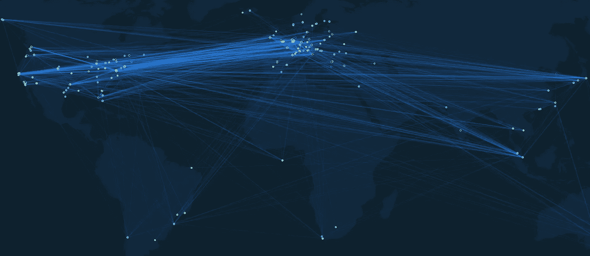
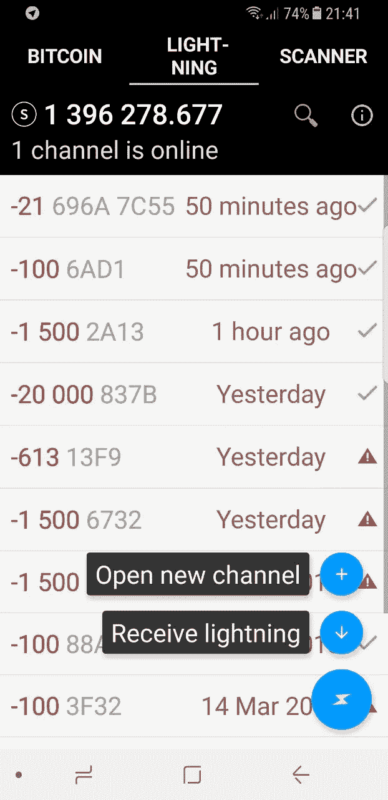
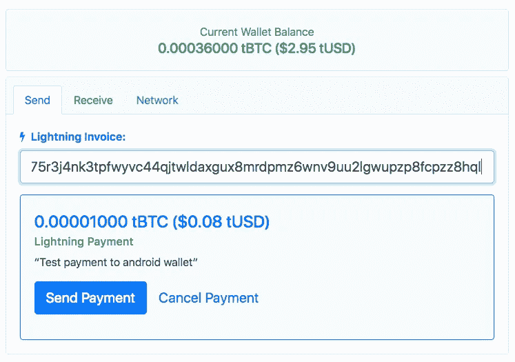
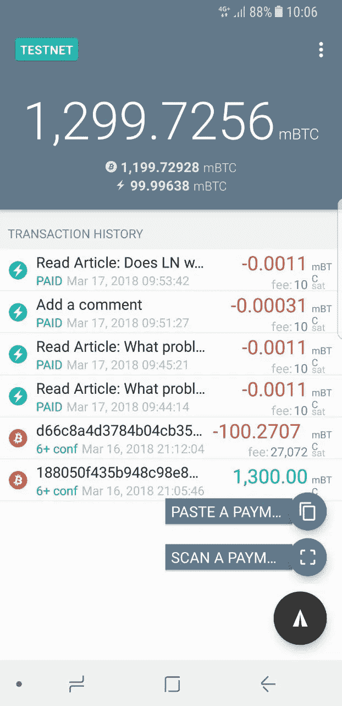
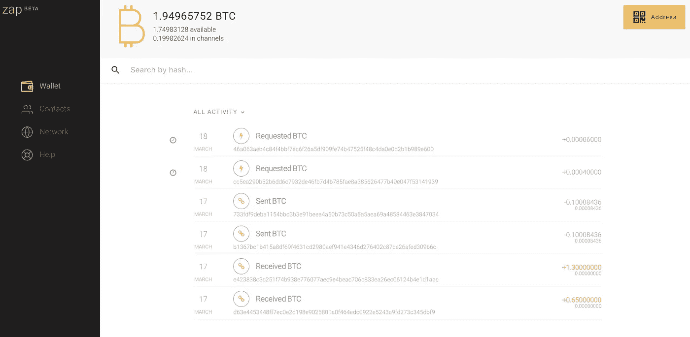

# 闪电网络菜鸟指南

> 原文：<https://medium.com/hackernoon/the-lightning-network-rookie-guide-9fd04468316f>

**本文是新的“搭上区块链列车”系列的第一部分:“闪电网络菜鸟指南”。**

# 哦，天哪，一个新系列！多给我讲讲！

在关于 IPFS 的五集节目之后，是时候介绍区块链世界的另一项令人兴奋的技术了:闪电网络。从这里开始只是`Lightning Network`(单数，我稍后会解释为什么)或者简称为`LN`。

一个快速测试来看看你是否注意了:`LN`。你有没有在脑海中把这个扩展到`Lightning Network`？干得好，你通过了！

顺便说一句，如果你错过了 IPFS 的剧集，可以在这里或 [hackernoon](https://hackernoon.com/catching-the-blockchain-train-9a0945aab958) 开始。

我喜欢将实践(玩软件工具)与阅读和理解技术结合起来的想法。这在本《菜鸟指南》的大纲中有所体现*:

1.  以最终用户的身份玩 LN:这一集。
2.  了解 LN 的基础知识。
3.  准备:设置一个比特币全节点和一个本地块浏览器。
4.  LN 动手:安装 LN 节点、更多钱包、应用、在 mainnet 上买一件 [t 恤](https://store.blockstream.com/)等等。
5.  更好地理解 LN:深入研究[白皮书](http://lightning.network/lightning-network-paper.pdf)和[规范](https://github.com/lightningnetwork/lightning-rfc)。

*)如果菜鸟这个词冒犯了你:我说的当然是我自己。当我写这些帖子，把自己从一个菜鸟变成一个初学者的时候，我想通了这一切。

# 聪的眼光！

在我们开始之前，这里有一个中本聪天才的一瞥:[聪的远见！(支付渠道/ LN)](https://www.reddit.com/r/Bitcoin/comments/6s7c9r/satoshis_vision_payment_channels_ln/) 。那是 2010 年！

在理解他的具体陈述之前，我们还有很长的路要走:

> nTimeLock 做的正好相反。这是一个开放的交易，可以在截止日期前用新版本替换。锁定后才能录制。截止日期到来时的最高版本被记录下来。例如，它可以用于编写一个将自动永久锁定并通过的托管交易，除非它在截止日期前被撤销。这个特性还没有启用或使用，但是支持已经存在，所以可以在以后实现。

但我们会实现的，一步一步来。

显然，他在 2013 年又这样做了:[这封由迈克·赫恩在 2013 年 4 月撰写的电子邮件，引用了 Satoshi 关于现在被称为#LightningNetwork](https://twitter.com/ArminVanBitcoin/status/973778847287136258) 的谈论。

# 闪电网络的大肆宣传是怎么回事？

如果你一直关注比特币技术，你很可能知道闪电网络。如果不是:这是一个提议的解决方案，通过允许以不信任的方式进行“链外”交易来增加比特币网络的可扩展性。

最近有很多关于 LN 的讨论，可能是因为有几个实现，而且看起来很有效。

[人们已经在主要的比特币网络上使用](https://www.coindesk.com/bitcoins-lightning-network-problem-people-already-using/) it。三天前，mainnet 的第一个 LN 节点[宣布](https://blog.lightning.engineering/announcement/2018/03/15/lnd-beta.html)。

这是当前 [mainnet LN](https://lnmainnet.gaben.win/) 的一个很酷的可视化。当我们在半路上的时候，我希望你和我都有自己的节点！

为什么闪电网络如此令人兴奋？我是一个粉丝已经有一段时间了，但是这个由伊丽莎白·斯塔克和安德烈亚斯·安东诺普洛斯主持的播客让我着迷了。#357 真正的闪电与伊丽莎白·斯塔克。

我鼓励你听完整个播客，但是如果你没有，没关系，这里有一些突出的要点(至少我是这么认为的):

1.  **比特币的可扩展性改进**:比特币的预期/广告中的快速和低费用交易现在成为可能。
2.  小额支付:有史以来第一次，技术将使小额、跨境、几乎免费的支付成为可能。
3.  互操作性:全区块链一个 LN。正如因特网是网络的网络一样，我们可以把 LN 看作是区块链的区块链。标准化正在进行中，以便不同的区块链可以在一个公共接口上工作。这些规格被命名为[螺栓](https://github.com/lightningnetwork/lightning-rfc/blob/master/00-introduction.md)(就像比特币的 BIPs)。
4.  **跨链交换**:这种互操作性有助于[原子](https://bitcointechtalk.com/atomic-swaps-d6ca26b680fe) [交换](https://twitter.com/lightning/status/931277111490265088)，例如，从比特币到以太坊或任何与这个覆盖 LN 接口的区块链。届时，真正分散的交易所将成为可能。
5.  **应用层**:在 LN(比特币 e.a .之上的第二层，代表第一层)的顶部是第三层，这将是应用层。这里是扎普夫妇居住的地方。
6.  **开发者平台**:LN 为开发者打开了一个充满可能性的世界。 [LND 实现](https://github.com/lightningnetwork/lnd)提供了一个 [gRPC](http://dev.lightning.community/guides/python-grpc/) 接口，使得编写`(z|l)apps`更加容易。我们稍后肯定会深入探讨这一点！
7.  **开发者社区**:活跃在这个空间的开发者有 100 个，赶快成为其中一员吧。他们在 [Lightning Labs slack](https://lightningcommunity.slack.com/) 闲逛，在这里拿到他们的文档[。](http://dev.lightning.community/)

现在如果*那个*没有让你兴奋……(这可能意味着你过着有趣而有意义的生活)。

好吧，那么，让我们从最终用户的角度来看看它是什么样子的…

# 闪电网络钱包

在深入研究 LN 协议的工作原理和建立我们自己的 LN 节点之前，让我们先来尝试一下目前可用的一些钱包:

1.  照明钱包
2.  HTLC.me
3.  艾克蕾尔钱包
4.  Zap 桌面钱包
5.  闪电桌面应用

# 先弄点 testnet 比特币

我们在比特币测试网上使用钱包，所以你需要一些测试网比特币(tBTC)。就像过去的 mainnet 比特币一样，你可以在水龙头那里买到它们。

这个[水龙头](https://testnet.manu.backend.hamburg/faucet)和[这个也](https://testnet.coinfaucet.eu/en/)为我工作过。如果你在获取测试网硬币方面有困难，请发微博给我，我会给你寄一些。

注意，testnet 地址有`m`、`n`或`2`作为[前缀](https://en.bitcoin.it/wiki/List_of_address_prefixes)。

Testnet 比特币没有(也永远不会有)任何价值，但看到一个免费的 200.000.000 satoshis 到来，仍然令人兴奋:)

# 闪电钱包

这个[闪电钱包](http://lightning-wallet.com/)只针对安卓；可以在这里下载:[比特币+闪电钱包](https://play.google.com/store/apps/details?id=com.lightning.wallet)。

我喜欢这款钱包，因为它是 Anton Kumaigorodskiy[的个人项目，而且它有一些创新的功能。](https://github.com/btcontract)

这款钱包有一本出色的在线用户手册，让我们浏览一下:

[设置比特币钱包](http://lightning-wallet.com/setting-up-bitcoin-wallet.html):这个应用非常方便，因为它是一个 [SPV](https://bitcoin.org/en/developer-guide#simplified-payment-verification-spv) 比特币节点，上面建有一个闪电节点。按照手册中的说明，将一些 testnet 硬币发送到您的钱包中。请注意，您需要等待交易被确认几次才能继续。

接下来:[使用闪电钱包](http://lightning-wallet.com/using-lightning-wallet.html)。

选择`Lightning`选项卡，点击`Open new channel`。现在选择一个频道或搜索安东推荐的[频道](https://bitcointalk.org/index.php?topic=2735482.0)。我选择了`oh hi mark`，因为它让我觉得很受欢迎。然后资助频道(嘿，你可以资助一个亚聪分辨率的频道！)并等待两次确认。

这些确认可能需要一段时间，因为这是一个实际的比特币交易。您出资的金额决定了通过此渠道支付的最高金额。我们将在本指南的下一集深入探讨这一切。

一旦我们有了活跃的支付渠道，我们就可以买东西了。

我的第一次购买是在[yalls.org](https://yalls.org/)为 100 个测试聪的一篇文章，然后为 21 个测试聪留下了评论。小额支付成为现实！

我还在[Starbucks](https://starblocks.acinq.co/)买了一个 Blockaccino。还有几个地方你可以在这里度过 tBTC。

这里发生的情况是，支付通过一系列支付渠道，经过许多节点。所有这些都是以一种不可信的方式进行的，费用非常低，速度非常快。很神奇不是吗？

观看这个[手机闪电钱包演示](https://www.youtube.com/watch?v=yNFfUfyL2xE)的全过程。

安东还创作了另一个有用的视频:[当闪电出错的时候](https://www.youtube.com/watch?v=H-WJPjAp5u8)。它描述了渠道关闭或支付停滞时的各种情况。这些是他描述的场景:

1.  相互(合作)关闭交易:通道的双方同意关闭通道，剩余余额在区块链上结算，没有任何延迟。双方都需要在线才能工作。
2.  如果对等体没有响应或变得不合作，则强制关闭通道。强制关闭通道的对等方受到“惩罚”,要等待很长时间才能使用他们的比特币。
3.  您的对等方想要通过向区块链发送先前的承诺交易来窃取您的信息。我们看到同伴为此受到了惩罚，得到的比他按规则行事时得到的要少。

我们将在下一集看到这一切是如何实现的。

这款钱包最后一个很酷的功能由两部分组成:手机上的应用程序和一个服务器，该服务器可以卸载手机应用程序的一些工作。它被命名为[奥林巴斯](http://lightning-wallet.com/what-does-olympus-server-do)，这里有一个关于它的视频。

为了*接收*闪电网络支付，我们需要另一个对等点，所以让我们继续下一个 LN 钱包…

# HTLC.me

HTLC.me 是最简单的开始方式，因为你不需要安装任何东西，它给你一点 tBTC 来玩。

从用户的角度来看，这不是一个钱包，而是一个闪电网络节点的集中前端。它会跟踪您的余额，您可以在第一次激活“钱包”时应用他们提供的恢复密码来访问它。

无论如何，现在我在 HTLC.me 上创建了一个钱包，并用一些 tBTC 进行了资助，我可以用它来测试 Anton 的 Lightning 钱包上的接收功能:

摘自安东的《闪电钱包用户指南》:

> *接收闪电资金*
> 
> *为了获得闪电付款，必须满足一些条件:*
> 
> *创建新的支付渠道后，不会立即收到任何东西，因为必须先花费一些资金来为流入的资金腾出“空间”。一个支付通道可以被认为是一个装满水的瓶子:为了往里面倒东西，必须先把东西倒出来。*
> 
> *每个通道都包含不可使用的储备，通常占通道容量的 1%。在允许接收之前，您必须使用该储备。当新频道已满时，无法使用的频道预留是您看到负接收限制的原因。它表明你需要花多少钱才能通过渠道收到任何东西。*
> 
> *每个付款请求都是一次性的，不能多次完成。因此，您需要为您希望收到的每笔款项发出新的个人付款请求。*
> 
> *您的 Lightning 钱包需要在线才能接收资金。*

除此之外，在不总是在线的手机应用上收款也存在风险。对等体可以通过发送以前的承诺事务来试图窃取您的信息。您的 LN 客户端只有在每天至少在线一次的情况下才能更正此问题。

从我的手机应用程序中腾出一些空间后，我尝试了一下。虽然步骤非常顺利，但由于 HTLC.me 无法与我的手机钱包建立连接，实际支付失败。

让我们用另一个钱包再试一次！

# 艾克蕾尔钱包

艾克蕾尔钱包也只适用于安卓系统。在[这篇博文](/@ACINQ/announcing-eclair-wallet-a8d8c136fc7e)中公布了。

它的工作原理和安东的闪电钱包差不多。一个区别是它不允许接收 tBTC，如上面的公告中所解释的。

艾克蕾尔钱包暴露了一些技术细节，如钱包的节点 id(闪电网络的公共标识符)和连接的对等体。节点地址具有`some-public-key@ip-address:port`的形式，例如`03dc39d7f43720c2c0f86778dfd2a77049fa4a44b4f0a8afb62f3921567de41375@213.133.99.89:9735`。

说到同行，艾克蕾尔钱包允许连接多个同行(也就是不止一个支付渠道)。如果您知道节点 id，可以在这个出色的浏览器中查找:[https://explorer . AC inq . co/#/n/03 DC 39d 7 f 43720 C2 c 0 f 86778 DFD 2 a 77049 fa 44 B4 f 0a 8 AFB 62 f 3921567 de 41375](https://explorer.acinq.co/#/n/03dc39d7f43720c2c0f86778dfd2a77049fa4a44b4f0a8afb62f3921567de41375)。

从 wallet 中，您可以扫描该节点 id 并将其添加为另一个对等节点。

让我坐一会儿，让它深入人心……这是老生常谈，但我们生活在未来。维萨等人应该害怕了。

现在，让我们再试一次，看能否用 Anton 的 Lightning 钱包接收。我把两个钱包都连接到同一个节点上，这样就简单多了(是吗？).不幸的是，我们无法影响艾克蕾尔钱包使用哪个渠道。

过了一会儿，我从现实中醒来:一个永远在等待付款，另一个失败了。维萨又可以呼吸正常了。

让我们用另一个钱包试试，也许我们在那里运气更好。

# Zap 桌面钱包

这个 [Zap 钱包](https://zap.jackmallers.com/)是一个不同的野兽；它使用一个完整的 [lnd](https://github.com/lightningnetwork/lnd) 节点。

这款钱包在本文中首次公布:[公布 Zap:一款闪电网络钱包](/@JimmyMow/announcing-zap-a-lightning-network-wallet-47622acd89fb)。它有一个嵌入的视频，可以让你很好地了解它是如何工作的。但是更好的选择是下载钱包并一起玩！(顺便提醒一下，这个应用程序还没有准备好真正使用，它会不时地使用所有的 CPU，所以只有当你喜欢你的电脑风扇的声音时才继续使用)。

在这里下载您的平台的最新版本:[版本](https://github.com/LN-Zap/zap-desktop/releases)。

第一次运行时，需要很长时间才能使用。当它同步时，你可以观看几个视频: [Zap 闪电网络钱包教程](https://www.youtube.com/playlist?list=PLMj6UA3-f3cRfKmG1xRm3j0KBRCvbX4vW)。

我发现这个钱包不如我玩过的其他钱包直观，但它补偿了这一点，因为它由一个完整的闪电节点供电。希望这意味着我们最终可以看到接收 tBTC 是如何工作的。

另一次尝试从 Zap 支付到安东的应用程序再次失败，从任何一个移动应用程序向 Zap 钱包支付也导致了`RouteNotFound`。不知道这是怎么回事，但是收钱比花钱难，就像在现实生活中一样。

让我们继续我们的最后一个钱包…

# 闪电桌面应用

这款钱包的最新版本(仍在大量开发中)可以从这里下载。

这里宣布:[宣布我们的 Lightning 桌面应用，现在可以测试](https://blog.lightning.engineering/announcement/2017/10/12/test-blitz.html)。

不幸的是，我无法让它在我的 Mac 上运行。我创建了一个[问题](https://github.com/lightninglabs/lightning-app/issues/245)，所以当事情得到解决(或者他们指出我这边的问题)时，我会更新这篇文章。

# 初步结论

付款是不真实的，快速和便宜！

通过读取 [Lightning Network Explorer](https://explorer.acinq.co/#/) 上的二维码来添加对等节点就像变魔术一样！

收到付款非常顺利*如果*成功了……我所有的尝试都失败了，但是哦，不总是在线的钱包首先就不应该收到付款。为此，我们在服务器上运行了完整的节点。很快就会在这个博客上看到！

在所有的钱包中，这两款手机钱包都是我最喜欢的，因为用手机扫描二维码支付比复制粘贴支付请求更自然。

下一集会少一点动手。我将深入研究 LN 协议，希望能以一种简单易懂的方式与大家分享。

*最初发布于*[*decentralized . blog*](http://decentralized.blog/the-lightning-network-rookie-guide.html)*。*