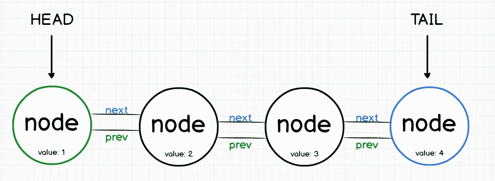
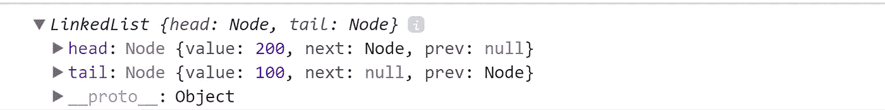
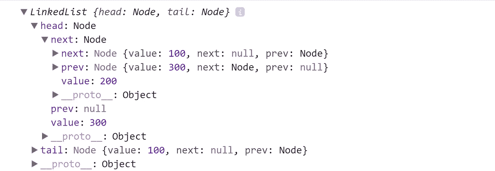
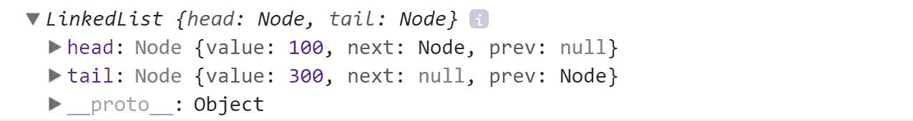
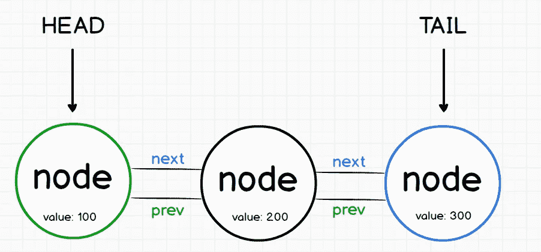
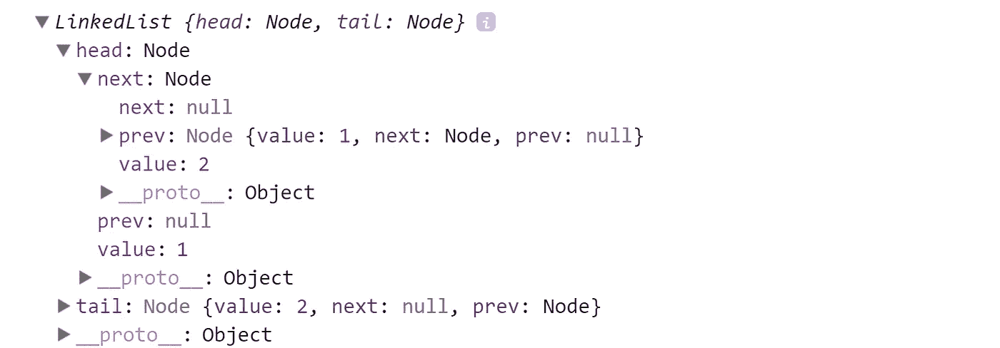
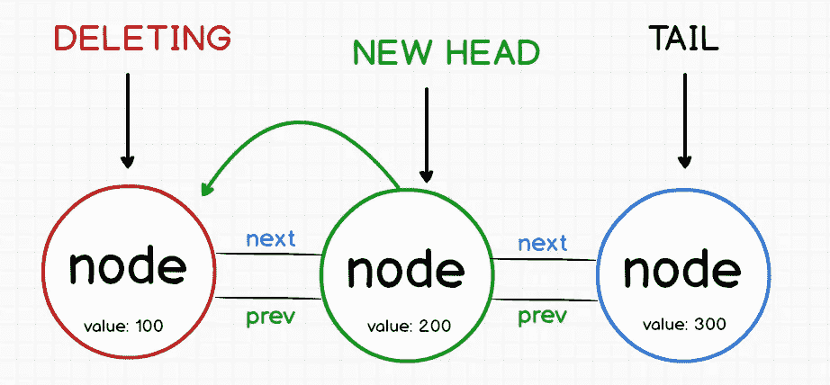
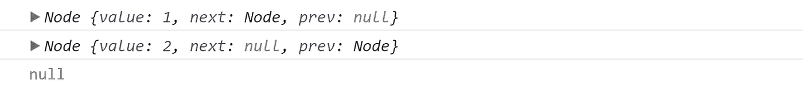

# JavaScript 中的链表小指南

> 原文：<https://medium.com/hackernoon/the-little-guide-of-linked-list-in-javascript-9daf89b63b54>


# 什么是数据结构？

> 数据结构是一种组织存储在计算机中的数据的方式，以便可以有效地使用它。

一个*链表*，顾名思义，是一个节点的链表，由列表中第一个节点的头和最后一个节点的尾来表示。每个节点都有一个指向前一个和下一个节点的引用/指针。

链表数据结构有两种类型，第一种是单链表，这种类型的节点有指向下一个节点的指针，但没有指向上一个节点的指针。

在这篇文章中，我们将探索*双向链表，即节点有一个下一个和上一个指针(头节点有一个下一个指针，但没有上一个，尾节点有一个上一个指针，但没有下一个)。*

## 优势:

尽管链表类似于数组，但它并不局限于声明的元素数量。此外，与在内存或磁盘上连续存储数据的数组不同，链表可以轻松地**插入或删除**元素，而无需重新分配或重组整个结构，因为数据项不需要连续存储。

## 链表的缺点:

1)不允许随机访问。我们必须从第一个节点开始按顺序访问节点。因此，我们不能在链表上做二分搜索法。**所以搜索元素的速度很慢。**

2)列表的每个元素都需要用于链接的额外存储空间。

**链表**数据结构常用于实现其他数据结构。


在这篇文章中，我们将有一种方法来处理*链表*数据结构。



所以我们要创建两个构造函数:

```
function LinkedList() {
  this.head = null;
  this.tail = null;
}function Node(value, next, prev) {
  this.value = value;
  this.next = next;
  this.prev = prev;
}
```

如你所见，我们在构造函数中表示图像样本。我们的 *LinkedList 函数*有`head`和`tail`，为什么**为空？**因为在开始时没有任何节点。

所以，现在我们要创建我们的 *addToTail* 方法。

# 创建头部节点

```
LinkedList.prototype.addToHead = function(value) {
  const newNode = new Node(value, this.head, null);
  if (this.head) this.head.prev = newNode;
  else this.tail = newNode; 
  this.head = newNode;
};
```

正如你看到的，我们在 LinkedList 原型中创建了这个方法，**为什么？**这项技术很有用，因为我们将创建许多对象，如果我们没有在原型中创建我们的方法，我们将为每个对象复制所有方法，这意味着可能有害的内存开销。

## 让我们回顾一下每一行

这将在变量 newNode 中存储一个新的节点对象。`value`将是我们在 addToHead 方法中传递的值，`this.head`最初为空，因此`next`属性为空，`prev`属性也将为空，因为我们在第三个参数中传递了它。

`if (this.head) this.head.prev = newNode;`好的，这一行意味着如果存在一个*头*节点，它们的 prev 值将是 newNode(即新的头)。如果没有节点，我们创建的实际节点将是头部，也是尾部，正如我们在第**第三个**图像示例中看到的。

例如，如果我们现在创建两个节点:

```
const list = new LinkedList();
list.addToHead(100);
list.addToHead(200);
console.log(list);
```

我们将得到以下输出:



头节点的`value`为 200，`next`属性是尾对象(列表中的下一个)，没有*前一个*对象，因为*头*是第一个。

现在，想象一下:

```
const otherlist = new LinkedList();
otherlist.addToHead(100);
otherlist.addToHead(200);
otherlist.addToHead(300);
console.log(otherlist);
```

输出将是:



或者类似这样的东西:


因此，如果您希望它访问中间节点，您可以这样做:

```
console.log(`Middle node value: ${otherlist.head.next.value}`);
```

记住 *addToHead* 方法将节点添加到开始，然后你唯一需要做的就是在你的控制台中分解对象！

试试吧！

所以，现在我们要创建我们的 *addToTail* 方法。

# 创建尾节点

实际上，这个方法与我们在 addToHead 示例中所做的非常相似。

```
LinkedList.prototype.addToTail = function(value) {
  const newNode = new Node(value, null, this.tail);
  if (this.tail) this.tail.next = newNode;
  else this.head = newNode;
  this.tail = newNode;
}
```

使用与上一个例子相同的逻辑，本质是相似的，只是使用了相反的逻辑。

所以现在，如果我们做和在 addToHead 方法中一样的例子:

```
const list = new LinkedList();
list.addToTail(100);
list.addToTail(200);
list.addToTail(300);
console.log(list);
```

现在，最后添加的将是尾部(最后一个),不像另一个方法，最后一个写入被添加为第一个节点(头)。



或者像这样:



## 测试两种方法:

```
const list = new LinkedList();
list.addToHead(1);
list.addToTail(2);
console.log(list);
```



# 删除节点

## 想象我们有这样的节点:

```
const list = new LinkedList();
list.addToHead(200);
list.addToHead(100); *// remember this is the head now!*
list.addToTail(300);
console.log(list);
```

## 删除头节点方法:

```
LinkedList.prototype.removeHead = function() {
  if (!this.head) return null;
  let value = this.head.value;
  this.head = this.head.next;

  if (this.head) this.head.prev = null;
  else this.tail = null;

  return value;
}
```

让我们看看，第一行将验证是否有任何头，如果没有返回 null。然后，我们保存*头节点*的*值*，并使用下面这条线设置新的头节点:`this.head = this.head.next;`因此，在这一点上，我们有:



在最后几行代码中，我们将 *prev* 重置为空，因为新的 head 不能有 prev 值(因为是第一个节点)。

返回移除值。

## 删除尾节点方法:

```
LinkedList.prototype.removeTail = function() {
  if (!this.tail) return null;
  let value = this.tail.value;
  this.tail = this.tail.prev;

  if (this.tail) this.tail.next = null;
  else this.head = null;

  return value;
}
```

对此方法应用相同的逻辑，因为它是相同的，但效果相反。

# 搜索节点:

```
LinkedList.prototype.search = function(searchValue) {
  let currentNode = this.head;

  while(currentNode) {
    if (currentNode.value === searchValue) return currentNode;
    currentNode = currentNode.next; 
  }
  return null;
}
```

所以在这里，我们在*当前节点*变量中保存`this.head`的值，然后*当*当前节点不*未定义*时，我们比较是否存在*节点*与我们传递的*值*，如果不存在，我们返回*空值*。

所以，如果我们有这个:

```
const list = new LinkedList();list.addToHead(1);
list.addToTail(2);console.log(list.search(1)); *// true*
console.log(list.search(2)); *// true*
console.log(list.search(3000)); *// false*
```

输出将是:



我希望你喜欢它！

**完整代码:**[https://github.com/germancutraro/LinkedList-Data-Structure](https://github.com/germancutraro/LinkedList-Data-Structure)

**你有我的**[***Github***](https://github.com/germancutraro)**如果你愿意跟随我，我将不胜感激！**

感谢**[**solo learn**](https://www.sololearn.com/)一款梦幻般的 app！**

****学习数据结构和算法的绝佳课程:**
◾ [从零开始学习 JavaScript 中的数据结构](https://www.udemy.com/learning-data-structures-in-javascript-from-scratch/)
◾ [编码面试训练营:算法+数据结构](https://www.udemy.com/coding-interview-bootcamp-algorithms-and-data-structure/)**

**谢谢你😊**