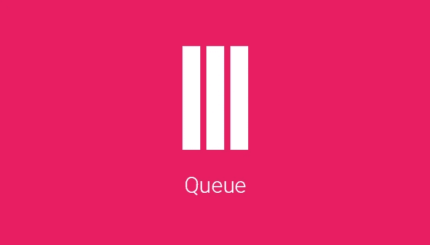
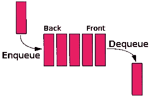
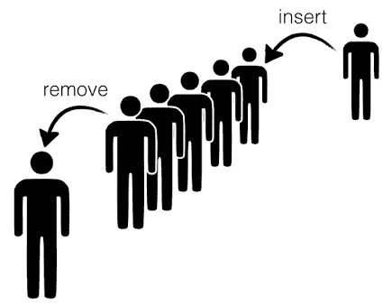
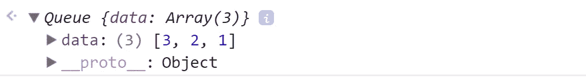
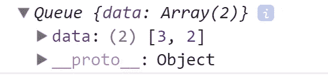

# JavaScript 中的队列小指南

> 原文：<https://medium.com/hackernoon/the-little-guide-of-queue-in-javascript-4f67e79260d9>



队列是一个简单的**数据结构**，它允许元素从称为尾部的一端插入，从称为前端的另一端删除。

这种行为叫做 *FIFO* **(先进先出)**。



因此，队列是一种线性数据结构。一个非常重要的概念是，队列只删除最早添加的元素。



The person that is removed was the first in the queue

# 应用程序

*   每当我们需要从中的第一个对象开始按顺序管理对象时，就会用到队列。
*   场景包括在打印机上打印文档，呼叫中心系统应答等待的人，等等。

# **创作**

*   可以使用**数组**或**链表来实现队列。**

所以，在 JavaScript 中做一个**队列**非常简单，因为我们可以采用数组方法，比如 *unshift* 和 *pop。*

## 请记住:

`unshift`在数组的开头添加一个元素。
`pop`删除数组的最后一个元素。

# 履行

所以我们要做的第一件事是创建一个队列构造函数，里面有一个空数组。

```
function Queue() {
  this.data = [];
}
```

记住，我们在这里使用了`this`关键字，因为我们需要指向我们创建的对象。

# **方法**

主要方法将*添加*和*删除:*

```
Queue.prototype.add = function(record) {
  this.data.unshift(record);
}Queue.prototype.remove = function() {
  this.data.pop();
}
```

我们将再添加 3 种方法:

```
Queue.prototype.first = function() {
  return this.data[0];
}Queue.prototype.last = function() {
  return this.data[this.data.length - 1];
}Queue.prototype.size = function() {
  return this.data.length;
}
```

那么，让我们看看我们得到了什么:

```
const q = new Queue():
q.add(1);
q.add(2);
q.add(3);
console.log(q);
```



所以，最老的是值为 **1 的元素，因为我们先添加了它。**

如果你不相信我，你可以用我们的*最后一个*方法来看看:

```
console.log(q.first());
  *// -> 3*
console.log(q.last());
  *// -> 1*
```

因此，如果我们使用 *remove 方法，将被删除的元素是最旧的，因此 1 被删除。*

```
q.remove();
console.log(q);
```



我们还有最后一个方法调用*大小*

```
console.log(q.size())
  // -> 2
```

删除最后一个元素后，返回' **'2''** 。

【https://github.com/germancutraro/Queue-Data-Structure】完整代号:；

**你有我的**[***Github***](https://github.com/germancutraro)**如果你想关注我，我会非常感激！**

感谢**[**solo learn**](https://www.sololearn.com/)一款梦幻般的 app！**

****学习数据结构和算法的绝佳课程:**
◾ [从零开始学习 JavaScript 中的数据结构](https://www.udemy.com/learning-data-structures-in-javascript-from-scratch/)
◾ [编码面试训练营:算法+数据结构](https://www.udemy.com/coding-interview-bootcamp-algorithms-and-data-structure/)**

**谢谢你😊**