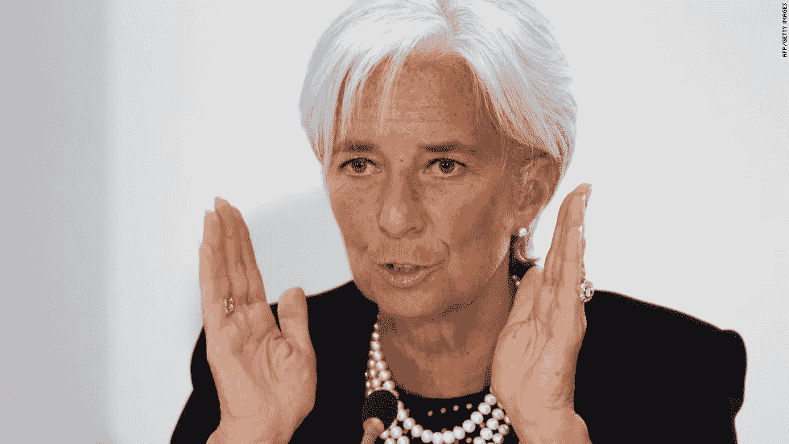

# 区块链采用的漫长道路可能会变得越来越短

> 原文：<https://medium.com/hackernoon/the-long-road-to-blockchain-adoption-might-be-getting-shorter-b5d01a6ed65b>

image source: [Pexels](https://www.pexels.com/)

去年九月，国际货币基金组织总裁克里斯蒂娜·拉加德在伦敦的英格兰银行会议上发表了一个关于中央银行和金融科技的令人难以置信的演讲。演讲中最引人注目的主题是虚拟货币的作用及其在颠覆我们所知的传统金融体系中的地位。

根据拉加德的说法，比特币等虚拟货币可以解决现有问题，因此主流金融不应轻视它们。然而，她指出，数字货币的大规模采用仍远未实现，因为它们太不稳定，高度能源密集型和区块链-它们背后的技术仍不可扩展。监管也存在问题，全球各国政府担心其分散的性质可能使其成为犯罪分子的避风港。

她继续指出，尽管存在这种担忧，但这些挑战可以随着时间的推移得到解决，因此并不证明可以放弃这项技术。

Lagarde speaking source: [CNN](https://edition.cnn.com/)

她讨论的问题的解决方案正在进行中。以区块链的可伸缩性问题为例；像[雷电网络](https://raiden.network/)和[等离子](https://plasma.io/)这样的解决方案已经有了。

雷电网络通过利用信道网络在链外扩展以太网，因此区块链不会参与每一次传输。另一方面，Vitalik Buterin 和 Joseph Poon 发明的 Plasma 处理智能合约的方式与目前相同，同时向公共以太坊链广播完成的交易。这两项技术的目标是使每秒执行数十亿次计算成为可能。

在波动性问题上，有理由相信正在进行的监管打击将导致市场调整并最终稳定价格。随着监管机构加入这场游戏，投资者可能会关注每种加密货币的基本面，而不是仅仅出于投机目的。然而，鉴于在不抑制增长的情况下给加密市场带来秩序的监管方法仍有待制定，因此仍有许多工作要做。

除了拉加德提到的原因，购买、转移、交换和存储加密货币的复杂性也是采用缓慢的原因。尽管如此，近几个月来，针对这一挑战推出了许多解决方案。例如，去年 10 月，万事达卡推出了一个区块链驱动的支付平台，供某些银行和商家用于支付商品和服务。此举受到了区块链爱好者的欢迎，并被视为传统金融机构大规模接受的第一步。

另一方面，Visa 也对加密货币表现出了兴趣，批准了加密支持卡和程序，允许消费者将加密货币转换为法定货币，并将这些资金存入与其借记卡或预付卡相关的银行账户。一些与 Visa 合作的区块链公司包括 Monaco、BitPay 和 Shift Card。

区块链公司也在努力设计能够大规模采用加密货币的方法。 [TokenCard](https://tokencard.io/) ，为以太坊和智能合约打造的借记卡，就是一个很好的例子。该卡很容易通过银行转账或借记卡充值，并可能被全球数百万商家和自动取款机接受。除了该卡，该公司还开发了一款移动应用，帮助用户在一个地方查看和管理他们的资产，实时跟踪他们的支出，快速安全地发送和接收资产，并通过滑动在各种数字资产之间切换。TokenCard 已与 Bancor、Melon Port 和 Digix 等主要行业参与者合作。

最后，随着人们继续接触加密货币和区块链技术，采用率很可能会增加。抵制变化是人的天性，因此前几年目睹的缓慢采用并不罕见。然而，随着数字货币技术的不断规范化，采用率将呈指数级增长。