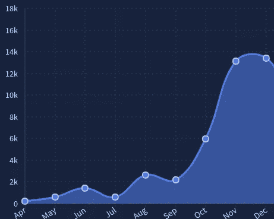
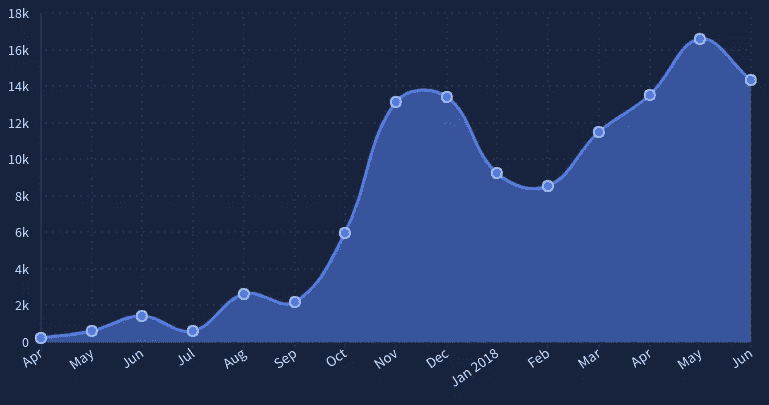
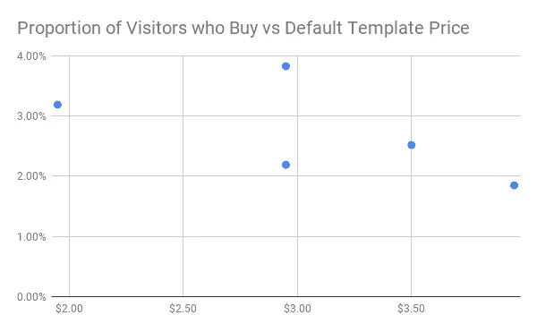
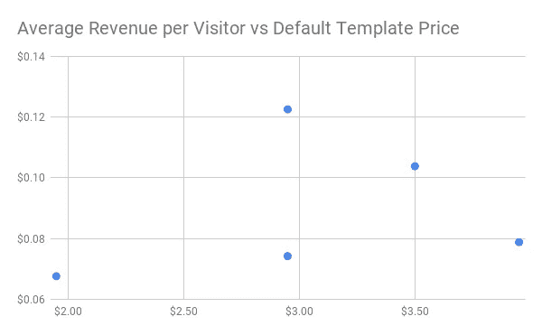
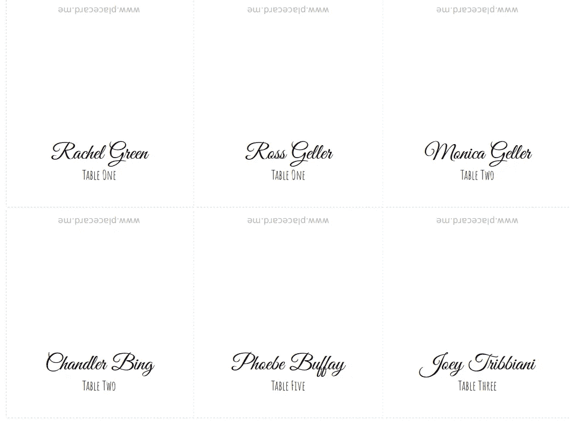
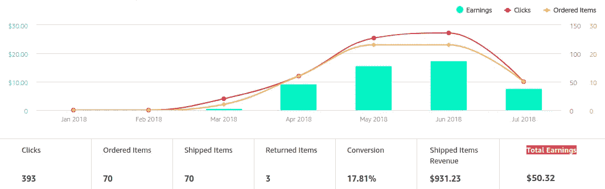
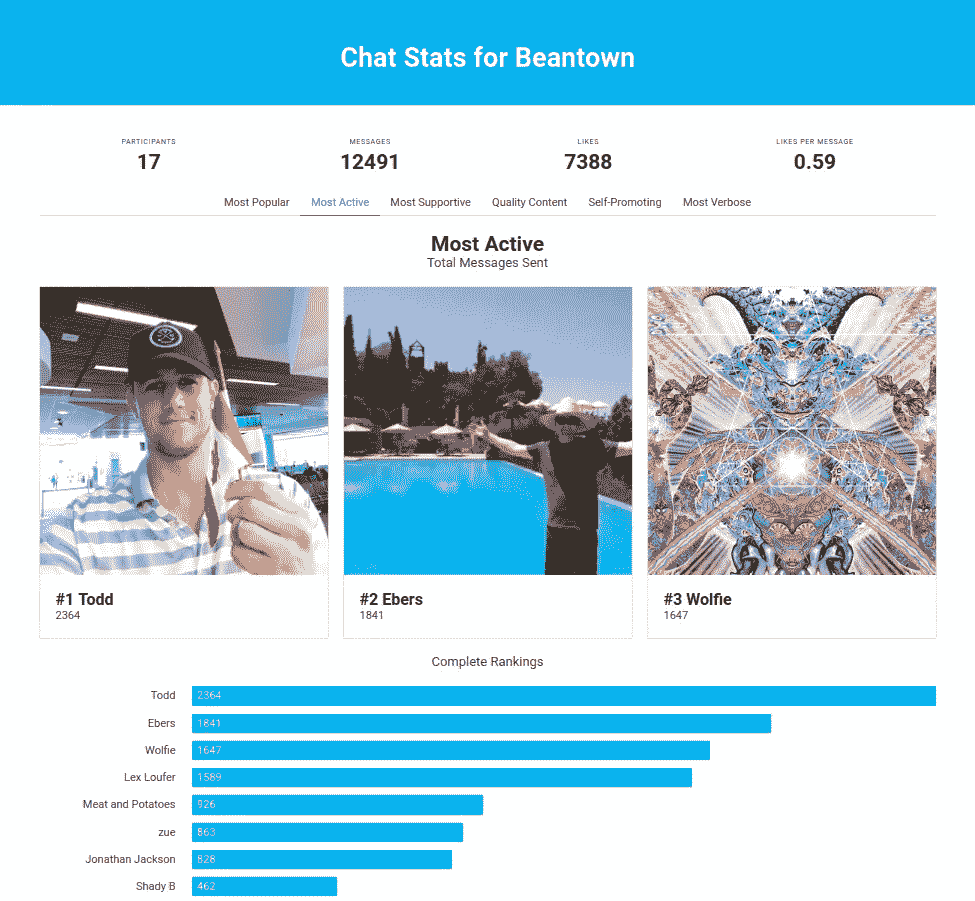
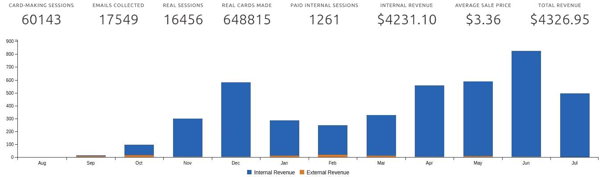

# 通往被动收入的漫长道路第三部分:期望与现实

> 原文：<https://medium.com/hackernoon/the-long-road-to-passive-income-part-3-expectations-vs-reality-6967985cc1db>

## “人鼠之间最周密的计划经常会出错”——罗伯特·彭斯

这是我的系列文章的第 3 部分，讲述如何构建一个创收的 web 应用程序，提供可持续的被动收入。如果你还没有看过，这里有 [*第一部分*](https://hackernoon.com/the-road-to-passive-income-part-1-getting-to-100-in-monthly-revenue-6127269ff25f) *和* [*第二部分*](https://hackernoon.com/the-long-road-to-passive-income-part-2-getting-from-100-to-1000-in-monthly-revenue-6c91a13b6685) *。*

因此，在去年 12 月出版的“通往被动收入的漫长道路”的第 2 部分中，我制定了一个计划来发展我的 web 应用程序，使每月收入从 100 美元增加到 1000 美元。这是一个直截了当的计划，有三个组成部分:1)乘势而上，增加我的漏斗顶端，2)优化(又名提高)价格，3)货币化我的网站的免费层。

八个月后，我仍然没有达到 1000 美元的里程碑，尽管我已经非常接近 6 月份达到 885 美元的收入。我想看看我的期望如何与现实相符，我实际上是如何得到这个数字的，以及我打算从这里开始做些什么，这可能会很有趣。

那么我们在这些计划上做得怎么样？

# 计划 1:乘势而上，增加有机流量

我希望发生的第一件事是，我将能够利用我持续的有机流量增长——主要来自我所做的与位置卡相关的搜索引擎优化工作——来看到稳定的收入增长。

而且成功了！我的流量在 11 月和 12 月飙升，收入也随之飙升。这是交通数据:

Traffic data for Place Card Me from April — December 2017\. Visualization courtesy of [Indie Hackers](https://www.indiehackers.com/product/place-card-me/traffic).

只是……然后在一月份发生了一些令人担忧的事情。我的流量急剧下降——下降了 30%以上。然后 2 月份又跌了。

发生了什么事？

事实证明，座位卡是一项季节性很强的业务。人们主要在 11 月和 12 月的假期和婚礼上使用它们，对于世界上大多数人来说，婚礼发生在温暖的 4 月-10 月。我的流量*在*继续有机增长，但受到季节变化的巨大影响，这种影响在一年中的许多月份都超过了其他因素。这是迄今为止的完整图表。请注意 2018 年初的大幅下降，随后是夏季的缓慢攀升。

Traffic data for Place Card Me from April 2017 — June 2018\. Visualization courtesy of [Indie Hackers](https://www.indiehackers.com/product/place-card-me/traffic).

不管怎样，关键是，虽然我的有机增长计划总体上实现了我的预期，但这是一次混乱的旅程。

得分:非常准确。

# 计划第二部分:优化(即提高)价格

所以 [Place Card Me](https://www.placecard.me/) 的工作方式是，你可以免费制作空白的 Place Card，也可以支付少量费用使用预先制作好的设计(或者上传自己的设计)。你想要多少卡就付多少钱。

从事这项工作已经一年多了，现在我可以满怀信心地说，销售名片模板可能是一个糟糕的选择。

首先，在一个消费者期望网络产品免费的世界里，它是一个消费者网络产品。然后，即使他们真的付钱了，每次销售的成本也很小，而且我的大多数客户只需要一次服务，所以每个客户的总收入很低。最重要的是，我的准新娘和准新郎的目标客户群是互联网上一大部分人争夺注意力的群体。所以竞争很激烈。

综上所述，这项业务的一大特点是——确切地说是*，因为*我没有回头客——我可以随心所欲地改变价格，而且几乎没有任何影响。每周都有一批新的名片制作人第一次发现我的网站，他们对东西的价格没有先入为主的预期。

Trying to channel my inner Patrick McKenzie.

因此，在产品的历史上，我能够非常连续地进行定价测试。我开始以 5-10 美元的价格出售模板，最终将价格降到 1 美元，然后在过去的 9 个月里，慢慢地将价格提高到 2 美元、3 美元、5 美元，然后再降到目前的 3.5 美元。

为了评估价格变化的净效应，我只看了几个数字:

1.  购买模板的游客比例， **B**
2.  模板的平均销售价格， **P**
3.  每个访问者的平均收入， **R** ，简单来说就是 **B * P**

假设价格越高，购买的人越少，那么应该有一个最优价格使 r 最大化。

实际上，这些数据要混乱得多。这是我尝试过的不同价格区间的情况。

Proportion of visitors who buy (**B**) vs default template price

2.95 美元有两个点，因为 12 月和 3 月的数据完全不同，而这两个月的价格是相同的。12 月的销售率要高得多——可能是由于假日购物卡销售的增长。

一旦你把销售价格( **P** )考虑进去，并转换成每个访问者的收入( **R** )，这个图看起来就是这样的。

Average revenue per visitor (**R**) vs default template price.

现在我们可以清楚地看到，总的来说，较高的价格比较低的价格表现得更好，但数据仍然太混乱，无法确定一个最佳价格，而异常的 12 月点继续把事情搞得一团糟。

在第 2 部分中，我提出我可以通过价格优化使我的收入翻倍。实际情况是，到目前为止，我只能提高 50%左右。

得分:到目前为止，只有 50%的增长，而不是 100%。

# 计划第 3 部分:免费层货币化

我 12 月份计划的最后一部分是将免费层货币化。为此，我采取了一个简单的方法，在座位卡上添加一点品牌，让人们支付 2 美元来删除它。

What the free place cards look like with branding added.

我只是在 7 月 13 日(大约六周前写这篇文章的时候)实现了这个改变。从那以后，我看到平均每天约有 2.5 笔销售，每天收入 5 美元，每月额外收入 150 美元。

这与我在上一篇文章中提出的 400 美元的额外收入相去甚远，尽管像其他事情一样，我计划继续玩价格和想法，看看我是否能继续让这个数字攀升。

**得分:只赚到我建议的 400 美元/月的 40%，但还早。**

# 新的收入来源

这涵盖了我在第二部分说过的所有事情，但这并不是我被动收入的完整情况。在过去的 8 个月里，我还增加了三个新的收入来源:

*   附属链接(12 美元/月)
*   捐款(每月 3 美元)
*   第二个产品(80 美元/月)

下面是对这些问题的简要总结。

## 附属链接

到目前为止，我做的最简单的事情就是建立一些[亚马逊联盟](https://affiliate-program.amazon.com/)的链接来增加一点额外的现金。如果你还不知道，它的工作方式是，你用一个特殊的代码链接到 Amazon.com，然后如果有人在点击你的链接后购买了一些东西，你就可以获得一小部分销售额。

例如，我已经在几个地方链接到了亚马逊，建议人们应该使用什么类型的纸张来制作座位卡，所以在我克服了令人讨厌的因素之后，添加这些标签是显而易见的。

虽然产生的收入到目前为止极其微薄，但每一点都很重要！

My extremely modest month-over-month affiliate revenue from Amazon.

## 捐款

我做的第二件事是设置了一个[给我买咖啡页面](https://www.buymeacoffee.com/czue)并在几个地方链接到它，包括在我的 [Google 相册 Chrome 扩展](http://www.photosnewtab.com/)里面。当我为 Place Card Me 提供超越客户支持时，我还会在我的电子邮件签名中添加一个链接。

 [## BuyMeACoffee.com，给科里·祖莪买杯咖啡

### 我制作了 Place Card Me，Photos New Tab，Chat Stats，以及关于航运软件的文章。

www.buymeacoffee.com](https://www.buymeacoffee.com/czue) 

到目前为止，捐款按钮几乎没起什么作用，但是一个非常慷慨的人给了我 15 美元，作为我帮助她办理座位卡的报酬。

# 第二种产品

我做的最后一件事是为第二个产品建立付费层，这是三件事中收入最高的，每月高达 80 美元。

该产品名为[聊天统计](https://chatstats.co/)——这是一种对 [GroupMe](https://groupme.com/en-US/) 上的群聊进行有趣/愚蠢分析的方式，这是一个相对不太出名的消息平台，我碰巧经常使用。

就像我所有的创业努力一样，这个产品的产生是因为它是我想在这个世界上看到的不存在的东西，所以我决定制造它。去年 12 月，我在几个 subreddits 上发帖，试运行了它，当我开始看到使用率略有上升时，在 4 月份增加了一个付费层。人们支付 10 美元来导入多达 50 万条消息，并获得一些额外的功能。

My second revenue generating product: [Chat Stats](https://chatstats.co/)

这款产品的不同寻常之处在于，我几乎没做什么推广工作。

有了 Place Card Me，我在各种地方推广它，并非常关注 SEO，但对于聊天统计，我只是在 reddit 上发布，几乎没有做任何其他事情。我的理论是，通过挑选一些如此晦涩难懂的东西，让它拥有一个很小的利基受众群，就很容易接触到他们。

# 下一步是什么？

在第二部分的结尾，我思考了如何从每月 1000 美元涨到每月 5000 美元。我以一句话结束:*如果我能成功地将收入翻 8 倍，我肯定能再翻两三倍，不是吗？*

八个月后，我仍然在追逐 1000 美元的里程碑，我感到有点不自信了。

在 Place Card Me 上，我已经基本上没有轻松获胜的机会了，虽然我认为随着时间的推移，我能够通过继续改进产品、加大营销力度和进一步优化定价来慢慢增加收入，但很难看到我需要做出 2 倍的改变来真正推动这一点。

与此同时，我很确定我已经让“使用 GroupMe 的人愿意为愚蠢的分析数据付费”的市场饱和了。下一步自然是尝试扩展到一个新的聊天平台，但这将是一个相当大的工作量，我还不确定该产品在其他平台上是否同样有趣。

所以，我想现在的答案是我不确定接下来会发生什么。我想这就是我在第 4 部分要解决的问题。

# 一线希望

抛开悲观情绪不谈，我仍然可以自信地说，被动收入的梦想依然存在。

2017 年，我在 Place Card Me 上工作了 283 个小时，赚了 945.35 美元。这相当于每小时 3.34 美元，约为美国最低工资的 46%。

2018 年到目前为止，我已经在 Place Card Me 上工作了 48 小时，赚了 3381.60 美元。这是一个完全值得尊敬的 70.45 美元的时薪，从三月份开始，我每个月的时薪都超过了 100 美元！

All time month over month revenue and usage data for Place Card Me.

此外，超过 16，000 人使用 Place Card Me 制作了超过 600，000 张 Place Card。这意味着 16000 人的生活得到了改善。三十五英里长的牌位首尾相连。我知道这不会改变世界，但这是宇宙中属于我的一个小小的凹痕。

*最初发表于*[*【www.coryzue.com】*](http://www.coryzue.com/writing/road-to-passive-income-part-3/)*。*