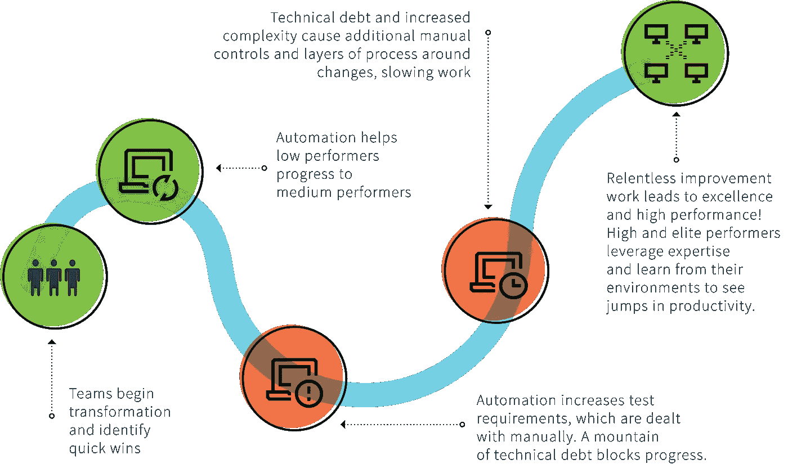

# 疯狂的中间——小胜利和大胜利之间的失败和努力

> 原文：<https://medium.com/hackernoon/the-maddening-middle-of-engineering-and-business-performance-2d19046e90ee>

来自[多拉](https://devops-research.com/)的 [2018 年发展状况报告](https://cloudplatformonline.com/2018-state-of-devops.html)于上周发布。这是我从头到尾读完的第一篇(我失败了！)，而不仅仅是略读重点..里面有一些*非常*有趣的东西。

## 更好地发布软件就是更好地做生意。

在创业公司和硅谷的过滤器泡沫中，这种感觉是真实的。但回到 2014 年的[报告，数据显示，航运代码方面的高绩效者比低绩效者至少有 50%的机会达到他们的一个业务目标，如 rev 目标。](https://puppet.com/resources/whitepaper/2014-state-devops-report)

> 我们的分析表明，优秀员工达到或超过组织绩效目标的可能性是 1.53 倍，优秀员工达到或超过目标的可能性是 1.38 倍。— [2018](https://cloudplatformonline.com/2018-state-of-devops.html)
> 
> 今年，我们考察了组织绩效的财务和非财务指标。我们发现，无论是财务指标还是非财务指标，高绩效员工实现其报告目标的可能性是普通员工的两倍。— [2017](https://puppet.com/resources/whitepaper/2016-state-of-devops-report)
> 
> 在 2014 年 DevOps 调查中，只有 1000 多名受访者自愿说出了他们工作过的公司。其中，355 家上市交易。我们分析了这些公司的三年业绩，发现它们在同一三年期间的表现都优于标准普尔 500。根据我们的分析，在这一群体中，拥有高绩效 IT 团队的公司在三年内的市值比拥有低绩效 IT 团队的上市公司高出 50%。拥有高绩效 IT 团队的公司在盈利能力、市场份额和生产效率方面超出自己目标的可能性也是其他公司的两倍。— [2016 年](https://puppet.com/resources/whitepaper/2016-state-of-devops-report)
> 
> 今年，我们希望验证这一初步发现，但我们的股票代码样本量太小，无法进行有意义的分析。然而，我们确实发现，与去年的高绩效员工相比，今年的高绩效员工超出其组织的盈利能力、市场份额和生产力目标的可能性是同行的 1.5 倍，而去年的高绩效员工超出目标的可能性是同行的 1.9 倍。— [2015 年](https://puppet.com/resources/whitepaper/2015-state-devops-report)

## 高绩效人员部署*更快*

“Elite” performers vs low performers

## 被认为是“低”性能的东西正在变得更快

在 2016 年，低绩效员工每一到六个月部署一次。

2017 年，他们每月至少部署一次**。**

****

**在 2018 年，一些群组获得了快速，但没有按需快速，而低性能栏保持稳定。**

****

**你怎么称呼今天慢于低的球队？**

## **你运得越多/越快，你损失就越少**

**在 2018 年的报告中，更好的可用性与高性能明确相关。高绩效团队是那些部署更快的团队。这些团队也恢复得更快，从开发到生产的交付周期更短。**

> **分析表明，可用性指标与软件交付绩效显著相关，精英和高绩效者始终报告卓越的可用性，精英绩效者拥有强可用性实践的可能性是高绩效者的 3.55 倍。**

## **少做点辛苦对生意有好处**

> **高绩效者在所有方面做的手动工作明显减少，花更多时间做新工作**

**这是辛劳。阅读[网站可靠性工程的书【Google】](https://landing.google.com/sre/book/chapters/eliminating-toil.html):**

> **辛劳是一种与运行生产服务相关的工作，这种工作往往是手动的、重复的、可自动化的、战术性的，缺乏持久的价值，并且随着服务的增长而线性扩展**

**高绩效者一致减少或彻底消除辛劳。请记住，高绩效员工也有两倍的可能超越他们自己的业务目标(收入、盈利能力等)。**

**我是第一批怀疑方(等)公司的产品是否适用于其他任何人的人之一。但是这是一个明显的例子，它不仅仅适用于谷歌；对我们所有人来说也是如此。**

## **尽早关注质量会带来更好的绩效**

> **因为[高绩效者]建立质量，他们花更少的时间解决下游问题，腾出更多的时间做增值工作。**

**这是不言而喻的。然而，它总是被牺牲给你的老板对他们的老板做出的虚假承诺，对他们的老板对投资者做出的虚假承诺。打破循环。**

**注重质量是什么意思？**

*   **编写可观察的代码**
*   **比现在的规模扩大一个数量级**
*   **消除辛劳**
*   **为有限资源预留容量缓冲区**
*   **花时间找出你的代码绑定在什么资源上**
*   **为维护、偿还债务、重构、修复错误预留时间**

## **开销是真实的**

**在“精英”级别，做“新工作”，也就是创造商业价值，最好的情况是 50%的时间。这意味着表现最好的人有 50%的开销。**五成。****

**考虑到我从许多工程领导者那里听到的 anecdata，我们都在欺骗自己和彼此。**

****

## **令人恼火的中间派**

**一些*超级有趣的事情*发生在低水平和高水平的表演者之间。我们被困住了。**

> **中等水平的员工在所有方面都需要大量的体力劳动。**

****

**同样的模式也发生在[初创公司](https://hackernoon.com/tagged/startup)走向市场增长、炒作周期，或者成为*任何*努力领域的专家。**

*   **低垂的果实被采摘**
*   **执行了大量快速、肮脏但有效的工作**
*   **我们开始失去轻松的胜利**
*   **从早期快速而肮脏的决策中，我们开始感受到债务的重量和惯性，无论是技术性的还是其他的**
*   **真正的工作*开始了——现在我们必须在偿还技术债务、增加流程、自动化工作、计算出什么可以扩展、什么不可以扩展、推广到足以超越早期采用者等方面取得渐进的、非常不令人满意但必要的进展***

**以我的经验来看，很少有组织愿意做这样的工作，或者为此创造必要的文化和激励。一点都不性感。这不是激励。不再有速赢了。大部分是体力劳动。**

**对我来说，这正是报告中最有趣的一点*，因为*这是一个跨领域的常见模式。唯一的答案是:做该死的工作。**

## **进一步的问题**

*   **从 2014 年(以及随后的每一年)开始，有多少(百分之几)表现不佳的人现在是中等或高水平的人？**
*   **在 2014 年(以及随后的每一年)的低绩效者中，有多少(百分比)是新的(比如他们之前没有被计算在内，或者超出了低绩效，或者从低绩效的低端移动到接近中绩效，但并不完全是)？**
*   **2014 年(以及随后的每一年)有多少(百分之几)表现中等的人在接下来的几年里向高水平过渡？**
*   **什么是广义的进化率低->中->高->精英？**

## **进一步阅读**

*   **[DevOps 研究和评估出版物](https://devops-research.com/research.html)**
*   **妮可·福斯格伦博士的任何作品**
*   **[2018 年发展状况报告](https://cloudplatformonline.com/2018-state-of-devops.html)**
*   **[2017 年发展状况报告](https://puppet.com/resources/whitepaper/2017-state-devops-report)**
*   **[2016 年发展状况报告](https://puppet.com/resources/whitepaper/2016-state-devops-report)**
*   **[2015 年发展状况报告](https://puppet.com/resources/whitepaper/2015-state-devops-report)**
*   **[2014 年发展状况报告](https://puppet.com/resources/whitepaper/2014-state-devops-report)**
*   **[2013 年发展状况报告](https://puppet.com/resources/whitepaper/2013-state-devops-report)**
*   **[DBSmasher 对 DevOps 报告新状态的看法](https://blog.dbsmasher.com/2018/08/31/accelerate-state-of-devops.html)**