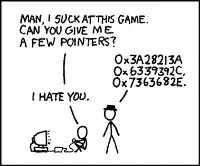

# Perl 中数组引用的魔力

> 原文：<https://medium.com/hackernoon/the-magic-of-array-references-in-perl-cb0bdd82a448>



在编程的世界里，如果不遇到嵌套的数据结构，你不可能走得很远。例如，JavaScript 对象可能如下所示:

```
var cats = {
	"name":"Mr. Tickles",
	"owners": {
		   "owner1" : "Tom",
		   "owner2" : "Janet"
		},
	"color":"orange
};
```

在这个例子中，我们在一个更大的 cats 对象中嵌套了多个 owner 对象。对于数组，我们也可以有类似的东西:

```
var array1 = [["one", "two"], ["three", "seven", "five"]];
```

在这里，我们有一个嵌套数组，或数组的数组。

在 JavaScript 中，可以使用点符号或括号符号来访问嵌套对象。对于数组，您可以调用`array1[0]`，这个调用的预期输出将是数组中的第一个数组，即`[“one”, “two”]`。

这是我们在 Perl 中访问数据的主要区别。尽管两种语言的语法非常相似，但在 Perl 中访问嵌套数据可能会稍微困难一些。例如，如果我们有上面相同的嵌套数组，保存数组的变量是`@array1`，我们想访问$array1 中的第一个数组，并使用调用，`@array1[0],` ，我们实际得到的输出将是第一个元素，`“one”.`

这是因为 Perl 展平了所有嵌套数据。如果您有一个包含多个数组的数组，Perl 将其解释为单个数组，并将所有数组数据混合在一起。Perl 也以非常相似的方式解释对象或散列。

# 输入数组引用

如果您不打算在访问数据时将所有数据展平，那么最好的解决方案是在定义数组变量时使用数组引用。这是在创建数组时完成的，远在我们打算访问数组之前。如果数据不是作为引用存储的，我们就不能作为引用访问它。

在上面的例子中，我们可以如下定义它来实现这一点:

```
my @array1 = ();
```

这里，我们只是创建一个空数组来存放嵌套数组。接下来，我们可以将新数组放入数组容器中。

```
my @nestedArray = ("one", "two");
my @nestedArray2 = ("five", "seven", "three");
```

此时，我们可能会尝试使用以下代码:

```
push @array1, @nestedArray;
```

这就完成了我们之前所做的，一个扁平的数组。相反，在将数组推入容器数组之前，我们将创建数组的引用。

# 创建参考:

```
my $nestedArray = \@nestedArray;
```

这将创建一个标量变量来保存嵌套数组引用。引用实际上是使用反斜杠符号创建的。

现在，我们可以复制上面的代码，将引用推入数组:

```
push @array1, $nestedArray;
```

# 取消引用被引用的数组:

使用同样的格式，我们可以将尽可能多的嵌套数组放入数组容器中。稍后，我们可能需要访问这些引用。让我们首先想象一下我们的嵌套数据是这样的:

```
@array1 = [[1, 2, 4], [3, 4, 5], [8, 8, 9], [6, 7, 6]];
```

这里，我们在一个数组容器中嵌套了四个数组，每个嵌套的数组包含 3 个整数。让我们尝试访问最后一个嵌套数组中的第一个整数。

起初，访问引用数组的语法似乎有点复杂。首先，我将把代码放在这里，然后解释它是如何工作的:

```
@{ $array1[3] }[0];
```

花括号前面的@符号告诉 Perl 我们正在访问一个数组，数组变量前面的$(标量)符号让我们只能访问容器中的一个数组。[3]让我们访问数组中的第 4 个元素，它位于索引[3]。这得到了序列中的最后一个数组，然后在这个块的末尾，我们有了熟悉的[0]，它告诉 Perl 我们想要这个数组中的第一个元素。我们在这里的预期收益是 6。

现在，让我们来看一个更复杂的问题，我们将不得不在一个循环中使用许多引用。这是一个叫做最大路径和的问题。以下面的三角形数字为例:

3，
7，4
2，4，6
8，5，9，3

这里的目标是从上到下，找到最大和路径，只向右或向左移动。例如，从第二行开始，如果我们选择 7，我们就不能访问 6。在本例中，最大和路径为 3、7、4、9，和为 23。

知道了解决方案之后，让我们使用 Perl 和数组引用来逆向解决这个问题。要记住的第一件事是，对于较大的三角形，使用蛮力(尝试每一种数字组合)是不可能解决这个问题的。解决这类问题的最好方法实际上是逆向工作。我们将从第 3 行或示例开始，根据当前数字下两个可能数字的总和来测试每个数字。第一个数字是 2，我们可能的组合是 8 和 5。这里最大的可能和是 10 ( 8 + 2)。在我们对每个数字完成这个过程后，我们只需删除最后一行，并用最高的和替换第三行。我们的新三角形如下所示:

3、
7、4
10、13、15

现在，我们将对第二行做同样的事情，这将得到:

3、
20、19

最后一行是 23。

从编程的角度来考虑这个过程，我们的数据输入可能是一个数组，而不是一个三角形:

```
my [@triangle](http://twitter.com/triangle) = (3,7,4,2,4,6,8,5,9,3);
```

我们接下来的过程可能是把它分成几行。这就是嵌套引用数组发挥作用的地方。我们想要的最终结果是这样的:

```
my [@triangle](http://twitter.com/triangle) = ([3],[7,4],[2,4,6],[8,5,9,3]);
```

最简单的方法是循环遍历我们的数组，创建每个嵌套数组的引用，并将其推入一个新数组。

有一种方法可以做到这一点:

```
my [@choppedTriangle](http://twitter.com/choppedTriangle) = []; 
my [@chopped](http://twitter.com/chopped) = ();  #Our new array container
my $start = 0;
my $stop = 0;
my $length = 1;
my $row = 1;
my $triangle = [@triangle](http://twitter.com/triangle);
while ([@choppedTriangle](http://twitter.com/choppedTriangle) < [@triangle](http://twitter.com/triangle)) {
my [@row](http://twitter.com/row) = ();
for (my $i=$start; $i <= $stop; $i++) {
push [@choppedTriangle](http://twitter.com/choppedTriangle), $triangle[$i];
push [@row](http://twitter.com/row), $triangle[$i];
};my $row = \[@row](http://twitter.com/row);
push [@chopped](http://twitter.com/chopped), $row;
$start = $stop + 1;
$length = $length + 1;
$stop = $stop + $length;
};
```

这里，我们在 while 循环中使用了 for 循环。在循环中，在每次迭代中，我们将每个@row 推入@choppedTriangle。这不是一个数组引用，这是故意的。在这种情况下，我们应该只有 4 个嵌套数组，并且我们不想推送任何超过 4 个嵌套数组的东西。@triangle 也有 4 个嵌套数组，所以只要两个数组相等，我们的 while 循环条件语句就会停止。一旦我们将所有行推入@choppedtriangle，我们就要结束循环。

这些工作都将在我们的 for 循环中完成。在 for 循环之外，但仍在 while 循环中，我们将为每一行创建一个数组引用，您可以在下面的行中看到这一点:

```
my $row = \@row;
push [@chopped](http://twitter.com/chopped), $row;
```

然后我们将这个引用放入我们的@chopped 数组。我只使用@choppedtriangle 作为 while 循环的条件，一旦循环完成，我就不再需要使用它了。但是，我需要的所有嵌套数组都包含在@chopped 中。

我还在循环中使用$start、$stop 和$length 变量，使用这些变量作为索引来确定每一行的开头和结尾。例如，两者都从 0 开始，这将是[$start]的索引。因为我们要提取的第一个元素在索引 0 处，所以这是完美的。在每次循环之后，我们将调整变量$start 和$stop，让 Perl 知道新行的长度。新行将从第一行结束的地方开始，因此:

```
$start = $stop + 1;
```

那么长度也将是`$length = $length + 1`，因为我们从第 1 行开始，随后的每一行都长了一个字符。然后，不管新的长度是多少，我们将使用该值来设置新的`$stop`变量，它将只是长度之后的一个字符，允许我们获取新的`$start` 和`$stop`变量之间的所有内容。

这样一来，我们现在应该有一个包含 4 个嵌套数组的数组了。接下来我们要做的是遍历数组，然后遍历每个嵌套的数组。我们想要做与前面提到的完全相同的事情，将当前行与其下一行进行比较，并用最大和替换这些值。我的想法是这样的。假设我们当前的行是这样的:

[ 2，4]下面一行是[1，2，3]。

我将创建一个临时数组，并遍历第一行。这个循环将只包含 2 次迭代，因为数组的长度只有 2。在每次迭代中，我将进行 2 次比较，2+1 和 2+2，然后是 4+2 和 4+3。在每次迭代中，我将取最大的比较和，并将其放入临时数组。所以我的临时数组现在保存了值[4，7]。

接下来，我将用新的临时数组[4，7]替换前面的行[2，4]。

最后，我将重置我正在处理的行，新行是三角形上的下一行，我将重置我正在比较的行，这将是我们刚刚设置的行，[4，7]。

让我把我要用的代码放在这里，然后我会解释我是如何得到它的:

首先，我将创建两个变量来控制我要迭代的行:

`my $iter = 1;
my $iter2 = 2;`

我在这里的想法是，我将在每个循环结束时改变这些变量，这将允许我移动到下一行。

```
my [@tempArray](http://twitter.com/tempArray) = ();
my $chopRows = [@chopped](http://twitter.com/chopped)-1;
for (my $i=0; $i < $chopRows; $i++) {
[@tempArray](http://twitter.com/tempArray) = ();
for (my $i=0; $i < @{ $chopped[scalar [@chopped](http://twitter.com/chopped)-$iter2] }; $i++) {if(@{ $chopped[scalar [@chopped](http://twitter.com/chopped)-$iter2] }[$i] + @{ $chopped[scalar [@chopped](http://twitter.com/chopped)-$iter] }[$i] > @{ $chopped[scalar [@chopped](http://twitter.com/chopped)-$iter2] }[$i] + @{ $chopped[scalar [@chopped](http://twitter.com/chopped)-$iter] }[$i+1])
{
push [@tempArray](http://twitter.com/tempArray), @{ $chopped[scalar [@chopped](http://twitter.com/chopped)-$iter2] }[$i] + @{ $chopped[scalar [@chopped](http://twitter.com/chopped)-$iter] }[$i];
}
else
{push [@tempArray](http://twitter.com/tempArray),@{ $chopped[scalar [@chopped](http://twitter.com/chopped)-$iter2] }[$i] + @{ $chopped[scalar [@chopped](http://twitter.com/chopped)-$iter] }[$i+1];
};
};
@{ $chopped[scalar [@chopped](http://twitter.com/chopped)-$iter2] } = [@tempArray](http://twitter.com/tempArray);
$iter = $iter + 1;
$iter2 = $iter2 + 1;
};
```

第一部分可能看起来很奇怪:

```
my [@tempArray](http://twitter.com/tempArray) = ();
my $chopRows = [@chopped](http://twitter.com/chopped)-1;
for (my $i=0; $i < $chopRows; $i++) {
[@tempArray](http://twitter.com/tempArray) = ();
```

因为我创建了临时数组，然后在 for 循环中再次调用它。原因是，当 for 循环结束时，我应该有新的值在那里，代表总和。一旦我回到循环的开始，我需要清空临时数组。因为我在循环之外创建了数组，如果我没有在每次循环开始时清空它的内容，那么到第 4 次迭代(我们的三角形的第 4 行)，我们将拥有一个包含整个三角形的所有总和的数组…而我们想要的只是当前行。现在，在我的第二个循环中，我们有这个:

```
for (my $i=0; $i < @{ $chopped[scalar [@chopped](http://twitter.com/chopped)-$iter2] }; $i++) {
```

现在，这只是一个非常基本的 for 循环，中间有一个奇特的长度控制。`@{ $chopped[scalar [@chopped](http://twitter.com/chopped)-$iter2] };`

希望这看起来很熟悉，因为这正是我们先前用来解引用数组并访问其内容的方法:

`@{ $array1[3] }[0];`

`[scalar [@chopped](http://twitter.com/chopped)-$iter2]` 这里的`$iter2`变量，目前是“2”，指向倒数第二行，基本上是从`@chopped`数组的末尾开始工作，向后退两位。这意味着，我们将遍历倒数第二行中的数字，并将它们与最后一行进行比较。完成后，我们可以将`$iter2`改为 3，或者简单地称为`$iter2 = $iter2 + 1`。这将允许我们访问倒数第三行，然后我们可以继续重复这个过程。

为了简单起见，我们在 for 循环中只有一个条件语句。这将当前整数与其下两个可能的整数进行比较。

```
if(@{ $chopped[scalar [@chopped](http://twitter.com/chopped)-$iter2] }[$i] + @{ $chopped[scalar [@chopped](http://twitter.com/chopped)-$iter] }[$i] > @{ $chopped[scalar [@chopped](http://twitter.com/chopped)-$iter2] }[$i] + @{ $chopped[scalar [@chopped](http://twitter.com/chopped)-$iter] }[$i+1])
```

这里，我们正在访问解引用数组`@{ $chopped[scalar [@chopped](http://twitter.com/chopped)-$iter2] }[$i]`的值。这代表上一行的当前迭代，我们正在观察它和`@{ $chopped[scalar [@chopped](http://twitter.com/chopped)-$iter] }[$i]`的和是否大于`@{ $chopped[scalar [@chopped](http://twitter.com/chopped)-$iter2] }[$i] + @{ $chopped[scalar [@chopped](http://twitter.com/chopped)-$iter] }[$i+1])`。这里，我们使用了变量$iter2 和$iter，给出了每一行的值，$iter 是底部的行，$iter2 是上面的行。

如果该条件返回 true，我们将推送当前值:

```
[@tempArray](http://twitter.com/tempArray), @{ $chopped[scalar [@chopped](http://twitter.com/chopped)-$iter2] }[$i] + @{ $chopped[scalar [@chopped](http://twitter.com/chopped)-$iter] }[$i];
```

否则我们就推行另一种价值观。这样我们就不需要比较值是否相等了。因为如果第一个值不太大，我们会忽略另一个值，因为它们是否相同并不重要。

最后，在循环结束时，我们重置当前行的值，用 temparray 替换它的值，同时重置$iter 和$iter2 变量的值:

```
@{ $chopped[scalar [@chopped](http://twitter.com/chopped)-$iter2] } = [@tempArray](http://twitter.com/tempArray);
$iter = $iter + 1;
$iter2 = $iter2 + 1;
```

这使我们回到循环的顶部，在那里我们重置@temparray 值，并从下一行开始。我们现在可以打印@tempArray 的值，它将保存最终值。

```
foreach my $x ([@tempArray](http://twitter.com/tempArray)) {
  print "$x \n";
}
```

要查看完整的代码块，下面是我得到的结果:

```
#!/usr/bin/perl
use strict;
use warnings;
# By starting at the top of the triangle below and moving to adjacent numbers on the row below, the maximum total from top to bottom is 23.
# 3,
# 7, 4
# 2, 4, 6
# 8, 5, 9, 3
# 23!
# starting triangle array
my [@triangle](http://twitter.com/triangle) = (3,7,4,2,4,6,8,5,9,3);
# array to hold
my [@choppedTriangle](http://twitter.com/choppedTriangle) = [];
my [@chopped](http://twitter.com/chopped) = ();
my $start = 0;
my $stop = 0;
my $length = 1;
my $row = 1;
my $triangle = [@triangle](http://twitter.com/triangle);
while ([@choppedTriangle](http://twitter.com/choppedTriangle) < [@triangle](http://twitter.com/triangle)) {
my [@row](http://twitter.com/row) = ();
for (my $i=$start; $i <= $stop; $i++) {
push [@choppedTriangle](http://twitter.com/choppedTriangle), $triangle[$i];
push [@row](http://twitter.com/row), $triangle[$i];
};my $row = \[@row](http://twitter.com/row);
push [@chopped](http://twitter.com/chopped), $row;
$start = $stop + 1;
$length = $length + 1;
$stop = $stop + $length;
};
my $iter = 1;
my $iter2 = 2;my [@tempArray](http://twitter.com/tempArray) = ();
my $chopRows = [@chopped](http://twitter.com/chopped)-1;
for (my $i=0; $i < $chopRows; $i++) {
[@tempArray](http://twitter.com/tempArray) = ();
for (my $i=0; $i < @{ $chopped[scalar [@chopped](http://twitter.com/chopped)-$iter2] }; $i++) {if(@{ $chopped[scalar [@chopped](http://twitter.com/chopped)-$iter2] }[$i] + @{ $chopped[scalar [@chopped](http://twitter.com/chopped)-$iter] }[$i] > @{ $chopped[scalar [@chopped](http://twitter.com/chopped)-$iter2] }[$i] + @{ $chopped[scalar [@chopped](http://twitter.com/chopped)-$iter] }[$i+1])
{
push [@tempArray](http://twitter.com/tempArray), @{ $chopped[scalar [@chopped](http://twitter.com/chopped)-$iter2] }[$i] + @{ $chopped[scalar [@chopped](http://twitter.com/chopped)-$iter] }[$i];
}
else
{push [@tempArray](http://twitter.com/tempArray),@{ $chopped[scalar [@chopped](http://twitter.com/chopped)-$iter2] }[$i] + @{ $chopped[scalar [@chopped](http://twitter.com/chopped)-$iter] }[$i+1];
};
};
@{ $chopped[scalar [@chopped](http://twitter.com/chopped)-$iter2] } = [@tempArray](http://twitter.com/tempArray);
$iter = $iter + 1;
$iter2 = $iter2 + 1;
};foreach my $x ([@tempArray](http://twitter.com/tempArray)) {
  print "$x \n";
}
```

这可能有点难以理解，但是我发现，当习惯于在 Perl 中引用和解引用嵌套数据时，这样一个复杂的场景有助于我理解正在发生的事情，以及它为什么如此有用。如果你有任何反馈，请告诉我！