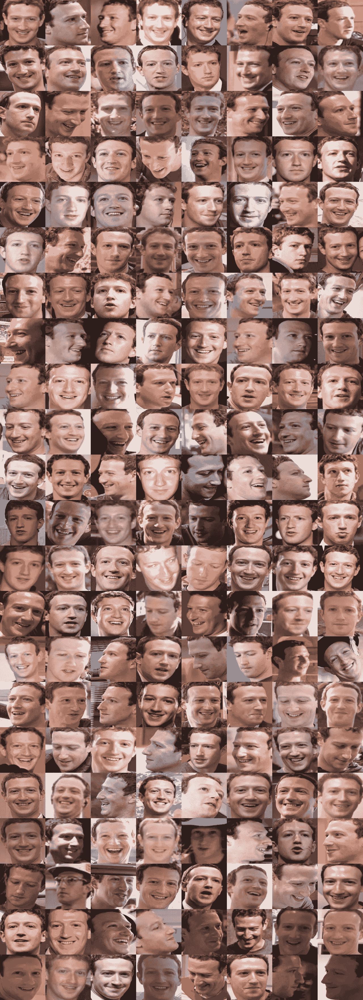

# 马克·扎克伯格的多面性:深度学习方法(上)

> 原文：<https://medium.com/hackernoon/the-many-faces-of-mark-zuckerberg-a-deep-learning-approach-part-1-72fc1a7fad61>

*(* [*这里有一个链接*](https://drive.google.com/file/d/1v71ELOcn5KumrM1pq0MX7r5iNf8WrYQK/view?usp=sharing) *到我用的数据！内容详情在文末。)*

今天早上，我浏览了马克·扎克伯格在脸书的照片，裁剪了 176 张过去 14 年中各种标志的头像。然后我使用 FaceNet 的 TensorFlow 实现[为每一个人生成一个](https://github.com/davidsandberg/facenet)[特征向量](https://en.wikipedia.org/wiki/Feature_(computer_vision)#Feature_vectors_and_feature_spaces)(一种由 512 个数字组成的“面部指纹”)。

我计算了所有这些特征向量的中点，试图找到马克·扎克伯格理想中的脸。然后我把我收集的所有[张脸](https://hackernoon.com/tagged/faces)按照它们偏离标准的程度分类，并把它们拼接成这张图片:

These faces are sorted in ascending order of “deviation” from left-to-right and top-to-bottom

很难判断底部的脸是因为在不寻常的光线下或用坏相机拍摄的，还是因为马克的头转向了(所有这些我都想用算法来校正)，或者是因为它捕捉到了更有趣的特征，如他晒得有多黑，他是否有正常的面部表情，他多大了，或者他在照片拍摄前几个月是否去过健身房。

我使用 [MTCNN](https://github.com/ipazc/mtcnn) 来裁剪和旋转他的脸，但是根据两个距离最远的脸是马克正在转头的脸这一事实来判断，我可能会在生成特征向量之前进行更复杂的“脸对齐”(例如，通过[一种构建 3D 模型的算法来运行脸](http://www.arxiv-sanity.com/search?q=3D+face+alignment)，并“转动”脸直到它面向前方)。

我想尝试的另一件事是对特征向量进行[降维](https://en.wikipedia.org/wiki/Dimensionality_reduction)，然后查看他的哪些脸在不同维度上是离群值。我能通过目测判断这些尺寸代表什么吗？

我可以选择的其他方向:

*   聚类标记
*   在大数据集中计算人脸的特征向量(就像从 IMBD 收集了成千上万张人脸的数据集一样),看看哪些人看起来最像马克
*   用一个 [GAN](https://en.wikipedia.org/wiki/Generative_adversarial_network) 生成新的扎克伯格，或者改造现有的脸，让它们看起来更像他

[这里有一个 zip 文件](https://drive.google.com/file/d/1v71ELOcn5KumrM1pq0MX7r5iNf8WrYQK/view?usp=sharing)，包含一个 pickled Python 对象，它将图像文件名和所有图像一起映射到特征向量。如果你发现了什么酷的东西，请告诉我！