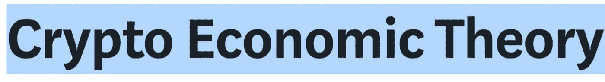
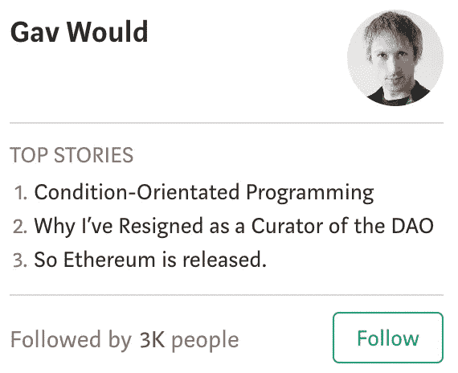
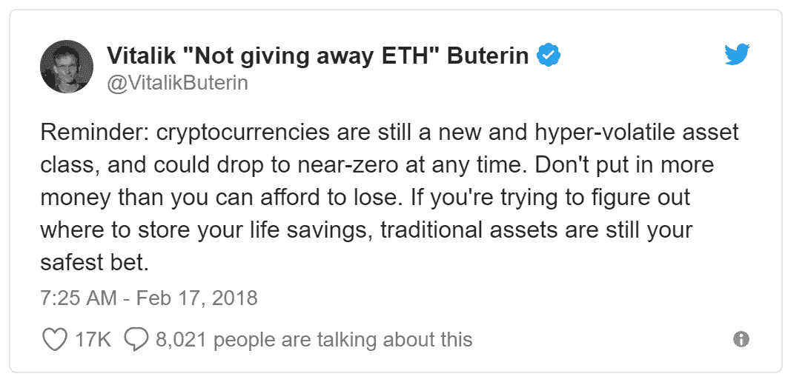
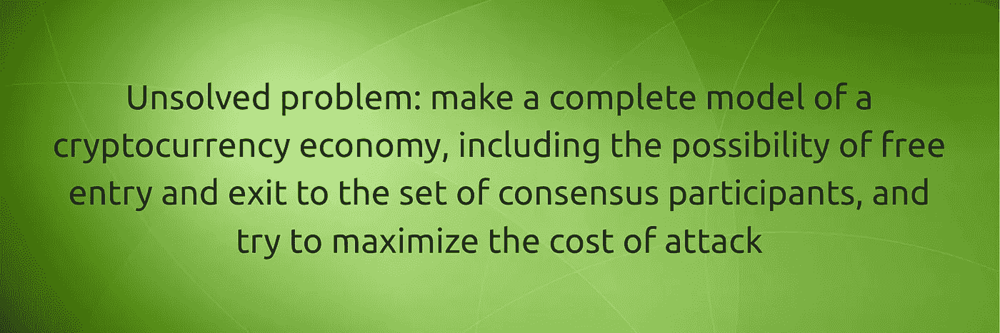

# (物质)秘密经济

> 原文：<https://medium.com/hackernoon/the-material-crypto-economy-1-of-2-ce48c9275756>

## 数字资产很酷，但真正的行动是在 crypto 的材料集成。对于稳健的密码学，从头开始。

(*这是关于* **(物质)秘密经济**的两部分系列的第一部分。*第二部分即将推出。*)

“密码经济学”这个词通常让人联想到比特币或其他加密金融市场，以及许多加密开发者声称加密工具代表了全新的经济组织模式。

> 密码经济学的常见分析起点是博弈论、统计学和/或其他形式逻辑，以及理性人为何投资纯“数字资产”如比特币、密码猫集合、个人数字身份、声誉等的证明。

但众所周知，除了对越来越高的估值的假设约束或基于信仰的信念，还有更多的东西需要隐藏。

## 普通人在接触 crypto 时想知道的是它在物质意义上是如何工作的。我能做什么——物质上的，具体的，有形的——来获得密码？我如何获得 crypto 的材料所有权？我将把它安全地保存在哪里——在一个非常真实的物质意义上。

这些不是天真的问题。它们触及了 crypto 全部潜力的核心，以及 crypto 迄今为止最大的扩展错误。

# 1.论文

## (A)无论是个人还是机构投资者，新来者都不想费力地通过数学、代码或密码俚语来了解日常材料中密码的前景。

## (B)人们想知道每个人获得密码的最简单方法——而不仅仅是少数特权阶层。

## (C)crypto 全球采用的速度和最终成功取决于 crypto 阐明(A)和(B)的能力。

## 这篇文章回答了这些核心的效用问题，并挑战加密思想领袖也这样做。这些是当今最重要的密码问题。

# 2.背景

建立繁荣的(例如，可持续盈利的)秘密经济的唯一方法是理解正常人对经济过程的一些基本期望。绘制预期的唯一方法是理解人类如何评价不同的经济投入和产出。

人类每天都会进行数百次复杂的物质资产评估，通常是下意识的。作为一个估价计算器，人脑可以实时地给各种各样的物质对象赋值，并且可以执行极其复杂的价值权衡功能。我们不需要复杂的*经济人*理论来认识到人们会做出那些会给他们带来最大总体收益的选择(由做出给定经济选择的人主观定义)。

人类给密码经济学带来了同样的期望。

> 最终，只有在有实际意义的情况下，人类才会采用加密技术。

加密图像如此重要是有原因的——显示微笑的比特币玩家之间传递黄金比特币。它被称为 Bit- **coin** 是有原因的，而不是 Bit- **note** 。加密最佳实践包括将加密资产存储在物理保险库中、可移动的纳米分类帐中，或者至少以纸质材料的形式存储，这是有原因的。

这就是人类思维的方式。crypto 将从利用人类对物质性的基本需求中获利，而不是试图绕过它。

> 我们对物质性的渴求并不是系统中的缺陷，而是人类经济系统的一个特征。

今天的密码有很多不同的方法来整合现有的物质经济，但没有一个明显的主导方法。

> 经过十年的发展，认为 crypto 仍然在物质世界中“找到自己的路”的想法是不可接受的。

Crypto 缺乏素材整合是一个**大问题**。Crypto 需要尽快解决这个问题。

# 3.今天的秘密经济理论

大多数密码业内人士对密码市场的介绍都一头扎进了极其抽象的交易池(“货币市场”、“身份市场”、“甲骨文市场”、“数据市场”、“内部密码治理机制设计”等)。).

> 但是对离散市场或有限组织逻辑的分析并没有抓住“秘密经济”的复杂性。对基于交易所的“市场”(比特币基地、币安等)的研究也是如此。)或各种正在进行的加密企业集成。

为了有用，一个秘密经济理论必须超越估价和预测。

好的加密经济理论揭示了新的价值和效用命题，甚至连加密开发者都无法看到。

# 4.一个好的密码经济理论的要素

秘密经济理论必须解释:

> **(一)人们为什么采用密码**；
> 
> (b)**crypto 相对于现有技术和流程的竞争优势是什么**;
> 
> (c)哪些**具体的效用和价值主张**(供应)可以刺激最大数量的人对给定加密工具的最大需求。

以太坊联合创始人加文·伍德(又名[加文·威尔](https://medium.com/u/d37e9e93aefc?source=post_page-----ce48c9275756--------------------------------))于 2015 年 12 月在 Medium 上发表的文章是“加密经济理论”的最佳介绍之一。它叫做:

> "[于是以太坊发布了](/@gavofyork/so-ethereum-is-released-4291da46b770)"

这是一篇由顶尖密码理论家撰写的精彩文章。因此，它可以作为好的**和坏的***密码/密码法律理论的例证。*

以下是方法。

# 5.以太坊作为样本密码学

伍德指出了他所谓的“秘密法律生态系统”的三个关键“支柱”它们包括:

*   **身份** (1)
*   **资产** (n)
*   **数据** (inf)

仅仅从这三个支柱，Wood 就生成了一个丰富的加密经济地图，这在以太坊平台上是可能的。这一愿景的规模令人惊叹。这比我们从那以后遇到的任何东西都更大胆，除了 IOTA 材料。

> 伍德的文章的关键观点是，不同的区块链架构最终允许我们跟踪、分析和更好地调整个人权利持有人(伍德称之为“身份”，可以包括个人、公司、非政府组织等)之间的无限潜在交易排列。)相对于物质和非物质资产。

鉴于它已有近 3 年的历史，按照加密标准来看，它已经是“老歌”了，但仍不失为一个好东西。

像所有真正的天才一样，*所以以太坊发布了*。不需要炫耀或天赋。这是一个保守的分析。作为一部 9 分钟的介绍秘密经济潜力的影片，以及一部创造性地介绍法律在秘密交易领域的地位的影片，它简直是无与伦比。

干得好，盖夫！

从一个受过良好教育的非加密人员的角度来看，Wood 的分析只有一个问题:**它非常抽象**。

# 6.抽象密码经济学=糟糕的经济学

我们注意到来自 CleanApp Foundation 的“抽象”批评看起来不真诚，因为我们的很多工作也经常被批评为抽象。但我们如此坦然地提出这种批评的原因是因为我们同意我们的批评者:

> 熟悉密码俚语不是我们读者(或观众或市场)的工作；恰恰相反，crypto 的成功依赖于它能够去除不必要的术语和抽象。

是时候直截了当地说出并提出具体的物质价值主张，让普通人通过赚取密码在餐桌上吃面包了。

# 7.抽象遮蔽了效用

你不能用"*新*概念[密码法](/cryptolawreview/cryptolaw-9410cf7a8fd4)"或"自由激进主义"或[新投票和社会契约理论](https://papers.ssrn.com/sol3/papers.cfm?abstract_id=3243656)(例如，见 Buterin、Hitzig、Weyl)。

> 你也不能(一直)用加密交易的投机“收益”买面包。光是交易费就会耗尽你的面包预算。

此外，当领先的密码理论家明确警告你将面包钱存入“传统资产”时，你就知道有事发生了。

将“秘密采矿”和“秘密收入” [**面包放到最大数量的桌子**](/cleanapp/cryptos-killer-app-is-litter-ally-under-our-feet-1-of-5-eb064a6ab215) 上的唯一方法是理解今天的**秘密(物质)经济**的局限性，以及明天的**秘密-物质-经济**的潜力。

# 8.密码共享的悲剧

许多加密开发团队正在努力为普通人解锁不同的方式来赚取加密——从传统的加密采矿池(转租你的计算能力)，到分散式云存储的等离子/Sia 模型(转租你的硬盘)，到新型能源市场([转租你的太阳能电池板、发电机和电池](http://gridplus.io/)，等等。

所有这些使加密的价值和效用民主化的努力都应该受到欢迎和支持。

但是，我们论点的核心前提— [**部署加密经济流程，让尽可能多的普通人轻松获得可轻松转换的加密【**](/cryptolawreview/what-is-blockchain-hyperutility-ade850f3034d)】—似乎从关于全球加密采用、加密扩展和加密支持的治理转型的主流话语中缺失了。

> 对经济发展和经济赋权的普遍承诺是存在的——在字里行间，在边缘——但具体的收益效用最大化理论、过程和实施似乎并不是核心的发展议程项目。
> 
> 为什么不呢？

也许当每个人都假设*其他人*正在开发一个加密面包机的时候，那么*没有人会被激励去开发一个加密面包机***——**加密公地的悲剧**。**

# **9.意识形态有责任吗？**

**布特林已经明确表示，crypto 必须完成“对社会有实际意义的事情”，否则他将退出；IOTA 基金会现在几乎是物质秘密效用命题的同义词，具有显著提高个人和社会福利的潜力。**

> **但是以太坊和 IOTA 都没有教普通人如何做对社会有益的工作，通过明确和客观地最大化个人和社会效用的过程来赚点外快。**

**“个人效用最大化”是否过于强制？“社会效用最大化”听起来是不是太规定性和专制了？**

**如果[隐蔽的意识形态壁垒](/cryptolawreview/codeislaw-maybe-3a6b90aab89a)阻碍了[的全球扩张，而这将使每个人都变得更好](/cryptolawreview/crypto-scaling-is-a-legal-problem-b2074367eedb)，那么可能是时候寻找新的意识形态停泊点了。**

> **意识形态不应该阻碍 crypto 稳步迈向全球统治地位。**

## **正是本着这种精神，我们要求每个人暂停他们对秘密市场如何运作(或者应该如何运作)的假设，进行一次思想实验，从零开始建立一个[物质秘密经济](/cryptolawreview/what-is-blockchain-hyperutility-ade850f3034d)。**

**我们并不孤单。这也是伍德、布特林、EOS、IOTA 和其他许多人正在做和呼吁的事情。Buterin 最近的路演演示中的一张幻灯片有助于说明这一点:**

****

**许多人把这个称呼解释为“一个完整的[正式的数学-算法-计量经济学-法律-等等]。]模型”的“加密货币经济”**

> **我们对这一呼吁的解释要宽泛得多。我们要求每个人也这样做。**

## **回报是更好地理解世界实际上是如何工作的，以及密码在其中的位置。**

****