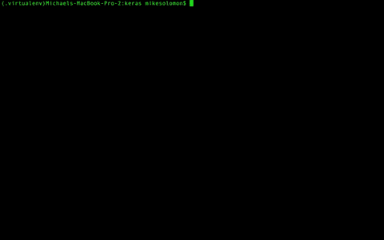

# Meeshkan Keras 后端覆盖了 100%的 Keras 公共 API:为什么这很重要

> 原文：<https://medium.com/hackernoon/the-meeshkan-keras-backend-covers-100-of-the-keras-public-api-why-this-matters-8207cb601f19>

## *TL；Meeshkan 现在覆盖了 100%的 Keras 公共 API！*

当 [Meeshkan](https://app.meeshkan.com) 从使用 DSL 转向使用 Keras 进行机器学习入口时，Meeshkan 核心只覆盖了 [Keras 公共 API](https://keras.io/) 的 25%。为了保持业务不间断运行，我们使用了一个小脚本来确定 Keras 模型是否可以部署在 Meeshkan 后端，如果不能，就使用 [Theano](http://deeplearning.net/software/theano/) 或 [Tensorflow](https://www.tensorflow.org/) 。

对于 Meeshkan 来说，这意味着约 75%的工作成本更高，处理速度可能更慢，因为这些工作无法利用我们的分布式基础架构。我们决定不将这些成本转嫁给客户，而是对所有机器学习工作保持一个较低的费率。不用说，自从 Meeshkan 公开测试版[发布以来，我们一直在不知疲倦地工作，以完成我们的定制后端，这样每个没有显式调用`K.some_proprietary_method`的 Keras 作业都可以在我们低成本、相当快的网络上运行。](https://hackernoon.com/meeshkan-machine-learning-a33a8cabb0d6)

我很兴奋地报告，我们终于达到了目标！我们将在接下来的几周内推出新版本的 Meeshkan，它将覆盖 100%的 Keras 公共 API。我们将从 A/B 测试开始，然后用于所有在我们网络上进行机器学习的客户。



Ugh…this is boring…now that Meeshkan covers 100% of the Keras Public API and all of the tests are passing, there is nothing left to fix. How am I gonna spend my Sundays from now on? With my family? Quick, I better write in a couple bugs!

我今天想写的是我们如何实现这一里程碑，我们学到了什么，以及为什么我认为这一步在我们公司的发展中特别重要。

# 达到 100%

编写 Keras 后端是一项非常艰巨的任务——除了将 Keras 中的所有东西粘在一起所需的 3000 多行 Python 代码之外，后端所依赖的底层库需要非常坚固，因为 Keras 不会测试您的库代码，只会报告您的计算结果与其他(假设正确的)后端的计算结果之间的数值不一致。此外，虽然 Keras 做了很多有用的事情，但最终还是由后端作者来实现 RNN、卷积、最大池和其他来自 ML 最热门的棘手张量操作。

在三个月的时间里，我们对 Meeshkan 内核进行了四次重写，对后端进行了三次重写，才得到一个可以投入生产的版本。一直以来，在 Amazon 上运行的 CI 服务器确保测试通过，并且代码覆盖在最关键的地方是不可避免的。

# 经验教训

对于未来的 Keras 后端作家，这里是我学到的一些经验教训(艰难的方式！)关于如何为 Keras 组装一个后端。由于不是所有这些信息都可以在 Keras 文档中找到，我希望它能节省人们的时间并提供有用的信息。

## 1.用这个要点来组织你的工作

在 Keras 代码库中，没有一个中心位置告诉您需要实现什么功能来使您的后端通过测试并覆盖 Keras 公共 API。他们提供的最接近的是在[https://keras.io/backend](https://keras.io/backend/)，它列出了某些只适用于一些后端的函数和一些不属于公共 API 的函数(意味着不在后端代码之外的 Keras 源代码中使用)。上面的字典将键映射到 Meeshkan 后端中的函数，但是您可以在各个 Keras 后端(即`grep “def normalize_batch_in_training”`)中抓取键并进行 grep，以查看它们是如何组合在一起的。我相信这个列表会随着时间的推移而改变，但这就是赫尔辛基时间 1 月 21 日周日下午 5:23 的情况。

## 2.肆无忌惮地逆向工程

对于 50%左右的 Keras 后端 API 表面，通过逆向工程 Tensorflow 后端并将您的版本与真实版本进行比较，您可以在不到一周的时间内编写一个迷你后端。通过做这个练习，您将了解 Keras 的内部是如何工作的，并在开始为您选择的库实现后端时有一个非常安全的基线。

## 3.`**_keras_shape, _keras_shape, _keras_shape**`

Keras 有一个或多或少没有记录的接口，叫做`_keras_shape`，基本上可以在任何地方、任何时间调用它来获得张量的形状。

```
$ git grep -c _keras_shape
backend/cntk_backend.py:7
backend/meeshkan_backend.py:1
backend/tensorflow_backend.py:8
backend/theano_backend.py:79
engine/topology.py:23
models.py:4
```

所以给每样东西都加上一个`_keras_shape`。我们用一个偷偷摸摸的装饰器把它固定在*上。*

## 4.使用其他 Keras 后端作为模板

Keras 有三个开源的全功能后端:CNTK、Tensorflow 和 Theano。在这三个后端之间，几乎总有一个可以让你在写作时获得灵感。特别是对于像`batch_dot`这样在其他 ML 项目中没有真正对等物的特殊 Keras 约定，从另一个后端的代码中搭建你的实现将会节省你很多时间。它还允许您在代码中创建逻辑断点，以便在不同后端的相同位置进行调试。

## 5.继续，给自己一个全连接的密集神经网络

编写一个 Keras 后端，你总是会陷入核心张量运算实现细节的细枝末节，而不会只见树木不见森林。当你感到沮丧时，永远不要忘记你是一个点积，一个 ReLU 和一个 L2 归一化，远离一个完全连接的神经网络。当然，也不要忽视低垂的果实！我将从实现一个返回后端名称的函数开始。

```
def __backend(self):
  return 'meeshkan'
```

但是一旦你做到了这一点，不要犹豫选择你最喜欢的后端功能，这样你的库就可以马上用 Keras 构建很酷的东西。这是疯狂的激励！

## 6.当有疑问时，WWND(numpy 会怎么做)

正常人的大脑不可能预见到实现 Keras 后端所需的每一个张量操作，必须通读代码才能知道发生了什么。在这样做的过程中，您总是会发现一些基本库中没有的操作，这些操作从原语组合起来效率很低，或者根本不可能用原语来组合。因此，您将被迫向核心库写入新的功能。在这样做的时候，我发现如果你的目标是与 **numpy** 的 API 对等，你就不会出错。只有几个函数，比如`np.gradient`，其中 numpy 实现对张量没有太大帮助。当然，有一整类函数(像`tf.nn`中的那些)不能被 numpy 化。但是你必须实现的将所有东西粘在一起的大部分零碎东西都可以被认为是愚蠢的。所以保持你的 API 调用类似于 numpy——当其他人阅读你的后端代码时，你会很感激你这样做了，不用仔细阅读你的库的文档就可以理解正在发生的事情。

# 自信地部署到米什坎

米什坎最近实现了许多很棒的里程碑——我们在三藩市与[的合作伙伴举行了一些很棒的会议，启动了](https://www.heroku.com) [Accelerace](https://www.accelerace.io/) 项目，并在我们的 [Udemy 课程](https://www.udemy.com/meeshkan-machine-learning-the-github-api/)上通过了 6000 名学生的分数。但是我这个极客认为这个 Keras 里程碑是最重要的。原因如下。

在我看来，Keras 是人工智能事实上的通用语。像英语一样，它是不完美的和特殊的，但像英语一样，许多爱好者被它所提供的东西所激励，他们聚集在它周围交流。Meeshkan 也不例外——我们着迷于 Keras 项目，并认为人工智能中的许多伟大想法可以使用其简洁的 API 轻松表达出来。

越来越多的公司和爱好者每天都在使用 Keras 制作他们的 AI 模型。随着人工智能变得越来越容易，人们希望做更多的工作，但受到自己机器的限制。为了让 Meeshkan 有一个令人信服的商业论点，它需要给人们一个超越他们 PC 的实质性优势，同时提供与其他 Keras 后端相同的高质量人工智能。

因为 Meeshkan 针对所有其他 Keras 后端进行了测试，并且通过了 100%的测试，所以您可以放心地部署到 Meeshkan 网络，因为您知道您的 AI 作业将产生与从 Tensorflow 和 Theano 等其他后端获得的结果相同的结果。与此同时，您还可以享受到速度惊人的 Meeshkan 后端带来的好处，这是市场上最划算的交易，并且只有在新后端完全部署后才会变得更好。

我希望你能在 Meeshkan 上开始构建一些[难以置信的 ML 项目！我们不能等到我们的新后端完全推出，在这一点上，我们将报告一些整洁的基准。我们希望赢得您的信任，因为我们努力提供业界最佳的质量、速度和价格组合。](https://app.meeshkan.com)

