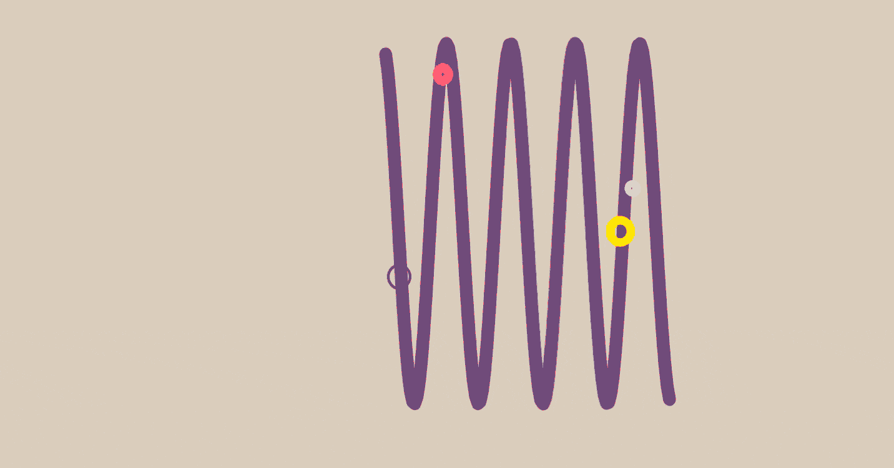

# 元编辑器

> 原文：<https://medium.com/hackernoon/the-meta-editor-2e9b24fccd9e>

还记得 Google Wave 吗？欢迎来到未来…

我最近得出的结论是，最近有几个真正有趣的想法，其他人没有谈论，但值得关注。要实现这一目标，需要采取许多小步骤和编写代码。但是随着[海](https://gun.eco/docs/Todo-Dapp)、[斧](http://axe.eco/)入门等的改进。我们很亲密。还有一些奇怪的事情，比如:

## 确定性 HTML

对于用户输入，我们需要端到端地净化和确定性地规范化 HTML。例如，这个是基于我的旧的[规格化](https://github.com/amark/normalize)库。它将允许我们将 MarkDown、Medium 或 custom 编辑器附加到 dApps 中，同时确保输入可以在 [GUN](https://github.com/amark/gun) 中同步，并在不同的浏览器/设备上显示，就像在您的浏览器上编辑/显示/预览一样。

有兴趣帮忙写这篇文章吗？请告诉我们！

## 元编辑器

首先构建一个元编辑器是很重要的——它可能看起来就像 Twitter 或脸书或 SMS 输入，但如果你开始输入更长时间，它会自动扩展成一个中等大小的文章/博客编辑器。如果你想让其他人帮忙的话，它也会开始表现得像一个 gDoc 协作编辑器。

一个很酷的作品，是由构建我们的 Docs 系统的家伙启发的，是我也想要**超链接/内联**文章，这是可能的，因为 GUN 的图形数据结构。对于我的科学大脑来说，我希望有一个小的独立的论点或对一个想法的解释，我把它放在自己的页面上。但之后我可能会写另一篇文章，并希望包含那个“想法”，这样我就可以**内嵌粘贴**进去。但是每当独立版本更新时，另一篇文章也会更新，因为它使用的是 GUN。

我们有许多协作的、互动的教育作品，如[卡通密码术](https://gun.eco/docs/Cartoon-Cryptography)、[分类故事](https://gun.eco/explainers/basketball/basketball.html)、[托多·达普](https://gun.eco/docs/Todo-Dapp)、[信任陌生人](http://gun.eco/docs/Trusting-Strangers)、[分发物品](https://gun.eco/distributed/matters.html)等。我想制作更多这样的作品，让它们更容易制作，更容易/可重复使用地链接和引用它们。

## 网络音频 API

但是，如果你的博客帖子或推文也是音频格式的，那不是很好吗？

*   比如说，一个道德论证，这样盲人也能理解？
*   或者，一个贪婪的论点，这样你的推文/博客也是独立的播客，驱动更多的订阅者/追随者？

这个元编辑器应该可以扩展来录制音频。这里有很多有趣的事情:

*   例如，我们需要帮助为 GUN 编写二进制转换器/适配器。
*   需要有 Web 音频 API 经验的人帮忙/教/编码。

除了能够在元编辑器中录制音频之外，对于播客来说，如果你正在写你的 tweet，它已经扩展为一篇长格式的类似文章，你正在与你的朋友 gDoc 共享…如果 auto 开始与任何人进行音频通话，他们会帮助你吗？现在你可以和世界另一端的人一起合作写文章了！

## 紧急混音

如果这些片段也有可访问的音频片段，那么也有可能“重新混合”播客，就像之前的文本一样，我建议你可以在文章中插入其他独立的想法/论点。这些也将实时更新，现在你可以在你的新文章中获得免费音频，内嵌旧的部分。如果能够突出显示一些文本，阅读它，并且系统自动知道它是带注释的，那该有多酷？

不要让我甚至开始对我的旧[或](https://vimeo.com/21452381) (2011！)关于元编辑器如何帮助绘制卡通/图像/图形或像谷歌幻灯片一样的想法。或者让你添加一个元编辑器到你的元编辑器(超级元！)您在“文章”或“帖子”中添加的内容可以让人们对您的“文章”或“帖子”进行回复/评论，就像您在博客中插入图片一样。现在你已经建立了自己的评论系统！

## 联觉仪器

我想用播客/音频/辅助工具做的另一件事是创作动态音乐。我有一个合成器的旧演示，当你写英语时，它会产生古典/原声钢琴声，所以你可以通过写 tweet 来播放一首歌(或者[试试别人的这个](https://patatap.com/))。

## 一个(胡)人乐队

或者更酷，这是我接下来想做的事情之一…以及为什么我要找一个网络音频 API 志愿者(觉得你能帮上忙？[跟我们谈谈](https://gitter.im/amark/gun)！)是将哼唱输入元编辑器播客系统，然后要求它将波形中的哼唱转换成音符，这样我就可以将不同的合成器应用到(管弦乐队、钢琴、吉他、鼓等)。)一旦波形被转换为音符，这些音符应该是可编辑的——也许我在哼唱中犯了一个错误，所以我可以删除它，或者更改音符。

## 像个专家

这有其他更简洁的想法:嗡嗡声转换为音符现在可以让你调整时间，你可以画一条线/弧/什么的来调整每秒的音符数，所以即使你的嗡嗡声不是四分之一秒一致，你的 synth 生成的音符版本是一致的，或者它可以根据你画的弧慢慢加速或减速。

现在，如果我们将这种哼声转换成可编辑音符的想法应用到播客录制中，会怎么样呢？如果您在选择文本时进行了录制，因此系统知道文本中可供盲人使用的音频部分……但是您搞砸了，会怎么样？你说了“嗯”什么的。难道系统不能检测波形中的波峰和波谷，就像它检测嗡嗡声一样，让你像删除一个音符一样回过头去删除“嗯”吗？不仅仅是剪辑音频，它可以“模糊”前后的过渡，因此被删除的单词听起来甚至不像是被剪辑过的，它播放起来很流畅，等等。

## 网络需要你！

但是，首先我们需要确定性地规范化 HTML，以保证协作编辑的结构在不同的设备/浏览器上呈现相同。

谁愿意帮忙写一个确定性的 HTML 杀毒器？:)

[让我们知道](https://gitter.im/amark/gun)！或者在推特上让[我](https://twitter.com/marknadal)知道！

也想看到这样的未来？然后请帮忙传个话，把这篇文章拍一堆，或者转发！

如果你觉得这篇文章有趣，你也会喜欢阅读关于社交网络的[未来](https://hackernoon.com/a-new-kind-of-social-network-emotional-intelligence-e45dcddb1bdb)！