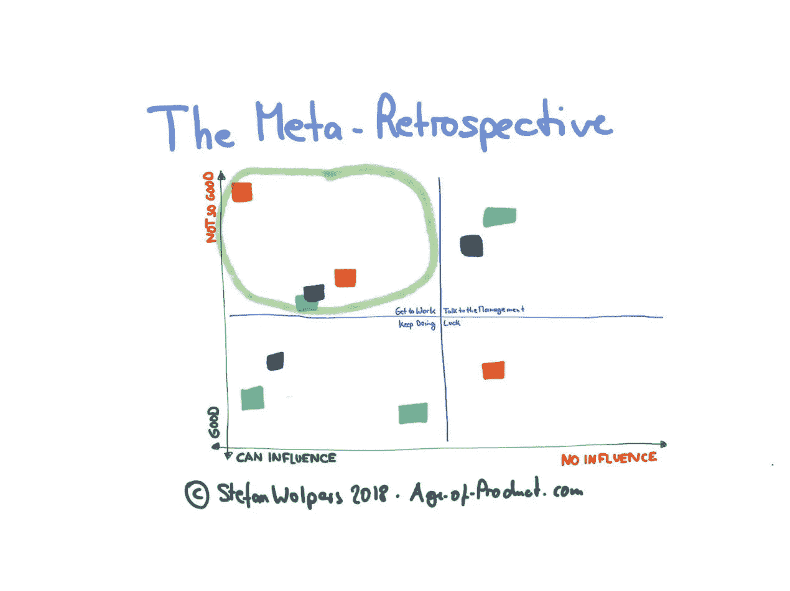
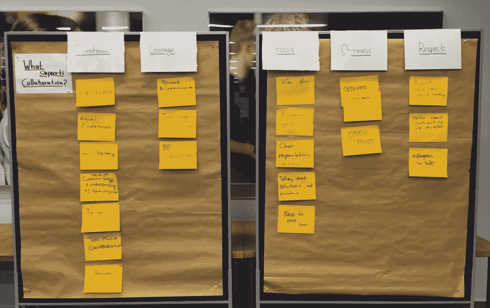
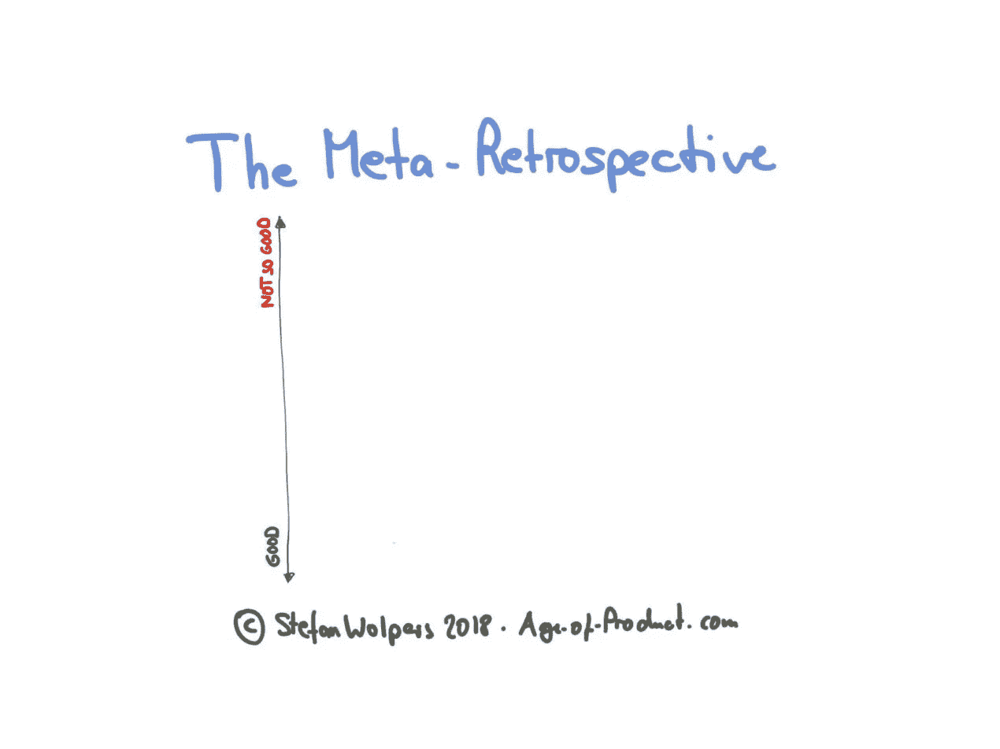
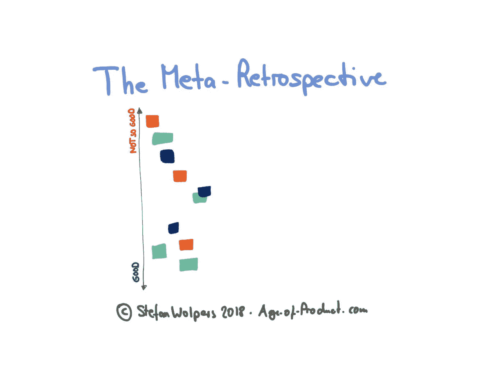
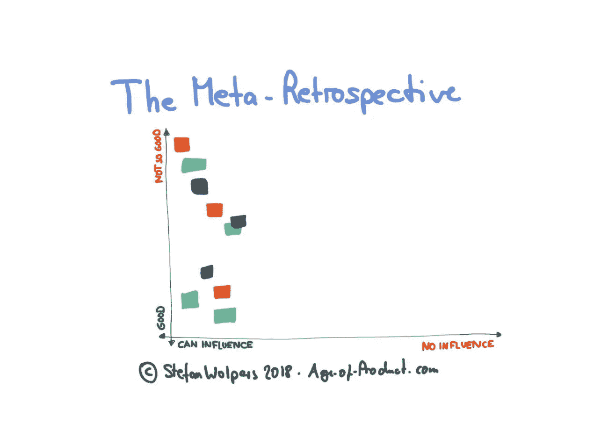
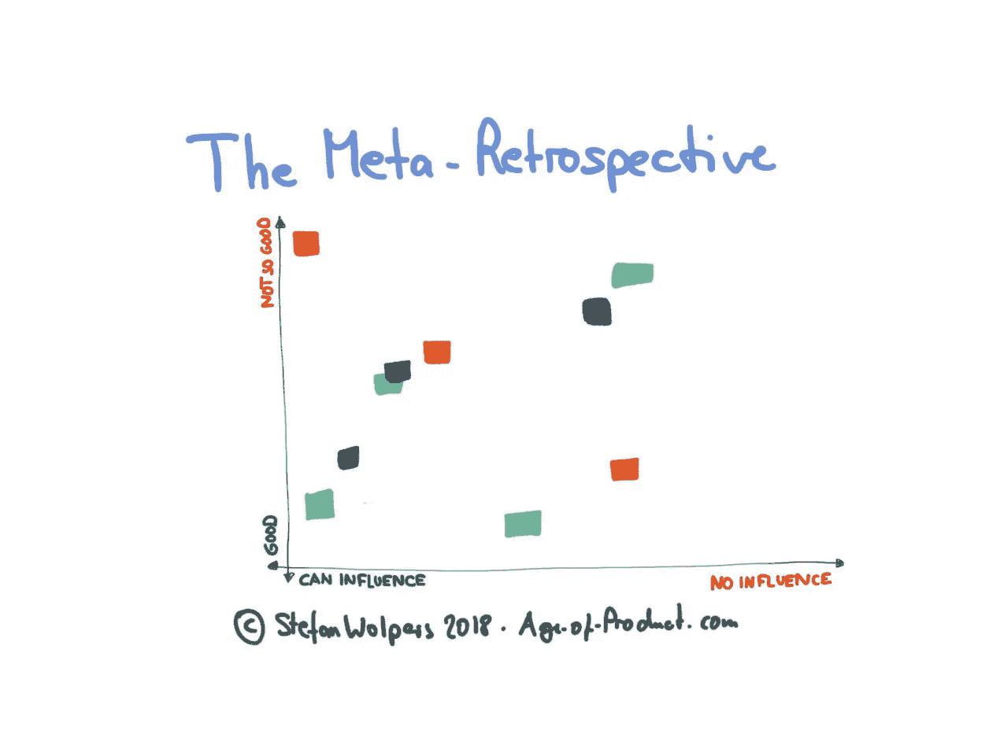
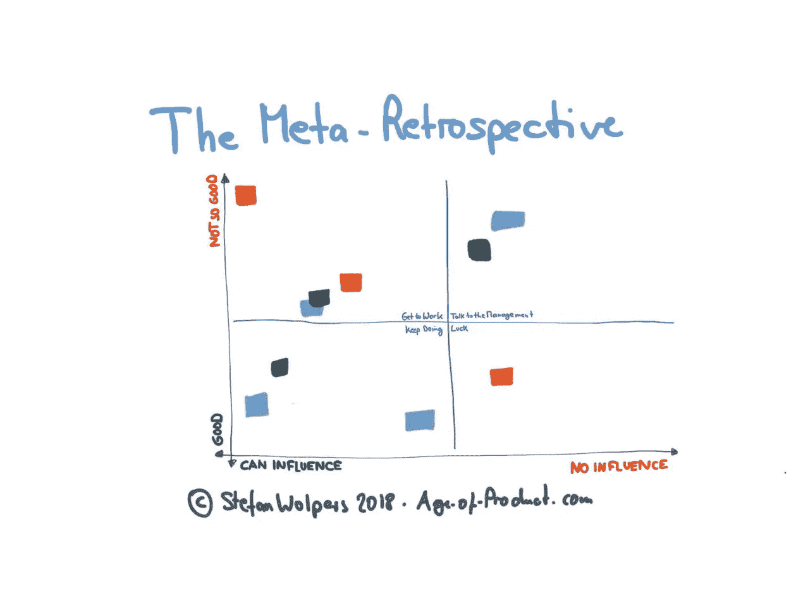

# 元回顾展

> 原文：<https://medium.com/hackernoon/the-meta-retrospective-9ae23868a40e>

## TL；DR:根据我的定义，元回顾包括一个或几个产品团队的成员——或者来自这些团队的代表——以及利益相关者。利益相关方的参与者是来自企业和客户的人。

根据我的经验，无论是作为一个常规事件，比如说一个季度一次，还是在达到一个特定的里程碑之后，例如，产品的一个特定发布，运行元回顾都是有用的。

阅读更多关于如何组织这样一个元回顾。

# 如何进行元回顾

我在这里描述的元回顾形式基于扎克·博纳克尔的韦德矩阵，在回顾开始时通过一个额外的实践进行了扩展。为了框定即将到来的对话的(必要的)开放程度，我做了一个简短的练习，将 Scrum 价值观带回与会者的心中。毕竟，我们组织元回顾也是为了解决房间里的大象。

元回顾本身不需要任何敏捷实践的知识，因此几乎适合每个人。如果房间足够大，这种形式可以轻松容纳 15 人以上。当有空间让人们聚在一起讨论时，效果最好。此外，我们需要在房间里至少有一块大白板，因为大部分工作将在这面墙上进行。

## Scrum 价值观练习

运行 Scrum 价值观练习很简单:

*   让参与者两人一组，在三分钟内选择支持团队协作的三个最重要的特征。(我通常会举一个没有帮助的例子，比如大喊大叫或指指点点。)
*   然后要求每一组向其他与会者介绍他们的选择，并放在白板上。如果相似的特征已经存在，我会将它们聚集起来。
*   一旦所有的标签都在白板上，主持人走上前解释什么是 [Scrum 价值观](https://scrumorg-website-prod.s3.amazonaws.com/drupal/2018-05/ScrumValues-Tabloid.pdf)以及为什么它们有助于指导团队完成任务。(如果 Kaizen 在您的组织中不仅仅是一个流行词，请确保您在房间中提到需要以文明的方式解决的潜在客户的话题。)
*   然后，主持人将写有 Scrum 价值观的五张贴纸——勇气、专注、承诺、尊重和开放——放在白板上，并要求与会者将他们的发现与 Scrum 价值观联系起来。

一旦这样做了，你就可以开始元回顾了。

## 敏捷过渡——来自战壕的手册

Download the ‘Agile Transition — A Hands-on Guide from the Trenches’ Ebook for Free

最新的 236 页的《敏捷过渡——来自战壕的实践手册》可以在这里免费获得！

## 元回顾练习

通过在白板上画第一个轴来开始元回顾，注意这个轴代表一个连续体。然后要求与会者再次配对，但选择一个与之前不同的搭档。

现在让他们回顾过去，选出三个最重要的学习内容。将创建阶段的时间框定为 3-5 分钟。准备好学习材料后，要求每一组向其他与会者介绍这些材料，并放在白板上。(同样，他们应该在适当的时候将胶粘物聚集在一起。)

在下一步中，引入第二个轴——它也是一个连续体。

然后要求参与者将白板上的所有便笺也与第二个轴对齐。一旦粘帖不再在白板上移动，您就可以停止此操作。

现在是时候将模式转换成 2×2 矩阵，并相应地标记四个象限:

*   **开始工作**:这是直接受影响的区域。
*   **与管理层对话**:这些问题阻碍了你；把它们上报给管理层。
*   运气:很顺利，但是不要在这里投入任何精力。
*   继续做:目前这里没有什么需要改变的。

下一步，关注左上方的象限——“开始工作”——忽略下面的两个象限。或许，还会有时间解决右上象限的问题。(“和管理层谈谈。”)首先，将便笺从左上角移动到白板的不同部分，并准备好进行点投票，以确定问题的等级。(为此，我通常会向每位与会者发放 3-5 点。投票可能需要五分钟。)一旦投票完成，通过基于排列好的问题进行[精益咖啡式的讨论](http://leancoffee.org/)来产生一些行动项目。

# 荟萃回顾—结论

运行元回顾是一个很好的练习，可以促进扩展团队内部的协作，创建对全局的共同理解，并立即创建有价值的行动项目。最棒的是:只需不到两个小时，避免“大木”和实践“改善”的想法就能为每个人所知。

## 如果你喜欢这篇文章，帮我一个忙👏👏 👏多次—您的支持对我来说意味着一切！

***如果你更喜欢邮件通知，请*** [***注册我的每周简讯***](https://age-of-product.com/subscribe/?ref=Food4ThoughtMedium) ***，加入 18862 位同行。***

# 📺加入 Youtube 上的 675 多名敏捷同行

现已在 Youtube 产品年龄频道上发布:

*   [敏捷成熟度和敏捷评估:敏捷是时尚还是趋势？](https://www.youtube.com/watch?v=XtESMQ2wcm8)
*   [敏捷失败模式 2.0](https://www.youtube.com/watch?v=-RXQLVhIuJg&t=6s)
*   [产品所有者反模式](https://www.youtube.com/watch?v=VnopIzbRJ8k&t=12s)

# ✋不要错过:加入 3850 多个强大的“动手敏捷”Slack 社区

我邀请你加入[“手把手的敏捷”Slack 社区](https://goo.gl/forms/LObbRtSF9vvxN3CL2)，享受来自世界各地的敏捷实践者的快速增长、充满活力的社区带来的好处。

如果你现在想加入，你现在所要做的就是通过这个谷歌表格提供你的证书，我会帮你注册。对了，**免费的。**

# 元回顾性相关文章

[免费下载《敏捷过渡——实战指南》](https://age-of-product.com/download-agile-transition-hands-guide-trenches/)

《元回顾——如何让客户和利益相关者参与进来》首先在 Age-of-Product.com 上发表。