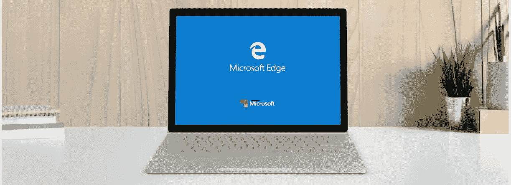

# 微软 Edge 浏览器逐渐进入了漏洞领域

> 原文：<https://medium.com/hackernoon/the-microsoft-edge-browser-edges-into-the-bug-territory-512775ba70f2>

**微软 Edge 浏览器挤入 Bug 领地**

一名在谷歌工作的安全研究员最近在微软 Edge 网络浏览器上发现了一个严重漏洞。该缺陷可能允许黑客在受害者不知情的情况下访问他们的敏感信息。

虽然安全漏洞已被修补，但它表明需要始终保持您的程序最新，并避免访问恶意网站。

**漏洞是如何被发现的**

杰克·阿奇博尔德是一名在谷歌工作的[开发者](http://blog.liveedu.tv/bug-developer/)，他偶然发现了这个漏洞，并将其命名为“Wavethrough”之所以这样命名，是因为浏览器的安全漏洞涉及到播放 wave 音频，攻击者可能会窃取敏感用户的数据。

阿奇博尔德在几个月前发现了这个漏洞，并在他的博客[这里](https://jakearchibald.com/2018/i-discovered-a-browser-bug/)发布了细节。在发现漏洞后，谷歌通知微软在 90 天内修复该问题。

并且，在等待期结束后，谷歌公开了这个问题，而微软也不愿意解决这个问题。

**bug 的恶劣影响**

Wavethrough 错误处理 web 浏览器如何处理对多媒体数据的跨来源请求。

当恶意网站雇佣服务人员从不同位置将多媒体数据加载到一个标签中时，该漏洞就会被利用。同时，该站点将利用“range”参数来获取该文件的特定部分。

由于浏览器在音频标签内的服务人员的帮助下处理从其他位置加载的文件的方式不规则，黑客可以轻松地在恶意网站上部署任何内容，并获取用户的敏感信息。

通常，浏览器有一个内置的保护措施，称为 CORS(跨源资源共享)，不允许网站从其他网站加载内容。

然而，在这一严重的安全缺陷中，在引诱受害者访问网站后，攻击者可以绕过这一安全措施，并迫使浏览器传输原本无法获得的数据。

这意味着用户可以使用编程不当的浏览器访问受损的网站，从而允许攻击者访问他们的信息，如电子邮件和脸书更新，而这一切都是在不知情的情况下进行的。

这里有一个阿奇博尔德制作的视频，展示了微软 Edge bug 的不良影响:

**修复直通漏洞**

好消息是，Wavethrough 浏览器漏洞不会影响所有浏览器。它主要是在微软 Edge 浏览器上被发现的。

Mozilla Firefox 也可能容易受到该漏洞的影响，但只有其测试版被发现易受攻击。然而，该公司的开发人员在该漏洞被引入 Firefox 主要稳定发布版本之前修复了这一问题。

其他主流浏览器如 Chrome 和 Safari 都没有受到 Wavethrough 漏洞的影响。

[微软，](https://portal.msrc.microsoft.com/en-us/security-guidance/advisory/CVE-2018-8235#ID0EN)将该漏洞代号为“CVE-2018–8235 安全漏洞”，列为“旁路漏洞”该公司已经发布了更新，以纠正这一缺陷，并为用户提供安全的浏览体验。

**收尾**

这不是第一次在主要的网络浏览器上发现重大的安全漏洞。因此，提高您的网络安全技能对于防止您的敏感数据被未经授权的访问至关重要。

例如， [Waqar Ahmed](https://www.liveedu.tv/waqarahmed/lpm5W-a-simple-introduction-to-cyber-security/) ，一个认证的道德黑客和认证渗透测试工程师，教人们简单的工具和技术来保护自己不成为黑客的受害者。

无论您使用哪种浏览器，您都可以向他学习并保护您的浏览体验！