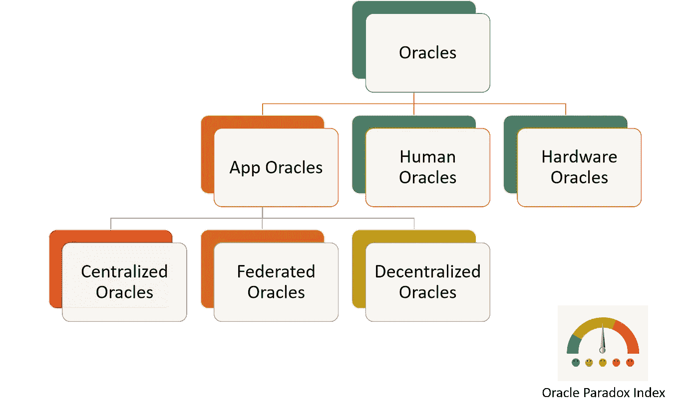

# 信任的中间人:甲骨文悖论和五个可以将外部数据带入区块链的协议

> 原文：<https://medium.com/hackernoon/the-middleman-of-trust-the-oracle-paradox-and-five-protocols-that-can-bring-external-data-into-the-df39b63e92ae>

许多人认为，实现与外部数据源的集成是主流采用区块链技术的最大挑战。在企业环境中，数据分散在成千上万个异构系统中，如果不提供无缝集成模型来访问这些数据源，任何区块链平台都没有成功的希望。矛盾的是，与区块链生态系统的其他方面相比，这个问题仍然相对被忽视。

在区块链体系结构中，我们将 Oracle 一词用于在不违反区块链完整性的情况下负责访问外部数据的实体。在古希腊，神谕是神圣的人，他们解释神的意志并将其传达给人们。古希腊最重要的神谕是皮媞亚，特尔斐阿波罗的女祭司。皮媞亚最著名的预言之一是吕底亚(今天的土耳其西南部)的国王克罗伊斯问神谕他是否应该对他的邻国开战。神谕回答说，如果他参战，一个伟大的王国将会覆灭。克罗伊斯认为这是他敌人的…结果是他自己的。提醒您正确解释来自神谕的信息与访问神谕本身一样重要😉。

在建立了神是外部数据源而凡人是智能契约的类比之后😉神谕的作用是在不侵犯区块链国家完整的情况下，沟通这两个世界。从以太坊的早期开始，Oracle 的概念就已经出现在许多区块链平台上，然而，这个问题在很大程度上仍然没有解决。挑战的一部分在于，大多数神谕引入了一种信任级别，这与区块链的不信任性质直接矛盾。这就是我所称的“甲骨文悖论”

# 甲骨文悖论

要理解甲骨文悖论，首先提供一个代表区块链生态系统中不同类型甲骨文的基本分类法可能会有所帮助。根据外部数据集成到区块链应用程序的不同渠道，我们可以为不同类型的 Oracles 提供一个基本的分类模型。

这些是 Oracle 模型，其中有人访问外部数据信号并将其输入到区块链中。

**App Oracle:**这些是基于软件应用程序的 Oracle 模型，包含区块链应用程序所需的数据。

**集中式 Oracle:**这些是依赖于来自集中式应用程序的信息的 Oracle 模型。

**联邦 Oracle:**这些是 Oracle 模型，其中外部信息由与主数据提供者相关的少量节点进行验证。

**分散式预言:**这些是预言模型，在这些模型中，从预言的选择到信息的验证都是使用分散式一致协议来实现的。

**硬件甲骨文:**这些甲骨文依靠可信执行环境(TEE)来隔离访问外部数据的代码到区块链。

我用一个色标来表示不同类型的神谕易受“神谕悖论”攻击的程度。通常，人和硬件 Oracle 是访问外部数据的相对安全的模型，而所有其他体系结构都有点容易受到“Oracle 悖论”的攻击。实质上,“Oracle 悖论”描述了外部数据的相关性和需要放在 Oracle 中的信任级别之间的冲突。像任何软件应用程序一样，Oracles 很容易受到不良行为的攻击，这些不良行为在区块链会具体化为游戏化的攻击。最简单的形式是，集中式 Oracle 可以决定提供不准确的数据，这些数据会影响区块链节点的行为，使它们容易受到攻击。通常，Oracle 模型越分散，越不容易受到“Oracle 悖论”的影响。

为了应对“甲骨文悖论”的挑战，一些平台已经建立了财务、声誉和治理协议，以减轻对坏甲骨文的脆弱性。最近，我们看到了新一代的 Oracle 协议，它们扩展了以太坊 Oracle 的基本概念，以实现非常复杂的外部数据访问模型。

# 您应该了解的五个 Oracle 协议

正如我在文章开始时提到的，Oracles 仍然是一个大规模的未解决的问题，并且正在成为主流采用区块链应用程序的一个障碍。然而，有几个协议在这个领域积极创新，帮助并提出了创造性的想法，以支持在区块链应用程序中访问外部数据。以下是我认为我们应该关注的一些 Oracle 协议:

[Oraclize](http://www.oraclize.it/) :最近我把 [Oraclize](http://www.oraclize.it/) [称为你没听说过的最重要的区块链协议](https://cryptocurrencyhub.io/technology-fridays-oraclize-is-the-most-important-blockchain-technology-you-never-heard-of-1c6f77228a29)。该平台提供了一种协议，可以将不同类型的数据源(如 IPFS 或 URL)与以太坊、R3 Corda 或 BlockApps 等区块链集成在一起。Oraclize 使用一种称为真实性证明的机制来充当某种不可信的中介。

ChainLink :称 ChainLink 为 Oracle 协议可能有点轻描淡写。该平台充当一个分散的 Oracle 网络，其中任何参与者都可以提供一个数据馈送来交换链接令牌。ChainLink 平台包括认证、验证和信誉服务，这些服务加强了 Oracles 的完整性。

augr:augr 通常被称为分散式预测市场，它实施了区块链生态系统中最复杂的 Oracle 协议之一。Augur 允许区块链网络的参与者报告与特定预测相关的外部事件。该平台使用验证争议协议和信誉令牌(REP)来维护不同 Oracles 的行为记录。

[实体](https://aeternity.com/):实体是一个平台，可以实现与外部数据源交互的智能契约。该平台依靠国家渠道实现区块链和外部数据源的集成。实体也包括一个声誉系统，作为不同神谕的货币。

[Rlay](https://rlay.com/):Rlay 是该领域相对较新的参与者，它提供了一个平台，能够基于链外数据源制定和验证报表。Rlay 包括一个一致性证明的确定性共识协议，用于验证来自 Oracles 的语句。

这些是区块链生态系统中我最喜欢的 Oracle 协议。显然，许多主要的区块链平台都实现了自己的 Oracle 协议，但是在撰写本文时，它们都没有被主流采用。解决离线数据的访问仍然是下一代区块链技术最重要的挑战之一。