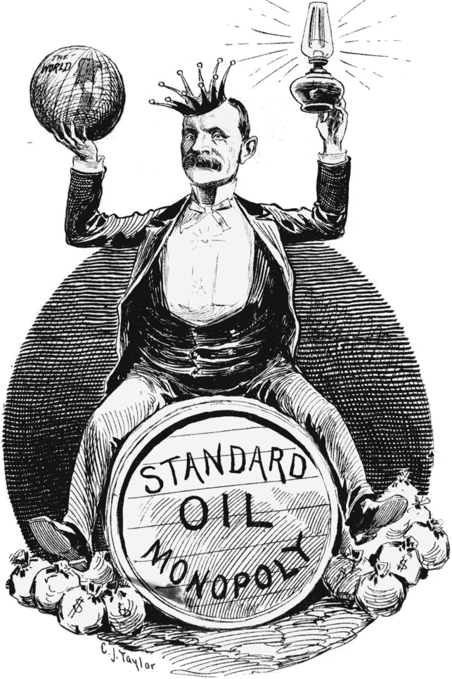

# 协议开发者的错位激励

> 原文：<https://medium.com/hackernoon/the-misaligned-incentives-of-protocol-developers-e422d6279ed2>

如今，以太坊和比特币等最受欢迎的协议正遭遇严重的瓶颈，其中最严重的是可扩展性。交易费用处于历史最高水平，比特币平均每笔交易约为 30 美元，以太坊平均每笔交易约为 3 美元(T2)。开发这种规模的协议是行业的一个严肃目标，最先确定的协议将最有可能在用户群方面获得重大优势。一旦发生这种情况，整合就会开始。企业将开始在他们的商业模式中实施[区块链](https://hackernoon.com/tagged/blockchain)，网络效应将开始发展。一旦这些成功的区块链开发了他们的护城河，将会有一个严重的激励问题，我们都必须考虑；为什么开发人员(或者更具体地说，具有治理 klout 的早期令牌持有者)会继续提高可伸缩性？

# **激励问题**

对加密货币进行估值的基本方法是使用法定货币的公式。这是 MV = PQ 等式，其中 PQ 是价格 x 数量，即维护网络的计算能力的总成本，M 是所有令牌的价值，V 是令牌的速度。

根据这个公式，我们应该考虑如何调整我们的开发人员的激励，或者换句话说，**开发人员如何增加他们网络的价值？**

1.  **增加交易吞吐量** —增加网络价值的最明显机制是增加网络的有用性，即让更多的人使用它。这是真正的竞争，区块链将在可扩展性、合作伙伴关系、UI/UX 等方面相互竞争。这将为他们赢得用户，从而获得更高的估值。这里不存在激励问题，因为网络的开发者和用户的激励相当精确地一致。
2.  **降低速度**——这里有一篇关于这个[的很棒的文章](https://www.coindesk.com/blockchain-token-velocity-problem/)，我将试着给出一个大概的概述，如果你愿意的话，你可以更深入地挖掘这个链接。最终，对于效用令牌，大部分价值来自令牌的速度。如果没有理由持有代币，这可能会导致速度飙升，价值完全下降。作者使用了音乐会门票支付代币的例子，其中消费者使用代币购买门票，但是由于一般的价格波动而拒绝持有代币。在这种情况下，开发者被激励去开发方案，使得持有代币更有利可图。这些包括像摩纳哥那样的购买和焚烧机制，允许在代币上赚取利率的赌注机制，以及像 Factom 使用的平衡焚烧和造币操作。最终这种类型的激励并不*必然*与用户激励不一致。每种不同的速度降低机制都有自己的优点和缺点，但总的来说，它们大多只是为用户创造了另一种激励类型，而不是作为一个整体伤害他们。
3.  **保持网络成本稳定** —这是用户和开发者之间不一致激励的主要来源。**这将仅适用于平台代币**，即以太坊、neo、waves 等。其中令牌的成本与运行网络的价格联系在一起。然而，它可以应用于开发商在某种意义上也是“矿工”的市场。有人认为这对于比特币来说是正确的，许多核心开发人员也在为 blockstream 工作，该公司计划使用网络交易费来激励交易所使用其网络(更多信息可在这里找到)。这意味着，一旦一个连锁店在自身周围建立了显著的转换成本，它就会受到激励，留出扩大规模的机会，以支持更多的用户增长活动。可伸缩性实际上减少了 P 的大小，这反过来降低了它们的令牌的价格。显然，在我们今天所处的阶段，区块链是非常不可扩展的，因此，通过增加可扩展性来实现用户收益的权衡是值得的，但可能有一天这不是真的。我们已经在某种程度上看到了比特币，但不幸的是，他们尚未解决可扩展性问题，因此事实上这可能会导致他们的垮台。

Many people liken Ethereum to the oil of the new web. Like Standard Oil, Ethereum has the same monetary incentives to keep gas prices high and cut them temporarily to price out competitors

# **竞争性回应**

[有人提出了这样的想法](https://s3.eu-west-2.amazonaws.com/john-pfeffer/An+Investor%27s+Take+on+Cryptoassets+v6.pdf):在这样的场景中，分叉区块链并最终消除这些网络可能因不提高可扩展性而招致的垄断租金的交换成本可能非常低，以至于用户可以有效地分叉协议并创建一个使用最新可扩展协议的协议。我同意这比传统业务更有可能，因为这些协议是开源的，但我认为在接受这一点之前，我们必须考虑一些转换成本:

1.  **采矿盈利能力** —采矿盈利能力作为转换成本的概念非常重要，因为矿工是区块链的保障。分叉协议必须有效地向其用户传达，除了更具可扩展性之外，将有另一个协议在所有方面都是平等的，然后以某种方式说服矿工接受较低的采矿奖励来换取可用性。这只有在矿工们相信这个链将完全取代原来的链时才有意义，因为他们可以在人们熟悉新链之前早早进入并吃掉一堆区块奖励。人们很容易也很常见地看到略微成功的分叉，但我认为这是市场早期状态的产物，而且这些货币中的许多几乎没有形成护城河，因为它们太年轻了。
2.  **可伸缩性改进** —在区块链没有改进其可伸缩性的情况下，一些新来者可以分叉链并改进协议的想法也不能得到保证。**你不能照搬他们的代码，你必须比他们做得更好。**这个新协议将需要一个重要的开发团队，并且已经精通区块链，以便理解和改进当前的协议。即便如此，现任者仍将拥有优势，因为他可能拥有更多资金、专业知识，以及与交易所和银行等现有机构的整合。与卡内基钢铁公司和标准石油公司暂时降低费率以排除竞争的能力类似，大型连锁企业可能具有最显著的规模优势，它们可以在必要时打开或关闭。在这种情况下，最有可能的“分叉”实际上是企业转向其他类似的连锁店，如 NEO，而不是创建自己的以太坊版本。这实际上意味着可伸缩性将成为主要连锁店之间的竞争，这些连锁店可能只会将可伸缩性提高到对企业来说经济上可行的程度。任何进一步的改进都会降低他们的代币价值。这可能会在美国引发围绕寡头垄断的不同诉讼，许多连锁店是否会走利润最大化的道路也是值得怀疑的(例如，Vitalik Buterin 似乎对《区块链议定书》的未来非常理想化，他自己认为可扩展性是广泛采用的头号瓶颈)，但无论如何，查看某些行为的直接金钱回报是一种有用的做法。

# 结论

能够推迟网络协议可扩展性的改进会带来巨大的金钱回报，就像标准石油公司这样的垄断企业可以从中获利一样。当今世界的不同之处在于，从理论上讲，区块链比网络效应更容易分叉，比如标准石油公司(Standard Oil)，该公司不得不投入大量资金来维护其网络，并保持专有制造能力。然而，这些在区块链世界并非不存在，我们应该密切关注比特币现金等衍生工具如何发展，以便我们能够感受到区块链领域的竞争将会有多成功。