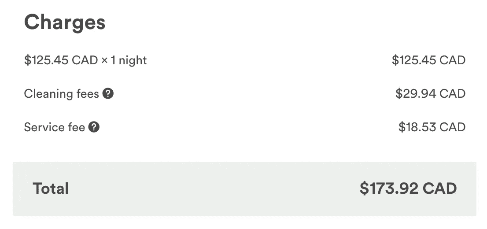

# 缺失的区块链用户指南

> 原文：<https://medium.com/hackernoon/the-missing-blockchain-user-guide-1b5f53ab69e0>

## 考虑一下:最近在领先的区块链上存储 3 x 1 MB 的图片要花费 78，887.25 美元。比特币匿名创始人中本聪的关键经验是，如何设计一个激励体系，激励各种参与者以互利的方式工作。虽然区块链是这种博弈论驱动的系统的一个组成部分，但它不具有普遍适用性，只需要用作状态转移机器或需要完全透明的地方。这篇文章深入揭露了区块链的“魔力”，并将其作为时间序列数据库的扩展，作为管理信任的一种方式。

# 介绍

我是普罗米修斯。我是匿名的，所以我说的话一定很神奇？:)

嗯，当然不是。我只是在华尔街后台交易数据仓库工作过的成千上万人中的一员——在那里，“时间”和“审计”的概念已经根深蒂固。每笔交易都有一个历史记录，使用双时态数据建模的概念，可以看到与该交易的每一次更新相关的完整审计跟踪。区块链的概念将这一概念扩展到使用加密技术的公众，这开辟了新的使用案例，如比特币；以及一个全新的区块链以太坊，以支持更多的用例。

它允许像我这样的业余爱好者深入研究一个基于 ERC-20 的代币的交易历史，并发布以下分析:

 [## 隐玉米:鲸鱼和 YouTube 的影响者如何将 Kin 从 5000 万美元的市值提高到 10 亿美元…

### Kik 是最具开拓性的创业公司之一，几乎从未被加拿大主流媒体报道过。那是…

medium.com](/@startuphackers/the-curious-case-of-kins-50-million-to-1-billion-market-cap-rise-over-two-weeks-ccdf25179f8f) 

但这也是我在时间序列数据库领域做了十多年的事情。如果你可以访问这两个系统，那么它们之间没有任何区别。两者都是为了呈现准确的历史记录，追溯历史；不同之处在于集中化，时间序列数据库由混合的手动流程维护，而区块链由自动驾驶的博弈论驱动的激励机制维护。

出于这个原因,“区块链”概念**一定是从那个世界诞生的**,由一个了解时间序列数据库的人提出，他对 2008 年的崩盘感到沮丧，考虑到这个行业的性质，他不想暴露自己的身份。一名前学者，绝对是一名博士，曾是一名定量分析师，可能在 2008 年金融危机中被解雇。没有“我们”——聪必须是一个单身人士，出身于金融界。

但他或她忘记告诉人们不要使用区块链 ***而不是*** 数据库，这是 ***而不是瑞士军刀*** ，事实上有一个非常具体的用例来保持信任。这就是丢失的用户指南。不要用区块链，除非有意义；当你以前从未使用过数据库时，请不要谈论“把东西放在区块链上”。

# 第 1 章:区块链概述

区块链通常被视为分布式、去中心化的公共账本，由“链接”在一起的交易“块”(或批)组成(使用哈希，一个指向另一个)。它通过在网络上的每个节点上复制每个**验证的**事务来发挥作用。没有中央权威机构——即使一些节点出现故障，也不会中断或使数据不可用。

随着网络的增长和事务数量的增加，每个节点上维护区块链状态的开销也会显著增加。

在比特币中，运行特定软件的节点可以通过解决密码难题来验证任何新创建的个人交易，然后竞争将它们添加到区块链中，从而为它们所做的“工作”赢得奖励令牌(在这种情况下是比特币)。解决这个密码难题(越来越难)所需的资源是以消耗的电力/资源来衡量的，这也是比特币的稀缺性和价值的基础。

还有其他的区块链工作在其他的原则上——但是一个分散的、自我驱动的、基于奖励令牌的系统的核心思想使用加密技术支撑着所有这些原则。

# 第二章:从用户角度看“区块链上的 Airbnb”风险投资的样本成本

*These are based on median gas price of 30 gwei; and ETH/USD all time high price of when 1 ETH = 1402.44 USD, modelled using Danny Ryan’s spreadsheet (post and link below)*

最近在以太坊区块链上存储 3 张图片(每张 1MB)将花费**78，887.25 美元。作为一个状态转移机器，它真的很出色，这是它在财务上唯一可行的用例。对于所有其他涉及数据存储或计算的目的，这些任务最好留给常规的集中式数据库/服务器来完成。**

## 使用区块链驱动的应用程序“发推特”只需 0.02 美元？

Source: [https://blocksplain.com/2018/04/17/peepeth-decentralized-twitter/](https://blocksplain.com/2018/04/17/peepeth-decentralized-twitter/)

例如，考虑一下这个——区块链上的一个版本的推特(Twitter ),人们必须支付交易费用来发布信息:每条“推特”大约 0.02 美元。

这种现在对人们在其他地方免费获得的东西收费的产品是如何突破最初的密码社区的？

## 除非必要，否则不要使用以太坊进行计算或存储

以太坊区块链对于**消费者/最终用户**来说，纯粹作为数据存储或计算引擎在财务上是不可行的。考虑这些使用区块链的常规存储和计算场景，以及 Airbnb 提供该数据条目的目的(提示，其价格为 0 美元)。将这些成本与 AWS 进行比较。

以下是这种服务需要支持的核心功能:

*   创建个人资料
*   列出一个房间(有图片和描述)
*   把观众带到那个帖子/“创造市场”
*   设置可用性
*   闲谈
*   方便付款
*   系统可以留下评论并查看其他人留下的评论
*   分享和参考的激励

## 上传 3 张你的酒店图片(每张 1MB):78，887.25 美元

*在 Airbnb 上，这对房东来说是零成本。但是以太坊的成本如此之高，只有在蒙娜丽莎创作的前一天，这是她睡觉的房间才有意义。*

## 写一篇简短的，50 字的主持人评论:50 美元

*对于 Airbnb 上的主人或客人来说，这是零成本。如果写评论要花钱，为什么还会有人写评论？没有审查，系统如何工作？*

## 填写(保存)你的简历(100 字):100 美元

对于 Airbnb 上的主人或客人来说，这是零成本。如果要花钱的话，为什么要填写这个呢——在这种情况下，你又该如何建立对这个系统的信任呢？

## 计算预订成本(每晚价格 X 住宿天数):0.0002 美元

对于 Airbnb 上的主人或客人来说，这是零成本。请在客户端执行此操作。以太坊区块链不应用于/滥用此类用例。

## 提交预订请求:仅“创建”一个预订请求就要花费 1.35 美元

对于 Airbnb 上的主人或客人来说，这是零成本。但是嘿，如果你在区块链上做这个，记得在下面的表格里加上一个“区块链费用”:

## 每次发送交易(主机接受或拒绝):0.88 美元

对于 Airbnb 上的主人或客人来说，这是零成本。有人拒绝了你的请求，嘿，在区块链世界里，你还得为此支付将近 1 澳元。

相比之下，Airbnb 的上述成本对主人和客人都是 0 美元。有些人可能会认为用户数据的散列可以存储在区块链上，而不是数据元素本身——但这有什么意义呢？这样做的成本仍将高于 Airbnb 对此类数据录入的收费:0 美元。

从用户的角度来看，只要数据的读/写是即时的、有备份的并且始终可用，那么数据存储在哪里/如何存储又有什么关系呢？用户**信任 Airbnb 的品牌**来管理这件事。对于用户来说，完全控制/独立于他/她的数据集*稍微好一点*，但是对于服务所需的价值来说*并不重要*。

在另一个世界里，大部分数据都托管在区块链上，这意味着用户体验异常缓慢。用户还必须**信任底层区块链的品牌(比如以太坊)**。更不用说实际构建一个漂亮的产品体验以及推动分销的核心启动活动仍然需要完成——在任何情况下这都是第一步。和 Airbnb 的竞争不是在价格上，而是整体体验。

# 第 3 章:DApp it —将用户数据存储在其他用户的计算机上的信任困境

Filecoin architecture

如前一节所示，在这些用例中使用以太坊区块链进行计算或存储是没有意义的。

区块链创业公司得到这个。最终，不管他们的服务叫什么，他们如何安全地加密它，并管理对它的访问，他们的替代方案要求将这些数据存储在其他用户的计算机上。

**如果你向你奶奶解释，你会这么说。**

> Airbnb 将用户数据存储在其管理和控制的数据库中。如果你的数据有问题，那是它的责任。
> 
> “区块链上的 Airbnb”——它把你的数据储存在其他用户的电脑上。它高效而安全，但这就是分权的含义。它并不便宜，但这是一个选择的问题。

你奶奶 Alice 觉得你的照片、评论、简历以及你写的或上传的所有东西都储存在 Bob 的电脑里可以吗？是的，它在一把锁和一把钥匙后面，Bob 不能读它——但原则上，对你的祖母来说，而不是对你内心的密码爱好者来说，这听起来是个好主意吗？奶奶脑子里的问题是:

> 我该相信鲍勃还是相信 Airbnb？

这是我们这个时代的关键信任问题，用户将用他们的钱包来投票。

他们是信任集中的品牌和访问，还是接受分散的存储？不管怎样，我都不在乎。数据存储在“哪里”并不重要，重要的是用户获得了什么价值。

归根结底，如果服务质量不像 Airbnb 已经提供的那样便宜、快速和高效，任何“区块链上的 Airbnb”创业公司都是行不通的。服务必须提升 10 倍才能让用户进行转换。因此，看着这些区块链初创公司融资数千万，然后意识到他们仍然必须做出用户想要的整体产品+价值主张，这将是很有趣的。绝大多数用户并不关心数据存储在“哪里”,事实上，如果你告诉他们数据存储在 Bob 的电脑上，而不是存储在公司自己的电脑上，他们就不会信任你。

# 第四章:区块链作为一个转移状态(如货币)的系统，确实工作得非常好

以 350 美元的总预订成本为例，客人和主人最终总共向 Airbnb 支付了约 63 美元的费用(让我们假设最多向客人收取 15%的费用，这是 T2 的做法)。3%给主机。

如果交易仅在 ETH 中完成，其中主机和客户都有一个 ETH 钱包，那么交易成本大约为客户**0.88 美元**(基于上述假设在以太坊上发送 1 笔交易的成本)。为了更快地完成，需要支付更多的交易成本。

如果客人用美元购买 ETH 并放入钱包；然后 ETH 转到主机的 ETH 钱包，然后主机把 ETH 兑换成美元——本来会有额外的交易成本混入其中。

但这显示了以太坊区块链的真正用途所在— **作为状态维护者**，在本例中，它恰好是客人帐户的状态，也是主人帐户的状态。对于这个用例，使用区块链要好得多。

作为一个微妙的提醒，用户并不关心底层技术，他们关心的是他们从中获得了什么，他们对服务的总体体验是什么。

## 混合实际上意味着 99%的离线+ 1%的在线，仅用于状态管理

 [## 集中式和分散式混合应用的未来

### 上周早些时候，有报道称，即时通讯应用 Telegram 正在为一项大胆的…

www.theinformation.com](https://www.theinformation.com/the-future-of-hybrid-centralized-decentralized-apps?shared=5b152f291c7c6ec1) 

区块链的 Airbnb*实际上是以下几个方面的结合:*

*   *99%的集中服务，保存个人资料、评论、图片等，以节省成本和提高效率。 ***可能是*** ，这是过渡到分散存储架构的部分，如果为了速度和成本而保持奇偶校验的话。*
*   *1%用于客人和主人之间的价值转移，这是在以太坊区块链上完成的，这提供了巨大的成本节约，以及所发生的价值转移的不变性和可验证性。*

*因此，对于一家纯粹分散的区块链驱动的初创公司来说，颠覆 Airbnb 这样一家成熟的集中式初创公司实际上是不可行的。它将不得不在产品用户界面/UX、网络效应、保险/担保和其他因素上展开竞争。整体产品体验才是最重要的，在其他条件相同的情况下，Airbnb 比纯粹的“区块链版 Airbnb”要便宜得多。*

# *第五章:奖励代币，例如，如果灵媒有一枚“硬币”会怎样*

*奖励代币可以用来构建产品的经济结构——为参与者创造适当的激励，让他们参与某些对他们和系统都有利的行为。想想飞行里程，但是通过区块链启用的令牌连接。在以太坊世界中，这些是基于 ERC 20 的代币。这基本上是一组具有非常基本的功能(检查余额、转账等)的函数，变量名被定义为令牌的名称、总供应量和用于显示的小数。*

*这篇文章很好地介绍了 ERC 20 代币:*

* [## 了解 ERC-20 令牌合同

### 查看以太坊代币并解释 ERC-20 的特征和功能，以提供对代币的理解…

medium.com](/@jgm.orinoco/understanding-erc-20-token-contracts-a809a7310aa5) 

> 通过跨一系列领域的精心设计、博弈论驱动的系统来驱动特定的用户行为

区块链的一个核心用例是奖励令牌，它决定了如何定义你的产品的经济性。在比特币的例子中，利用加密技术为矿工创造了足够的激励。然而，基于奖励令牌的系统不必使用密码驱动的奖励；也可能是完全不同的东西。例如，Medium 可以引入一个*，它将具有双重功能，既可以发出好帖子的信号，也可以自动奖励作者。它可能还需要一定数量的令牌才能对帖子发表评论——再次建立一个自我驱动的激励系统。不需要人工的，人类的节制。与人工智能驱动的调节代理配对，其他人由于内置的激励调节内容，突然你在互联网上有了一个安全的空间与他人交流并进行良好的讨论。*

## *最大化数据库，最小化区块链使用率*

*使用区块链的最佳方式是仅将它用于**最小绝对需求**，与完成大量繁重工作的关系数据库混合使用。将事务写入到链中需要花费时间和金钱，这比简单的数据库写入要昂贵得多。一个智能区块链策略包括尽可能多地利用数据库，并且只在绝对需要的时候才把事务交给区块链。*

*在这个例子中，不需要介质来存储区块链上的帖子、评论等。即使立即在区块链上存储每个鼓掌也没有意义，因为考虑到区块链的基本设计，这将是非常低效的:相反，可以将数据库中收集的单个 ***月末合计鼓掌硬币*** 写入区块链。** 

# **第 6 章:真相就在那里——带来完全的透明度和问责制**

**很难想象未来民主国家的政府不会在从维护土地注册到其他功能的一系列政府服务中广泛采用区块链。**

**或者投票怎么样？每一张选票不都应该与一个合格的投票人联系在一起吗？这个投票人的身份是未知的，但在系统中是有效的。**

**也很难想象区块链在未来不被非营利部门使用。比方说，如果你捐赠的每一个“捐赠硬币”都可以被你捐赠的慈善机构追踪到在哪里以及如何分配的。如果有太多的信息流向了管理者，那么不需要内部的告密者就能知道这些秘密。**

**虽然使用区块链会带来巨大的开销，而且必须有人为此付费，但是在信任和责任有更高需求的情况下，这是合理的。**

**然而，在私营部门，值得一问的问题是，如果数据可以存储在集中管理的数据库中，并通过 API 公开，为什么区块链及其相关开销更好？让我们揭穿区块链的魔法吧..**

# **第 7 章:区块链是金融数据世界中现有的、广泛使用的概念的延伸**

**交易数据仓库基本上是类似于“集中式区块链”的模型。除了关于在多个分布式对等体上存储数据的部分之外，所有的概念都是从*双时态建模*扩展而来的，这在关系数据库中已经做了很长时间。这是报告数据仓库系统的基础，尤其是对于金融界，并且是众所周知的最佳实践。这些是此类系统的主要特征:**

## **1.不可变的记录和时间戳一起被分块，提供了一个“截至”那个时间的状态视图**

***“这些数据在过去的任何时间点都是什么状态？”***

**每笔交易输入数据库的时间都被记录下来，同时记录的还有处理所有此类交易的唯一批次标识号。这允许人们查询该时间点的系统状态。由于过程而不可变，因为* **没有人** *应该改变关于交易的基本信息单元。存储事务的散列，这是用来比较和跟踪变化的。**

**事务，**被一起阻塞**(每次数据加载过程运行时由唯一的块 id 保存)，它们的**时间戳被记录**并且是**不可变的**(由于已建立的过程)。假设这些块 id 是连续的——如果需要，您可以从事务块回溯。**

## **2.用完整的新行更正历史记录，而不是覆盖以前的字段**

***“目前最准确的数据表述是什么？”***

**这种系统的第二个特征是其他交易数据可以在稍后的时间点被纠正，这对于财务报告系统是有用的。**

**这种校正不是通过直接更新特定记录的字段来完成的，而是通过插入全新的事务记录来完成的，该事务记录具有更新的值以及所有先前未改变的字段，并且记录了新的时间戳以及新的唯一块标识号。先前不正确的记录不可用于进一步的查询；并且在每个时间点，只有一个真实、正确的数据表示。**

**然而，使用上面的#1，您仍然可以及时追溯更新的历史。**

## **一个例子——发现交易的核心真相**

****

**What bitemporal modelling looks like in standard relational databases**

**在上面的例子中，我们可以问系统:**

*   **截至美国东部时间 2016 年 1 月 10 日晚上 9:00(这里是“10”)，这一特定交易的状态是什么，是谁进入的？**
*   **截至美国东部时间 2016 年 1 月 10 日晚上 10:00(这里是“11”)，这一特定交易的状态是什么，是谁进入的，是谁更新的？**
*   **它目前的状态是什么(在哪里是“12”)？**

**在每个这样的记录中，还有在数据加载过程中它与哪些其他事务分组的历史(这是唯一的、系统生成的块 ID，例如，单个数据加载过程可能加载 100 个这样的事务)，唯一的事务 ID 是什么，记录被插入的确切时间，由谁插入，等等。这些构成了每笔交易的“核心真相”。**

**这些系统早于区块链，在金融界广泛使用。然而，这样的时间序列数据库具有显著的效率开销，这使得它们的用例非常有限。对于区块链来说，它不仅在精神上是“时间序列”，而且是大规模分布和复制的，这大大增加了开销。**

> **可以存储在集中式关系数据库中的一切都可以存储在区块链中，其额外的好处是将它们与历史上可验证的代币相链接，然后这些代币可以在交易所交易并用作产品内奖励代币。**

# **第 8 章:在基于系统设计的区块链中，手工过程被简单地自动化了**

## **1.从集中式数据库->分散式区块链**

**由 Satoshi 推广的区块链概念完全抛弃了上面的第二个概念，因为它对报告系统更有用。它还提供了一项核心发明，即如何通过一组分布式节点记录/验证这些交易，并内置一个**激励机制**让它们工作。这种激励机制的 ***如何*** 涉及到使用密码学和某些规则来奖励人们去建立和运行这样一个网络。**

**在集中式数据库中，记录历史通过进程是*不可变的。例如，这种未经授权的更新将导致该人被解雇，起诉或两者兼而有之！在区块链中，记录历史是被设计成不可改变的*——即使是故意的记录也不能被改变。跟踪历史存在于双时态模型关系数据库设计中，以及块 id 的概念等等。****

## *2.从存储过程->智能合同*

*在 Oracle 这样的关系数据库中，可以用*存储过程*编写代码，并在满足一定条件时自动运行。这可以适当地查询和更新记录。存储过程是关系数据库中枯燥的工作，通常充满了复杂的代码。*

*以太坊区块链所启用的“智能合约”复制了这一功能。它们很容易被称为存储过程，但不会那么令人兴奋。他们是“聪明”，他们是“契约”！所有的代码都是。当你运行它的时候，它不会出去喝咖啡。我们不要崇拜它——它也不适合所有的用例。*

*常规数据库存储过程不需要“付费”就能运行(除了为服务器成本付费的人)，但区块链上的智能合约需要，因为它们利用了节点的资源。*

## *3.来自应用内货币->基于区块链的令牌*

*很多应用程序和组织都有自己的奖励计划。与区块链理工大学的主要区别是，现在奖励点被称为令牌，是智能合约和区块链 的底层功能所需的 ***。****

*例如，如果你收集了 100 个航空里程，然后你必须支付 5 个航空里程才能在网站上预订，或者如果你想在奶奶生日那天给她寄 80 个航空里程——现在你可以用区块链的代币做到这一点。如果出于某种原因，你还需要一个与你使用这些航空里程相关的公开的审计线索，那么这是一个完美的解决方案。*

*如果投机者参与了这种航空里程的买卖，如果你持有的航空里程随着时间的推移而增值，那会怎么样呢？然后，这就变成了你的另一种资产类别，**另一种赚取财富的方式**，从某个完全锁定在自己数据库中默默无闻的东西，现在你有能力交易它。*

# *第九章:为什么不使用区块链？*

## *1.区块链的效率低得令人难以置信:速度慢，每秒钟的处理能力低得可笑*

*用户开始期望关系数据库级别的读/写速度。因为潜在的技术而要求他们等待是绝对不行的。除非区块链能够提供同样水平的性能，否则它们为最终消费者提供的真实使用案例将仍然是理论性的；被夸大的幻象只是用来向不知情的投资者出售代币。*

*考虑到**以太坊每秒只支持 15 个交易**！来自下面的 scaling 文章:“它依赖于一个由‘节点’组成的网络，每个节点都存储着整个以太坊的交易历史以及账户余额、合约和存储的当前‘状态’”。它的设计是低效的。*

*为什么你希望你的面向消费者的产品建立在这样一个网络上？你为什么会选择它而不是 AWS 或 Google Cloud 等云平台上的关系数据库呢？你还会在 BitTorrent 上下载电影和歌曲吗，还是更喜欢网飞或 iCloud 提供的更快的服务？*

> *有必要问一个问题:从用户的角度来看，为什么在这种情况下使用区块链有意义？当他们使用你的产品时，他们的生活变得更好还是更糟？*

 *[## 以太坊将如何扩展？— CoinDesk

### 像其他公共区块链一样，以太坊打算支持尽可能多的用户。问题是，今天，我们不…

www.coindesk.com](https://www.coindesk.com/information/will-ethereum-scale/)* 

*尽管**集中式数据库昂贵且难以维护**；对于企业来说，逻辑迁移路径是向云迁移。他们需要速度、持续的正常运行时间、支持，并一直在构建系统，以根据内部流程提供关于每笔交易的准确事实陈述，而不需要区块链。*

## *2.某些用例的隐私:没有人想让所有人都看到他们的全部余额和交易历史*

*当普通用户发现他们的全部交易历史和钱包里的钱都可以被任何人公开搜索时，他们会有什么反应？即使它与他们的名字无关，但归根结底，还有人想要他们的银行账号，并在网上公布余额和交易历史吗？*

*由于私钥的知识是阻止资金转移的唯一因素——不良行为者可以远程利用/威胁来获得访问权并转移您的资金；不像银行那样至少会为你抗争，因为它的声誉取决于此。*

*这也意味着企业充其量会选择一个私人区块链。最终会有一个“区块链的甲骨文”——一个足够大的公司，完全致力于提供私有区块链的优化部署，包括支持和咨询服务。这也可能有助于公司间的联系。*

## *区块链即服务:失去剧情？*

*由领先的云提供商提供的此类部署将有助于在提供优势的同时缓解一些棘手问题。但是再一次在一个集中的网络上运行一个分散的网络，你不得不问:这有什么意义，它在哪里增加价值？为什么不仅仅在这种情况下打开具有适当访问权限的关系数据库呢？*

# *结论*

*我们正处于一个“密码驱动”的商业模式被颠覆的时代。然而，区块链对它来说是一条无路可走的路。*

*我们不需要知道 Satoshi 是谁——我们所知道的是，随着比特币的部署而开创的核心理念非常有意义，这个理念就是你如何为你的产品设计一个完善的、自我驱动的激励系统？*

*这是设计智能区块链驱动的生态系统的最佳时机，它利用奖励令牌，带来更大的透明度和更智能的系统。人类和人工智能将融入这个更智能系统的世界。不过区块链是锤子，不是瑞士军刀，请慎用:)*

# *感谢您的阅读*

# *附录:以太坊使用成本的来源*

* [## 以太坊合同中的成本计算

### 天然气价格 PSA(2017–08–23):撰写本文时的天然气价格中位数为 28 Gwei，并将继续保持…

hackernoon.com](https://hackernoon.com/ether-purchase-power-df40a38c5a2f) 

## Danny 共享的电子表格

[https://docs . Google . com/spreadsheets/d/1 kew kkn 0 by hot 1 p 6 lm 6 bdqawlin-2 jqmgpwswu 3 KP w9 c/edit # GID = 0](https://docs.google.com/spreadsheets/d/1KeWKkn0BYhOt1p6lM6BDQAWLin-2JQmGpwswU3kPw9c/edit#gid=0)

[https://docs . Google . com/spreadsheets/d/1n 6 mrqkbz 3 iwcolrem _ mo 09 gtskekrasfo 7 frgx 18 pnu/edit # GID = 0](https://docs.google.com/spreadsheets/d/1n6mRqkBz3iWcOlRem_mO09GtSKEKrAsfO7Frgx18pNU/edit#gid=0)

## 故障

*   两个整数相加:3 个气体单位
*   两个整数相乘:5 气体单位
*   基础交易:21，000 个天然气单位
*   如果您正在与一个将两个整数相乘的合同进行交互:21，000 天然气+ 5 = 21，005 天然气单位
*   1 Gwei = 0.000000001 ETH
*   以 gwei/gas 表示的天然气价格；当前中位数为 30 千兆瓦；有些人支付更少，有些人支付更多以获得更快的交易处理
*   每次交易支付的总费用=天然气价格*使用的天然气单位*