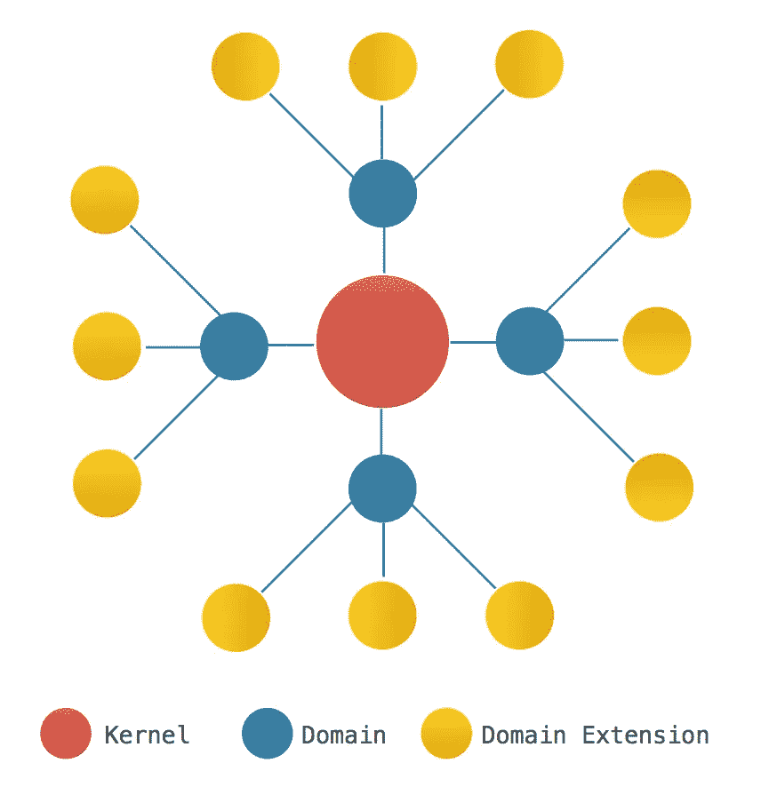
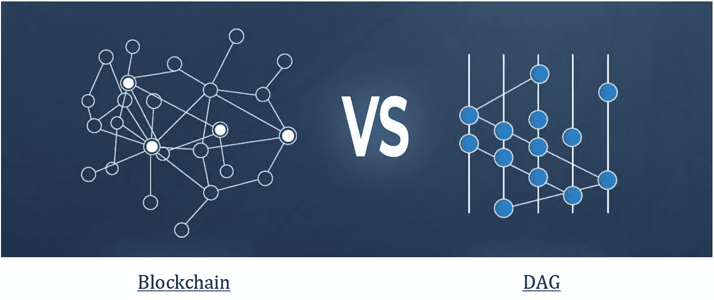
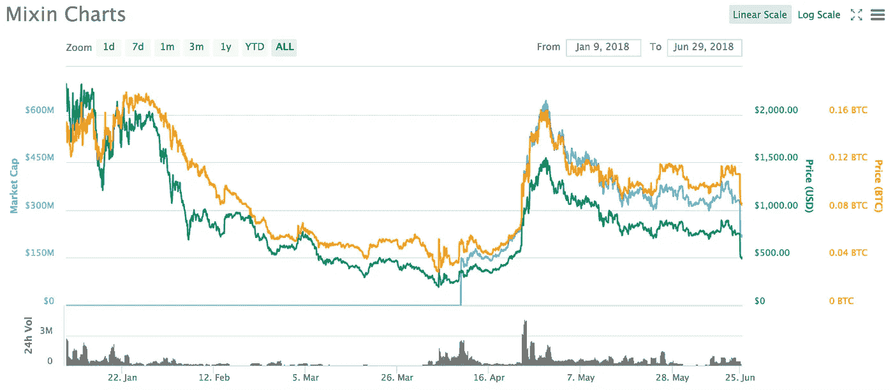
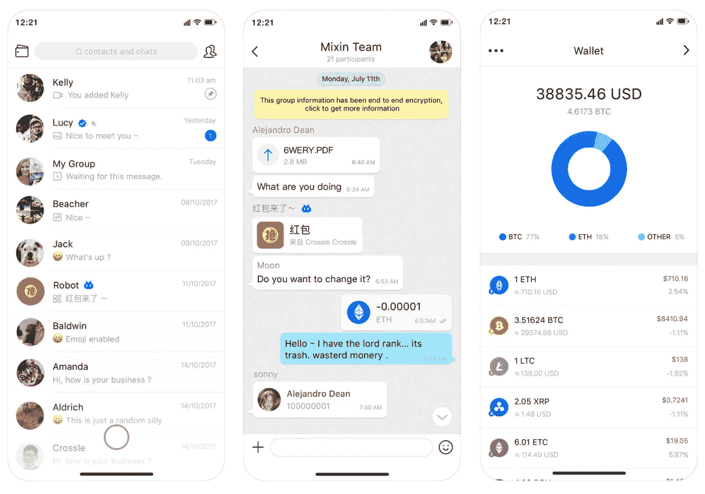

# Mixin 网络评论

> 原文：<https://medium.com/hackernoon/the-mixin-network-review-ce56d591af>

由于区块链可扩展性的挑战继续阻碍加密货币提升为主流采用，一场全行业的军备竞赛已经启动，以产生一种能够实现更快交易速度而又不损害安全性或分散性的分布式账本。尽管像 Lightening Network、Raiden 和 Plasma 这样的解决方案目前处于领先地位，但它们仍然没有被证明是实现真正可扩展性的决定性解决方案。

为了应对这种情况， [Mixin Network](https://mixin.one/) 向市场推出了一个多层平台，旨在提高跨多个分布式分类账的数字资产之间的交易速度、隐私性和安全性。

Mixin 提供了一个信使应用程序——“Mixin Messenger”，用户可以在钱包中存储加密货币，并在联系人之间进行快速的点对点交易。开发者也可以在 Mixin Networks 基础设施上构建新的 Dapps。

大胆宣称每秒超过 10 亿次交易，0%交易费，以及用于跨链 Dapp 开发的基础设施；Mixin 将自己定位为区块链可伸缩性问题的主要解决方案。

**工作原理**

Mixin 网络由不同的高性能分布式分类帐组成，核心分类帐称为“内核”，支持分类帐称为“域”和“域扩展”。

域是将比特币、以太坊、其他区块链甚至中央银行的资产输入内核的网关。内核负责验证和管理资产及其事务。

域扩展是存储以太坊、EOS 和其他区块链智能合约和可信应用程序的分布式分类帐。

**米欣内核**

内核是 Mixin 网络的核心组件。它使用有向无环图设计来扩展数字资产交易。

有向无环图(或 DAG)是由以非线性模式相互连接的节点组成的结构。借助 DAG，信息通过“八卦协议”同时在多个节点间传播，从而更快地达成交易共识。

**共识协议**

Mixin 内核分布式分类帐使用一个利益一致协议的证明。内核节点以至少 10，000 XIN 作为抵押，换取在内核分布式账本上验证交易的能力。

每个 Mixin 内核节点代表 10000 个 xin，大约是网络股份的 2%。内核只能在至少 7 个节点加入的情况下运行，这大约是整个网络的 15%的股份。

**隐私**

出于隐私考虑，Mixin 内核使用一次性密钥生成算法，该算法允许系统生成一个“ghost address ”,该地址可以在用户每次交易后被丢弃。

**Mixin 域**

Mixin 域通过系统调用与内核通信。

为了使外部资产(例如来自比特币区块链)与 Mixin 内核相关联，首先产生 Mixin 公钥以与域连接，然后产生资产特定公钥(即比特币公钥)以将资产连接到 Mixin 内核。如果有人想从他们的比特币钱包中向 Mixin 网络发送资金，该域将创建一个到 Mixin 公钥的交易，Mixin 内核将验证该交易。

**Mixin 域名扩展**

Mixin 域扩展使用户能够从单个计算单元(即你的笔记本电脑或 iPhone)设置“智能合约”。这些智能合约比以太坊区块链交易所目前提供的合约性能更高、更稳健。

**昕令牌**

XIN 令牌是网络中使用的主要令牌。与比特币和以太坊一样，令牌通过验证交易支付给支持网络的人。XIN 令牌也在利益一致性协议的证明中被标记(至少 10，000 个 XIN 令牌必须被标记以作为完整节点加入网络)。

Mixin 网络还使用 API 调用连接到不同的 Dapps。这些 Dapp 基于 Dapp 消耗的资源量以 XIN 令牌向网络付费。

*总供应量:100 万*

*循环供应量:438154*

代币销售日期:2017 年 11 月 25 日至 12 月 25 日

市值:2.31 亿美元(排名第 45 位)

*当前价格:529 美元*

**Mixin Messenger**

Mixin 提供了一个名为“Mixin Messenger”的消息应用程序，允许用户利用他们建立的安全高效的分布式账本基础设施。

该应用可在谷歌或苹果商店获得，可用于向任何有电话号码的人转移加密货币，即使他们不是 Mixin 用户。该应用程序还具有一个数字钱包，能够在 Mixin 联系人之间执行快速的点对点交易。

Mixin Messenger 还提供了一系列由开发人员社区创建的机器人，为用户实现某些功能的自动化:

对于交易:

红包(红包袋):在群聊中赢取代币的游戏化 bot**。**

**助理(群聊管理员):群主可以邀请这个机器人加入他们的群聊，并决定所有成员的条件。比如说；该组成员的帐户上应该有 20 XIN。**

**Exin (OTC，Exchange): 用户购买加密货币 OTC(场外)，bot 提供几个交易对，例如:BTC/USDT，ETH/USDT，XIN/BTC 等。**

**硬币兑换:分为两部分:付费问题和硬币兑换。付费问题部分显示了几个有价值的问题，人们必须付费才能查看答案。交换部分是 Mixin 网络上的一个小而简单的加密交换。**

**新闻和信息:**

**Mixin Log:这是发布关于 Mixin 的开发日志或新闻等的官方渠道。**

**黑客新闻:黑客新闻是 Y-Combinator 旗下的新闻频道。自动发送有趣的新闻。**

**IMEOS(最新更新):该机器人连接了关于 EOS 的第一个媒体门户网站 IMEOS(T1)，它还报道全球区块链新闻、EOS 营销数据等。**

**Bot(毕世杰新闻新鲜更新):bot 链接了一家名为[毕世杰](http://www.bishijie.com/)的区块链著名媒体。它将新闻从官方网站发送到 Mixin。**

**游戏:**

**虚拟美国轮盘赌:决定什么样的令牌，你赌多少，你选择哪种颜色或号码。玩家将这些订单发送给机器人，向机器人付款，然后你马上就能收到结果。**

**人工智能/聊天机器人:**

**MX(虚拟朋友):一个叫萧冰的虚拟女孩，你可以像真人一样和她交流。**

****队****

**Mixin Network 团队由经验丰富的开发人员组成，他们在区块链和技术领域工作多年，开发了各种独特的多媒体应用。该团队共有 20 名成员，分布在中国和日本。**

**cedric Fung——首席执行官——亚洲顶级新兴交易所 BigONE 的区块链架构师，**Yixia.com**的联合创始人，中国视频生态系统领导者，产品包括喵派短视频应用程序、小卡秀 dubsmash 应用程序和易智博直播应用程序**

**李(音译)———最早采用的人，前 8BTC 专栏作家，投资主管，INBlockchain 核心团队成员和 BigONE 运营主管**

**Crossle Song — CTO —前**Yixia.com**技术负责人，Vitamio SDK 架构负责人，经验丰富的 Android 和 iOS 开发人员**

**烤箱唐——产品负责人——拥有 3 亿用户的中国领先视频应用“喵拍”的开发者**

****投资者****

**小赖(区块链合伙人)**

**老毛(在区块链合伙人)**

**娄永浩(Smartisan 首席执行官)**

****路线图****

**2018 年 7 月中旬 Mixin Exchange 首次亮相**

**2018 年 9 月— Mainnet 测试版发布**

**2019 年 2 月— Mainnet 发布**

****社区发展计划****

**2018 年 7 月初— Mixin 开发者黑客马拉松**

**2018 年 7 月 7 日至 9 日黑客峰会**

****优点:****

*   **拜占庭容错安全**
*   **可信执行环境(TEE)用于通过消除网络延迟来增强安全性和加快事务处理时间**
*   **Ghost 地址生成在转移资金时增强了用户隐私**
*   **Messenger 应用程序能够简化联系人之间的快速对等交易**
*   **为跨链 Dapp 开发提供基础设施。**
*   **强大的技术团队**
*   **存储价值超过 1 亿美元的资产的 40，000 名每日活跃用户**

****挑战****

*   **Mixin 面临着来自其他区块链协议如 EOS、ICON、NEO 等的激烈竞争。这些协议都试图实现最具可扩展性的解决方案。然而，Mixin 的优势在于，它提供了一个网络，可以提高交易速度、安全性以及属于这些区块链的所有数字资产的隐私性。**

****结论****

**在一个竞争激烈的领域，数百种协议正在争夺市场主导地位，Mixin 通过提供增强可伸缩性、安全性、隐私和跨链功能的多层基础设施脱颖而出。**

**在基础层，Mixin 旨在通过创建一个在高度安全的有向无环图设计下运行的分布式分类帐网络来解决区块链可伸缩性。在这个高功能网络的顶部有一个简单的移动消息应用程序，它使用户能够在联系人之间无缝存储和转移各种加密货币。最后，Mixin 渴望成为跨链 Dapp 开发的平台。**

**总的来说，Mixin 在成为像 EOS 或以太坊那样家喻户晓的名字之前还有一段路要走。然而，他们独特的价值主张、当前的用户采用和高度先进的技术基础设施使它成为一个非常有希望继续关注的项目。**