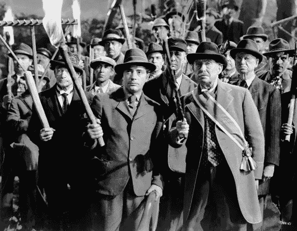

# 暴民和人群

> 原文：<https://medium.com/hackernoon/the-mob-and-the-crowd-94abc7f2232d>

最令人不安的是，时间充裕的违法者企图摧毁托比·扬，却没有一个人后退一步说:“哇。我们在这里做什么，伙计们？”据我所知，他们中没有一个人对自己的行为感到良心不安，有过片刻的反省或任何严肃的批评。没有人停下来反思他们七天来对杨八年前所说的话的愤怒，并怀疑这是否有点过分；如果有一点史塔西的味道，那就是无情地研究杨写的每一条推文和文章，以便一些粗鲁或粗糙的台词可以作为他为什么“不适合公共生活”的证据。“不适合公共生活”——这样一个丑陋的短语，这样一个鲜明的品牌，只有最自以为是、最挑剔、最有资格的人才能说出这样的话。

这种缺乏异议，这种容易激动的反年轻的推特成员中没有一个人后悔或反思他们的指责行为，令人担忧。这表明完全没有个人良知的调节作用。这可能意味着个人思想本身的消失，所以这些人——这些主要是中产阶级，有影响力的人——开始完全崩溃，思想和能量变成一种感觉，一种感觉，一个*时刻*。在这一时刻，独立思考和自我分析的批判能力没有任何作用，事实上可能会阻碍手头的任务，如果我们可以称之为任务的话:从摧毁一个恶魔中获得短暂的集体快乐。因此，这些能力必须被抛弃，头脑的工作方式被用来换取本能的兴奋，成为对抗邪恶实体的强烈情感的一部分。

过去一周，个人良知可能、也应该对托比·扬产生强烈的虚拟仇恨，这是有很多充分理由的。首先，肯定有可能对目标、对扬产生同情，人们可以合理地推断，Twittermob 的行为给他带来的痛苦——他的教育成就被毁了，他的名誉被玷污了，他未来的职业生涯可能受到了威胁——与他的不端行为完全不成比例，这些行为在很大程度上相当于在 Twitter 上发表诙谐、粗鲁的评论。这是一个后果问题，让一个人回忆起过去类似的集体仇恨事件，认识到创造一种局面，让自信和自以为是的非正式群体成为个人是否适合担任公职的评判者，这将比托比·扬更能损害公共生活。还有狭隘的利己主义，这是一种理性的评估，即如果右翼人士会因为他们所说的话而被摧毁，那么在未来的某个时候，左翼人士也可能会遭到同样的命运。还有一个狭隘的问题，那就是充分利用一个人的道德能量，问问自己:为了把一个人赶出某个机构，去搜索他的社交媒体历史，直到把他过去的错误行为公之于众，这是对我的时间和情感资源的充分利用吗？

然而，良知的这些作用——不是同情，不是道德分析，不是自我反省，甚至不是自我保护——都没有在集体毁灭年轻人的企图中表现出来。没有一个人在这种强烈的愤怒中退出并重新思考。这不仅说明了今天所谓的左翼不容忍达到了令人震惊的程度——人们认为任何不是卫士的人都不适合公共生活——而且还说明了一个永久暴民的形成，一种不受思想、理性和良心控制的政治手段。因为这正是暴民的定义:一个过程，在这个过程中，一群个体为了对冒犯了他们的情感或教条的人或事发出大规模的集体嚎叫，而丧失了道德和智力上的自我反省技能。暴民——今天这意味着中产阶级的推特暴民——不再像历史上那样是偶然的暴力爆发；相反，它是英国公共生活的永久特征和功能，对公共理性、政治理性主义、个人意识和自由思想造成了毁灭性的损害。

反年轻人的推特运动引人注目的地方在于，它的领导者和参与者往往来自社会的同一个阶层，他们愤怒地反对人群，尤其是投票支持英国退出欧盟的人群。圣诞节期间，刘易斯·汉密尔顿说，男孩不应该穿裙子，一些政客、文化名人或名人近年来说了一些公众健身的自信警察认为令人反感的话，人们对此愤怒不已。这些放弃理性的人，这些轻率的、无情的、没有良心的、对不可接受的思想进行惩罚的人，正是那些花了 18 个月时间对“人民”(他们总是把它放在吓人的引号中)和反对通过“群众鼓掌”来搞政治的人。他们说，普通人的“低信息”本质意味着在像欧盟这样的重大问题上，这种群体决策总是错误和糟糕的。一个标题写道，“是时候让精英们起来反抗无知的大众了”。

本质上，他们所说的是，暴民，他们的暴民是好的，而群众——*那些人*，那些选民——是坏的。他们的暴徒清理政治，驱逐不受欢迎的人，保持公共生活纯洁；人群损害政治，给政治注入偏见，伤害理性和反思。事实上，情况恰恰相反。首先，建议我们应该将重大政治决策委托给这些精英、这些缺乏道德严肃感的有影响力的团体，而不是在高度管理和强烈审查之间徘徊，这显然是荒谬的，这两者都代表着放弃道德深度和政治思想。他们越是这样，民主就越有吸引力；我们，公众，越认识到民主制度的不可估量的价值，它允许我们从这些有偏见的、封闭的精英手中夺取重大决策权。

其次，群众——我们——和群众——他们——之间的区别在于，群众是有思想的、理性的和明智的。这是个人的集体，不像暴民，在暴民的集体中，个人没有有意义的存在，事实上必须同意将自己完全沉浸在嚎叫的快乐中。人群是个人思考，然后参与和与他人辩论；他们的良心永远是亮着的，永远是准备好的；必须如此，因为日常辩论需要它，塑造国家的重大决策也需要它。人群思考，反映，移动，改变；它是个体与其他个体的结合。相比之下，暴民是个人主义的终结。没有同情或道德约束或政治深度或异议的空间——正如我们在为期一周的反对扬的推特运动中所看到的那样，这是一件令人担忧的循规蹈矩的事情，数以千计的推特用户或推动者中没有一个人用他们的良心来改变他们的想法或行为。可悲的是，这群乌合之众，这群受过良好教育的乌合之众，对今天的政治生活有着巨大的影响。这对我们所有人都不好。我们需要更少的暴民，更多的群众；更少鲁莽的精英主义和更多有分寸的公众讨论；少了受伤的精英们的嫉妒和挑剔，多了来自严肃和有思想的大众的投入。

*我只 Instagram: @burntoakboy*