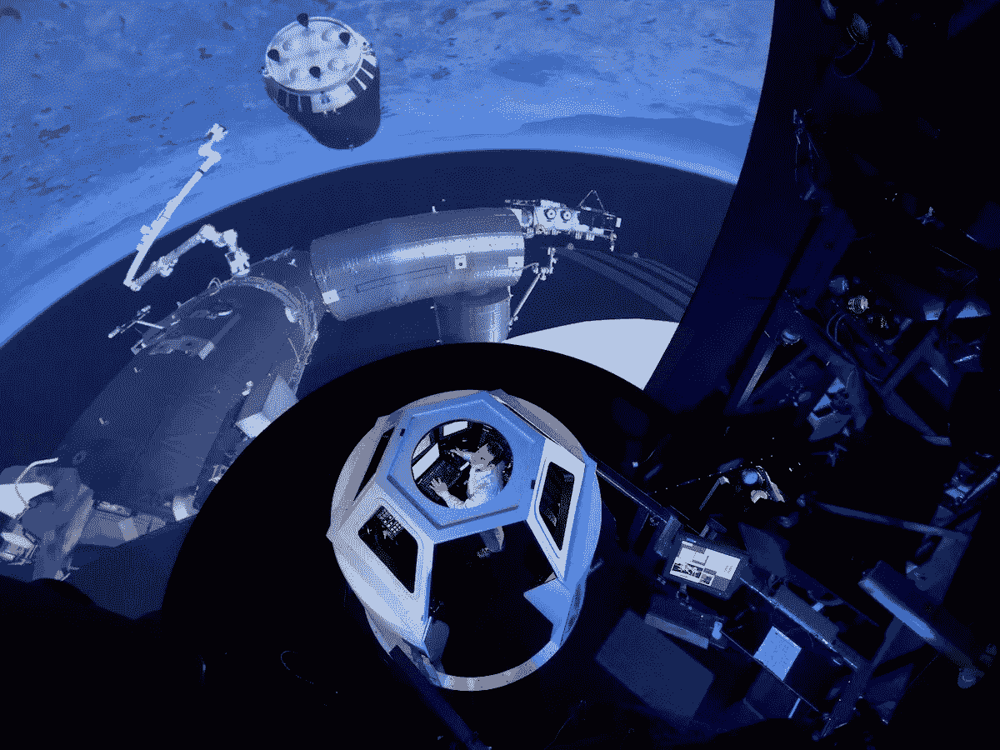
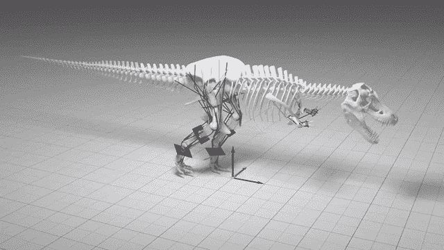
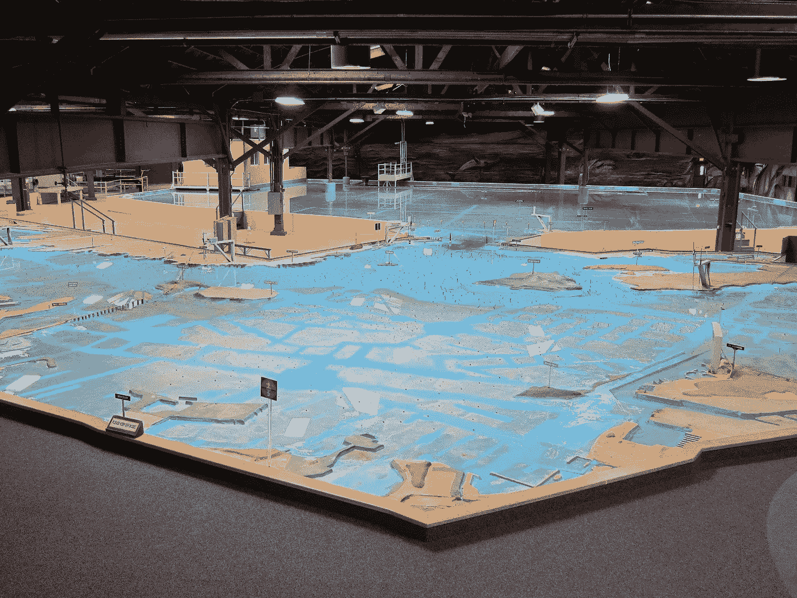
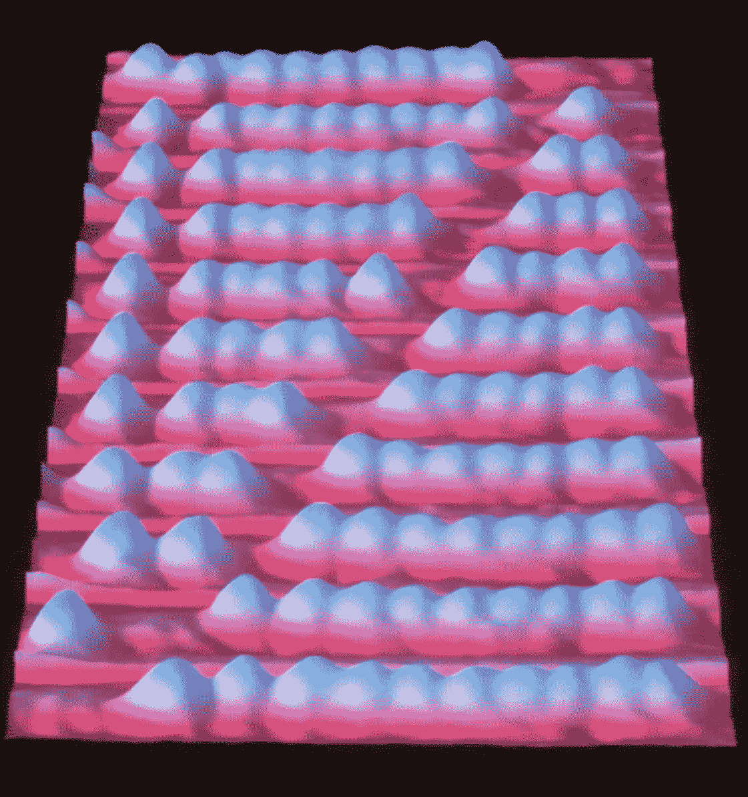
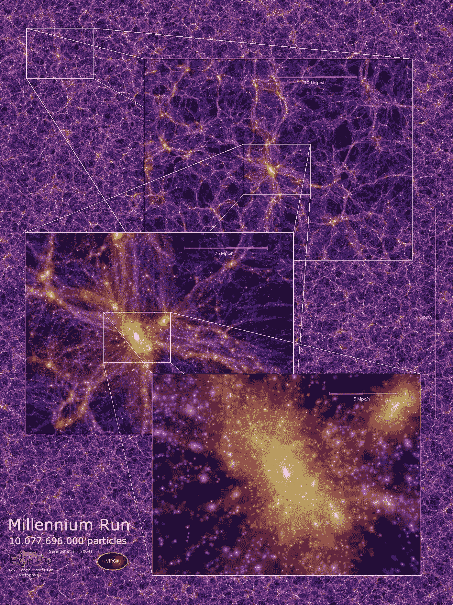
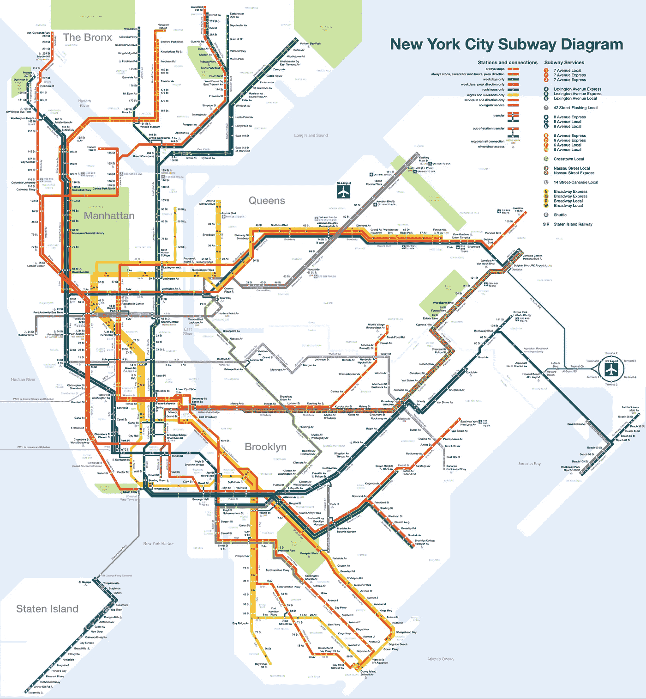

# 建模本能

> 原文：<https://medium.com/hackernoon/the-modeling-instinct-40a25a272c64>

## 我们对微型物体和世界的迷恋不仅仅是一种消遣。

Credit: Miniatur Wunderland - Hamburg

所有大脑的目的，无论是人类还是其他，都是为了移动身体；引导它在复杂而充满敌意的世界中前进。为此，大脑构建了他们所处世界的心理表征或模型。

即使是最简单的大脑也会这样做。秀丽隐杆线虫是一种微小的蠕虫，其大脑仅由 302 个神经元组成。有些是感觉神经元，在有食物、化学物质、其他蠕虫等存在时会激活。另一些是运动神经元，其放电激活肌肉。(其余的是“中间神经元”，只连接到其他神经元。)感觉神经元的放电，连同它们诱导的后续放电，构成了蠕虫环境的实时表示，其告知运动神经元的放电。秀丽隐杆线虫因此可以走向有益的事物，远离有害的事物。

但是在一个充斥着无数障碍和竞争生物的复杂世界里，从 A 到 B 的最短最安全的路径很少是直线。我们像 C elegans 一样，寻找好的，避免坏的，但是我们的大脑在这些基本的运动功能上已经进化出无数层间接和抽象。我们的心理模型已经变得非常复杂，而且它们是适应性的；随着新信息的获得，我们不断地对它们进行阐述，我们寻找新奇的事物来明确地支持这一过程。

我们强大的大脑不仅丰富了我们的行动，而且还使一种全新的行动成为可能。我们可以利用我们先进的运动技能来构建不是由神经元组成的模型，而是由大理石、墨水和硅等环境材料组成的模型。通过这种方式，我们将我们的心理模型扩展到了物理世界。不受我们头骨的限制，这样的外部模型可以被操纵、实验或简单地欣赏，不仅是我们自己，其他人也可以。

外部模型，就像精神模型一样，是现实的某个方面的简化表示。被建模的事物——“目标系统”——可能是一个物体、一个人、一种现象、一个生态系统、一系列事件或者一条自然法则；任何存在的事物都可以用某种方式建模。这包括只存在于假设中的事物。例如，建筑平面图描绘了尚不存在的建筑；小说描述从未发生的事件。

很明显，人类拥有一种与生俱来的动力去创造这样的模型并与之互动，并与他人分享他们的创造。只要看着孩子们玩耍，我们就能看到这种建模的本能在起作用。他们不需要正式的指导就可以用积木组装城堡，或者在玩具屋里表演戏剧，或者为他们的作品寻找观众。

## 许多类型的模型

由于模型可能代表现实的任何方面，并且可以由任何数量的材料制成，因此显然有很多种材料。对它们进行分类是一个挑战，而且这个问题由于一些模型是许多更小的子模型的组合而变得更加复杂，每个子模型都有自己的特点。

为了管理这种复杂性，我将只考虑四个我认为既基本又有用的方面——至少对于本系列文章的目的来说——这四个方面。它们是:目的、动力、构成和现实主义。

***维度 1:*** *有些车型是为功利目的服务的。对于其他人来说，目的是提供一种体验。*

**实用模型**是为了帮助现实世界与目标系统的互动而创建的。因此，它们是一种特殊的工具。例如，地图是用于导航由地图建模的地形的工具。飞行模拟器是学习飞行的工具，因为它模拟飞行的动力学。

**科学模型**是一个特例。它们是功利主义的(或者可以是功利主义的)，但它们的首要目的是准确而彻底地解释它们的目标系统。科学家设计并测试不完全理解的系统的解释性模型，如果存在模型的话，开发模型的实用应用是工程师的责任。

**相比之下，体验式模型**是为观众提供体验而创建的。人们认为它们本身是有价值的，而不考虑它们的实用性。这种内在价值源于这样一个事实，即在某种认知水平上，我们对模型的体验就好像它们是真实的一样。因此，根据他们提供的经验，他们可以激发各种各样的情绪。

一个模型可以同时具有功利性和体验性两个方面，很少有纯粹的非此即彼。例如，一个虚构的故事可能提供有用的人生教训，就像飞行模拟器可能吸引一个无意驾驶真实飞机的人一样。

NASA’s Systems Engineering Simulator (here configured to simulate operations aboard the International Space Station) is a utilitarian spaceflight simulator with experiential qualities. (Credit: NASA)

***维度 2:*** *有些模型融入了支配其目标系统如何随时间变化的规律，而有些则没有。*

**动态模型**起作用。它们是“运行的”，而静态模型是被观察或体验的。

然而，这种区别并不像看起来那么简单。例如，一部小说作品是在时间中经历的，它描述了(表面上)在时间中展开的事件，但页面上的文字或单个的照片画面是不变的。这同样适用于历史书或从实验中收集的数据。

这种模型是动态目标系统单次运行的记录或记忆。虽然被记录的系统是动态的，但记录本身是静态的，因为它不包含导致其内容的因果法则。

A dynamic biomechanical model of Tyrannosaurus rex. (Credit: University of Manchester)

***维度 3:*** *有些模型是由物理材料制成的，比如塑料或涂料，而有些模型是由符号制成的，比如数学符号、计算机代码或某种语言的文字。*

**物理模型**由物理材料制成，通常描述其目标系统的几何特征。一个实用的例子可能是风洞中的模型飞机。雕塑、绘画和主题公园景点都是体验性的例子。

A physical model of the San Francisco Bay Area constructed to test the feasibility of dams and other projects.

**相比之下，符号模型**由具有预定义含义的符号组成。当然，符号本身必须由某种材料制成，但符号模型的区别在于材料的选择不会改变符号的逻辑属性。例如，在算盘的情况下，塑料珠子产生的结果与木制珠子相同。

An abacus with individual carbon molecules as beads. (Credit: IBM Research — Zurich)

符号模型可以通过它们使用的符号种类来进一步表征。

虽然我们通常不说“单词模型”，但语言实际上是描述或模拟现实的一种象征性手段。它对名词和动词(运动中的物体)的依赖反映了它最初对物理事物和动作的关注。但是一旦名词、动词和其他词类存在，它们也可以用来表示抽象的事物。

**数学符号**最早源于计数和测量事物的需要。但是随着越来越多的符号被设计出来，以及操作它们的新规则，数学发展出一种表现自然现象的非凡能力。

**计算机代码**的独特之处在于它的一些符号(定义为“指令”)代表对其他符号的改变。“指令指针”本身是一个可变的符号，它记录下一步执行哪条指令。这种安排意味着计算机特别擅长于模拟随时间进化的系统。

当然，除了这些，还有其他种类的符号。

***维度 4:*** *模型展现出不同程度的真实性，这取决于它们表示目标系统的准确程度以及细节的多少。*

在现实的一端是计算机模拟，设计来尽可能真实地反映他们的目标系统。这种模型可能非常详细，有时包含数百万甚至数十亿个相互作用的元素，所有元素都根据已知的科学原理运行。它们通常用于预测(例如，天气)，或者获取关于一个系统的知识，否则获取该系统将会非常困难、昂贵或危险。

A snapshot of a cosmological simulation that consisted of more than 10 billion massive “particles” in a cubic region of space 2 billion light-years to the side. (Credit: Max-Planck-Institute for Astrophysics)

完美的逼真是不可能的(不精确地复制目标系统，这是荒谬的)，但无论如何也没有必要。模型只需要包含目标系统中有助于实现其目的的那些方面。例如，地铁地图的目的是帮助乘客决定在哪里上下车。对那个决定没有帮助的细节可以省略掉。

A map of the NYC subway system in the “Vignelli style,” a style of design favoring simplicity. (Credit: CountZ at English Wikipedia [[CC BY-SA 3.0](https://creativecommons.org/licenses/by-sa/3.0)], via Wikimedia Commons)

经验模型可以比省略不必要的细节更进一步——包含的细节可以用非现实的方式描述。艺术家可以自由探索所有的领域，从写实到风格化再到不连贯。

为什么一个艺术家会选择创造一个不现实的模型？一个原因是提供新鲜感。新鲜感抵消了熟悉的眩目效果，从而激发了想象力。一旦参与其中，想象力就可以转向模型中*确实*反映现实的方面。

J.R.R. Tolkien’s map of Middle Earth. (Creative Commons)

## 什么是好的模式？

从一个好的模型实现其目的的前提出发，不难得出这样的结论:一个好的功利模型是*有用的*，一个好的科学模型是*准确的*，一个好的经验模型是*投入的*。

但是有没有适用于各种模型的普遍的善的原则呢？在这里，我将提出三点:新颖性、相关性和经济性。

***原理 1:*** *一个模型如果提供了其目标系统的新信息，或者以新的方式表现了其目标系统，那么这个模型就是* ***新颖*** *。*

这一原则最直接适用于体验模型，其目的是吸引观众。从定义上来说，新奇是吸引注意力的东西。它标志着新的信息可用于整合，一个人的感官和其他认知资源应该被重定向到这项任务。优秀的艺术家之所以如此小心翼翼地避免陈词滥调，原因就在于新奇的卓越性。

新颖性对于实用模型来说也是至关重要的，因为它们的效用依赖于提供关于用户不熟悉的目标系统的信息——或模拟体验。例如，地图对那些不熟悉地形的人来说是最有用的。

但是不同的人熟悉不同的东西，对一个人来说新奇的东西对另一个人来说可能是平凡的。从认为一个模型新颖的人数比例来看，得出这样的结论似乎是合理的。

对于功利主义和经验主义模型，这种推理可能是合理的，但是对于科学模型，情况就有点不同了。科学模型的“观众”是全人类，一个人的发现(和发表)被所有人集体所知。因此，对于一个新颖的新科学理论来说，它必须解释现实中没有被任何人解释过的一个方面，或者它必须提供一种以前没有被发现的方法来代表一个已经被解释过的系统。

***原理二:*** *一个模型是* ***相关*** *如果它准确地描绘了一个对某人很重要的目标系统。*

如果说吸引注意力的是新奇感，那么决定吸引多少注意力的则是相关性。例如，一页随机的信，既完全新奇又完全不相关。即使这些字母抓住了你的注意力，它们也不会持续太久，因为它们不代表任何对你来说重要的东西。

对于非科学模型来说，相关性就像新颖性一样，是受众的一种功能。为了相关，功利主义模型必须帮助某人打算进行的活动，而经验主义模型必须描述某人关心的系统。在这两种情况下，如果一个模型不忠实于目标系统中重要的方面，那么它的相关性就会受损。一张不准确的地图不仅对观众无用，甚至可能激怒他们，动机不良的虚构人物也可能产生同样的效果。

关于相关性，科学模型又是一个特例。科学的目标是解释所有的现实，所以所有非想象的系统对科学都很重要。因此，准确性是最重要的。事实上，科学的大部分工作都涉及到测试模型，看它们是否准确，而无法测试的模型被认为是不科学的。

Novelty in the form of an alien weapon, and relevance in the form of human targets. (Still from “War of the Worlds,” © DreamWorks LLC and Paramount Pictures)

***原则 3:*** *一个模型是* ***经济的*** *如果它包含了实现其目的所必需的最少元素。*

经济型汽车具有这样的品质，即使是最轻微的改动也会降低它们的品质。它们是信息密集型的，通常包含执行双重或三重任务的元素。

对于经验模型来说，决定包含哪些元素和排除哪些元素是艺术重点的问题。这是一个主观的过程，完全取决于艺术家的判断。然而，对于功利主义模型，这个过程可能更加客观。这里的指导原则是*效率*——不要在无用或多余的元素上浪费资源。

正如人们所料，功利主义和经验主义案例之间存在重叠。在设计实用模型时，艺术判断往往是有帮助的(在一定程度上，它们包含了经验元素)，正如经验模型往往受到资源的限制。

就经济而言，科学模型是最不主观的，因为它们的目的是提供准确的解释，而且准确性是可以检验的。如果两个科学模型同样准确，那么简单的那个更经济。

## 关于这个系列

物理模型(微型建筑、立体模型等等)让我们高兴，因为它们一眼就概括了建模的本能，但是除了这些，这种本能还包括许多种类的模型。这一系列文章将特别关注三种类型——*模拟*(作为复杂系统的模型)*游戏*(作为人类努力的模型)，以及*智能代理*(作为思维的模型)。

本系列的第一部分将研究这种模型的性质以及它们通常是如何构建的，重点是基于计算机的实现。第二部分将考虑它们的哲学和社会学含义，特别是当超级强大的计算机——以及超级强大的模型——的前景变得越来越真实的时候。

**:人类本能地创造模型，分享模型，与模型互动。模型是现实的某个方面的简化表示——物质的或符号的、静态的或动态的、现实的或程式化的。模型的创建是有目的的，可能是功利的，经验的，或者两者的结合。好的模型是新颖的、相关的、经济的。**

**

*感谢你的阅读！请看看我在 Steam 上的游戏[表格](https://store.steampowered.com/app/770660/Thetaball)——这是我为在基于物理的环境中进化智能代理而开发的实验游戏引擎的第一个应用。*