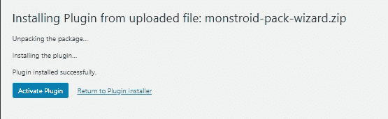
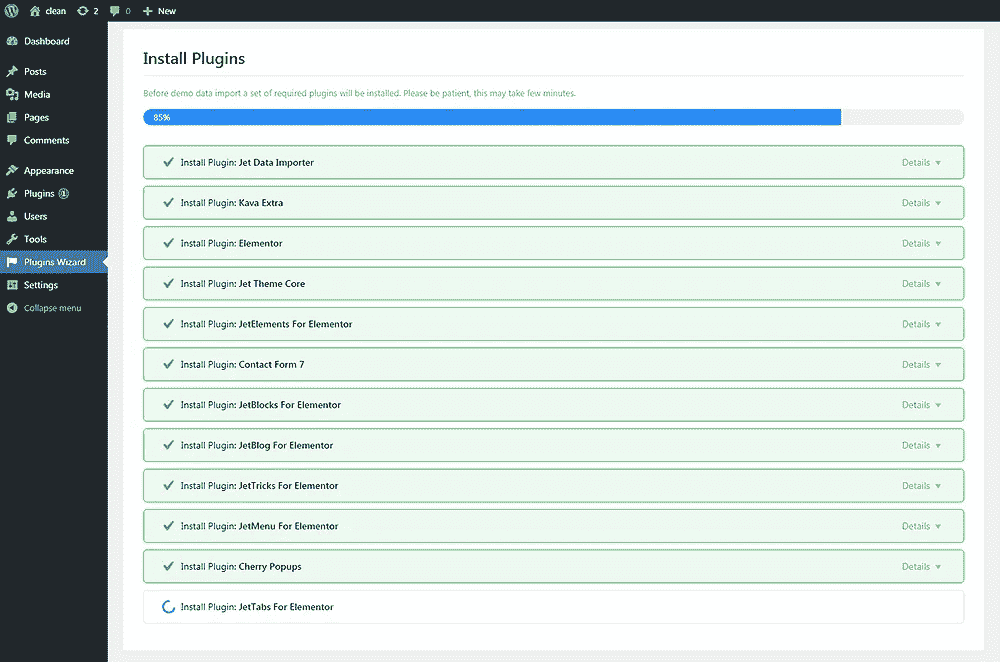
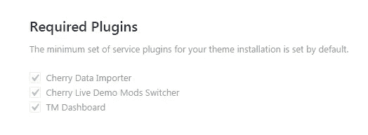
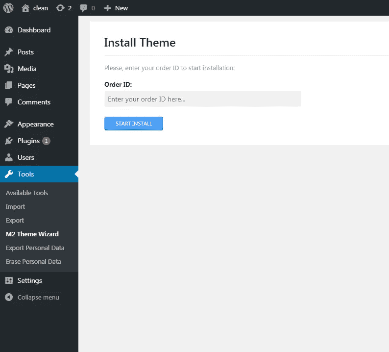

# Monstroid WordPress 主题演变[2016 至 2018]

> 原文：<https://medium.com/hackernoon/the-monstroid-wordpress-themes-evolution-2016-to-2018-42031284b83e>

在过去的几年里，你听到过多少次怪兽这个名字？Zemez 让你有可能将这些令人惊叹的主题家族与最流行的页面生成器[element 或](https://elementor.com/)一起使用，从而延长你的快乐时光。八月中旬，TemplateMonster marketplace 发布了一个令人震惊的版本，宣布了 Monstroid2 主题的更新版本。

与 2018 年相比，2017 年的 Monstroid2 相形见绌。这让我想起了另一个最近的公告，以及那个永恒的厄运。这就是我所说的:

前作《怪物 2》看起来像《毁灭战士 4》里的毁灭战士。

而现在的 Monstroid2 看起来像《永恒毁灭》里的毁灭战士。

总的来说，主题变得越来越大，越来越糟糕，它获得了更多的皮肤，更多的区块，更多的定制自由，更多的功能，更多的可能性来创建真正独特的网站。

让我们详细了解一下这些主题有什么不同，为什么还有共同点。

# 安装这些主题有多容易？

此外，我将向你展示一步一步的安装过程，所有三个 Monstoid 主题，但首先几句话对这些主题的每一个。

# 截至 2016 年 Monstroid 是什么？

[Monstroid](https://www.templatemonster.com/wordpress-themes/monstroid/?aff=hackernoon) 是 Cherry 框架和 Elementor 功能的硬组合。你可以很容易地用 M1 包中的任何主题创建令人敬畏的网站，但你会被你选择的主题设计所限制(除非你使用 Elementor builder 提供的块和页面)。)

基本上它是一个 19 个元素或主题的捆绑包，你可以安装在你的网站上。

# 怪物身上怎么会有元素或者主题？

在 Monstroid2 主题的更新版本发布之前，Zemez 更新了他们之前的旗舰 WordPress 主题，使其与 Elementor builder 兼容。这一更新背后的想法是让每个想得到 Monstroid 主题的人能够在 Elementor builder 中使用它(主题中的皮肤)。

# 2017 年 Monstroid2 是什么？

截至 2016 年，使用自定义页面生成器是一个好主意。Zemez devs 创建了一个强大的构建器，它基本上是一个后台页面构建器，在这里你可以用自定义内容填充你的页面。让这个主题独一无二的是大量的皮肤(你可以在任何其他皮肤中独立使用它们的样式)。)

# Monstroid2 截至 2018 年有哪些更新？

相比之下，当前版本的 [Monstroid2](https://www.templatemonster.com/wordpress-themes/monstroid2.html?aff=hackernoon) 是一个终极工具，你可以用它来构建数量惊人的独特页面。

现在让我们回到安装过程。

# M1

## 第一步

## 第二步

## 第三步

## 第四步

## 第五步

## 第六步

## 第七步

## 第八步

## 第九步

# M2 (2016 年)

## 第一步

## 第二步

## 第三步

## 第四步

## 第五步

## 第六步

## 第七步

## 第八步

## 第九步

## 第十步

## 步骤 11

## 步骤 12

## 第十三步

# M2 (2018 年)

## 第一步

## 第二步

## 第三步

## 第四步

## 第五步

## 第六步

## 第七步

## 第八步

## 第九步

## 第十步

## 步骤 11

## 步骤 12

## 第十三步

## 步骤 14

从 1 到 5 的范围内，安装有多容易？我敢说，所谓的 Monstroid 向导是一个神奇的东西，它可以在短短 3 分钟内帮助你安装任何主题。

最常犯的错误是人们不阅读文档，试图通过**外观> >主题**部分安装向导作为主题，而**向导**不是主题，而是插件。

正如你所看到的安装过程几乎是相似的，所有三个主题都利用了几年前开发的[入职系统](https://www.templatemonster.com/blog/customer-onboarding-templatemonster/?aff=hackernoon)(向导插件)。

# 总体结果

monstroid— ★★★★
monstroid 2(上一版本)— ★★★★★
Monstroid2(当前版本)—★★★★

# 当我们得到 WordPress 5.0 更新时会发生什么？

Gutenberg 与任何其他已知的构建者都不兼容，这是 Matt 的绝望之举，这意味着获得新的受众，并使 WordPress 成为 Saas 解决方案和第三方网站构建者的竞争对手。现在我们可以说，你不能在生产网站上使用古腾堡，因为它仍然是测试版，很可能会破坏你的网站。

# 还有多少额外的设计？

M1M2(前一版本)M2(当前版本)由于 Monstroid 是一种元素或 WordPress 主题的捆绑包，你会受到这些主题的设计和功能的限制。由于 Elementor builder，你可以使用这个 builder 提供的自定义页面和块，总之你有 19 个主题/皮肤可以用来创建一个网站。Monstroid2 主题有 12 个皮肤和 32 个子主题。

当你开始用最新的 Monstroid2 主题编辑页面时，你会发现所谓的“魔法按钮”，在它的帮助下你可以添加 **500 个预先设计好的模块、数百个页面和页面模板**中的一个。所有这些物品都可以在任何一个 **20 皮肤**上使用，这意味着在定制方面没有任何限制。更重要的是，有了这个模板，你将每周获得一次新的区块、页面模板和皮肤。

# 总体结果

monstroid—★★★
monstroid 2(上一版本)— ★★★
Monstroid2(当前版本)— ★★★★

# 如何定制这些主题？

Monstroid 和 Monstroid2 (2018)都是使用 Elementor builder 定制的，请注意，有一个免费版本的 builder，我们用于设计主主题、所有皮肤和子主题。

* *—monstroid 2(2016)是使用 Zemez 的定制开发 Power Builder 创建的。这是一个后端拖放生成器，可以使用多个内容块创建各种布局。

# 包括哪些 WordPress 插件？

正如你所知道的，不建议同时安装很多插件，插件可能会影响你的网站的性能，引起 500 个错误，等等。

# 总体结果

monstroid—★★★
monstroid 2(上一版本)— ★★★
Monstroid2(当前版本)— ★★★★

# 支持和更新选项怎么样？

# 总体结果

monstroid—★★
monstroid 2(上一版)— ★★★
Monstroid2(当前版)— ★★★★

# 电子商务

# 总体结果

monstroid—★★★
monstroid 2(上一版)— ★★★★
Monstroid2(当前版)— ★★★★

# 定价和许可

# 总体结果

Monstroid — ★★★
Monstroid2(上一版本)— ★★★★
monstroid 2(当前版本)—★★★

# 轮到你了

正如你所看到的，Monstroid2 主题的最新版本肯定会赢得比赛，但你需要明白，这些主题中的每一个都可以轻松地帮助你完成工作。

更重要的是，如果你购买了最新的 Monstroid2 主题，你可以免费获得以前版本的 Monstroid2，你所需要的只是联系 TemplateMonster marketplace 支持团队。