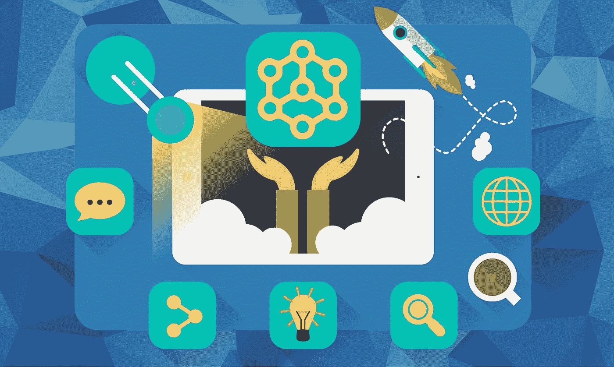

# 大公司正在开发的最雄心勃勃的区块链项目

> 原文：<https://medium.com/hackernoon/the-most-ambitious-blockchain-projects-in-development-4e04d412f65b>

事实证明，对一些人来说，虚拟货币是高回报的投资，随着越来越多的虚拟货币不断被开发，它们现在更加安全，并且有着各种各样的应用。然而，加密货币所基于的区块链技术是一个发展速度甚至超过虚拟货币的领域，其影响几乎对所有可以想象的行业都具有深远意义。

其中一个项目是努力建立一个支持工人权利的登记处。可口可乐、美国国务院、Emercoin 和 Bitfury Group 正在寻求为外国的糖供应链工人建立一个登记册。这将是一种确保雇主履行其与登记处的合同的方式，涵盖工人权利的多个领域，包括强迫劳动、童工和通过 28 项研究收集的土地权利。这个项目的一个重要方面是智能合同，它是区块链的一部分，既透明又安全。因此，与经常被争议或更改的口头和书面合同不同，通过区块链达成的协议在签署后不能更改。这将迫使雇主履行他们与工人签订的合同，并对食品和饮料行业产生巨大影响，该行业是强迫劳动的最大用户之一。

第二个将利用区块链的项目是微软的一个项目，它试图创建数字身份证来帮助任何可能在验证身份方面有困难的人。该公告是在 2 月份发布的，该公司表示，他们打算使用区块链在其 Authenticator 应用程序中开发分散式 id，目前有数百万人在使用该应用程序。授权码是令牌或代码，为返回的设备和用户提供另一层安全保护。

分散的 id 对这个项目至关重要，因为全世界有超过 10 亿人无法证明他们的身份。这使得他们无法获得银行或医疗保健等基本服务，甚至无法旅行和创业。通过向人们提供一种在区块链上存储 ID 信息以及使用数字密钥访问的方法，每个人都可以管理自己的数字身份，并在被要求验证其身份时提供不变的证明。

IBM 一直致力于开发一个区块链软件平台，该平台基于 Linux 基金会的开源 Hyperledger 软件。迄今为止，该公司已经在供应链、媒体、医疗保健、金融服务等行业参与了 400 多个区块链项目。

另一个基于区块链的项目是 IOTA 的数据共享市场，它将允许人们买卖未使用的数据。不仅如此，数据市场将允许物联网(IoT)成为交易电力、存储、分析和传感器数据的手段。假以时日，这可能是保持物联网正常工作的一种方式。

这些只是区块链正在开发的项目中的一小部分，它们将改变世界进行各种交易和合同的方式，更重要的是，改变人们对区块链技术的看法。

BLMP 2018，新加坡

BLMP(block chain Licensing market place)是区块链的一家技术公司，致力于消除障碍，促进虚拟商品行业中围绕供应链管理交易的复杂问题的信任。

*BLMP Network 利用区块链技术，将全球的数字平台与全球品牌连接起来，将跨任何数字平台的官方授权虚拟商品货币化；从游戏到流媒体服务&社交媒体，让数百万用户能够接触到一个全新的品牌虚拟产品世界。*

联系我们:

[网站](https://www.blmp.network/)

[推特](https://twitter.com/BLMPNetwork)

[脸书](https://www.facebook.com/BlmpNetwork)

[领英](https://www.linkedin.com/company/blmp/)

[AngelList](https://angel.co/blmp-network)