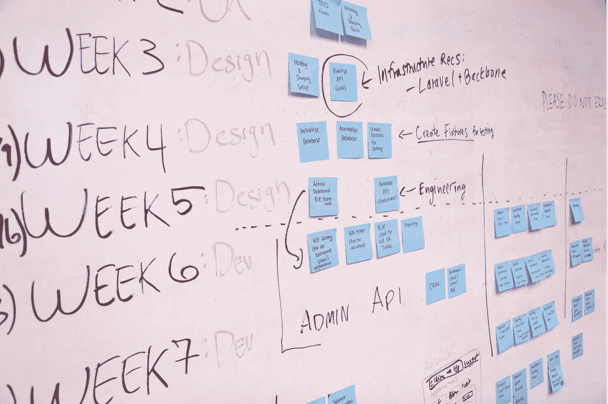

# 我在产品/工程过程中见过的最常见的问题

> 原文：<https://medium.com/hackernoon/the-most-common-problem-ive-seen-in-product-engineering-process-debd821a423f>

[Image from here](https://www.pexels.com/photo/schedule-planning-startup-launching-7376/)

我第一次意识到这个问题根本不是在工作中。事实上，在任何一方寻求另一方帮助的情况下，这都是一个常见的问题。

几年前我和男朋友在西雅图过感恩节。星期三晚上，我在吃晚饭时意识到我忘记带牙刷和牙膏了。我问女服务员:

*“你知道这附近有没有开门的便利店吗？”*

女服务员回答:*“不知道。不好意思。”*

*“你怎么问起便利店了？”*男朋友问我。

*“因为我可以在那里买到牙刷。”*

*“好吧，那你为什么不直接问牙刷的事？”*

*“嗯……”*

*“你听说过 XY 问题吗？”*

*“否……”*

> XY 问题——XY 问题问的是你尝试的*解决方案*,而不是你的*实际问题。*

***“你正在努力解决问题*** `***X***` ***，你认为解决方案*** `***Y***` ***会奏效，但当你遇到麻烦时，你不是问*** `***X***` ***，而是问*** `***Y***` ***。”***

XY 问题会导致寻求帮助的人和提供帮助的人浪费大量的时间和精力。这里有一个与来自 [stackexchange](https://meta.stackexchange.com/questions/66377/what-is-the-xy-problem) 的编码相关的好例子。

在我工作过的公司里，我已经多次看到 XY 问题的发生。

## 您如何知道您的公司是否遇到了这个问题？

根据我的经验，这个问题的后果通常表现为很少或从来没有被使用的特性，没有为公司提供任何学习的特性，或者没有为客户提供任何价值的特性。

我见过几十种不同类型的事件被跟踪，但从未被关注，因为它们要么不可操作，要么难以分析，或者两者兼而有之。我见过价值超过 1000 行 React 代码的特性被实现，部署到生产中，从未被使用过，然后在几周内被新代码完全废弃。我花了几天时间处理小而复杂的 UX 请求，这些请求本可以被更简单的解决方案所取代(或者根本就不需要存在)。

所有这些事件和浪费的努力之所以发生，是因为在产品/工程过程的某个地方，真正的*为什么*丢失了，而团队发布了一个没有解决真正问题`X`的功能`Y`。

我自己也确实犯过这样的错误:在开始实施某件事情之前，没有深究为什么，最终，因为它没有解决任何问题，所以不得不放弃。

## 那么如何才能避免这个问题呢？

我的职业生涯还很年轻，我还没有全部的智慧。然而，我确实认为基于实现的产品/工程过程比基于问题的产品/工程过程更容易出现 XY 问题。

区别就在这里。

基于实现的产品/工程过程更倾向于线性和流水线式。产品所有者决定构建什么功能。然后，设计师们设计出模型。只有当设计完成后，构建特性的工程师才会被告知这些特性。

这个工作流程有什么问题？首先，处于链条下游的人们无法清楚地了解问题的根源(即`X`)。如果一个错误的假设(即`Y`)在链的开始被做出，那么每个参与的人都会盲目地服从命令，做`Y`。

另一方面，在基于问题的工作流程中，产品负责人的角色是让团队专注于*为什么*。产品、设计和工程部门共同协作，集思广益来定义和解决问题。

> 每件事背后都有一个为什么。

我看到 XY 问题发生的所有时间都是因为相关的人没有按照这个原则生活。

我们为什么要做这个专题？

为什么该功能对客户有帮助？

为什么这个特性对我们自己的学习有帮助？

如果原因没有想清楚或传达清楚，那就是过度工程化实现的处方，最终不会解决根本问题。